import Callout from '@components/Callout.astro';
import ImplementationNote from '@components/ImplementationNote.astro';
import ExternalCite from '@components/ExternalCite.astro';

## Introduction

Your Domain Layer should not know what a `DbContext` is. It shouldn't know about SQL connections or transaction scopes.

**Why the Repository Pattern?**
-   **Abstraction**: Swapping EF Core for Dapper (or CosmosDB) becomes possible without changing domain logic.
-   **Testing**: Mocking `IDocumentRepository` is trivial; mocking `DbSet<T>` is a nightmare.
-   **Intent**: `repo.GetOverdueLoans()` is clearer than `ctx.Loans.Where(l => l.DueDate < Now && !l.Returned)`.

### What We'll Build
1.  **Generic Interface**: A standard contract for Get/Add/Update/Delete.
2.  **Specific Repository**: Extending the contract for complex entity-specific queries.
3.  **EF Core Implementation**: The infrastructure layer adapter.

## Architecture Overview

```mermaid
flowchart TB
    subgraph Core["🎯 Core Layer (Pure C#)"]
        Interface["📜 IDocumentRepository"]
        Agg["📄 Document Aggregate"]
    end

    subgraph Infra["⚙️ Infrastructure Layer"]
        Impl["💾 DocumentRepository"]
        EF["🗄️ EF Core DbContext"]
        DB[("PostgreSQL")]
    end

    Impl -- implements --> Interface
    Impl -- uses --> EF
    EF -- reads/writes --> DB
    
    classDef primary fill:#7c3aed,color:#fff
    classDef secondary fill:#06b6d4,color:#fff
    classDef db fill:#f43f5e,color:#fff
    classDef warning fill:#fbbf24,color:#000

    class Core primary
    class Infra db
```



## Implementation

### The Contract

In DDD, the repository interface lives in the **Domain/Core** layer.

```csharp
// Core/Interfaces/IRepository.cs
public interface IRepository<TEntity, TId> where TEntity : AggregateRoot<TId>
{
    Task<TEntity?> GetByIdAsync(TId id, CancellationToken ct = default);
    Task AddAsync(TEntity entity, CancellationToken ct = default);
    Task DeleteAsync(TEntity entity, CancellationToken ct = default);
}

// Core/Interfaces/IDocumentRepository.cs
public interface IDocumentRepository : IRepository<Document, BlueRobinId>
{
    // Specific queries needed by the domain
    Task<bool> ExistsWithFingerprintAsync(string hash, CancellationToken ct);
    Task<IReadOnlyList<Document>> GetByOwnerAsync(BlueRobinId ownerId, int take, CancellationToken ct);
}
```

### The Implementation

The implementation lives in the **Infrastructure** layer. This is where EF Core resides.

```csharp
// Infrastructure/Repositories/DocumentRepository.cs
public sealed class DocumentRepository : IDocumentRepository
{
    private readonly BlueRobinDbContext _context;

    public DocumentRepository(BlueRobinDbContext context)
    {
        _context = context;
    }

    public async Task<Document?> GetByIdAsync(BlueRobinId id, CancellationToken ct)
    {
        return await _context.Documents
            .Include(d => d.Metadata) // Eager load Value Objects
            .FirstOrDefaultAsync(d => d.Id == id, ct);
    }

    public Task AddAsync(Document entity, CancellationToken ct)
    {
        _context.Documents.Add(entity);
        return Task.CompletedTask;
    }

    // Specialized Logic
    public async Task<bool> ExistsWithFingerprintAsync(string hash, CancellationToken ct)
    {
        return await _context.Documents
            .AnyAsync(d => d.Fingerprint.Value == hash, ct);
    }
}
```

<ImplementationNote>
    Notice `AddAsync` is synchronous (returns `Task.CompletedTask`). In EF Core, `Add` just tracks the entity in memory. The actual database call happens when `UnitOfWork.SaveChangesAsync()` is called later.
</ImplementationNote>

## Section 3: The Unit of Work

We don't call `SaveChangesAsync` in the repository. We use a Unit of Work to commit changes atomically.

```csharp
// Application/Services/DocumentService.cs
public async Task UploadAsync(...)
{
    var doc = Document.Create(...);
    
    // 1. Add to Repository (In Memory)
    await _repository.AddAsync(doc);
    
    // 2. Commit Transaction (Database Write + Domain Events Dispatch)
    await _unitOfWork.SaveChangesAsync(ct);
}
```

## Conclusion

The Repository pattern keeps your domain model clean. It acts as an in-memory collection of objects, hiding the ugly details of SQL mapping and database connections behind a semantic interface.
