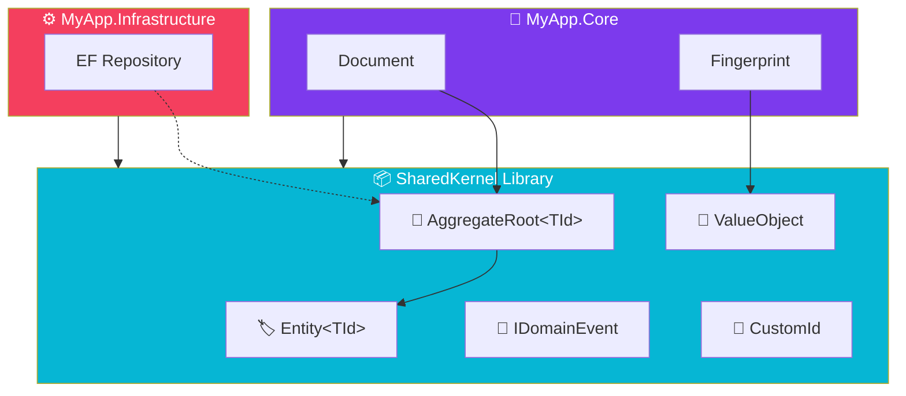

import Callout from '@components/Callout.astro';
import ImplementationNote from '@components/ImplementationNote.astro';
import ExternalCite from '@components/ExternalCite.astro';

## Introduction

When I started building BlueRobin, every module had its own definition of what an 'Entity' looked like. Archives.Core used GUIDs, the Workers used strings, and the Infrastructure layer had its own base classes. This inconsistency was a nightmare for serialization and testing. The Shared Kernel was my answer—a single library that defines the tactical building blocks everyone must use.

This article details the production implementation of our Shared Kernel, focusing on type safety, immutability, and enforcing DDD rules at the compiler level.

## Why a Shared Kernel?

Without a Shared Kernel, each microservice or module might implement "Entity" or "Domain Event" differently, leading to inconsistent behavior and serialization issues. The Shared Kernel acts as the "Standard Library" for your domain architecture.

| Component | Responsibility |
|-----------|----------------|
| **Entity** | Base class providing Identity and Equality behaviors. |
| **ValueObject** | Base class providing Structural Equality. |
| **AggregateRoot** | Base class for roots, managing Domain Events. |
| **CustomId** | A strongly-typed, human-friendly identifier (NanoID). |

<ExternalCite title="Domain-Driven Design: Tackling Complexity in the Heart of Software" url="https://www.domainlanguage.com/ddd/" author="Eric Evans" date="2003" />

## Architecture Overview

The Shared Kernel sits at the bottom of the dependency graph. It has no dependencies on infrastructure or specific domains.


```mermaid
flowchart TB
    subgraph SK["📦 SharedKernel Library"]
        direction TB
        Entity["🏷️ Entity&lt;TId&gt;"]
        AggRoot["📄 AggregateRoot&lt;TId&gt;"]
        VO["💎 ValueObject"]
        Event["📣 IDomainEvent"]
        BRId["🔑 CustomId"]
        
        AggRoot --> Entity
    end

    subgraph Core["🧱 MyApp.Core"]
        Doc["Document"] --> AggRoot
        FP["Fingerprint"] --> VO
    end

    subgraph Infra["⚙️ MyApp.Infrastructure"]
        Repo["EF Repository"] -.-> AggRoot
    end

    Core --> SK
    Infra --> SK

    classDef primary fill:#7c3aed,color:#fff
    classDef secondary fill:#06b6d4,color:#fff
    classDef db fill:#f43f5e,color:#fff
    classDef warning fill:#fbbf24,color:#000

    class Core primary
    class SK secondary
    class Infra db
```

## Implementation

## The Identity Strategy: CustomId

We use a specialized, strongly-typed identifier key called `CustomId` instead of raw GUIDs or Integers.

**Why?**
1.  **URL Friendliness**: 8-char alphanumeric strings are cleaner in URLs than GUIDs.
2.  **Type Safety**: Prevents mixing up `UserId` and `DocumentId` (Primitive Obsession).
3.  **Consistency**: Used everywhere—Postgres Primary Keys, MinIO Object Keys, NATS Subjects.

```csharp
// SharedKernel/Utilities/CustomId.cs
using NanoidDotNet;

public readonly struct CustomId : IEquatable<CustomId>, IComparable<CustomId>
{
    private const string Alphabet = "0123456789abcdefghijklmnopqrstuvwxyz";
    private const int Size = 8;
    
    public string Value { get; }

    // Private constructor forces validation
    private CustomId(string value) => Value = value;

    public static CustomId New() => new(Nanoid.Generate(Alphabet, Size));

    public static Result<CustomId> Create(string? value)
    {
        if (string.IsNullOrWhiteSpace(value))
            return Result.Failure<CustomId>(new Error("Identity.Empty", "ID cannot be empty"));

        var normalized = value.Trim().ToLowerInvariant();
        
        if (normalized.Length != Size || !normalized.All(c => Alphabet.Contains(c)))
             return Result.Failure<CustomId>(new Error("Identity.Invalid", "Invalid ID format"));

        return Result.Success(new CustomId(normalized));
    }
    
    // Equality and Operators
    public override bool Equals(object? obj) => obj is CustomId other && Equals(other);
    public bool Equals(CustomId other) => Value == other.Value;
    public override int GetHashCode() => Value.GetHashCode();
    public override string ToString() => Value;
    
    public static implicit operator string(CustomId id) => id.Value;
}
```

<ExternalCite title="NanoID - A tiny, secure, URL-friendly, unique string ID generator" url="https://github.com/ai/nanoid" author="Andrey Sitnik" date="2024" />

<ImplementationNote>
We stick to **lowercase alphanumeric** characters. This avoids case-sensitivity issues across different filesystems (MinIO on Linux vs Windows) and database collations.
</ImplementationNote>

<ImplementationNote>
I initially used a 12-character NanoID, but found that 8 characters with a 36-character alphabet (a-z, 0-9) gives roughly 2.8 trillion combinations. For a personal document system, the collision probability is astronomically low. The shorter length made a noticeable difference in URL readability and NATS subject lengths.
</ImplementationNote>

## The Entity Base Class

Entities are objects defined by their identity. Two entities with different attributes but the same ID are considered the same entity.

```csharp
// SharedKernel/Entity.cs
public abstract class Entity
{
    // Protected set: ID should only be set during construction
    public CustomId Id { get; protected set; }

    protected Entity(CustomId id)
    {
        Id = id;
    }

    // EF Core constructor
    protected Entity() { }
}
```

<ExternalCite title=".NET Domain-Driven Design Guidance" url="https://learn.microsoft.com/en-us/dotnet/architecture/microservices/microservice-ddd-cqrs-patterns/" author="Microsoft" date="2024" />

<ImplementationNote>
The parameterless `protected Entity() { }` constructor is there solely for EF Core. When Entity Framework materializes objects from the database, it needs a way to create instances without going through our factory methods. I spent a frustrating afternoon debugging "No suitable constructor found" errors before adding this. The key insight: EF Core uses reflection to bypass access modifiers, so `protected` works fine—it doesn't need to be `public`.
</ImplementationNote>

## The Aggregate Root

The `AggregateRoot` combines Entity behavior with the ability to record domain events. It serves as a transaction boundary.

```csharp
// SharedKernel/AggregateRoot.cs
public abstract class AggregateRoot : Entity, IAggregateRoot
{
    private readonly List<IDomainEvent> _domainEvents = new();
    
    public IReadOnlyCollection<IDomainEvent> DomainEvents => _domainEvents.AsReadOnly();

    protected AggregateRoot(CustomId id) : base(id) { }
    protected AggregateRoot() { }

    protected void RaiseDomainEvent(IDomainEvent domainEvent)
    {
        _domainEvents.Add(domainEvent);
    }

    public void ClearDomainEvents()
    {
        _domainEvents.Clear();
    }
}
```

<ExternalCite title="Implementing Domain-Driven Design" url="https://www.oreilly.com/library/view/implementing-domain-driven-design/9780133039900/" author="Vaughn Vernon" date="2013" />

<Callout type="tip">
**Why ClearEvents?** Domain Events are typically dispatched *after* the transaction is committed to the database. We need a way for the repository or dispatcher to clear them after processing to prevent double-firing.
</Callout>

<ImplementationNote>
Getting the timing of domain event dispatch right was one of the trickiest parts of the architecture. If you dispatch events before `SaveChangesAsync`, side effects execute even if the database commit fails. If you dispatch after, you risk losing events if the process crashes post-commit. I settled on dispatching via an EF Core `SaveChangesInterceptor` that fires events after a successful commit, with a fallback outbox pattern for critical events.
</ImplementationNote>

## The Value Object Base Class

For Value Objects, which have no identity, we implement structural equality.

```csharp
// SharedKernel/ValueObject.cs
public abstract class ValueObject : IEquatable<ValueObject>
{
    protected abstract IEnumerable<object?> GetEqualityComponents();

    public override bool Equals(object? obj)
    {
        if (obj is null || obj.GetType() != GetType()) return false;
        return Equals((ValueObject)obj);
    }

    public bool Equals(ValueObject? other)
    {
        return other is not null && GetEqualityComponents().SequenceEqual(other.GetEqualityComponents());
    }

    public override int GetHashCode()
    {
        return GetEqualityComponents()
            .Aggregate(0, (hash, current) => HashCode.Combine(hash, current));
    }
    
    public static bool operator ==(ValueObject? a, ValueObject? b)
    {
        if (a is null && b is null) return true;
        if (a is null || b is null) return false;
        return a.Equals(b);
    }

    public static bool operator !=(ValueObject? a, ValueObject? b) => !(a == b);
}
```

<ExternalCite title="Value Object Pattern" url="https://martinfowler.com/bliki/ValueObject.html" author="Martin Fowler" date="2016" />

## Conclusion

The Shared Kernel has been one of the most valuable investments in this project. By standardizing `CustomId` and the base classes for DDD tactical patterns, I've ensured that every service speaks the same language and adheres to the same structural rules. When I later added the Finance and Health modules, they immediately inherited all these patterns without reinventing them.

**Next Steps**:
- Learn how to [enforce invariants with factory methods](/ddd-factory-methods-private-constructors) to prevent invalid state.
- Explore [Value Objects in depth](/ddd-value-objects-csharp) for self-validating domain primitives.
- See how [Aggregates](/ddd-aggregates-consistency-boundaries) build on these base classes.

## Further Reading

<ExternalCite title="Shared Kernel Pattern" url="https://www.domainlanguage.com/ddd/reference/" author="Eric Evans" date="2015" />

<ExternalCite title="C# Records - Microsoft Documentation" url="https://learn.microsoft.com/en-us/dotnet/csharp/language-reference/builtin-types/record" author="Microsoft" date="2024" />
