import Callout from '@components/Callout.astro';
import ImplementationNote from '@components/ImplementationNote.astro';
import ExternalCite from '@components/ExternalCite.astro';

## Introduction

In Domain-Driven Design (DDD), the **Shared Kernel** is a strategic pattern—a shared library containing the core building blocks and ubiquitous language elements referenced by multiple Bounded Contexts. It provides the tactical foundation: `Entity`, `AggregateRoot`, `ValueObject`, and standard `IDomainEvent` definitions.

This article details the production implementation of the Shared Kernel in BlueRobin, focusing on type safety, immutability, and enforcing DDD rules at the compiler level.

## Why a Shared Kernel?

Without a Shared Kernel, each microservice or module might implement "Entity" or "Domain Event" differently, leading to inconsistent behavior and serialization issues. The Shared Kernel acts as the "Standard Library" for your domain architecture.

| Component | Responsibility |
|-----------|----------------|
| **Entity** | Base class providing Identity and Equality behaviors. |
| **ValueObject** | Base class providing Structural Equality. |
| **AggregateRoot** | Base class for roots, managing Domain Events. |
| **BlueRobinId** | A strongly-typed, human-friendly identifier (NanoID). |

## Architecture Overview

The Shared Kernel sits at the bottom of the dependency graph. It has no dependencies on infrastructure or specific domains.

```mermaid
flowchart TB
    subgraph SK["📦 SharedKernel Library"]
        direction TB
        Entity["🏷️ Entity&lt;TId&gt;"]
        AggRoot["📄 AggregateRoot&lt;TId&gt;"]
        VO["💎 ValueObject"]
        Event["📣 IDomainEvent"]
        BRId["🔑 BlueRobinId"]
        
        AggRoot --> Entity
    end

    subgraph Core["🧱 Archives.Core"]
        Doc["Document"] --> AggRoot
        FP["Fingerprint"] --> VO
    end

    subgraph Infra["⚙️ Archives.Infrastructure"]
        Repo["EF Repository"] -.-> AggRoot
    end

    Core --> SK
    Infra --> SK

    classDef primary fill:#7c3aed,color:#fff
    classDef secondary fill:#06b6d4,color:#fff
    classDef db fill:#f43f5e,color:#fff
    classDef warning fill:#fbbf24,color:#000

    class Core primary
    class SK secondary
    class Infra db
```



## Implementation

## The Identity Strategy: BlueRobinId

BlueRobin uses a specialized, strongly-typed identifier key called `BlueRobinId` instead of raw GUIDs or Integers.

**Why?**
1.  **URL Friendliness**: 8-char alphanumeric strings are cleaner in URLs than GUIDs.
2.  **Type Safety**: Prevents mixing up `UserId` and `DocumentId` (Primitive Obsession).
3.  **Consistency**: Used everywhere—Postgres Primary Keys, MinIO Object Keys, NATS Subjects.

```csharp
// SharedKernel/Utilities/BlueRobinId.cs
using NanoidDotNet;

public readonly struct BlueRobinId : IEquatable<BlueRobinId>, IComparable<BlueRobinId>
{
    private const string Alphabet = "0123456789abcdefghijklmnopqrstuvwxyz";
    private const int Size = 8;
    
    public string Value { get; }

    // Private constructor forces validation
    private BlueRobinId(string value) => Value = value;

    public static BlueRobinId New() => new(Nanoid.Generate(Alphabet, Size));

    public static Result<BlueRobinId> Create(string? value)
    {
        if (string.IsNullOrWhiteSpace(value))
            return Result.Failure<BlueRobinId>(new Error("Identity.Empty", "ID cannot be empty"));

        var normalized = value.Trim().ToLowerInvariant();
        
        if (normalized.Length != Size || !normalized.All(c => Alphabet.Contains(c)))
             return Result.Failure<BlueRobinId>(new Error("Identity.Invalid", "Invalid ID format"));

        return Result.Success(new BlueRobinId(normalized));
    }
    
    // Equality and Operators
    public override bool Equals(object? obj) => obj is BlueRobinId other && Equals(other);
    public bool Equals(BlueRobinId other) => Value == other.Value;
    public override int GetHashCode() => Value.GetHashCode();
    public override string ToString() => Value;
    
    public static implicit operator string(BlueRobinId id) => id.Value;
}
```

<ImplementationNote>
We stick to **lowercase alphanumeric** characters. This avoids case-sensitivity issues across different filesystems (MinIO on Linux vs Windows) and database collations.
</ImplementationNote>

## The Entity Base Class

Entities are objects defined by their identity. Two entities with different attributes but the same ID are considered the same entity.

```csharp
// SharedKernel/Entity.cs
public abstract class Entity
{
    // Protected set: ID should only be set during construction
    public BlueRobinId Id { get; protected set; }

    protected Entity(BlueRobinId id)
    {
        Id = id;
    }

    // EF Core constructor
    protected Entity() { }
}
```

## The Aggregate Root

The `AggregateRoot` combines Entity behavior with the ability to record domain events. It serves as a transaction boundary.

```csharp
// SharedKernel/AggregateRoot.cs
public abstract class AggregateRoot : Entity, IAggregateRoot
{
    private readonly List<IDomainEvent> _domainEvents = new();
    
    public IReadOnlyCollection<IDomainEvent> DomainEvents => _domainEvents.AsReadOnly();

    protected AggregateRoot(BlueRobinId id) : base(id) { }
    protected AggregateRoot() { }

    protected void RaiseDomainEvent(IDomainEvent domainEvent)
    {
        _domainEvents.Add(domainEvent);
    }

    public void ClearDomainEvents()
    {
        _domainEvents.Clear();
    }
}
```

<Callout type="tip">
**Why ClearEvents?** Domain Events are typically dispatched *after* the transaction is committed to the database. We need a way for the repository or dispatcher to clear them after processing to prevent double-firing.
</Callout>

## The Value Object Base Class

For Value Objects, which have no identity, we implement structural equality.

```csharp
// SharedKernel/ValueObject.cs
public abstract class ValueObject : IEquatable<ValueObject>
{
    protected abstract IEnumerable<object?> GetEqualityComponents();

    public override bool Equals(object? obj)
    {
        if (obj is null || obj.GetType() != GetType()) return false;
        return Equals((ValueObject)obj);
    }

    public bool Equals(ValueObject? other)
    {
        return other is not null && GetEqualityComponents().SequenceEqual(other.GetEqualityComponents());
    }

    public override int GetHashCode()
    {
        return GetEqualityComponents()
            .Aggregate(0, (hash, current) => HashCode.Combine(hash, current));
    }
    
    public static bool operator ==(ValueObject? a, ValueObject? b)
    {
        if (a is null && b is null) return true;
        if (a is null || b is null) return false;
        return a.Equals(b);
    }

    public static bool operator !=(ValueObject? a, ValueObject? b) => !(a == b);
}
```

## Conclusion

The Shared Kernel provides a robust, type-safe foundation for the entire BlueRobin ecosystem. By standardizing `BlueRobinId` and the base classes for DDD tactical patterns, we ensure that every microservice speaks the same language and adheres to the same structural rules.
