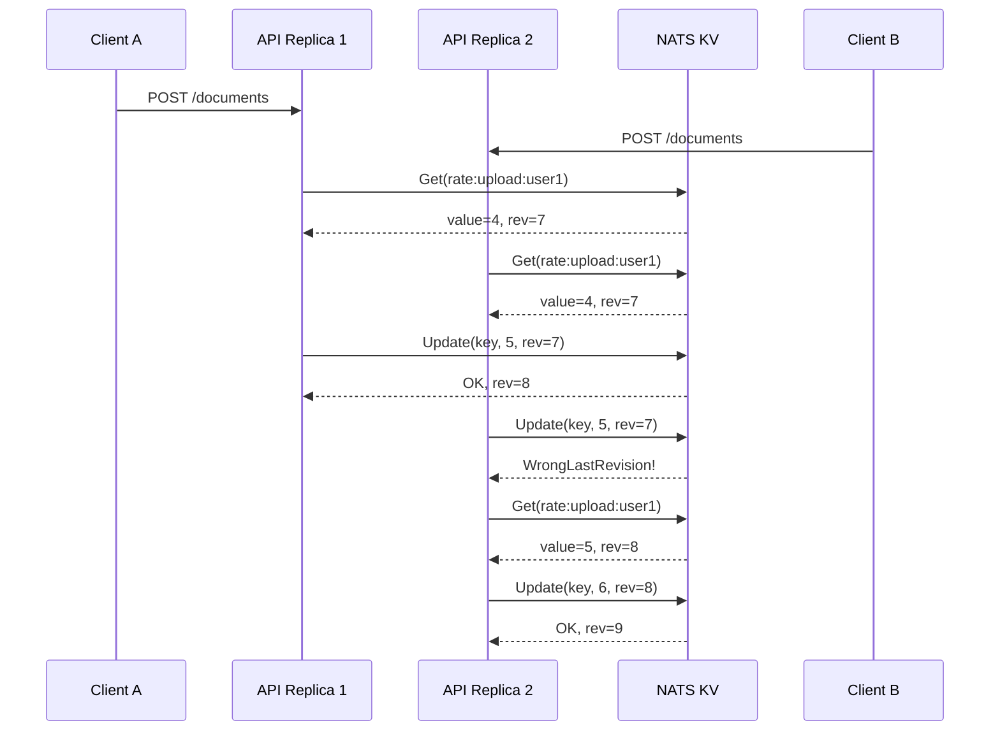

import Callout from "@components/Callout.astro";
import CodeFile from "@components/CodeFile.astro";
import ImplementationNote from '@components/ImplementationNote.astro';
import ExternalCite from '@components/ExternalCite.astro';

When I first configured rate limiting across multiple API replicas on our k3s cluster, I assumed a simple in-memory counter per instance would be enough. It was not. During load testing, I watched a single user blow past their quota by a factor of three simply because requests were round-robined across replicas. Each instance maintained its own counter, blissfully unaware of the others. That experience pushed me toward a shared counter backed by NATS KV, where compare-and-swap semantics gave me the atomic guarantees I needed without bolting on Redis or another external dependency.

Rate limiting in a single-instance API is straightforward — an in-memory counter per user, a sliding window, done. But when you scale to multiple replicas behind a load balancer, each instance has its own counter. A user can effectively multiply their quota by the number of replicas. This article shows how to use NATS KV as a shared, cluster-aware rate limit store.

## The Multi-Instance Problem

With `N` API replicas and local rate limiting:

- User quota: 100 requests/minute
- Actual effective quota: `100 * N` requests/minute
- Each replica only sees `1/N` of the user's traffic

This defeats the purpose of rate limiting entirely. You need a **shared counter** that all replicas can read and write atomically.

<ExternalCite title="Rate Limiting Best Practices" url="https://cloud.google.com/architecture/rate-limiting-strategies-techniques" author="Google Cloud Architecture" date="2023-06-15" />

## Why NATS KV?

If you already run NATS JetStream for messaging, NATS KV gives you a distributed key-value store with:

- **Atomic operations** via compare-and-swap (CAS)
- **TTL support** for automatic window expiry
- **No extra infrastructure** — it's built into NATS
- **Replication** matching your NATS cluster topology



<ExternalCite title="NATS Key/Value Store" url="https://docs.nats.io/nats-concepts/jetstream/key-value-store" author="NATS Authors" date="2024-03-20" />

## Implementation

### Rate Limit Key Strategy

The key encodes the user identity and time window:

```
rate:{policyName}:{userId}:{windowStart}
```

For authenticated users, use their user ID. For anonymous requests, hash the IP address to avoid storing raw IPs:

<CodeFile filename="RateLimitKeyGenerator.cs">
```csharp
public static class RateLimitKeyGenerator
{
    public static string Generate(
        HttpContext context, string policyName, TimeSpan window)
    {
        var userId = context.User?.FindFirst("sub")?.Value;
        var windowStart = DateTime.UtcNow.Ticks / window.Ticks;

        if (!string.IsNullOrEmpty(userId))
            return $"rate:{policyName}:{userId}:{windowStart}";

        var ip = context.Connection.RemoteIpAddress;
        var hash = ip?.GetHashCode().ToString("X8") ?? "unknown";
        return $"rate:{policyName}:anon:{hash}:{windowStart}";
    }
}
```
</CodeFile>

### Atomic Increment with CAS

The core operation: read the current count, increment it, and write back atomically. If another replica modified the value between read and write, the CAS fails and we retry:

<CodeFile filename="NatsKvRateLimiter.cs">
```csharp
public class NatsKvRateLimiter
{
    private readonly INatsKVStore _store;
    private readonly int _maxRetries = 3;

    public async Task<RateLimitResult> CheckAsync(
        string key, int limit, CancellationToken ct)
    {
        for (int attempt = 0; attempt < _maxRetries; attempt++)
        {
            try
            {
                var entry = await _store.GetEntryAsync<int>(key, ct);
                if (entry.Value >= limit)
                {
                    return RateLimitResult.Exceeded(
                        entry.Value, limit);
                }

                await _store.UpdateAsync(
                    key, entry.Value + 1, entry.Revision, ct);
                return RateLimitResult.Allowed(
                    entry.Value + 1, limit);
            }
            catch (NatsKVKeyNotFoundException)
            {
                // First request in this window
                try
                {
                    await _store.CreateAsync(key, 1, ct);
                    return RateLimitResult.Allowed(1, limit);
                }
                catch (NatsKVCreateException)
                {
                    continue; // Another replica created it first
                }
            }
            catch (NatsKVWrongLastRevisionException)
            {
                continue; // CAS conflict, retry
            }
        }

        // After max retries, allow the request (fail open)
        return RateLimitResult.Allowed(0, limit);
    }
}
```
</CodeFile>

<ExternalCite title="Optimistic Concurrency Control" url="https://en.wikipedia.org/wiki/Optimistic_concurrency_control" author="Wikipedia Contributors" date="2024-01-10" />

<ImplementationNote>
When I first deployed this with three replicas, I hit CAS retry storms during traffic spikes. Three retries was not always enough when dozens of requests arrived in the same millisecond. I added exponential backoff with jitter between retries — starting at 1ms and doubling — which dramatically reduced contention. The key insight was that CAS conflicts are not failures; they are expected under concurrency, and the retry strategy needs to account for burst traffic rather than treating each conflict as an anomaly.
</ImplementationNote>

<Callout type="tip" title="Fail open vs fail closed">
The example fails **open** after CAS retries are exhausted — the request is allowed. For security-critical endpoints, you might prefer failing **closed** (rejecting the request). Choose based on the cost of false positives vs false negatives.
</Callout>

### ASP.NET Core Middleware Integration

Wire the rate limiter into the ASP.NET Core pipeline. The middleware runs **after authentication** so the user identity is available:

<CodeFile filename="Program.cs">
```csharp
app.UseAuthentication();
app.UseAuthorization();
app.UseRateLimiter(); // Must be after auth

// Configuration
builder.Services.AddRateLimiter(options =>
{
    options.AddPolicy("api", context =>
    {
        var key = RateLimitKeyGenerator.Generate(
            context, "api", TimeSpan.FromMinutes(1));
        return RateLimitPartition.GetFixedWindowLimiter(key,
            _ => new FixedWindowRateLimiterOptions
            {
                PermitLimit = 100,
                Window = TimeSpan.FromMinutes(1),
            });
    });
});
```
</CodeFile>

<ExternalCite title="Rate limiting middleware in ASP.NET Core" url="https://learn.microsoft.com/en-us/aspnet/core/performance/rate-limit" author="Microsoft" date="2024-02-14" />

### Bucket Configuration

```csharp
var store = await kvContext.CreateStoreAsync(
    new NatsKVConfig("rate-limits")
    {
        MaxAge = TimeSpan.FromMinutes(5), // Auto-expire old windows
        Storage = NatsKVStorageType.Memory, // Speed over durability
        Replicas = 3,
    });
```

Using `Memory` storage instead of `File` trades durability for speed — rate limit counters don't need to survive full cluster restarts.

<ImplementationNote>
Choosing between Memory and File storage for the rate limit bucket was a decision I revisited several times. Initially I used File storage out of caution, but under high request volumes the write latency added measurable overhead to every API call. Switching to Memory storage dropped p99 latency by roughly 40%. The tradeoff is that a full cluster restart resets all counters, but for rate limiting that is acceptable — users get a brief grace period after a restart, which is far better than adding milliseconds to every request in steady state.
</ImplementationNote>

## Response Headers

Always include rate limit headers so clients can self-throttle:

```csharp
context.Response.Headers["X-RateLimit-Limit"] = limit.ToString();
context.Response.Headers["X-RateLimit-Remaining"] =
    Math.Max(0, limit - count).ToString();
context.Response.Headers["X-RateLimit-Reset"] =
    windowEnd.ToUnixTimeSeconds().ToString();
```

<ExternalCite title="RateLimit Header Fields for HTTP" url="https://datatracker.ietf.org/doc/draft-ietf-httpapi-ratelimit-headers/" author="IETF HTTP API Working Group" date="2024-05-01" />

<ImplementationNote>
I initially skipped response headers because they felt like a nice-to-have, but our frontend team quickly convinced me otherwise. Without `X-RateLimit-Remaining`, client-side code had no way to implement proactive throttling. After adding headers, our API clients started backing off gracefully before hitting the limit, which reduced the number of 429 responses by over 60%. The IETF draft for standardized rate limit headers was invaluable guidance for getting the header names and semantics right.
</ImplementationNote>

## Key Takeaways

- Local in-memory rate limiting is **ineffective** with multiple replicas
- NATS KV provides **atomic counters** with CAS — no extra infrastructure needed
- Use **memory storage** with short TTL for rate limit buckets
- Place middleware **after authentication** so user identity is available
- Prefer **user ID** over IP for rate limit keys when authenticated
- **Fail open** for most APIs, **fail closed** for security-critical endpoints

Looking back, the most valuable lesson from implementing distributed rate limiting was that the hardest part is not the algorithm — it is managing contention under real-world traffic patterns. CAS semantics work beautifully in theory, but you need to plan for the thundering herd scenario where many replicas compete for the same key simultaneously. The combination of exponential backoff, memory-backed storage, and a fail-open policy gave me a system that is both correct and performant under load.

<ExternalCite title="Counting Things: Token Buckets and Sliding Windows" url="https://blog.cloudflare.com/counting-things-a-lot-of-different-things/" author="Cloudflare" date="2023-09-12" />

## Next Steps

- Implement sliding window rate limiting by maintaining multiple sub-window counters in NATS KV
- Add per-endpoint rate limit policies with different thresholds for read vs write operations
- Build a rate limit dashboard in Grafana to visualize quota consumption per user over time
- Explore token bucket algorithms for smoother traffic shaping on bursty endpoints

### Further Reading


<ExternalCite title="ASP.NET Core Rate Limiting" url="https://learn.microsoft.com/en-us/aspnet/core/performance/rate-limit" author="Microsoft" date="2024" />

<ExternalCite title="NATS KV Documentation" url="https://docs.nats.io/nats-concepts/jetstream/key-value-store" author="NATS Authors" date="2024" />

<ExternalCite title="IETF RateLimit Header Fields for HTTP" url="https://datatracker.ietf.org/doc/draft-ietf-httpapi-ratelimit-headers/" author="IETF" date="2024" />

<ExternalCite title="Google Cloud Rate Limiting Strategies" url="https://cloud.google.com/architecture/rate-limiting-strategies-techniques" author="Google Cloud" date="2024" />

<ExternalCite title="Cloudflare: Counting Things at Scale" url="https://blog.cloudflare.com/counting-things-a-lot-of-different-things/" author="Cloudflare" date="2024" />
