import Callout from '@components/Callout.astro';
import ImplementationNote from '@components/ImplementationNote.astro';
import CodeFile from '@components/CodeFile.astro';
import ExternalCite from '@components/ExternalCite.astro';

## Introduction

Traditional OCR tools extract text but lose document structure. **Docling** is IBM's open-source document understanding library that preserves layout, tables, and semantic structure while converting documents to clean Markdown.

In this guide, we'll integrate Docling as a microservice in a .NET document processing pipeline.

## Why Docling?

| Feature | Traditional OCR | Docling |
|---------|-----------------|---------|
| Text extraction | ✅ | ✅ |
| Layout preservation | ❌ | ✅ |
| Table reconstruction | ❌ | ✅ |
| Semantic sections | ❌ | ✅ |
| Multi-format support | Limited | PDF, DOCX, PPTX, Images, HTML |
| Output format | Plain text | Markdown, JSON, DocTags |

Docling understands document structure—headings, paragraphs, lists, tables—and outputs clean Markdown that's perfect for RAG pipelines and semantic search.

<ExternalCite 
  title="Docling - Document Understanding Made Easy" 
  url="https://github.com/DS4SD/docling"
  author="IBM Research"
/>

## Architecture Overview

We'll deploy Docling as a REST API service and call it from .NET workers:

```mermaid
flowchart LR
    MinIO["🪣 MinIO\n(Storage)"] --> Worker["⚙️ OCR Worker\n(.NET)"]
    Worker --> Docling["📄 Docling\n(Python)"]
    Worker --> NATS["⚡ NATS\n(Events)"]

    classDef primary fill:#7c3aed,color:#fff
    classDef secondary fill:#06b6d4,color:#fff
    classDef db fill:#f43f5e,color:#fff
    classDef warning fill:#fbbf24,color:#000

    class Worker primary
    class Docling secondary
    class MinIO,NATS db
```



## Implementation

## Setting Up Docling Service

### Dockerfile

Create a containerized Docling API service:

```dockerfile
# Dockerfile for Docling OCR Service
FROM python:3.11-slim

WORKDIR /app

# Install system dependencies for PDF processing
RUN apt-get update && apt-get install -y \
    libgl1-mesa-glx \
    libglib2.0-0 \
    poppler-utils \
    && rm -rf /var/lib/apt/lists/*

# Install Python dependencies
COPY requirements.txt .
RUN pip install --no-cache-dir -r requirements.txt

COPY app.py .

EXPOSE 8080

CMD ["uvicorn", "app:app", "--host", "0.0.0.0", "--port", "8080"]
```

### Python API Service

```python
# app.py
from fastapi import FastAPI, HTTPException, UploadFile, File
from fastapi.responses import JSONResponse
from pydantic import BaseModel
from docling.document_converter import DocumentConverter
from docling.datamodel.pipeline_options import PdfPipelineOptions
from docling.datamodel.base_models import InputFormat
import tempfile
import os
from pathlib import Path

app = FastAPI(title="Docling OCR Service")

# Configure converter with optimal settings
pipeline_options = PdfPipelineOptions()
pipeline_options.do_ocr = True
pipeline_options.do_table_structure = True

converter = DocumentConverter(
    allowed_formats=[
        InputFormat.PDF,
        InputFormat.DOCX,
        InputFormat.PPTX,
        InputFormat.IMAGE,
        InputFormat.HTML,
    ],
    pdf_pipeline_options=pipeline_options,
)


class ConvertRequest(BaseModel):
    file_url: str
    output_format: str = "markdown"  # markdown, json, doctags


class ConvertResponse(BaseModel):
    content: str
    format: str
    page_count: int
    tables: list[dict] | None = None


@app.post("/convert", response_model=ConvertResponse)
async def convert_document(file: UploadFile = File(...), output_format: str = "markdown"):
    """Convert an uploaded document to the specified format."""
    
    # Validate file type
    allowed_extensions = {".pdf", ".docx", ".pptx", ".png", ".jpg", ".jpeg", ".html"}
    ext = Path(file.filename).suffix.lower()
    if ext not in allowed_extensions:
        raise HTTPException(400, f"Unsupported file type: {ext}")
    
    # Save uploaded file temporarily
    with tempfile.NamedTemporaryFile(delete=False, suffix=ext) as tmp:
        content = await file.read()
        tmp.write(content)
        tmp_path = tmp.name
    
    try:
        # Convert document
        result = converter.convert(tmp_path)
        doc = result.document
        
        # Generate output in requested format
        if output_format == "markdown":
            output = doc.export_to_markdown()
        elif output_format == "json":
            output = doc.export_to_dict()
        elif output_format == "doctags":
            output = doc.export_to_document_tokens()
        else:
            raise HTTPException(400, f"Unknown output format: {output_format}")
        
        # Extract table data for separate processing
        tables = []
        for table in doc.tables:
            tables.append({
                "id": table.id,
                "rows": table.num_rows,
                "cols": table.num_cols,
                "markdown": table.export_to_markdown(),
            })
        
        return ConvertResponse(
            content=output if isinstance(output, str) else str(output),
            format=output_format,
            page_count=doc.num_pages,
            tables=tables if tables else None,
        )
    
    finally:
        # Cleanup temp file
        os.unlink(tmp_path)


@app.get("/health")
async def health():
    """Health check endpoint."""
    return {"status": "healthy", "service": "docling-ocr"}
```

### Requirements

```text
# requirements.txt
docling>=2.15.0
fastapi>=0.115.0
uvicorn>=0.32.0
python-multipart>=0.0.17
```

## Kubernetes Deployment

Deploy Docling to your K3s cluster:

```yaml
# infrastructure/ai/docling-ocr/deployment.yaml
apiVersion: apps/v1
kind: Deployment
metadata:
  name: docling-ocr
  namespace: ai
spec:
  replicas: 2
  selector:
    matchLabels:
      app: docling-ocr
  template:
    metadata:
      labels:
        app: docling-ocr
    spec:
      containers:
        - name: docling
          image: ghcr.io/bluerobin/docling-ocr:latest
          ports:
            - containerPort: 8080
          resources:
            requests:
              memory: "2Gi"
              cpu: "500m"
            limits:
              memory: "4Gi"
              cpu: "2000m"
          readinessProbe:
            httpGet:
              path: /health
              port: 8080
            initialDelaySeconds: 10
            periodSeconds: 5
          livenessProbe:
            httpGet:
              path: /health
              port: 8080
            initialDelaySeconds: 30
            periodSeconds: 10
---
apiVersion: v1
kind: Service
metadata:
  name: docling-ocr
  namespace: ai
spec:
  selector:
    app: docling-ocr
  ports:
    - port: 80
      targetPort: 8080
```

<ImplementationNote>
Docling is memory-intensive when processing large PDFs. The 4Gi limit handles most documents; increase for scientific papers with many figures.
</ImplementationNote>

## .NET Client Implementation

### HTTP Client Service

Create a typed HTTP client to call the Docling API:

```csharp
// Infrastructure/Ocr/DoclingOcrService.cs
namespace Archives.Infrastructure.Ocr;

public interface IOcrService
{
    Task<OcrResult> ProcessDocumentAsync(
        Stream documentStream, 
        string fileName,
        CancellationToken ct = default);
}

public sealed record OcrResult(
    string Content,
    int PageCount,
    IReadOnlyList<TableData>? Tables);

public sealed record TableData(
    string Id,
    int Rows,
    int Columns,
    string Markdown);

public sealed class DoclingOcrService : IOcrService
{
    private readonly HttpClient _httpClient;
    private readonly ILogger<DoclingOcrService> _logger;
    
    public DoclingOcrService(
        HttpClient httpClient,
        ILogger<DoclingOcrService> logger)
    {
        _httpClient = httpClient;
        _logger = logger;
    }
    
    public async Task<OcrResult> ProcessDocumentAsync(
        Stream documentStream,
        string fileName,
        CancellationToken ct = default)
    {
        _logger.LogInformation("Processing document {FileName} with Docling OCR", fileName);
        
        using var content = new MultipartFormDataContent();
        using var streamContent = new StreamContent(documentStream);
        
        // Set content type based on file extension
        var contentType = GetContentType(fileName);
        streamContent.Headers.ContentType = new MediaTypeHeaderValue(contentType);
        
        content.Add(streamContent, "file", fileName);
        content.Add(new StringContent("markdown"), "output_format");
        
        var response = await _httpClient.PostAsync("/convert", content, ct);
        
        if (!response.IsSuccessStatusCode)
        {
            var error = await response.Content.ReadAsStringAsync(ct);
            _logger.LogError("Docling OCR failed: {StatusCode} - {Error}", 
                response.StatusCode, error);
            throw new OcrException($"OCR processing failed: {error}");
        }
        
        var result = await response.Content.ReadFromJsonAsync<DoclingResponse>(ct)
            ?? throw new OcrException("Empty response from OCR service");
        
        _logger.LogInformation(
            "OCR completed: {PageCount} pages, {TableCount} tables extracted",
            result.PageCount,
            result.Tables?.Count ?? 0);
        
        return new OcrResult(
            Content: result.Content,
            PageCount: result.PageCount,
            Tables: result.Tables?.Select(t => new TableData(
                t.Id, t.Rows, t.Cols, t.Markdown)).ToList());
    }
    
    private static string GetContentType(string fileName)
    {
        var ext = Path.GetExtension(fileName).ToLowerInvariant();
        return ext switch
        {
            ".pdf" => "application/pdf",
            ".docx" => "application/vnd.openxmlformats-officedocument.wordprocessingml.document",
            ".pptx" => "application/vnd.openxmlformats-officedocument.presentationml.presentation",
            ".png" => "image/png",
            ".jpg" or ".jpeg" => "image/jpeg",
            ".html" => "text/html",
            _ => "application/octet-stream"
        };
    }
    
    private sealed record DoclingResponse(
        string Content,
        string Format,
        int PageCount,
        List<DoclingTable>? Tables);
    
    private sealed record DoclingTable(
        string Id,
        int Rows,
        int Cols,
        string Markdown);
}

public class OcrException : Exception
{
    public OcrException(string message) : base(message) { }
    public OcrException(string message, Exception inner) : base(message, inner) { }
}
```

### Service Registration

Configure the HTTP client with resilience policies:

```csharp
// Program.cs / ServiceCollectionExtensions.cs
services.AddHttpClient<IOcrService, DoclingOcrService>(client =>
{
    client.BaseAddress = new Uri(configuration["Ocr:DoclingUrl"] 
        ?? "http://docling-ocr.ai.svc.cluster.local");
    client.Timeout = TimeSpan.FromMinutes(5); // Long timeout for large documents
})
.AddStandardResilienceHandler(options =>
{
    options.Retry.MaxRetryAttempts = 3;
    options.Retry.Delay = TimeSpan.FromSeconds(2);
    options.CircuitBreaker.SamplingDuration = TimeSpan.FromSeconds(30);
});
```

<Callout type="tip">
Use Kubernetes service DNS (`docling-ocr.ai.svc.cluster.local`) for in-cluster communication. For local development, use `http://192.168.0.6:30808` via Tailscale.
</Callout>

## OCR Worker Integration

The OCR worker listens for document upload events and processes them:

```csharp
// Workers/OcrWorkerService.cs
namespace Archives.Workers;

public sealed class OcrWorkerService : BackgroundService
{
    private readonly INatsConnection _nats;
    private readonly IOcrService _ocrService;
    private readonly IObjectStorage _storage;
    private readonly ILogger<OcrWorkerService> _logger;
    private readonly string _environment;
    
    public OcrWorkerService(
        INatsConnection nats,
        IOcrService ocrService,
        IObjectStorage storage,
        IConfiguration configuration,
        ILogger<OcrWorkerService> logger)
    {
        _nats = nats;
        _ocrService = ocrService;
        _storage = storage;
        _logger = logger;
        _environment = configuration["Environment"] ?? "dev";
    }
    
    protected override async Task ExecuteAsync(CancellationToken stoppingToken)
    {
        var subject = $"{_environment}.archives.documents.object.uploaded";
        
        _logger.LogInformation("OCR Worker subscribing to {Subject}", subject);
        
        await foreach (var msg in _nats.SubscribeAsync<DocumentUploadedEvent>(
            subject, cancellationToken: stoppingToken))
        {
            try
            {
                await ProcessDocumentAsync(msg.Data!, stoppingToken);
                await msg.AckAsync(cancellationToken: stoppingToken);
            }
            catch (Exception ex)
            {
                _logger.LogError(ex, "Failed to process document {DocumentId}", 
                    msg.Data?.DocumentId);
                await msg.NakAsync(cancellationToken: stoppingToken);
            }
        }
    }
    
    private async Task ProcessDocumentAsync(
        DocumentUploadedEvent evt, 
        CancellationToken ct)
    {
        _logger.LogInformation(
            "Processing OCR for document {DocumentId} from bucket {Bucket}",
            evt.DocumentId, evt.Bucket);
        
        // 1. Download document from MinIO
        var objectPath = $"original/{evt.DocumentId}{evt.FileExtension}";
        await using var documentStream = await _storage.GetObjectAsync(
            evt.Bucket, objectPath, ct);
        
        // 2. Process with Docling OCR
        var result = await _ocrService.ProcessDocumentAsync(
            documentStream,
            evt.FileName,
            ct);
        
        // 3. Store extracted content in MinIO
        var contentPath = $"processed/{evt.DocumentId}/content.md";
        await using var contentStream = new MemoryStream(
            Encoding.UTF8.GetBytes(result.Content));
        
        await _storage.PutObjectAsync(
            evt.Bucket,
            contentPath,
            contentStream,
            "text/markdown",
            ct);
        
        // 4. Store table data if present
        if (result.Tables?.Any() == true)
        {
            var tablesJson = JsonSerializer.Serialize(result.Tables);
            var tablesPath = $"processed/{evt.DocumentId}/tables.json";
            await using var tablesStream = new MemoryStream(
                Encoding.UTF8.GetBytes(tablesJson));
            
            await _storage.PutObjectAsync(
                evt.Bucket,
                tablesPath,
                tablesStream,
                "application/json",
                ct);
        }
        
        // 5. Publish completion event
        await _nats.PublishAsync(
            $"{_environment}.archives.documents.ocr.completed",
            new OcrCompletedEvent
            {
                DocumentId = evt.DocumentId,
                Bucket = evt.Bucket,
                UserId = evt.UserId,
                PageCount = result.PageCount,
                TableCount = result.Tables?.Count ?? 0,
                ContentPath = contentPath,
                ProcessedAt = DateTimeOffset.UtcNow
            },
            cancellationToken: ct);
        
        _logger.LogInformation(
            "OCR completed for {DocumentId}: {Pages} pages, {Tables} tables",
            evt.DocumentId, result.PageCount, result.Tables?.Count ?? 0);
    }
}
```

## Event Schemas

Define strongly-typed events for the pipeline:

```csharp
// Application/Events/DocumentEvents.cs
namespace Archives.Application.Events;

public sealed record DocumentUploadedEvent
{
    public required string DocumentId { get; init; }
    public required string Bucket { get; init; }
    public required string UserId { get; init; }
    public required string FileName { get; init; }
    public required string FileExtension { get; init; }
    public required long FileSize { get; init; }
    public required string ContentType { get; init; }
    public required DateTimeOffset UploadedAt { get; init; }
}

public sealed record OcrCompletedEvent
{
    public required string DocumentId { get; init; }
    public required string Bucket { get; init; }
    public required string UserId { get; init; }
    public required int PageCount { get; init; }
    public required int TableCount { get; init; }
    public required string ContentPath { get; init; }
    public required DateTimeOffset ProcessedAt { get; init; }
}
```

## Error Handling and Retries

Add robust error handling for OCR failures:

```csharp
// Infrastructure/Ocr/OcrRetryPolicy.cs
public static class OcrRetryPolicy
{
    public static AsyncRetryPolicy<OcrResult> Create(ILogger logger)
    {
        return Policy<OcrResult>
            .Handle<HttpRequestException>()
            .Or<TaskCanceledException>()
            .Or<OcrException>(ex => !ex.Message.Contains("Unsupported"))
            .WaitAndRetryAsync(
                retryCount: 3,
                sleepDurationProvider: attempt => 
                    TimeSpan.FromSeconds(Math.Pow(2, attempt)),
                onRetry: (outcome, timeSpan, attempt, _) =>
                {
                    logger.LogWarning(
                        "OCR retry {Attempt} after {Delay}s due to: {Error}",
                        attempt,
                        timeSpan.TotalSeconds,
                        outcome.Exception?.Message);
                });
    }
}
```

## Health Checks

Add Docling to your health check suite:

```csharp
// Infrastructure/HealthChecks/DoclingHealthCheck.cs
public class DoclingHealthCheck : IHealthCheck
{
    private readonly HttpClient _httpClient;
    
    public DoclingHealthCheck(IHttpClientFactory factory)
    {
        _httpClient = factory.CreateClient("Docling");
    }
    
    public async Task<HealthCheckResult> CheckHealthAsync(
        HealthCheckContext context,
        CancellationToken ct = default)
    {
        try
        {
            var response = await _httpClient.GetAsync("/health", ct);
            
            if (response.IsSuccessStatusCode)
            {
                return HealthCheckResult.Healthy("Docling OCR is available");
            }
            
            return HealthCheckResult.Degraded(
                $"Docling returned {response.StatusCode}");
        }
        catch (Exception ex)
        {
            return HealthCheckResult.Unhealthy(
                "Cannot reach Docling OCR service",
                exception: ex);
        }
    }
}

// Registration
services.AddHealthChecks()
    .AddCheck<DoclingHealthCheck>("docling-ocr");
```

## Testing the Integration

Write integration tests to verify OCR processing:

```csharp
// Tests/Integration/DoclingOcrServiceTests.cs
public class DoclingOcrServiceTests : IClassFixture<DoclingFixture>
{
    private readonly IOcrService _ocrService;
    
    public DoclingOcrServiceTests(DoclingFixture fixture)
    {
        _ocrService = fixture.OcrService;
    }
    
    [Fact]
    public async Task ProcessDocument_WithValidPdf_ReturnsMarkdown()
    {
        // Arrange
        var pdfPath = Path.Combine("TestFiles", "sample-invoice.pdf");
        await using var stream = File.OpenRead(pdfPath);
        
        // Act
        var result = await _ocrService.ProcessDocumentAsync(
            stream, "sample-invoice.pdf");
        
        // Assert
        Assert.NotEmpty(result.Content);
        Assert.Contains("Invoice", result.Content);
        Assert.True(result.PageCount >= 1);
    }
    
    [Fact]
    public async Task ProcessDocument_WithTable_ExtractsTables()
    {
        // Arrange
        var pdfPath = Path.Combine("TestFiles", "sample-with-table.pdf");
        await using var stream = File.OpenRead(pdfPath);
        
        // Act
        var result = await _ocrService.ProcessDocumentAsync(
            stream, "sample-with-table.pdf");
        
        // Assert
        Assert.NotNull(result.Tables);
        Assert.NotEmpty(result.Tables);
        Assert.Contains("|", result.Tables[0].Markdown); // Markdown table
    }
}
```

## Performance Optimization

### Batch Processing

For high-volume scenarios, batch documents:

```csharp
public async Task ProcessBatchAsync(
    IEnumerable<DocumentToProcess> documents,
    CancellationToken ct)
{
    var semaphore = new SemaphoreSlim(maxConcurrency: 3);
    
    var tasks = documents.Select(async doc =>
    {
        await semaphore.WaitAsync(ct);
        try
        {
            return await ProcessDocumentAsync(doc, ct);
        }
        finally
        {
            semaphore.Release();
        }
    });
    
    await Task.WhenAll(tasks);
}
```

### Caching Document Fingerprints

Skip re-processing unchanged documents:

```csharp
public async Task<bool> ShouldProcessAsync(
    string bucket, 
    string documentId, 
    string fingerprint,
    CancellationToken ct)
{
    var existingFingerprint = await _storage.GetMetadataAsync(
        bucket,
        $"processed/{documentId}/fingerprint",
        ct);
    
    return existingFingerprint != fingerprint;
}
```

## Summary

We've built a complete Docling OCR integration:

1. **Docling Service** — Containerized Python API with FastAPI
2. **Kubernetes Deployment** — Scalable service in the `ai` namespace
3. **HTTP Client** — Typed client with resilience policies
4. **OCR Worker** — Event-driven document processing
5. **Health Checks** — Monitoring integration

Docling's layout-aware extraction produces clean Markdown that's ideal for:
- Semantic search with embeddings
- RAG pipelines with structured chunks
- Document summarization
- Knowledge extraction

Next in the series, we'll build the **embedding pipeline** that converts OCR output into vector representations for semantic search.
