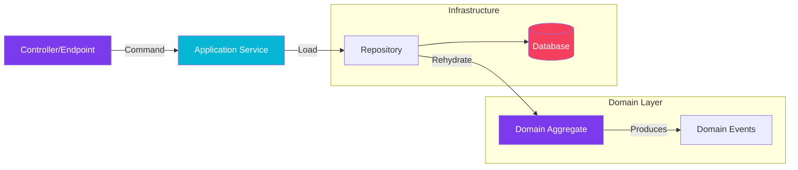

import Callout from '@components/Callout.astro';
import ImplementationNote from '@components/ImplementationNote.astro';
import CodeFile from '@components/CodeFile.astro';
import ExternalCite from '@components/ExternalCite.astro';

## Introduction

Domain-Driven Design (DDD) is often discussed in abstract terms. "Bounded Contexts," "Ubiquitous Language," "Aggregates." These terms sound great in a conference talk, but how do they translate to Monday morning coding?

At BlueRobin, DDD isn't just theory; it's how we structure our solution to keep complexity manageable as the system grows. In this guide, we will walk through a single feature—**"Archiving a Document"**—from the initial whiteboard session to the final API endpoint.

**Why This Matters:**

- **Clarity**: It bridges the gap between business requirements and variable names.
- **Maintainability**: It isolates business logic from infrastructure concerns (Database, API).
- **Consistency**: It gives the team a shared mental model.

### What We'll Build

We will implement the **Document Aggregate**. You will see:
1. **Event Storming**: Identifying the Domain Events.
2. **The Aggregate**: Modeling the invariants in C#.
3. **The Repository**: Persisting the state.
4. **The API**: Exposing the command.

## Architecture Overview

The flow of data and control follows the "Onion Architecture" (or Clean Architecture), moving from the outside (API) inwards to the Domain.



## Step 1: Event Storming

We start not with code, but with sticky notes. We ask: "What happens in the system?"

For our document system, we identified these key events:
- `DocumentUploaded`
- `DocumentVisualized`
- `DocumentArchived`

We realized that a *Document* isn't just a file. It has lifecycle states. It can't be archived if it hasn't been processed. It can't be modified after archiving. These rules are our **Invariants**.

## Step 2: The Domain Aggregate

The **Aggregate** is the transaction boundary. It ensures our invariants are never violated.

<ImplementationNote>
Notice the use of `private set` and a static factory method `Create`. This prevents invalid objects from ever existing. You cannot "new up" a `Document` without an ID and Owner.
</ImplementationNote>

```csharp
public class Document : AggregateRoot
{
    public DocumentId Id { get; private set; }
    public UserId OwnerId { get; private set; }
    public DocumentStatus Status { get; private set; }
    public DateTime? ArchivedAt { get; private set; }

    // Private constructor for ORM/Serialization
    private Document() { }

    // Factory Method acts as the 'genesis' event
    public static Document Create(DocumentId id, UserId ownerId, string filename)
    {
        var doc = new Document
        {
            Id = id,
            OwnerId = ownerId,
            Status = DocumentStatus.Draft
        };
        
        doc.AddDomainEvent(new DocumentCreated(id, ownerId));
        return doc;
    }

    // Business Method - Enforcing Invariants
    public void Archive()
    {
        if (Status == DocumentStatus.Archived)
            throw new DomainException("Document is already archived.");

        if (Status == DocumentStatus.Processing)
            throw new DomainException("Cannot archive a document while it is processing.");

        Status = DocumentStatus.Archived;
        ArchivedAt = DateTime.UtcNow;

        AddDomainEvent(new DocumentArchived(Id));
    }
}
```

## Step 3: The Repository

The repository interface lives in the Domain/Core project, but the implementation lives in Infrastructure. This verifies that our Domain knows nothing about the database.

```csharp
// Core/Interfaces/IDocumentRepository.cs
public interface IDocumentRepository
{
    Task<Document?> GetByIdAsync(DocumentId id);
    Task AddAsync(Document document);
    Task SaveChangesAsync();
}
```

## Step 4: The API Endpoint

Finally, we expose this capability to the world. We use the **Command Pattern**. The endpoint simply translates the HTTP request into a Domain Command and orchestrates the transaction.

```csharp
public class ArchiveDocumentEndpoint : Endpoint<ArchiveDocumentRequest>
{
    private readonly IDocumentRepository _repository;

    public ArchiveDocumentEndpoint(IDocumentRepository repository)
    {
        _repository = repository;
    }

    public override async Task HandleAsync(ArchiveDocumentRequest req, CancellationToken ct)
    {
        // 1. Load Aggregate
        var document = await _repository.GetByIdAsync(req.Id);
        if (document is null) 
        {
            await SendNotFoundAsync(ct);
            return;
        }

        // 2. Invoke Domain Behavior
        // This is where the business rules in the Aggregate are checked.
        // If it throws, our global exception handler returns 400 Bad Request.
        document.Archive();

        // 3. Persist
        await _repository.SaveChangesAsync();

        await SendOkAsync(ct);
    }
}
```

## Conclusion

By following this path, we've achieved something powerful. 

The API layer doesn't know *rules* about archiving (like "can't archive while processing"); it only knows *how* to call the method. The Database layer doesn't enforce business logic; it only stores state. 

All the complexity is encapsulated in the **Document Aggregate**. If the rules for archiving change tomorrow, we change them in one place—the Domain—and the whole system updates safely.

**Next Steps:**
- Learn about [Event Sourcing](link-to-event-sourcing) as an alternative to state-based persistence.
- Dive deeper into [Value Objects](link-to-value-objects) to replace primitive types like `string` and `int`.
