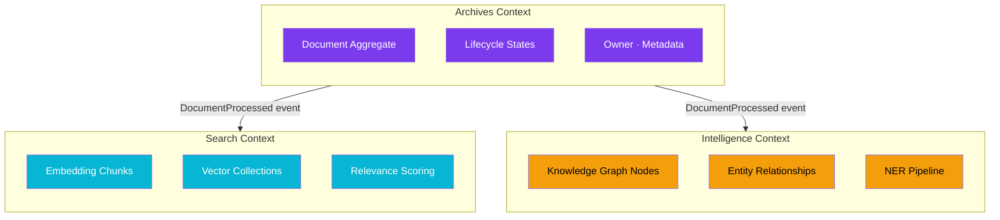
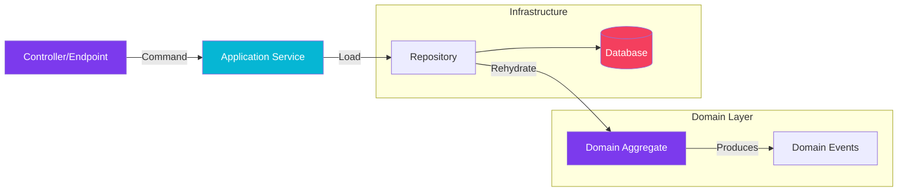
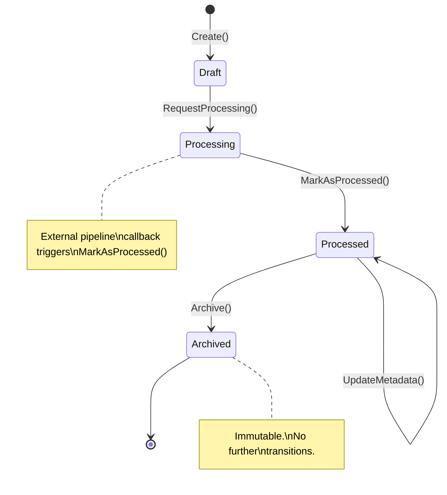

import Callout from '@components/Callout.astro';
import ImplementationNote from '@components/ImplementationNote.astro';
import CodeFile from '@components/CodeFile.astro';
import ExternalCite from '@components/ExternalCite.astro';

## Introduction

Domain-Driven Design (DDD) is often discussed in abstract terms. "Bounded Contexts," "Ubiquitous Language," "Aggregates." These terms sound great in a conference talk, but how do they translate to Monday morning coding?

In our project — BlueRobin, a document intelligence platform — DDD isn't just theory; it's how we structure our solution to keep complexity manageable as the system grows. The problem space we operate in is genuinely complex: documents arrive as raw files, pass through an OCR pipeline, get enriched with named-entity recognition, have their concepts embedded into vector space, and connect to a knowledge graph. There are at least five distinct sub-domains at play, each with its own rules. Without deliberate architectural boundaries, these concerns would bleed into each other and create an unmaintainable monolith.

In this guide, we will walk through a single feature — **"Archiving a Document"** — from the initial whiteboard session to the final API endpoint. Along the way, we will build out every tactical DDD pattern you need: Value Objects, Aggregates, Domain Events, Repositories, Application Services, and API Endpoints. By the end, you will have a complete, working vertical slice that demonstrates how all the pieces fit together.

**Why This Matters:**

- **Clarity**: It bridges the gap between business requirements and variable names. When a domain expert says "archive," the code has a method called `Archive()` with the exact same rules they described.
- **Maintainability**: It isolates business logic from infrastructure concerns (Database, API, messaging). You can swap your ORM, change your API framework, or migrate databases without touching a single line of domain logic.
- **Consistency**: It gives the team a shared mental model. Every developer knows that business rules live in the Aggregate, persistence lives in the Repository, and orchestration lives in the Application Service.
- **Testability**: By keeping the domain pure (no dependencies on frameworks or infrastructure), you can unit test every business rule with simple, fast tests that don't need a database or HTTP server.

<Callout type="info">
**Prerequisites**: This guide assumes basic familiarity with C# and ASP.NET. We use FastEndpoints for the API layer and EF Core for persistence. If you're new to these, the code examples are self-explanatory enough to follow along.
</Callout>

### What We'll Build

We will implement the **Document Aggregate** end-to-end. The journey covers:

1. **Strategic DDD**: Understanding Bounded Contexts and where our feature sits in the broader system.
2. **Event Storming**: Discovering Domain Events, Commands, and Invariants collaboratively.
3. **Value Objects**: Replacing primitive types with self-validating domain types.
4. **The Aggregate**: Modeling the full Document lifecycle with state transitions and invariant enforcement.
5. **Domain Events**: Decoupling side effects from core domain logic.
6. **The Repository**: Abstracting persistence behind a domain-centric interface and implementing it with EF Core.
7. **Application Services**: Orchestrating the use case — load, execute, persist, dispatch.
8. **The API**: Exposing commands through FastEndpoints with validation and error handling.
9. **Testing**: Proving our invariants hold with focused unit tests.

## Strategic DDD: The Big Picture

Before we write any code, we need to understand *where* our feature lives in the broader system. Strategic DDD is about drawing boundaries.

### Bounded Contexts

A Bounded Context is a boundary within which a particular model is defined and applicable. The word "Document" means different things in different parts of our system:

- In the **Archives context**, a Document is a lifecycle entity with states (Draft, Processing, Processed, Archived). It has an owner, metadata, and invariants about state transitions.
- In the **Search context**, a Document is a collection of vector embeddings paired with text chunks. It has a relevance score and retrieval semantics. It doesn't care about lifecycle states.
- In the **Intelligence context**, a Document is a source node in a knowledge graph, connected to entities (people, organizations, dates) extracted by NER. It has relationships, not states.

These are three different models of the same real-world concept. DDD tells us: that's fine. Don't try to create one God Model that satisfies all three. Instead, let each context have its own model, optimized for its own concerns.


```mermaid
flowchart TB
    subgraph Archives["Archives Context"]
        direction TB
        A1[Document Aggregate]
        A2[Lifecycle States]
        A3[Owner · Metadata]
    end

    subgraph Search["Search Context"]
        direction TB
        S1[Embedding Chunks]
        S2[Vector Collections]
        S3[Relevance Scoring]
    end

    subgraph Intelligence["Intelligence Context"]
        direction TB
        I1[Knowledge Graph Nodes]
        I2[Entity Relationships]
        I3[NER Pipeline]
    end

    Archives -->|DocumentProcessed event| Search
    Archives -->|DocumentProcessed event| Intelligence

    classDef primary fill:#7c3aed,color:#fff
    classDef secondary fill:#06b6d4,color:#fff
    classDef accent fill:#f59e0b,color:#000

    class A1,A2,A3 primary
    class S1,S2,S3 secondary
    class I1,I2,I3 accent
```

The Archives context publishes events (`DocumentProcessed`, `DocumentArchived`) and the other contexts react to them. They don't share database tables, they don't import each other's classes, and they communicate only through well-defined integration events. This is the essence of strategic DDD: autonomy within boundaries, integration across them.

### Ubiquitous Language

Within the Archives Bounded Context, we establish a shared vocabulary:

| Term | Meaning |
|------|---------|
| **Document** | An uploaded file with its lifecycle, metadata, and ownership. The central Aggregate. |
| **Archive** | The act of marking a processed document as permanently stored and immutable. |
| **Processing** | The OCR + enrichment pipeline currently running on a document. |
| **Owner** | The user who uploaded the document. Identified by a `BlueRobinId` (8-char alphanumeric). |
| **Draft** | Initial state after upload, before processing begins. |
| **Invariant** | A rule that must always be true (e.g., "cannot archive while processing"). |

This table isn't documentation for documentation's sake. These terms appear in our code — class names, method names, variable names, error messages. When the domain expert says "you can't archive a document that's still processing," the code reads `if (Status == DocumentStatus.Processing) throw new DomainException("Cannot archive a document while it is processing.")`. The language is identical.

<Callout type="tip">
**Practical tip**: Keep a glossary like this in your repository's `docs/` folder. When a new developer joins, the first thing they read is the Ubiquitous Language. It prevents the slow drift where code terms diverge from business terms.
</Callout>

## Architecture Overview

The flow of data and control follows the "Onion Architecture" (or Clean Architecture), moving from the outside (API) inwards to the Domain. The key rule: **dependencies point inward.** The Domain layer has zero dependencies on anything else. Infrastructure depends on Domain, not the other way around.


```mermaid
flowchart LR
    API[Controller/Endpoint] -->|Command| App[Application Service]
    App -->|Load| Repo[Repository]
    Repo -->|Rehydrate| Domain[Domain Aggregate]

    subgraph Domain Layer
        Domain -->|Produces| Events[Domain Events]
    end

    subgraph Infrastructure
        Repo --> DB[("Database")]
    end

    classDef primary fill:#7c3aed,color:#fff
    classDef secondary fill:#06b6d4,color:#fff
    classDef db fill:#f43f5e,color:#fff

    class API,Domain primary
    class App secondary
    class DB db
```

Each layer has a clear responsibility:

- **API Layer**: Translates HTTP requests into commands, validates input shape, returns HTTP responses. Knows nothing about business rules.
- **Application Layer**: Orchestrates use cases. Loads aggregates from repositories, invokes domain methods, dispatches domain events, manages transactions.
- **Domain Layer**: Contains all business logic. Aggregates enforce invariants, Value Objects validate themselves, Domain Events record what happened.
- **Infrastructure Layer**: Implements persistence (EF Core), messaging (NATS), and external service integrations. Depends on domain interfaces.

## Step 1: Event Storming

We start not with code, but with sticky notes. Event Storming is a collaborative workshop technique created by Alberto Brandolini that brings developers and domain experts together to explore a business process.

### Running the Session

In our session, we used four types of sticky notes:

| Colour | Represents | Question it answers |
|--------|-----------|-------------------|
| **Orange** | Domain Event | "What happened?" — past tense, factual |
| **Blue** | Command | "What triggered this?" — imperative, an intention |
| **Yellow** | Actor / User | "Who did it?" — a human or system role |
| **Pink** | Hotspot / Problem | "What's unclear or risky?" — unresolved questions |

We started with events (orange) and worked backwards to commands (blue) and actors (yellow). Here's what emerged for the Document lifecycle:

### The Document Lifecycle Events

| # | Event (orange) | Triggered by Command (blue) | Actor (yellow) |
|---|----------------|---------------------------|----------------|
| 1 | `DocumentCreated` | `UploadDocument` | User |
| 2 | `DocumentProcessingRequested` | `RequestProcessing` | System (after upload) |
| 3 | `DocumentOcrCompleted` | — (external pipeline callback) | OCR Worker |
| 4 | `DocumentEnrichmentCompleted` | — (external pipeline callback) | Enrichment Worker |
| 5 | `DocumentProcessed` | `MarkAsProcessed` | Processing Orchestrator |
| 6 | `DocumentMetadataUpdated` | `UpdateMetadata` | User |
| 7 | `DocumentArchived` | `ArchiveDocument` | User |

During the session, we identified several **hotspots** (pink):

- **Can a document be re-processed?** Decision: No. Once processed, the document is immutable except for metadata updates and archiving.
- **What if OCR fails?** Decision: The document stays in `Processing` state. A separate retry mechanism handles failures. The Aggregate itself doesn't model retries — that's infrastructure.
- **Can an archived document be un-archived?** Decision: No. Archiving is permanent. This is a strong invariant.

<Callout type="warning">
**Key insight from our session**: The verb "archive" in our domain is NOT the same as "delete" or "soft-delete." An archived document remains fully searchable and retrievable. Archiving signals that the document's content is finalized and should not be reprocessed. This distinction — which seems obvious now — only emerged through discussion with the domain expert.
</Callout>

### From Events to Invariants

The invariants fell out of the event timeline naturally:

1. **A Document must have an Owner** — the `DocumentCreated` event always includes an `OwnerId`. No unowned documents can exist.
2. **Processing must be requested explicitly** — you can't jump from `Draft` to `Processed` without going through `Processing`.
3. **Cannot archive while processing** — the `ArchiveDocument` command must be rejected if the document is in `Processing` state.
4. **Cannot archive twice** — idempotency: if already archived, the command fails.
5. **Cannot modify an archived document** — once archived, only read operations are permitted.

These invariants become the guard clauses in our Aggregate methods.

## Step 2: Value Objects

Before building the Aggregate, we eliminate Primitive Obsession. Instead of passing around `Guid` for document IDs and `string` for filenames, we create self-validating Value Objects. A Value Object is defined by its attributes, not its identity — two `DocumentId` instances with the same value are equal.

<Callout type="info">
For a deep dive into Value Object patterns, equality semantics, and EF Core persistence, see [Value Objects: Immutability and Self-Validation in C#](/articles/ddd-value-objects-csharp).
</Callout>

<CodeFile filename="Core/ValueObjects/DocumentId.cs">
```csharp
public sealed record DocumentId
{
    public Guid Value { get; }

    public DocumentId(Guid value)
    {
        if (value == Guid.Empty)
            throw new DomainException("DocumentId cannot be empty.");

        Value = value;
    }

    public static DocumentId New() => new(Guid.NewGuid());

    public override string ToString() => Value.ToString();
}
```
</CodeFile>

<CodeFile filename="Core/ValueObjects/UserId.cs">
```csharp
public sealed record UserId
{
    public string Value { get; }

    public UserId(string value)
    {
        if (string.IsNullOrWhiteSpace(value))
            throw new DomainException("UserId cannot be empty.");

        if (value.Length != 8 || !value.All(char.IsLetterOrDigit))
            throw new DomainException(
                "UserId must be an 8-character alphanumeric BlueRobinId.");

        Value = value.ToLowerInvariant();
    }

    public override string ToString() => Value;
}
```
</CodeFile>

<CodeFile filename="Core/ValueObjects/Filename.cs">
```csharp
public sealed record Filename
{
    private static readonly HashSet<string> AllowedExtensions =
        [".pdf", ".docx", ".xlsx", ".pptx", ".txt", ".md", ".jpg", ".png"];

    public string Value { get; }
    public string Extension => Path.GetExtension(Value).ToLowerInvariant();

    public Filename(string value)
    {
        if (string.IsNullOrWhiteSpace(value))
            throw new DomainException("Filename cannot be empty.");

        var ext = Path.GetExtension(value).ToLowerInvariant();

        if (!AllowedExtensions.Contains(ext))
            throw new DomainException(
                $"File extension '{ext}' is not supported. " +
                $"Allowed: {string.Join(", ", AllowedExtensions)}");

        // Sanitize: keep only the filename, not any path components
        Value = Path.GetFileName(value);
    }

    public override string ToString() => Value;
}
```
</CodeFile>

<ImplementationNote>
We use C# `record` types for Value Objects because they provide structural equality by default — two `DocumentId` instances with the same `Guid` value are automatically considered equal. The constructor validates on creation, making it impossible to have an invalid Value Object in memory. This is the "always valid" principle.
</ImplementationNote>

Finally, the status enumeration. This is a simple enum, but it defines the entire state space of our Aggregate:

```csharp
public enum DocumentStatus
{
    Draft,
    Processing,
    Processed,
    Archived
}
```

## Step 3: The Domain Aggregate

The **Aggregate** is the transaction boundary. It ensures our invariants are never violated. Every state change goes through a method on the Aggregate that checks preconditions before making the transition.

<ImplementationNote>
Notice the use of `private set` and a static factory method `Create`. This prevents invalid objects from ever existing. You cannot "new up" a `Document` without an ID, Owner, and Filename. The private parameterless constructor exists solely for EF Core's materializer — it will never be called by application code.
</ImplementationNote>

For a deeper exploration of factory methods and private constructors, see [Enforcing Invariants: Factory Methods and Private Constructors](/articles/ddd-factory-methods-private-constructors).

<CodeFile filename="Core/Aggregates/Document.cs">
```csharp
public class Document : AggregateRoot
{
    public DocumentId Id { get; private set; }
    public UserId OwnerId { get; private set; }
    public Filename OriginalFilename { get; private set; }
    public DocumentStatus Status { get; private set; }

    public DateTime CreatedAt { get; private set; }
    public DateTime? ProcessedAt { get; private set; }
    public DateTime? ArchivedAt { get; private set; }
    public string? Title { get; private set; }
    public string? Summary { get; private set; }

    // Private constructor for EF Core materialization
    private Document() { }

    // ── Factory Method ─────────────────────────────────
    // The only way to create a Document. Ensures initial
    // state is always valid and records the genesis event.

    public static Document Create(
        DocumentId id,
        UserId ownerId,
        Filename filename)
    {
        var doc = new Document
        {
            Id = id,
            OwnerId = ownerId,
            OriginalFilename = filename,
            Status = DocumentStatus.Draft,
            CreatedAt = DateTime.UtcNow
        };

        doc.AddDomainEvent(new DocumentCreated(id, ownerId, filename));
        return doc;
    }

    // ── State Transitions ──────────────────────────────

    public void RequestProcessing()
    {
        if (Status != DocumentStatus.Draft)
            throw new DomainException(
                $"Cannot request processing: document is in '{Status}' state. " +
                "Only Draft documents can be submitted for processing.");

        Status = DocumentStatus.Processing;
        AddDomainEvent(new DocumentProcessingRequested(Id));
    }

    public void MarkAsProcessed(string? title = null, string? summary = null)
    {
        if (Status != DocumentStatus.Processing)
            throw new DomainException(
                $"Cannot mark as processed: document is in '{Status}' state. " +
                "Only documents currently being processed can transition to Processed.");

        Status = DocumentStatus.Processed;
        ProcessedAt = DateTime.UtcNow;
        Title = title;
        Summary = summary;

        AddDomainEvent(new DocumentProcessed(Id));
    }

    public void UpdateMetadata(string? title, string? summary)
    {
        if (Status == DocumentStatus.Archived)
            throw new DomainException(
                "Cannot update metadata: document is archived and immutable.");

        if (Status == DocumentStatus.Draft)
            throw new DomainException(
                "Cannot update metadata: document has not been processed yet.");

        Title = title ?? Title;
        Summary = summary ?? Summary;

        AddDomainEvent(new DocumentMetadataUpdated(Id));
    }

    public void Archive()
    {
        if (Status == DocumentStatus.Archived)
            throw new DomainException("Document is already archived.");

        if (Status == DocumentStatus.Processing)
            throw new DomainException(
                "Cannot archive a document while it is processing.");

        if (Status == DocumentStatus.Draft)
            throw new DomainException(
                "Cannot archive a document that hasn't been processed.");

        Status = DocumentStatus.Archived;
        ArchivedAt = DateTime.UtcNow;

        AddDomainEvent(new DocumentArchived(Id));
    }
}
```
</CodeFile>

### State Machine Visualization

The allowed transitions form a strict state machine. There are no "back" transitions — the document moves forward through its lifecycle:


```mermaid
stateDiagram-v2
    [*] --> Draft : Create()
    Draft --> Processing : RequestProcessing()
    Processing --> Processed : MarkAsProcessed()
    Processed --> Processed : UpdateMetadata()
    Processed --> Archived : Archive()
    Archived --> [*]

    note right of Processing : External pipeline\ncallback triggers\nMarkAsProcessed()
    note right of Archived : Immutable.\nNo further\ntransitions.
```

Notice that `UpdateMetadata()` is the only self-transition (Processed → Processed). Every other transition moves the document to a new, distinct state. This simplicity is intentional — state machines should be easy to reason about.

<Callout type="info">
For a comprehensive look at consistency boundaries, aggregate sizing, and the relationship between aggregates and transactions, see [Building Rich Domain Models with Aggregates](/articles/ddd-aggregates-consistency-boundaries).
</Callout>

## Step 4: Domain Events

Every state transition in our Aggregate records a Domain Event. These events are facts — they describe something that already happened within the transaction boundary. They enable other parts of the system to react without the Aggregate needing to know about them.

<CodeFile filename="Core/Events/DocumentEvents.cs">
```csharp
// Base marker for all domain events
public interface IDomainEvent
{
    DateTime OccurredAt { get; }
}

public sealed record DocumentCreated(
    DocumentId DocumentId,
    UserId OwnerId,
    Filename Filename) : IDomainEvent
{
    public DateTime OccurredAt { get; } = DateTime.UtcNow;
}

public sealed record DocumentProcessingRequested(
    DocumentId DocumentId) : IDomainEvent
{
    public DateTime OccurredAt { get; } = DateTime.UtcNow;
}

public sealed record DocumentProcessed(
    DocumentId DocumentId) : IDomainEvent
{
    public DateTime OccurredAt { get; } = DateTime.UtcNow;
}

public sealed record DocumentMetadataUpdated(
    DocumentId DocumentId) : IDomainEvent
{
    public DateTime OccurredAt { get; } = DateTime.UtcNow;
}

public sealed record DocumentArchived(
    DocumentId DocumentId) : IDomainEvent
{
    public DateTime OccurredAt { get; } = DateTime.UtcNow;
}
```
</CodeFile>

These events are dispatched *after* the transaction commits (not during). This is critical — if the database write fails, no events should be published. In our system, the Application Service handles this ordering.

<ImplementationNote>
We use C# `sealed record` types for events because they are immutable by default, have structural equality (useful for testing), and clearly communicate that events are data,  not behavior. The `OccurredAt` timestamp is set at creation time — it represents when the domain action happened, not when the event was dispatched.
</ImplementationNote>

### What Reacts to These Events?

In the BlueRobin system, domain events cross context boundaries via NATS JetStream:

| Event | Reactor | Context |
|-------|---------|---------|
| `DocumentCreated` | Provisions a MinIO storage bucket for the owner (if first doc) | Archives |
| `DocumentProcessingRequested` | Enqueues the OCR job in the processing pipeline | Archives |
| `DocumentProcessed` | Triggers embedding generation across 8 models | Search |
| `DocumentProcessed` | Triggers entity extraction and graph linking | Intelligence |
| `DocumentArchived` | Updates search index metadata (marks as finalized) | Search |

The Aggregate doesn't know about any of these reactors. It just records the events. This decoupling is what makes the system extensible — adding a new reactor (e.g., "send email notification on archive") requires zero changes to the domain.

For the full event dispatcher implementation and handler patterns, see [Domain Events: Decoupling Your Domain Logic](/articles/ddd-domain-events-csharp).

## Step 5: The Repository

The repository interface lives in the Domain/Core project, but the implementation lives in Infrastructure. This verifies that our Domain knows nothing about the database. The interface uses domain types (`DocumentId`), not infrastructure types (`Guid`).

<CodeFile filename="Core/Interfaces/IDocumentRepository.cs">
```csharp
public interface IDocumentRepository
{
    Task<Document?> GetByIdAsync(DocumentId id, CancellationToken ct = default);
    Task<IReadOnlyList<Document>> GetByOwnerAsync(UserId ownerId, CancellationToken ct = default);
    Task AddAsync(Document document, CancellationToken ct = default);
    Task SaveChangesAsync(CancellationToken ct = default);
}
```
</CodeFile>

Now the EF Core implementation. This is Infrastructure code — it depends on the Domain interface but not the other way around.

<CodeFile filename="Infrastructure/Persistence/DocumentRepository.cs">
```csharp
public class DocumentRepository : IDocumentRepository
{
    private readonly ArchivesDbContext _db;

    public DocumentRepository(ArchivesDbContext db) => _db = db;

    public async Task<Document?> GetByIdAsync(
        DocumentId id, CancellationToken ct = default)
    {
        return await _db.Documents
            .FirstOrDefaultAsync(d => d.Id == id, ct);
    }

    public async Task<IReadOnlyList<Document>> GetByOwnerAsync(
        UserId ownerId, CancellationToken ct = default)
    {
        return await _db.Documents
            .Where(d => d.OwnerId == ownerId)
            .OrderByDescending(d => d.CreatedAt)
            .ToListAsync(ct);
    }

    public async Task AddAsync(
        Document document, CancellationToken ct = default)
    {
        await _db.Documents.AddAsync(document, ct);
    }

    public async Task SaveChangesAsync(CancellationToken ct = default)
    {
        await _db.SaveChangesAsync(ct);
    }
}
```
</CodeFile>

### EF Core Entity Configuration

Value Objects need explicit column mapping since EF Core can't infer how to store a `DocumentId` or `UserId`:

<CodeFile filename="Infrastructure/Persistence/DocumentConfiguration.cs">
```csharp
public class DocumentConfiguration : IEntityTypeConfiguration<Document>
{
    public void Configure(EntityTypeBuilder<Document> builder)
    {
        builder.ToTable("documents");

        builder.HasKey(d => d.Id);

        // Value Object → column conversions
        builder.Property(d => d.Id)
            .HasConversion(
                id => id.Value,
                value => new DocumentId(value))
            .HasColumnName("id");

        builder.Property(d => d.OwnerId)
            .HasConversion(
                id => id.Value,
                value => new UserId(value))
            .HasColumnName("owner_id")
            .HasMaxLength(8);

        builder.Property(d => d.OriginalFilename)
            .HasConversion(
                fn => fn.Value,
                value => new Filename(value))
            .HasColumnName("original_filename")
            .HasMaxLength(255);

        builder.Property(d => d.Status)
            .HasConversion<string>()
            .HasColumnName("status")
            .HasMaxLength(20);

        builder.Property(d => d.CreatedAt).HasColumnName("created_at");
        builder.Property(d => d.ProcessedAt).HasColumnName("processed_at");
        builder.Property(d => d.ArchivedAt).HasColumnName("archived_at");
        builder.Property(d => d.Title).HasColumnName("title").HasMaxLength(500);
        builder.Property(d => d.Summary).HasColumnName("summary").HasMaxLength(2000);

        // Index for owner lookups
        builder.HasIndex(d => d.OwnerId).HasDatabaseName("ix_documents_owner_id");
        builder.HasIndex(d => d.Status).HasDatabaseName("ix_documents_status");
    }
}
```
</CodeFile>

For a comprehensive guide on the Repository pattern with EF Core, including Unit of Work and query specification patterns, see [The Repository Pattern: Abstracting Persistence](/articles/ddd-repository-pattern-efcore).

## Step 6: Application Services

The Application Service lives between the API and the Domain. It orchestrates the use case: load the aggregate, invoke domain behavior, persist changes, and dispatch events. It does not contain business logic — that's the Aggregate's job. It handles *workflow*.

<CodeFile filename="Application/Commands/ArchiveDocumentHandler.cs">
```csharp
public class ArchiveDocumentHandler
{
    private readonly IDocumentRepository _repository;
    private readonly IDomainEventDispatcher _dispatcher;
    private readonly ILogger<ArchiveDocumentHandler> _logger;

    public ArchiveDocumentHandler(
        IDocumentRepository repository,
        IDomainEventDispatcher dispatcher,
        ILogger<ArchiveDocumentHandler> logger)
    {
        _repository = repository;
        _dispatcher = dispatcher;
        _logger = logger;
    }

    public async Task<Result> HandleAsync(
        DocumentId documentId,
        UserId requestingUserId,
        CancellationToken ct)
    {
        // 1. Load the Aggregate
        var document = await _repository.GetByIdAsync(documentId, ct);
        if (document is null)
            return Result.NotFound($"Document {documentId} not found.");

        // 2. Authorization check (not a domain rule, but an application concern)
        if (document.OwnerId != requestingUserId)
            return Result.Forbidden("You can only archive your own documents.");

        // 3. Invoke Domain Behavior
        //    If invariants are violated, DomainException is thrown.
        document.Archive();

        // 4. Persist (transaction commit)
        await _repository.SaveChangesAsync(ct);

        // 5. Dispatch Domain Events (after commit succeeds)
        await _dispatcher.DispatchAsync(document.DomainEvents, ct);

        _logger.LogInformation(
            "Document {DocumentId} archived by {UserId}",
            documentId.Value.ToString()[..8],
            requestingUserId);

        return Result.Success();
    }
}
```
</CodeFile>

<ImplementationNote>
Notice the order: domain action → persist → dispatch events. If `SaveChangesAsync` fails (constraint violation, deadlock, network issue), no events are dispatched. This guarantees that downstream systems never react to changes that didn't actually persist. The `Result` type is a simple discriminated union (Success, NotFound, Forbidden, Error) that replaces exceptions for expected failures.
</ImplementationNote>

For the `CreateDocument` use case, the pattern is the same:

<CodeFile filename="Application/Commands/CreateDocumentHandler.cs">
```csharp
public class CreateDocumentHandler
{
    private readonly IDocumentRepository _repository;
    private readonly IDomainEventDispatcher _dispatcher;

    public CreateDocumentHandler(
        IDocumentRepository repository,
        IDomainEventDispatcher dispatcher)
    {
        _repository = repository;
        _dispatcher = dispatcher;
    }

    public async Task<Result<DocumentId>> HandleAsync(
        UserId ownerId,
        Filename filename,
        CancellationToken ct)
    {
        // Create the Aggregate via the factory method
        var documentId = DocumentId.New();
        var document = Document.Create(documentId, ownerId, filename);

        // Immediately request processing (auto-submit after upload)
        document.RequestProcessing();

        // Persist
        await _repository.AddAsync(document, ct);
        await _repository.SaveChangesAsync(ct);

        // Dispatch both events: DocumentCreated + DocumentProcessingRequested
        await _dispatcher.DispatchAsync(document.DomainEvents, ct);

        return Result<DocumentId>.Success(documentId);
    }
}
```
</CodeFile>

## Step 7: The API Endpoint

Finally, we expose these capabilities to the world. We use FastEndpoints, which gives us one class per endpoint — a natural fit for the Command pattern. The endpoint's only job is to translate HTTP into domain types and delegate to the Application Service.

<CodeFile filename="Api/Endpoints/ArchiveDocumentEndpoint.cs">
```csharp
public class ArchiveDocumentRequest
{
    public Guid DocumentId { get; set; }
}

public class ArchiveDocumentValidator : Validator<ArchiveDocumentRequest>
{
    public ArchiveDocumentValidator()
    {
        RuleFor(x => x.DocumentId)
            .NotEmpty()
            .WithMessage("DocumentId is required.");
    }
}

public class ArchiveDocumentEndpoint
    : Endpoint<ArchiveDocumentRequest>
{
    private readonly ArchiveDocumentHandler _handler;
    private readonly IArchiveResolver _archiveResolver;

    public ArchiveDocumentEndpoint(
        ArchiveDocumentHandler handler,
        IArchiveResolver archiveResolver)
    {
        _handler = handler;
        _archiveResolver = archiveResolver;
    }

    public override void Configure()
    {
        Post("/api/documents/{DocumentId}/archive");
        Description(b => b
            .Produces(200)
            .Produces(400)
            .Produces(403)
            .Produces(404)
            .WithTags("Documents"));
    }

    public override async Task HandleAsync(
        ArchiveDocumentRequest req, CancellationToken ct)
    {
        // Resolve the current user's BlueRobinId from the JWT
        var userId = new UserId(_archiveResolver.GetBlueRobinId(HttpContext));

        // Delegate to the Application Service
        var result = await _handler.HandleAsync(
            new DocumentId(req.DocumentId),
            userId,
            ct);

        // Map Result to HTTP response
        switch (result)
        {
            case { IsSuccess: true }:
                await SendOkAsync(ct);
                break;
            case { IsNotFound: true }:
                await SendNotFoundAsync(ct);
                break;
            case { IsForbidden: true }:
                await SendForbiddenAsync(ct);
                break;
            default:
                ThrowError(result.Error!);
                break;
        }
    }
}
```
</CodeFile>

<CodeFile filename="Api/Endpoints/CreateDocumentEndpoint.cs">
```csharp
public class CreateDocumentRequest
{
    public string Filename { get; set; } = default!;
}

public class CreateDocumentValidator : Validator<CreateDocumentRequest>
{
    public CreateDocumentValidator()
    {
        RuleFor(x => x.Filename)
            .NotEmpty()
            .MaximumLength(255)
            .WithMessage("Filename is required and must be under 255 characters.");
    }
}

public class CreateDocumentEndpoint
    : Endpoint<CreateDocumentRequest>
{
    private readonly CreateDocumentHandler _handler;
    private readonly IArchiveResolver _archiveResolver;

    public CreateDocumentEndpoint(
        CreateDocumentHandler handler,
        IArchiveResolver archiveResolver)
    {
        _handler = handler;
        _archiveResolver = archiveResolver;
    }

    public override void Configure()
    {
        Post("/api/documents");
        Description(b => b
            .Produces<CreateDocumentResponse>(201)
            .Produces(400)
            .WithTags("Documents"));
    }

    public override async Task HandleAsync(
        CreateDocumentRequest req, CancellationToken ct)
    {
        var userId = new UserId(_archiveResolver.GetBlueRobinId(HttpContext));
        var filename = new Filename(req.Filename);

        var result = await _handler.HandleAsync(userId, filename, ct);

        if (result.IsSuccess)
        {
            await SendAsync(
                new CreateDocumentResponse { DocumentId = result.Value!.Value },
                201,
                ct);
        }
        else
        {
            ThrowError(result.Error!);
        }
    }
}

public class CreateDocumentResponse
{
    public Guid DocumentId { get; set; }
}
```
</CodeFile>

### Error Handling

`DomainException` is thrown when invariants are violated (e.g., "Cannot archive while processing"). We handle this globally with a FastEndpoints exception handler:

```csharp
public class DomainExceptionHandler : IExceptionHandler
{
    public async Task HandleAsync(
        ExceptionContext ctx, CancellationToken ct)
    {
        if (ctx.Exception is DomainException domainEx)
        {
            ctx.HttpContext.Response.StatusCode = 400;
            await ctx.HttpContext.Response.WriteAsJsonAsync(
                new { error = domainEx.Message }, ct);
            ctx.ExceptionHandled = true;
        }
    }
}
```

This way, the API endpoints never need try/catch blocks for domain exceptions. The framework handles the translation from domain exception to HTTP 400 automatically.

## Step 8: Testing the Domain

The beauty of a pure domain model is testability. Our Aggregate has no dependencies on databases, HTTP, or frameworks. We test it with simple, fast unit tests.

<CodeFile filename="Tests/DocumentAggregateTests.cs">
```csharp
public class DocumentAggregateTests
{
    private static Document CreateTestDocument(
        DocumentStatus targetStatus = DocumentStatus.Processed)
    {
        var doc = Document.Create(
            DocumentId.New(),
            new UserId("abc12345"),
            new Filename("report.pdf"));

        if (targetStatus >= DocumentStatus.Processing)
            doc.RequestProcessing();

        if (targetStatus >= DocumentStatus.Processed)
            doc.MarkAsProcessed("Test Report", "A summary.");

        // Clear events from setup so tests only see new events
        doc.ClearDomainEvents();
        return doc;
    }

    [Fact]
    public void Create_SetsInitialState_Correctly()
    {
        var doc = Document.Create(
            DocumentId.New(),
            new UserId("abc12345"),
            new Filename("report.pdf"));

        Assert.Equal(DocumentStatus.Draft, doc.Status);
        Assert.Null(doc.ArchivedAt);
        Assert.Null(doc.ProcessedAt);
        Assert.Single(doc.DomainEvents);
        Assert.IsType<DocumentCreated>(doc.DomainEvents[0]);
    }

    [Fact]
    public void Archive_FromProcessed_Succeeds()
    {
        var doc = CreateTestDocument(DocumentStatus.Processed);

        doc.Archive();

        Assert.Equal(DocumentStatus.Archived, doc.Status);
        Assert.NotNull(doc.ArchivedAt);
        Assert.Single(doc.DomainEvents);
        Assert.IsType<DocumentArchived>(doc.DomainEvents[0]);
    }

    [Fact]
    public void Archive_WhenAlreadyArchived_Throws()
    {
        var doc = CreateTestDocument(DocumentStatus.Processed);
        doc.Archive();
        doc.ClearDomainEvents();

        var ex = Assert.Throws<DomainException>(() => doc.Archive());

        Assert.Contains("already archived", ex.Message);
    }

    [Fact]
    public void Archive_WhenProcessing_Throws()
    {
        var doc = CreateTestDocument(DocumentStatus.Processing);

        var ex = Assert.Throws<DomainException>(() => doc.Archive());

        Assert.Contains("processing", ex.Message.ToLower());
    }

    [Fact]
    public void Archive_WhenDraft_Throws()
    {
        var doc = CreateTestDocument(DocumentStatus.Draft);

        var ex = Assert.Throws<DomainException>(() => doc.Archive());

        Assert.Contains("hasn't been processed", ex.Message);
    }

    [Fact]
    public void RequestProcessing_FromDraft_Succeeds()
    {
        var doc = CreateTestDocument(DocumentStatus.Draft);

        doc.RequestProcessing();

        Assert.Equal(DocumentStatus.Processing, doc.Status);
    }

    [Fact]
    public void RequestProcessing_FromProcessed_Throws()
    {
        var doc = CreateTestDocument(DocumentStatus.Processed);

        var ex = Assert.Throws<DomainException>(
            () => doc.RequestProcessing());

        Assert.Contains("Processed", ex.Message);
    }

    [Fact]
    public void UpdateMetadata_WhenArchived_Throws()
    {
        var doc = CreateTestDocument(DocumentStatus.Processed);
        doc.Archive();
        doc.ClearDomainEvents();

        var ex = Assert.Throws<DomainException>(
            () => doc.UpdateMetadata("New Title", null));

        Assert.Contains("archived", ex.Message.ToLower());
    }

    [Fact]
    public void UpdateMetadata_WhenProcessed_UpdatesFields()
    {
        var doc = CreateTestDocument(DocumentStatus.Processed);

        doc.UpdateMetadata("Updated Title", "Updated Summary");

        Assert.Equal("Updated Title", doc.Title);
        Assert.Equal("Updated Summary", doc.Summary);
    }
}
```
</CodeFile>

These tests run in milliseconds, need no test database, and cover every invariant in the Aggregate. If the business rules change, the corresponding test fails immediately — serving as a living specification of the domain.

<Callout type="tip">
**Test naming convention**: We use `MethodName_Scenario_ExpectedResult`. This makes test failure messages immediately actionable: "Archive_WhenProcessing_Throws FAILED" tells you exactly what went wrong.
</Callout>

## Conclusion

By following this path — from Event Storming through to tested API endpoints — we've built a complete vertical slice that demonstrates every tactical DDD pattern:

| DDD Concept | Artifact | Responsibility |
|-------------|----------|---------------|
| **Bounded Context** | Project/namespace boundary | Isolates the Archives model from Search and Intelligence |
| **Ubiquitous Language** | Method names, error messages | Code reads like domain expert speech |
| **Value Object** | `DocumentId`, `UserId`, `Filename` | Self-validating, immutable, no primitive obsession |
| **Aggregate** | `Document` class | Enforces all business invariants, controls state transitions |
| **Domain Events** | `DocumentCreated`, `DocumentArchived`, etc. | Records facts, enables decoupled reactions |
| **Repository** | `IDocumentRepository` / implementation | Abstracts persistence behind a domain-centric interface |
| **Application Service** | `ArchiveDocumentHandler` | Orchestrates use cases: load → execute → persist → dispatch |
| **API Endpoint** | `ArchiveDocumentEndpoint` | Translates HTTP ↔ domain types, delegates to handler |

The API layer doesn't know *rules* about archiving (like "can't archive while processing"); it only knows *how* to call the handler. The Database layer doesn't enforce business logic; it only stores state. All the complexity is encapsulated in the **Document Aggregate**. If the rules for archiving change tomorrow, we change them in one place — the Domain — and the whole system updates safely.

This is the payoff of DDD: complexity is managed, not eliminated. The complexity still exists (documents have lifecycle states, invariants, events, persistence needs), but it lives in well-defined, well-tested, well-named places. When a bug report says "users can archive documents that are still processing," you know exactly where to look: `Document.Archive()`, line by line.

<ExternalCite
  title="Domain-Driven Design: Tackling Complexity in the Heart of Software"
  url="https://www.domainlanguage.com/ddd/"
  author="Eric Evans"
  date="2003"
/>

<ExternalCite
  title="Implementing Domain-Driven Design"
  url="https://www.informit.com/store/implementing-domain-driven-design-9780321834577"
  author="Vaughn Vernon"
  date="2013"
/>

**Continue the journey:**
- Explore the full [DDD in Practice series](/articles/) for deep dives into each pattern.
- Learn about [CQRS with FastEndpoints and MediatR](/articles/architecture-pattern-cqrs-implementation-dotnet) for separating read and write models.
- Dive deeper into [Value Objects](/articles/ddd-value-objects-csharp) to understand equality semantics and EF Core persistence.
- See [The Repository Pattern with EF Core](/articles/ddd-repository-pattern-efcore) for advanced query patterns and specification objects.
