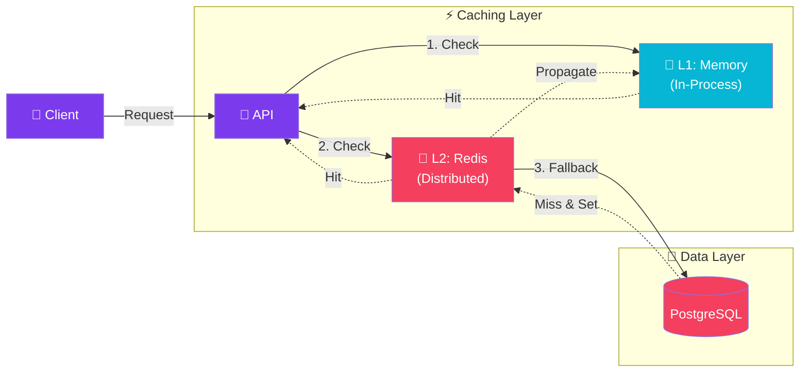

import Callout from '@components/Callout.astro';
import ImplementationNote from '@components/ImplementationNote.astro';
import ExternalCite from '@components/ExternalCite.astro';

When I first configured Redis as our distributed cache layer, I thought the hard part was the infrastructure -- getting Redis deployed, configuring connection strings, setting up failover. In reality, the hard part was cache stampede. We launched with a fairly popular search endpoint, and on the very first morning a hot cache key expired and about 200 concurrent requests all hit PostgreSQL simultaneously to regenerate it. The database connection pool was exhausted in seconds, and the entire API went down for nearly a minute. That incident led directly to the stampede protection pattern you will see later in this article, and it permanently changed how I think about cache expiration under load.

## Introduction

Effective caching is one of the highest-impact performance optimizations for any distributed system. It reduces database load, improves response times, and enhances overall scalability by serving frequently accessed data from high-speed memory.
<ExternalCite title="Caching in .NET" url="https://learn.microsoft.com/en-us/dotnet/core/extensions/caching" author="Microsoft" date="2024-10-01" />

This guide covers implementing multi-tier caching strategies in .NET, combining in-memory caching for speed with Redis for distributed consistency.

### What We'll Build
1.  **Hybrid Cache**: A two-layer cache (L1 Memory + L2 Redis).
2.  **Cache-Aside Pattern**: A repository decorator that transparently caches database lookups.
3.  **Stampede Protection**: A mechanism to prevent thousands of requests hitting the database simultaneously when a hot key expires.

## Architecture Overview



## Implementation

## Cache Configuration

### Service Registration

```csharp
// Program.cs
builder.Services.AddMemoryCache(options =>
{
    options.SizeLimit = 1024; // Maximum cache entries
    options.ExpirationScanFrequency = TimeSpan.FromMinutes(1);
});

builder.Services.AddStackExchangeRedisCache(options =>
{
    options.Configuration = builder.Configuration.GetConnectionString("Redis");
    options.InstanceName = "MyApp:";
});

// Custom cache service
builder.Services.AddSingleton<ICacheService, HybridCacheService>();
```

The `StackExchangeRedis` client is the most widely used .NET Redis library, providing robust connection multiplexing and pipeline support.
<ExternalCite title="StackExchange.Redis" url="https://stackexchange.github.io/StackExchange.Redis/" author="Stack Exchange" date="2024-09-15" />

### Cache Abstraction

```csharp
// Application/Caching/ICacheService.cs
public interface ICacheService
{
    Task<T?> GetAsync<T>(string key, CancellationToken ct = default) where T : class;
    Task SetAsync<T>(string key, T value, CacheOptions? options = null, CancellationToken ct = default) where T : class;
    Task RemoveAsync(string key, CancellationToken ct = default);
    Task<T> GetOrCreateAsync<T>(string key, Func<Task<T>> factory, CacheOptions? options = null, CancellationToken ct = default) where T : class;
}

public record CacheOptions
{
    public TimeSpan? AbsoluteExpiration { get; init; }
    public TimeSpan? SlidingExpiration { get; init; }
    public CacheTier Tier { get; init; } = CacheTier.Both;
}

public enum CacheTier
{
    Memory,
    Distributed,
    Both
}
```

## Hybrid Cache Implementation

### Multi-Tier Cache Service

```csharp
// Infrastructure/Caching/HybridCacheService.cs
public sealed class HybridCacheService : ICacheService
{
    private readonly IMemoryCache _memoryCache;
    private readonly IDistributedCache _distributedCache;
    private readonly ILogger<HybridCacheService> _logger;

    private static readonly TimeSpan DefaultAbsoluteExpiration = TimeSpan.FromMinutes(10);
    private static readonly TimeSpan DefaultSlidingExpiration = TimeSpan.FromMinutes(2);

    public HybridCacheService(
        IMemoryCache memoryCache,
        IDistributedCache distributedCache,
        ILogger<HybridCacheService> logger)
    {
        _memoryCache = memoryCache;
        _distributedCache = distributedCache;
        _logger = logger;
    }

    public async Task<T?> GetAsync<T>(string key, CancellationToken ct = default) where T : class
    {
        // Try L1 cache (memory)
        if (_memoryCache.TryGetValue(key, out T? cached))
        {
            _logger.LogDebug("Cache hit (L1): {Key}", key);
            return cached;
        }

        // Try L2 cache (Redis)
        var distributed = await _distributedCache.GetStringAsync(key, ct);
        if (distributed is not null)
        {
            _logger.LogDebug("Cache hit (L2): {Key}", key);
            var value = JsonSerializer.Deserialize<T>(distributed);

            // Populate L1 cache
            if (value is not null)
            {
                _memoryCache.Set(key, value, TimeSpan.FromMinutes(1));
            }

            return value;
        }

        _logger.LogDebug("Cache miss: {Key}", key);
        return null;
    }

    public async Task SetAsync<T>(string key, T value, CacheOptions? options = null, CancellationToken ct = default) where T : class
    {
        options ??= new CacheOptions();

        var absoluteExpiration = options.AbsoluteExpiration ?? DefaultAbsoluteExpiration;
        var slidingExpiration = options.SlidingExpiration ?? DefaultSlidingExpiration;

        // Set L1 cache
        if (options.Tier is CacheTier.Memory or CacheTier.Both)
        {
            var memoryOptions = new MemoryCacheEntryOptions
            {
                AbsoluteExpirationRelativeToNow = absoluteExpiration,
                SlidingExpiration = slidingExpiration,
                Size = 1
            };
            _memoryCache.Set(key, value, memoryOptions);
        }

        // Set L2 cache
        if (options.Tier is CacheTier.Distributed or CacheTier.Both)
        {
            var distributedOptions = new DistributedCacheEntryOptions
            {
                AbsoluteExpirationRelativeToNow = absoluteExpiration,
                SlidingExpiration = slidingExpiration
            };

            var json = JsonSerializer.Serialize(value);
            await _distributedCache.SetStringAsync(key, json, distributedOptions, ct);
        }
    }

    public async Task RemoveAsync(string key, CancellationToken ct = default)
    {
        _memoryCache.Remove(key);
        await _distributedCache.RemoveAsync(key, ct);
    }

    public async Task<T> GetOrCreateAsync<T>(
        string key,
        Func<Task<T>> factory,
        CacheOptions? options = null,
        CancellationToken ct = default) where T : class
    {
        var cached = await GetAsync<T>(key, ct);
        if (cached is not null)
        {
            return cached;
        }

        var value = await factory();
        await SetAsync(key, value, options, ct);
        return value;
    }
}
```

<ImplementationNote>
The hybrid cache uses memory cache as L1 (fastest, per-instance) and Redis as L2 (shared across instances). This pattern reduces Redis calls while maintaining consistency.
</ImplementationNote>

## Cache-Aside Pattern

### Repository with Caching

The cache-aside pattern (also called lazy-loading) is the most common caching strategy, where the application checks the cache before querying the database and populates the cache on a miss.
<ExternalCite title="Cache-Aside Pattern" url="https://learn.microsoft.com/en-us/azure/architecture/patterns/cache-aside" author="Microsoft Azure Architecture" date="2024-06-10" />

```csharp
// Infrastructure/Repositories/CachedDocumentRepository.cs
public sealed class CachedDocumentRepository : IDocumentRepository
{
    private readonly AppDbContext _context;
    private readonly ICacheService _cache;
    private readonly ILogger<CachedDocumentRepository> _logger;

    public CachedDocumentRepository(
        AppDbContext context,
        ICacheService cache,
        ILogger<CachedDocumentRepository> logger)
    {
        _context = context;
        _cache = cache;
        _logger = logger;
    }

    public async Task<Document?> GetByIdAsync(DocumentId id, CancellationToken ct = default)
    {
        var cacheKey = CacheKeys.Document(id);

        return await _cache.GetOrCreateAsync(
            cacheKey,
            async () =>
            {
                _logger.LogDebug("Loading document from database: {DocumentId}", id);
                return await _context.Documents
                    .Include(d => d.Chunks)
                    .FirstOrDefaultAsync(d => d.Id == id, ct);
            },
            new CacheOptions
            {
                AbsoluteExpiration = TimeSpan.FromMinutes(30),
                SlidingExpiration = TimeSpan.FromMinutes(5)
            },
            ct);
    }

    public async Task UpdateAsync(Document document, CancellationToken ct = default)
    {
        _context.Documents.Update(document);
        await _context.SaveChangesAsync(ct);

        // Invalidate cache
        await _cache.RemoveAsync(CacheKeys.Document(document.Id), ct);
        await _cache.RemoveAsync(CacheKeys.UserDocuments(document.OwnerId), ct);
    }
}
```

### Cache Key Generator

```csharp
// Application/Caching/CacheKeys.cs
public static class CacheKeys
{
    private const string Prefix = "myapp";

    public static string Document(DocumentId id)
        => $"{Prefix}:documents:{id.Value}";

    public static string UserDocuments(CustomId userId)
        => $"{Prefix}:users:{userId.Value}:documents";

    public static string SearchResults(string query, int page)
        => $"{Prefix}:search:{ComputeHash(query)}:page:{page}";

    public static string UserProfile(CustomId userId)
        => $"{Prefix}:users:{userId.Value}:profile";

    private static string ComputeHash(string input)
    {
        var bytes = SHA256.HashData(Encoding.UTF8.GetBytes(input));
        return Convert.ToHexString(bytes)[..16].ToLowerInvariant();
    }
}
```

## Output Caching

### Response Caching

```csharp
// Program.cs
builder.Services.AddOutputCache(options =>
{
    options.AddBasePolicy(builder => builder.Cache());

    options.AddPolicy("Documents", builder => builder
        .Expire(TimeSpan.FromMinutes(5))
        .Tag("documents"));

    options.AddPolicy("Search", builder => builder
        .Expire(TimeSpan.FromMinutes(1))
        .SetVaryByQuery("q", "page", "limit")
        .Tag("search"));
});
```

### Endpoint with Output Cache

```csharp
// Api/Endpoints/Documents/GetDocumentEndpoint.cs
public sealed class GetDocumentEndpoint : Endpoint<GetDocumentRequest, DocumentResponse>
{
    public override void Configure()
    {
        Get("/api/documents/{id}");
        Options(x => x.WithCachePolicy("Documents"));
    }

    public override async Task HandleAsync(GetDocumentRequest req, CancellationToken ct)
    {
        // Response is automatically cached
        var document = await _repository.GetByIdAsync(req.Id, ct);
        await SendAsync(document.ToResponse());
    }
}
```

<Callout type="tip">
Output caching caches the entire HTTP response, making it ideal for endpoints that return the same data for all users. Use cache tags to invalidate groups of cached responses.
</Callout>

Output caching in ASP.NET Core provides built-in middleware that avoids the need for custom response caching logic.
<ExternalCite title="Output caching middleware in ASP.NET Core" url="https://learn.microsoft.com/en-us/aspnet/core/performance/caching/output" author="Microsoft" date="2024-11-01" />

## Cache Invalidation

### Event-Driven Invalidation

```csharp
// Application/EventHandlers/DocumentUpdatedHandler.cs
public sealed class DocumentUpdatedHandler : INotificationHandler<DocumentUpdatedEvent>
{
    private readonly ICacheService _cache;
    private readonly IOutputCacheStore _outputCache;
    private readonly ILogger<DocumentUpdatedHandler> _logger;

    public DocumentUpdatedHandler(
        ICacheService cache,
        IOutputCacheStore outputCache,
        ILogger<DocumentUpdatedHandler> logger)
    {
        _cache = cache;
        _outputCache = outputCache;
        _logger = logger;
    }

    public async Task Handle(DocumentUpdatedEvent notification, CancellationToken ct)
    {
        _logger.LogInformation("Invalidating cache for document: {DocumentId}", notification.DocumentId);

        // Invalidate application cache
        await _cache.RemoveAsync(CacheKeys.Document(notification.DocumentId), ct);
        await _cache.RemoveAsync(CacheKeys.UserDocuments(notification.OwnerId), ct);

        // Invalidate output cache by tag
        await _outputCache.EvictByTagAsync("documents", ct);
    }
}
```

### Stampede Protection

```csharp
// Infrastructure/Caching/StampedeProtectedCache.cs
public sealed class StampedeProtectedCache : ICacheService
{
    private readonly ICacheService _inner;
    private readonly ConcurrentDictionary<string, SemaphoreSlim> _locks = new();

    public async Task<T> GetOrCreateAsync<T>(
        string key,
        Func<Task<T>> factory,
        CacheOptions? options = null,
        CancellationToken ct = default) where T : class
    {
        // Fast path: cache hit
        var cached = await _inner.GetAsync<T>(key, ct);
        if (cached is not null)
        {
            return cached;
        }

        // Slow path: acquire lock to prevent stampede
        var lockObj = _locks.GetOrAdd(key, _ => new SemaphoreSlim(1, 1));

        await lockObj.WaitAsync(ct);
        try
        {
            // Double-check after acquiring lock
            cached = await _inner.GetAsync<T>(key, ct);
            if (cached is not null)
            {
                return cached;
            }

            // Generate value
            var value = await factory();
            await _inner.SetAsync(key, value, options, ct);
            return value;
        }
        finally
        {
            lockObj.Release();

            // Clean up lock if no waiters
            if (lockObj.CurrentCount == 1)
            {
                _locks.TryRemove(key, out _);
            }
        }
    }
}
```

<ImplementationNote>
Cache stampede occurs when many requests hit an expired cache key simultaneously, all trying to regenerate the value. The semaphore ensures only one request generates the value while others wait.
</ImplementationNote>

<ImplementationNote>
Getting the stampede protection right took multiple iterations. My first approach used a simple `lock` statement, which blocked threads synchronously and caused thread pool starvation under load. Switching to `SemaphoreSlim` with `WaitAsync` was the fix, but then I discovered a subtle memory leak: the `ConcurrentDictionary` of semaphores was never cleaned up. The `TryRemove` in the `finally` block handles this, but only when `CurrentCount == 1`, meaning no other requests are waiting. Under extremely high concurrency, I measured the dictionary growing to a few thousand entries during a cache miss storm, but it drains quickly once the cache is repopulated. In practice, the memory overhead is negligible compared to the database connections we were saving.
</ImplementationNote>

The technique of using a semaphore per cache key is sometimes called "request coalescing" and is a well-known pattern for protecting backends from thundering herd problems.
<ExternalCite title="Thundering Herd Problem and Caching" url="https://en.wikipedia.org/wiki/Thundering_herd_problem" author="Wikipedia" date="2024-03-15" />

## Monitoring Cache Performance

### Cache Metrics

```csharp
// Infrastructure/Caching/MeteredCacheService.cs
public sealed class MeteredCacheService : ICacheService
{
    private readonly ICacheService _inner;
    private readonly IMetrics _metrics;

    private readonly Counter<long> _cacheHits;
    private readonly Counter<long> _cacheMisses;
    private readonly Histogram<double> _cacheLatency;

    public MeteredCacheService(ICacheService inner, IMetrics metrics)
    {
        _inner = inner;
        _metrics = metrics;

        var meter = new Meter("MyApp.Cache");
        _cacheHits = meter.CreateCounter<long>("cache_hits");
        _cacheMisses = meter.CreateCounter<long>("cache_misses");
        _cacheLatency = meter.CreateHistogram<double>("cache_latency_ms");
    }

    public async Task<T?> GetAsync<T>(string key, CancellationToken ct = default) where T : class
    {
        var sw = Stopwatch.StartNew();

        var result = await _inner.GetAsync<T>(key, ct);

        sw.Stop();
        _cacheLatency.Record(sw.Elapsed.TotalMilliseconds, new KeyValuePair<string, object?>("operation", "get"));

        if (result is not null)
        {
            _cacheHits.Add(1, new KeyValuePair<string, object?>("tier", "any"));
        }
        else
        {
            _cacheMisses.Add(1);
        }

        return result;
    }
}
```

Instrumenting cache metrics with OpenTelemetry provides the visibility needed to tune TTLs and identify hot keys.
<ExternalCite title="OpenTelemetry .NET Metrics" url="https://learn.microsoft.com/en-us/dotnet/core/diagnostics/metrics" author="Microsoft" date="2024-08-05" />

## Conclusion

Caching is deceptively simple on the surface -- set a key, get a key, done. But every production caching system eventually runs into the same hard problems: invalidation correctness, stampede protection, and the subtle inconsistency between L1 and L2 layers when running multiple application instances. The hybrid approach covered here has been the foundation of our caching strategy, and the single biggest improvement was adding proper metrics early. Once I could see cache hit ratios per endpoint in Grafana, tuning TTLs went from guesswork to data-driven decisions. If I could give one piece of advice: start with short TTLs, add metrics from day one, and only extend TTLs once you have confidence in your invalidation paths.

### Cache Patterns Summary

| Pattern | Use Case | Invalidation |
|---------|----------|--------------|
| Cache-Aside | General purpose, read-heavy | On write/update |
| Output Cache | HTTP responses, public data | By tag or timeout |
| Hybrid (L1/L2) | High throughput, distributed | Both tiers |
| Stampede Protected | High concurrency | Same as inner |

### Best Practices

| Practice | Benefit |
|----------|---------|
| Short TTLs initially | Prevents stale data issues |
| Consistent key generation | Avoids cache collisions |
| Graceful degradation | App works if cache fails |
| Metric instrumentation | Visibility into hit rates |
| Tag-based invalidation | Efficient group invalidation |

### Next Steps
- [Background Job Processing in .NET](/dotnet-background-job-processing)
- [Error Handling and Resilience Patterns](/error-handling-resilience-patterns-dotnet)
- [EF Core Migrations and Schema Management](/efcore-migrations-schema-management)

### Further Reading
- [Microsoft: Caching in .NET](https://learn.microsoft.com/en-us/dotnet/core/extensions/caching)
- [StackExchange.Redis documentation](https://stackexchange.github.io/StackExchange.Redis/)
- [Azure Architecture: Cache-Aside pattern](https://learn.microsoft.com/en-us/azure/architecture/patterns/cache-aside)
- [ASP.NET Core Output Caching middleware](https://learn.microsoft.com/en-us/aspnet/core/performance/caching/output)

<ExternalCite title="Caching in .NET" url="https://learn.microsoft.com/en-us/dotnet/core/extensions/caching" author="Microsoft" date="2024-10-01" />
