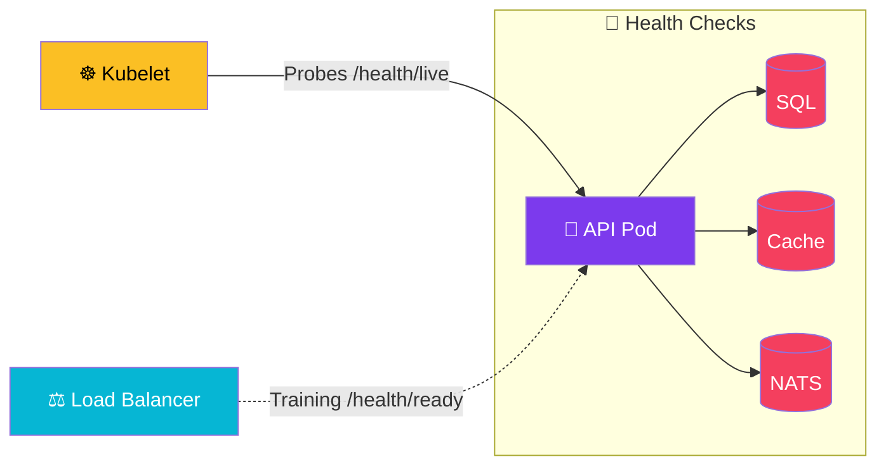

import Callout from '@components/Callout.astro';
import ImplementationNote from '@components/ImplementationNote.astro';
import ExternalCite from '@components/ExternalCite.astro';

When I first wired up health checks for our .NET API running on Kubernetes, I made the classic mistake of putting all dependency checks into the liveness probe. The result was catastrophic: a brief Redis connection hiccup caused Kubernetes to restart every API pod simultaneously, turning a minor blip into a full outage. That incident taught me the critical distinction between liveness and readiness probes the hard way. Liveness should only answer "is the process alive?" while readiness answers "can this pod handle traffic right now?" Getting this separation right eliminated our health check flapping problem entirely and gave us stable, predictable behavior during transient dependency failures.

## Introduction

In a containerized environment like Kubernetes, the orchestrator needs to know the exact state of your application to manage traffic routing and restarts. Health checks enable Kubernetes to determine when your application is ready to receive traffic (Readiness) and when it needs to be restarted (Liveness).

This guide covers implementing comprehensive health monitoring in .NET, ensuring your services are observable and resilient.

<ExternalCite title="Health checks in ASP.NET Core" url="https://learn.microsoft.com/en-us/aspnet/core/host-and-deploy/health-checks" author="Microsoft" date="2024-11-01" />

<ExternalCite title="Configure Liveness, Readiness and Startup Probes" url="https://kubernetes.io/docs/tasks/configure-pod-container/configure-liveness-readiness-startup-probes/" author="Kubernetes Authors" date="2024-06-15" />

### What We'll Build
1.  **Liveness & Readiness Probes**: Separate checks for startup, liveness, and readiness.
2.  **Infrastructure Checks**: Custom checks for PostgreSQL, Redis, NATS, and MinIO.
3.  **Health Dashboard**: A graphical UI to visualize the state of your cluster dependencies.

## Architecture Overview


```mermaid
flowchart LR
    Kubelet["☸️ Kubelet"] -->|Probes /health/live| API["🚀 API Pod"]
    LB["⚖️ Load Balancer"] -.->|Training /health/ready| API
    
    subgraph Checks["🏥 Health Checks"]
        API --> DB[(SQL)]
        API --> Redis[(Cache)]
        API --> Msg[(NATS)]
    end

    classDef primary fill:#7c3aed,color:#fff
    classDef secondary fill:#06b6d4,color:#fff
    classDef db fill:#f43f5e,color:#fff
    classDef warning fill:#fbbf24,color:#000

    class API primary
    class LB secondary
    class DB,Redis,Msg db
    class Kubelet warning
```

## Implementation

## Basic Setup

### Service Registration

```csharp
// Program.cs
builder.Services.AddHealthChecks()
    .AddCheck("self", () => HealthCheckResult.Healthy(), tags: ["live"])
    
    // Database
    .AddNpgSql(
        builder.Configuration.GetConnectionString("AppDb")!,
        name: "postgresql",
        tags: ["ready", "db"])
    
    // Redis
    .AddRedis(
        builder.Configuration.GetConnectionString("Redis")!,
        name: "redis",
        tags: ["ready", "cache"])
    
    // Custom checks
    .AddCheck<NatsHealthCheck>("nats", tags: ["ready", "messaging"])
    .AddCheck<MinioHealthCheck>("minio", tags: ["ready", "storage"])
    .AddCheck<QdrantHealthCheck>("qdrant", tags: ["ready", "search"]);
```

### Endpoint Mapping

```csharp
// Program.cs
app.MapHealthChecks("/health/live", new HealthCheckOptions
{
    Predicate = check => check.Tags.Contains("live"),
    ResponseWriter = WriteMinimalResponse
});

app.MapHealthChecks("/health/ready", new HealthCheckOptions
{
    Predicate = check => check.Tags.Contains("ready"),
    ResponseWriter = WriteDetailedResponse
});

app.MapHealthChecks("/health", new HealthCheckOptions
{
    ResponseWriter = WriteDetailedResponse
});
```

## Custom Health Checks

<ExternalCite title="AspNetCore.Diagnostics.HealthChecks" url="https://github.com/Xabaril/AspNetCore.Diagnostics.HealthChecks" author="Xabaril" date="2024-03-01" />

### NATS Health Check

```csharp
// Infrastructure/HealthChecks/NatsHealthCheck.cs
public sealed class NatsHealthCheck : IHealthCheck
{
    private readonly INatsConnection _connection;
    private readonly ILogger<NatsHealthCheck> _logger;

    public NatsHealthCheck(INatsConnection connection, ILogger<NatsHealthCheck> logger)
    {
        _connection = connection;
        _logger = logger;
    }

    public async Task<HealthCheckResult> CheckHealthAsync(
        HealthCheckContext context,
        CancellationToken ct = default)
    {
        try
        {
            var connectionState = _connection.ConnectionState;
            
            if (connectionState != NatsConnectionState.Open)
            {
                return HealthCheckResult.Unhealthy(
                    $"NATS connection state: {connectionState}");
            }

            // Verify with a ping
            var rtt = await _connection.PingAsync(ct);
            
            var data = new Dictionary<string, object>
            {
                ["server"] = _connection.ServerInfo?.Name ?? "unknown",
                ["rtt_ms"] = rtt.TotalMilliseconds,
                ["jetstream"] = _connection.ServerInfo?.IsJetStreamEnabled ?? false
            };

            return HealthCheckResult.Healthy("NATS connection is healthy", data);
        }
        catch (Exception ex)
        {
            _logger.LogWarning(ex, "NATS health check failed");
            return HealthCheckResult.Unhealthy("NATS connection failed", ex);
        }
    }
}
```

### MinIO Health Check

```csharp
// Infrastructure/HealthChecks/MinioHealthCheck.cs
public sealed class MinioHealthCheck : IHealthCheck
{
    private readonly IMinioClient _client;
    private readonly ILogger<MinioHealthCheck> _logger;

    public MinioHealthCheck(IMinioClient client, ILogger<MinioHealthCheck> logger)
    {
        _client = client;
        _logger = logger;
    }

    public async Task<HealthCheckResult> CheckHealthAsync(
        HealthCheckContext context,
        CancellationToken ct = default)
    {
        try
        {
            // List buckets as a connectivity test
            var buckets = await _client.ListBucketsAsync(ct);
            
            var data = new Dictionary<string, object>
            {
                ["bucket_count"] = buckets.Buckets.Count,
                ["endpoint"] = _client.Config.Endpoint
            };

            return HealthCheckResult.Healthy("MinIO is accessible", data);
        }
        catch (MinioException ex)
        {
            _logger.LogWarning(ex, "MinIO health check failed");
            return HealthCheckResult.Unhealthy("MinIO connection failed", ex);
        }
    }
}
```

### Qdrant Health Check

```csharp
// Infrastructure/HealthChecks/QdrantHealthCheck.cs
public sealed class QdrantHealthCheck : IHealthCheck
{
    private readonly QdrantClient _client;
    private readonly ILogger<QdrantHealthCheck> _logger;

    public QdrantHealthCheck(QdrantClient client, ILogger<QdrantHealthCheck> logger)
    {
        _client = client;
        _logger = logger;
    }

    public async Task<HealthCheckResult> CheckHealthAsync(
        HealthCheckContext context,
        CancellationToken ct = default)
    {
        try
        {
            var healthInfo = await _client.HealthAsync(ct);
            
            var data = new Dictionary<string, object>
            {
                ["version"] = healthInfo.Version,
                ["status"] = "healthy"
            };

            return HealthCheckResult.Healthy("Qdrant is healthy", data);
        }
        catch (RpcException ex) when (ex.StatusCode == StatusCode.Unavailable)
        {
            _logger.LogWarning(ex, "Qdrant unavailable");
            return HealthCheckResult.Unhealthy("Qdrant is unavailable", ex);
        }
        catch (Exception ex)
        {
            _logger.LogWarning(ex, "Qdrant health check failed");
            return HealthCheckResult.Degraded("Qdrant check failed", ex);
        }
    }
}
```

<ImplementationNote>
Use `HealthCheckResult.Degraded` when a non-critical dependency fails. This keeps the service running but signals that something needs attention.
</ImplementationNote>

<ImplementationNote title="NATS Reconnection and Health Flapping">
I ran into an issue where our NATS health check would briefly report `Unhealthy` during NATS server rolling updates, even though the client library was reconnecting automatically. This caused Kubernetes to pull pods from the load balancer for a few seconds on every NATS restart. The fix was to check both the connection state and whether a reconnection was in progress. If the NATS client is actively reconnecting (not permanently disconnected), I now return `Degraded` instead of `Unhealthy`, which keeps the pod in the ready pool while still surfacing the issue in our monitoring dashboards.
</ImplementationNote>

## Response Writers

### Detailed Response Writer

```csharp
// Infrastructure/HealthChecks/HealthCheckResponseWriter.cs
public static class HealthCheckResponseWriter
{
    public static Task WriteDetailedResponse(HttpContext context, HealthReport report)
    {
        context.Response.ContentType = "application/json";
        
        var response = new
        {
            status = report.Status.ToString(),
            duration = report.TotalDuration.TotalMilliseconds,
            checks = report.Entries.Select(e => new
            {
                name = e.Key,
                status = e.Value.Status.ToString(),
                duration = e.Value.Duration.TotalMilliseconds,
                description = e.Value.Description,
                data = e.Value.Data,
                exception = e.Value.Exception?.Message
            }),
            timestamp = DateTime.UtcNow
        };

        return context.Response.WriteAsJsonAsync(response);
    }

    public static Task WriteMinimalResponse(HttpContext context, HealthReport report)
    {
        context.Response.ContentType = "text/plain";
        return context.Response.WriteAsync(report.Status.ToString());
    }
}
```

### Sample Response

```json
{
  "status": "Healthy",
  "duration": 245.32,
  "checks": [
    {
      "name": "postgresql",
      "status": "Healthy",
      "duration": 12.5,
      "description": null,
      "data": {}
    },
    {
      "name": "nats",
      "status": "Healthy",
      "duration": 5.2,
      "description": "NATS connection is healthy",
      "data": {
        "server": "nats-0",
        "rtt_ms": 1.23,
        "jetstream": true
      }
    },
    {
      "name": "minio",
      "status": "Healthy",
      "duration": 45.8,
      "description": "MinIO is accessible",
      "data": {
        "bucket_count": 12,
        "endpoint": "minio.data-layer.svc.cluster.local:9000"
      }
    }
  ],
  "timestamp": "2026-03-14T10:30:00Z"
}
```

## Kubernetes Probes

<ExternalCite title="Pod Lifecycle" url="https://kubernetes.io/docs/concepts/workloads/pods/pod-lifecycle/#container-probes" author="Kubernetes Authors" date="2024-05-20" />

### Deployment Configuration

```yaml
# apps/myapp-api/deployment.yaml
apiVersion: apps/v1
kind: Deployment
metadata:
  name: myapp-api
spec:
  template:
    spec:
      containers:
        - name: api
          image: myapp-api:latest
          ports:
            - containerPort: 8080
          livenessProbe:
            httpGet:
              path: /health/live
              port: 8080
            initialDelaySeconds: 30
            periodSeconds: 10
            timeoutSeconds: 5
            failureThreshold: 3
          readinessProbe:
            httpGet:
              path: /health/ready
              port: 8080
            initialDelaySeconds: 10
            periodSeconds: 5
            timeoutSeconds: 3
            failureThreshold: 3
          startupProbe:
            httpGet:
              path: /health/live
              port: 8080
            initialDelaySeconds: 5
            periodSeconds: 5
            timeoutSeconds: 3
            failureThreshold: 30
```

<Callout type="tip">
Use `startupProbe` for applications with slow startup times. It prevents liveness probes from killing the pod before it's ready. The `failureThreshold * periodSeconds` gives the maximum startup time.
</Callout>

<ImplementationNote title="Startup Probe Timing">
I learned the hard way that EF Core database migrations running on startup can easily exceed the default startup probe window. Our API pod kept getting killed during the first deployment to a fresh environment because the migration took about 90 seconds, but the startup probe only allowed `failureThreshold(10) * periodSeconds(5) = 50 seconds`. I increased the `failureThreshold` to 30, giving the pod 150 seconds to complete startup. The alternative was to run migrations as a separate init container, but for our scale the simpler approach of extending the probe timeout was sufficient.
</ImplementationNote>

## Health Check UI

### Dashboard Configuration

```csharp
// Program.cs
builder.Services.AddHealthChecksUI(setup =>
{
    setup.SetEvaluationTimeInSeconds(30);
    setup.MaximumHistoryEntriesPerEndpoint(50);
    
    setup.AddHealthCheckEndpoint("API", "/health");
    setup.AddHealthCheckEndpoint("Workers", "http://myapp-workers:8080/health");
})
.AddInMemoryStorage();

// Map the UI
app.MapHealthChecksUI(options =>
{
    options.UIPath = "/health-ui";
    options.ApiPath = "/health-api";
});
```

## Startup Health Checks

### Deferred Initialization Check

```csharp
// Infrastructure/HealthChecks/StartupHealthCheck.cs
public sealed class StartupHealthCheck : IHealthCheck
{
    private volatile bool _isReady;

    public bool IsReady
    {
        get => _isReady;
        set => _isReady = value;
    }

    public Task<HealthCheckResult> CheckHealthAsync(
        HealthCheckContext context,
        CancellationToken ct = default)
    {
        return Task.FromResult(_isReady
            ? HealthCheckResult.Healthy("Application started")
            : HealthCheckResult.Unhealthy("Application is starting"));
    }
}

// Program.cs
builder.Services.AddSingleton<StartupHealthCheck>();
builder.Services.AddHealthChecks()
    .AddCheck<StartupHealthCheck>("startup", tags: ["live"]);

// After configuration is complete
app.Lifetime.ApplicationStarted.Register(() =>
{
    var startupCheck = app.Services.GetRequiredService<StartupHealthCheck>();
    startupCheck.IsReady = true;
});
```

## Dependency Timeout Configuration

### Configuring Check Timeouts

```csharp
// Program.cs
builder.Services.AddHealthChecks()
    .AddNpgSql(
        connectionString,
        name: "postgresql",
        timeout: TimeSpan.FromSeconds(5),
        tags: ["ready", "db"])
    .AddCheck<NatsHealthCheck>(
        "nats",
        failureStatus: HealthStatus.Degraded,
        timeout: TimeSpan.FromSeconds(3),
        tags: ["ready", "messaging"]);
```

## Publishing Health Status

### Health Check Publisher

```csharp
// Infrastructure/HealthChecks/MetricsHealthCheckPublisher.cs
public sealed class MetricsHealthCheckPublisher : IHealthCheckPublisher
{
    private readonly IMetrics _metrics;
    
    private readonly Gauge _healthStatus;

    public MetricsHealthCheckPublisher(IMetrics metrics)
    {
        _metrics = metrics;
        
        var meter = new Meter("MyApp.Health");
        _healthStatus = meter.CreateGauge<double>("health_status");
    }

    public Task PublishAsync(HealthReport report, CancellationToken ct)
    {
        // Overall status
        _healthStatus.Record(
            report.Status == HealthStatus.Healthy ? 1 : 0,
            new KeyValuePair<string, object?>("check", "overall"));

        // Individual checks
        foreach (var entry in report.Entries)
        {
            var value = entry.Value.Status switch
            {
                HealthStatus.Healthy => 1,
                HealthStatus.Degraded => 0.5,
                HealthStatus.Unhealthy => 0,
                _ => 0
            };
            
            _healthStatus.Record(value,
                new KeyValuePair<string, object?>("check", entry.Key));
        }

        return Task.CompletedTask;
    }
}

// Program.cs
builder.Services.Configure<HealthCheckPublisherOptions>(options =>
{
    options.Delay = TimeSpan.FromSeconds(5);
    options.Period = TimeSpan.FromSeconds(30);
});

builder.Services.AddSingleton<IHealthCheckPublisher, MetricsHealthCheckPublisher>();
```

## Conclusion

Health check configuration by environment:

| Check | Liveness | Readiness | Purpose |
|-------|----------|-----------|---------|
| Self | ✓ | | App is running |
| PostgreSQL | | ✓ | Can serve requests |
| NATS | | ✓ | Can publish events |
| MinIO | | ✓ | Can access storage |
| Qdrant | | ✓ | Can perform search |

Health checks enable Kubernetes to maintain application availability by routing traffic only to healthy pods and restarting unresponsive ones.

Implementing health checks properly has been one of the highest-leverage improvements I have made to our platform's reliability. Before this work, we had frequent incidents where pods would sit in a broken state, silently dropping requests because a downstream dependency was unreachable. Now, Kubernetes automatically removes unhealthy pods from the service mesh and restarts them only when truly necessary. The key insight was treating liveness and readiness as fundamentally different questions: liveness is about the process, readiness is about the system. Getting this distinction right eliminated our false-positive restart loops and made our deployments significantly more stable.

<ExternalCite title="Health checks in ASP.NET Core" url="https://learn.microsoft.com/en-us/aspnet/core/host-and-deploy/health-checks" author="Microsoft" date="2024-11-01" />

<ExternalCite title="Kubernetes Best Practices: Setting Resource Requests and Limits" url="https://cloud.google.com/blog/products/containers-kubernetes/kubernetes-best-practices-resource-requests-and-limits" author="Google Cloud" date="2024-04-01" />

## Next Steps

- Add structured logging to health check failures so you can correlate probe failures with specific dependency issues in your log aggregator.
- Implement circuit breaker patterns alongside health checks to prevent cascading failures when a shared dependency goes down.
- Set up Grafana dashboards using the `health_status` gauge metric published by the `MetricsHealthCheckPublisher` to track health trends over time.
- Consider implementing [warm-up health checks](https://learn.microsoft.com/en-us/aspnet/core/host-and-deploy/health-checks#use-health-checks-routing) that validate cache priming and connection pool establishment before marking the pod as ready.

## Further Reading

- [ASP.NET Core Health Checks Documentation](https://learn.microsoft.com/en-us/aspnet/core/host-and-deploy/health-checks) -- The official Microsoft guide covering all health check features and configuration options.
- [Kubernetes Probes Deep Dive](https://kubernetes.io/docs/tasks/configure-pod-container/configure-liveness-readiness-startup-probes/) -- Detailed reference for configuring liveness, readiness, and startup probes.
- [AspNetCore.Diagnostics.HealthChecks](https://github.com/Xabaril/AspNetCore.Diagnostics.HealthChecks) -- Community library providing pre-built health checks for dozens of infrastructure components.
