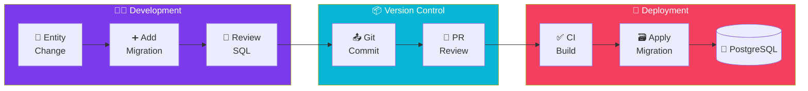

import Callout from '@components/Callout.astro';
import ImplementationNote from '@components/ImplementationNote.astro';
import ExternalCite from '@components/ExternalCite.astro';

When I first configured EF Core migrations for our multi-developer team, merge conflicts in the migration snapshot file became a recurring source of frustration. Two developers would add migrations on separate branches, and when both branches merged to main, the `ModelSnapshot.cs` file would have irreconcilable conflicts. It took us a few painful CI failures before we established a team convention: always rebase before adding a migration, and if the snapshot conflicts, delete your migration, pull the latest snapshot, and regenerate. That simple workflow rule eliminated an entire class of build failures, but it was a hard-won lesson that no documentation had prepared me for.

## Introduction

Database schema evolution is critical for maintaining applications over time. EF Core migrations provide a code-first approach to managing schema changes with full version control integration.
<ExternalCite title="EF Core Migrations Overview" url="https://learn.microsoft.com/en-us/ef/core/managing-schemas/migrations/" author="Microsoft" date="2024-10-15" />

## Architecture Overview


```mermaid
flowchart LR
    subgraph Dev["👩‍💻 Development"]
        Change["📝 Entity\nChange"] --> Add["➕ Add\nMigration"]
        Add --> Review["👀 Review\nSQL"]
    end

    subgraph VCS["📦 Version Control"]
        Review --> Commit["📤 Git\nCommit"]
        Commit --> PR["🔀 PR\nReview"]
    end

    subgraph Deploy["🚀 Deployment"]
        PR --> CI["✅ CI\nBuild"]
        CI --> Migrate["🗃️ Apply\nMigration"]
        Migrate --> DB[("🐘 PostgreSQL")]
    end

    classDef primary fill:#7c3aed,color:#fff
    classDef secondary fill:#06b6d4,color:#fff
    classDef db fill:#f43f5e,color:#fff
    classDef warning fill:#fbbf24,color:#000

    class Dev primary
    class VCS secondary
    class Deploy db
```

## Implementation

## Project Setup

### DbContext Configuration

```csharp
// Infrastructure/Persistence/ArchivesDbContext.cs
public sealed class ArchivesDbContext : DbContext
{
    public ArchivesDbContext(DbContextOptions<ArchivesDbContext> options)
        : base(options)
    {
    }

    public DbSet<Document> Documents => Set<Document>();
    public DbSet<DocumentChunk> DocumentChunks => Set<DocumentChunk>();
    public DbSet<ApplicationUser> Users => Set<ApplicationUser>();
    public DbSet<AuditLog> AuditLogs => Set<AuditLog>();

    protected override void OnModelCreating(ModelBuilder modelBuilder)
    {
        modelBuilder.ApplyConfigurationsFromAssembly(
            typeof(ArchivesDbContext).Assembly);

        // PostgreSQL-specific configurations
        modelBuilder.HasPostgresExtension("uuid-ossp");
        modelBuilder.HasPostgresExtension("pg_trgm");
    }
}
```

The `ApplyConfigurationsFromAssembly` method automatically discovers all `IEntityTypeConfiguration<T>` implementations, keeping the `DbContext` clean as the schema grows.
<ExternalCite title="Npgsql Entity Framework Core Provider" url="https://www.npgsql.org/efcore/" author="Npgsql" date="2024-09-20" />

### Design-Time Factory

```csharp
// Infrastructure/Persistence/DesignTimeDbContextFactory.cs
public sealed class DesignTimeDbContextFactory
    : IDesignTimeDbContextFactory<ArchivesDbContext>
{
    public ArchivesDbContext CreateDbContext(string[] args)
    {
        var connectionString = Environment.GetEnvironmentVariable(
            "ConnectionStrings__AppDb")
            ?? "Host=localhost;Database=myapp_dev;Username=postgres;Password=postgres";

        var optionsBuilder = new DbContextOptionsBuilder<ArchivesDbContext>();
        optionsBuilder.UseNpgsql(connectionString, npgsql =>
        {
            npgsql.MigrationsAssembly("MyApp.Infrastructure");
            npgsql.EnableRetryOnFailure(3);
        });

        return new ArchivesDbContext(optionsBuilder.Options);
    }
}
```

<ImplementationNote>
The design-time factory is required for running migrations from the CLI when the DbContext isn't in the startup project.
</ImplementationNote>

## Creating Migrations

### Initial Migration

```bash
# Create initial migration
dotnet ef migrations add InitialCreate \
    --project src/MyApp.Infrastructure \
    --startup-project src/MyApp.Api \
    --output-dir Persistence/Migrations
```

<ExternalCite title="EF Core Tools Reference - dotnet ef" url="https://learn.microsoft.com/en-us/ef/core/cli/dotnet" author="Microsoft" date="2024-08-01" />

### Generated Migration

```csharp
// Infrastructure/Persistence/Migrations/20260101000000_InitialCreate.cs
public partial class InitialCreate : Migration
{
    protected override void Up(MigrationBuilder migrationBuilder)
    {
        migrationBuilder.CreateTable(
            name: "Users",
            columns: table => new
            {
                Id = table.Column<string>(type: "character varying(8)", maxLength: 8, nullable: false),
                ExternalId = table.Column<Guid>(type: "uuid", nullable: false),
                Email = table.Column<string>(type: "character varying(256)", maxLength: 256, nullable: false),
                DisplayName = table.Column<string>(type: "character varying(100)", maxLength: 100, nullable: false),
                CreatedAt = table.Column<DateTimeOffset>(type: "timestamp with time zone", nullable: false),
                UpdatedAt = table.Column<DateTimeOffset>(type: "timestamp with time zone", nullable: false)
            },
            constraints: table =>
            {
                table.PrimaryKey("PK_Users", x => x.Id);
            });

        migrationBuilder.CreateIndex(
            name: "IX_Users_ExternalId",
            table: "Users",
            column: "ExternalId",
            unique: true);

        migrationBuilder.CreateIndex(
            name: "IX_Users_Email",
            table: "Users",
            column: "Email",
            unique: true);

        migrationBuilder.CreateTable(
            name: "Documents",
            columns: table => new
            {
                Id = table.Column<string>(type: "character varying(8)", maxLength: 8, nullable: false),
                Title = table.Column<string>(type: "character varying(200)", maxLength: 200, nullable: false),
                OwnerId = table.Column<string>(type: "character varying(8)", maxLength: 8, nullable: false),
                MimeType = table.Column<string>(type: "character varying(100)", maxLength: 100, nullable: false),
                FileSize = table.Column<long>(type: "bigint", nullable: false),
                Status = table.Column<string>(type: "character varying(20)", maxLength: 20, nullable: false),
                Tags = table.Column<string[]>(type: "text[]", nullable: false),
                CreatedAt = table.Column<DateTimeOffset>(type: "timestamp with time zone", nullable: false),
                UpdatedAt = table.Column<DateTimeOffset>(type: "timestamp with time zone", nullable: false)
            },
            constraints: table =>
            {
                table.PrimaryKey("PK_Documents", x => x.Id);
                table.ForeignKey(
                    name: "FK_Documents_Users_OwnerId",
                    column: x => x.OwnerId,
                    principalTable: "Users",
                    principalColumn: "Id",
                    onDelete: ReferentialAction.Cascade);
            });

        migrationBuilder.CreateIndex(
            name: "IX_Documents_OwnerId",
            table: "Documents",
            column: "OwnerId");

        migrationBuilder.CreateIndex(
            name: "IX_Documents_Status",
            table: "Documents",
            column: "Status");
    }

    protected override void Down(MigrationBuilder migrationBuilder)
    {
        migrationBuilder.DropTable(name: "Documents");
        migrationBuilder.DropTable(name: "Users");
    }
}
```

## Entity Configuration

### Document Configuration

```csharp
// Infrastructure/Persistence/Configurations/DocumentConfiguration.cs
public sealed class DocumentConfiguration : IEntityTypeConfiguration<Document>
{
    public void Configure(EntityTypeBuilder<Document> builder)
    {
        builder.ToTable("Documents");

        builder.HasKey(d => d.Id);

        builder.Property(d => d.Id)
            .HasConversion(
                id => id.Value,
                value => CustomId.From(value))
            .HasMaxLength(8)
            .IsRequired();

        builder.Property(d => d.Title)
            .HasMaxLength(200)
            .IsRequired();

        builder.Property(d => d.OwnerId)
            .HasConversion(
                id => id.Value,
                value => CustomId.From(value))
            .HasMaxLength(8)
            .IsRequired();

        builder.Property(d => d.MimeType)
            .HasMaxLength(100)
            .IsRequired();

        builder.Property(d => d.Status)
            .HasConversion<string>()
            .HasMaxLength(20)
            .IsRequired();

        builder.Property(d => d.Tags)
            .HasColumnType("text[]");

        // Indexes
        builder.HasIndex(d => d.OwnerId);
        builder.HasIndex(d => d.Status);
        builder.HasIndex(d => d.Tags)
            .HasMethod("gin"); // GIN index for array contains

        // Relationships
        builder.HasOne<ApplicationUser>()
            .WithMany()
            .HasForeignKey(d => d.OwnerId)
            .OnDelete(DeleteBehavior.Cascade);

        // Row-level security (PostgreSQL)
        builder.HasQueryFilter(d => d.DeletedAt == null);
    }
}
```

<ImplementationNote>
Value conversions for strongly-typed IDs (like `CustomId`) are essential for domain-driven design with EF Core. I initially forgot to set `HasMaxLength` on the converted property, which caused EF Core to default to `text` instead of `character varying(8)`. The result was a mismatch between the migration SQL and the actual column type, which only surfaced when I tried to add a foreign key constraint. Always review the generated SQL after adding a migration -- the `dotnet ef migrations script` command is invaluable for catching these issues before they reach any environment.
</ImplementationNote>

## Schema Evolution

### Adding Columns

```csharp
// Migration: AddDocumentMetadata
public partial class AddDocumentMetadata : Migration
{
    protected override void Up(MigrationBuilder migrationBuilder)
    {
        migrationBuilder.AddColumn<string>(
            name: "ContentHash",
            table: "Documents",
            type: "character varying(64)",
            maxLength: 64,
            nullable: true);

        migrationBuilder.AddColumn<int>(
            name: "PageCount",
            table: "Documents",
            type: "integer",
            nullable: true);

        migrationBuilder.AddColumn<JsonDocument>(
            name: "Metadata",
            table: "Documents",
            type: "jsonb",
            nullable: true);
    }

    protected override void Down(MigrationBuilder migrationBuilder)
    {
        migrationBuilder.DropColumn(name: "ContentHash", table: "Documents");
        migrationBuilder.DropColumn(name: "PageCount", table: "Documents");
        migrationBuilder.DropColumn(name: "Metadata", table: "Documents");
    }
}
```

<Callout type="tip">
Add new columns as nullable first, then populate data, then add NOT NULL constraint. This enables zero-downtime migrations.
</Callout>

This two-phase approach to adding required columns is a well-established pattern for zero-downtime schema changes in PostgreSQL.
<ExternalCite title="Zero-Downtime PostgreSQL Migrations" url="https://benchling.engineering/move-fast-and-migrate-things-how-we-automated-migrations-in-postgres-d60aba0fc3d4" author="Benchling Engineering" date="2024-02-20" />

### Data Migration

```csharp
// Migration: PopulateContentHashes
public partial class PopulateContentHashes : Migration
{
    protected override void Up(MigrationBuilder migrationBuilder)
    {
        // Set default for existing rows
        migrationBuilder.Sql("""
            UPDATE "Documents"
            SET "ContentHash" = encode(sha256("Title"::bytea), 'hex')
            WHERE "ContentHash" IS NULL
            """);

        // Now make it required
        migrationBuilder.AlterColumn<string>(
            name: "ContentHash",
            table: "Documents",
            type: "character varying(64)",
            maxLength: 64,
            nullable: false,
            oldClrType: typeof(string),
            oldType: "character varying(64)",
            oldMaxLength: 64,
            oldNullable: true);
    }

    protected override void Down(MigrationBuilder migrationBuilder)
    {
        migrationBuilder.AlterColumn<string>(
            name: "ContentHash",
            table: "Documents",
            type: "character varying(64)",
            maxLength: 64,
            nullable: true,
            oldClrType: typeof(string),
            oldType: "character varying(64)",
            oldMaxLength: 64);
    }
}
```

## Multi-Environment Deployment

### VS Code Task

```json
{
    "label": "db: migrate",
    "type": "shell",
    "command": "export DATABASE_PASSWORD=$(infisical secrets get APP_DB_PASSWORD --env=dev --plain) && export ConnectionStrings__AppDb=\"Host=192.168.0.6;Port=30432;Database=myapp_dev;Username=myapp_dev;Password=${DATABASE_PASSWORD};Include Error Detail=true;SSL Mode=Disable\" && dotnet ef database update --project src/MyApp.Infrastructure/MyApp.Infrastructure.csproj --startup-project src/MyApp.Api/MyApp.Api.csproj"
}
```

### CI/CD Migration

```yaml
# .github/workflows/migrate.yml
name: Database Migration

on:
  workflow_dispatch:
    inputs:
      environment:
        description: 'Target environment'
        required: true
        type: choice
        options:
          - staging
          - prod

jobs:
  migrate:
    runs-on: self-hosted
    environment: ${{ inputs.environment }}
    steps:
      - uses: actions/checkout@v4

      - name: Setup .NET
        uses: actions/setup-dotnet@v4
        with:
          dotnet-version: '10.0.x'

      - name: Install EF Tools
        run: dotnet tool restore

      - name: Run Migrations
        env:
          ConnectionStrings__AppDb: ${{ secrets.DATABASE_CONNECTION_STRING }}
        run: |
          dotnet ef database update \
            --project src/MyApp.Infrastructure \
            --startup-project src/MyApp.Api
```

<ExternalCite title="GitHub Actions for .NET" url="https://learn.microsoft.com/en-us/dotnet/devops/github-actions-overview" author="Microsoft" date="2024-07-15" />

<ImplementationNote>
Running migrations in CI exposed a timing issue I had not anticipated. Our GitHub Actions workflow ran migrations against a staging database that was also being used by a running staging instance. If the migration added a new required column, the running application would start throwing errors because it did not know about the new column yet. The solution was to adopt a strict ordering: deploy the new application code first (which handles both the old and new schema), then run the migration, then deploy the final version that requires the new schema. This expand-contract pattern adds complexity to the deployment pipeline, but it completely eliminates the window of incompatibility between app code and database schema.
</ImplementationNote>

## Rollback Strategy

### Reverting Migrations

```bash
# Revert to specific migration
dotnet ef database update AddDocumentMetadata \
    --project src/MyApp.Infrastructure \
    --startup-project src/MyApp.Api

# Revert all migrations
dotnet ef database update 0 \
    --project src/MyApp.Infrastructure \
    --startup-project src/MyApp.Api
```

### Safe Rollback Patterns

```csharp
// Always implement Down() properly
protected override void Down(MigrationBuilder migrationBuilder)
{
    // Reverse data migration first
    migrationBuilder.Sql("""
        -- Move data back if needed
        UPDATE "Documents" SET "OldColumn" = "NewColumn"
        WHERE "OldColumn" IS NULL
        """);

    // Then remove column
    migrationBuilder.DropColumn(name: "NewColumn", table: "Documents");
}
```

<ExternalCite title="PostgreSQL ALTER TABLE documentation" url="https://www.postgresql.org/docs/current/sql-altertable.html" author="PostgreSQL Documentation" date="2024-11-01" />

## Conclusion

EF Core migrations are a powerful tool, but the real challenges emerge at the intersection of team workflows and deployment pipelines. The migration files themselves are straightforward C# -- the difficulty lies in coordinating schema changes across multiple developers, ensuring CI/CD applies them safely, and maintaining rollback capability for every change. The two practices that have saved us the most headaches are: always generating and reviewing the SQL script before merging a migration PR, and adopting the expand-contract deployment pattern so that schema changes never break running application instances. If your team is small enough that only one person touches the database at a time, you may never hit the snapshot conflict problem. But the moment two developers are adding migrations in parallel, you need a clear team convention or you will lose hours to merge conflicts.

| Feature | Benefit |
|---------|---------|
| Code-First | Schema defined in C# |
| Version Control | Migrations in Git |
| Idempotent | Safe to run multiple times |
| Rollback | Down() methods for reverting |
| Multi-Environment | Same migrations, different DBs |

### Next Steps
- [Better IDs: Switching from UUID to NanoID](/better-ids-switching-uuid-to-nanoid)
- [Caching Strategies in .NET with Redis](/dotnet-caching-strategies-redis)
- [Integration Testing with Testcontainers](/integration-testing-dotnet-testcontainers)

### Further Reading
- [Microsoft: EF Core Migrations](https://learn.microsoft.com/en-us/ef/core/managing-schemas/migrations/)
- [Npgsql EF Core Provider documentation](https://www.npgsql.org/efcore/)
- [PostgreSQL ALTER TABLE reference](https://www.postgresql.org/docs/current/sql-altertable.html)
- [Benchling: Zero-downtime PostgreSQL migrations](https://benchling.engineering/move-fast-and-migrate-things-how-we-automated-migrations-in-postgres-d60aba0fc3d4)

<ExternalCite title="EF Core Migrations" url="https://learn.microsoft.com/en-us/ef/core/managing-schemas/migrations/" author="Microsoft" date="2024-10-15" />
