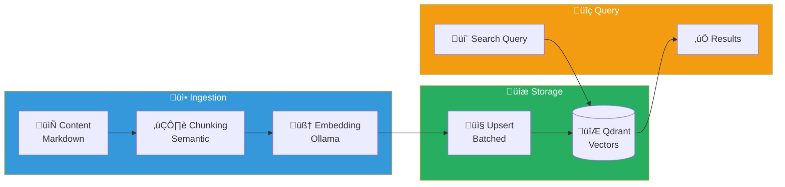

import Callout from '@components/Callout.astro';
import ImplementationNote from '@components/ImplementationNote.astro';
import ExternalCite from '@components/ExternalCite.astro';

## Introduction

Traditional keyword search fails when users search for "budget reports" but your documents say "financial statements." Semantic search solves this by converting text into vector representations (embeddings) that capture meaning, enabling similarity matching based on concepts rather than exact words.

**In this guide, we'll build a production-ready embedding pipeline that:**

1. Chunks documents into semantically meaningful segments
2. Generates vector embeddings using Ollama (local inference)
3. Stores vectors in Qdrant with metadata for filtered search
4. Processes documents asynchronously via NATS events
5. Enables semantic search with score thresholds and user isolation

### Why Ollama + Qdrant?

- **Ollama**: Run embedding models locally without API costs or data leaving your infrastructure. Perfect for sensitive documents.
- **Qdrant**: Purpose-built vector database with filtering, payloads, and horizontal scaling. Much faster than Postgres with pgvector for large collections.

### Prerequisites

- Ollama running with `nomic-embed-text` model pulled
- Qdrant instance (we use shared infrastructure in `data-layer` namespace)
- NATS JetStream for event-driven processing

## Architecture Overview

Before diving into code, understand the data flow:



**The flow works like this:**
1. After OCR completes, a NATS event triggers the embedding worker
2. Document content is split into ~500 token chunks with overlap
3. Each chunk is sent to Ollama for embedding generation
4. Vectors are stored in Qdrant with metadata (document ID, user ID, chunk content)
5. At search time, the query is embedded and compared against stored vectors

## Choosing an Embedding Model

Model selection significantly impacts both search quality and performance. For local inference with Ollama, we evaluated three options:

| Model | Dimensions | Context | Speed | Quality |
|-------|------------|---------|-------|---------|
| nomic-embed-text | 768 | 8192 | Fast | Excellent |
| mxbai-embed-large | 1024 | 512 | Medium | Very Good |
| all-minilm | 384 | 256 | Very Fast | Good |

**We chose `nomic-embed-text`** for several reasons:
- **768 dimensions**: Good balance between expressiveness and storage
- **8K context window**: Handles longer chunks without truncation
- **Competitive quality**: Benchmarks well against commercial models
- **Fast inference**: ~50ms per embedding on modest hardware

<ExternalCite 
  title="Nomic Embed: A Reproducible Long Context Text Embedder" 
  url="https://blog.nomic.ai/posts/nomic-embed-text-v1"
  author="Nomic AI"
/>

## The Embedding Service

Let's start with the interface. Defining a clean abstraction allows us to swap implementations (e.g., switch to OpenAI embeddings for comparison):

```csharp
// Application/Services/IEmbeddingService.cs
namespace Archives.Application.Services;

public interface IEmbeddingService
{
    /// <summary>
    /// Generates an embedding for a single text.
    /// </summary>
    Task<float[]> GenerateEmbeddingAsync(
        string text,
        CancellationToken ct = default);
    
    /// <summary>
    /// Generates embeddings for multiple texts in a batch.
    /// More efficient than calling GenerateEmbeddingAsync repeatedly.
    /// </summary>
    Task<IReadOnlyList<float[]>> GenerateEmbeddingsAsync(
        IReadOnlyList<string> texts,
        CancellationToken ct = default);
}
```

### Ollama Implementation

The Ollama API is straightforward—send text, receive a vector. The complexity comes from batching and error handling:

```csharp
// Infrastructure/AI/OllamaEmbeddingService.cs
namespace Archives.Infrastructure.AI;

public sealed class OllamaEmbeddingService : IEmbeddingService
{
    private readonly HttpClient _httpClient;
    private readonly ILogger<OllamaEmbeddingService> _logger;
    private readonly string _model;
    private const int MaxBatchSize = 10;  // Prevent memory spikes
    
    public OllamaEmbeddingService(
        HttpClient httpClient,
        IConfiguration configuration,
        ILogger<OllamaEmbeddingService> logger)
    {
        _httpClient = httpClient;
        _logger = logger;
        _model = configuration["Ollama:EmbeddingModel"] ?? "nomic-embed-text";
    }
    
    public async Task<float[]> GenerateEmbeddingAsync(
        string text,
        CancellationToken ct = default)
    {
        var result = await GenerateEmbeddingsAsync([text], ct);
        return result[0];
    }
    
    public async Task<IReadOnlyList<float[]>> GenerateEmbeddingsAsync(
        IReadOnlyList<string> texts,
        CancellationToken ct = default)
    {
        if (texts.Count == 0)
            return [];
        
        var embeddings = new List<float[]>(texts.Count);
        
        // Process in batches to manage memory and provide progress
        foreach (var batch in texts.Chunk(MaxBatchSize))
        {
            var batchEmbeddings = await GenerateBatchAsync(batch, ct);
            embeddings.AddRange(batchEmbeddings);
        }
        
        return embeddings;
    }
```

**Note on batching**: Ollama's `/api/embed` accepts one input at a time, so we iterate. However, batching still helps by limiting concurrent requests and providing natural checkpoints for logging.

```csharp
    private async Task<IEnumerable<float[]>> GenerateBatchAsync(
        IEnumerable<string> texts,
        CancellationToken ct)
    {
        var results = new List<float[]>();
        
        foreach (var text in texts)
        {
            var request = new OllamaEmbedRequest
            {
                Model = _model,
                Input = text
            };
            
            var response = await _httpClient.PostAsJsonAsync(
                "/api/embed",
                request,
                ct);
            
            response.EnsureSuccessStatusCode();
            
            var result = await response.Content
                .ReadFromJsonAsync<OllamaEmbedResponse>(ct);
            
            // Use pattern matching to safely extract the embedding
            if (result?.Embeddings is [var embedding, ..])
            {
                results.Add(embedding);
            }
            else
            {
                throw new EmbeddingException($"No embedding returned for text");
            }
        }
        
        return results;
    }
    
    private sealed record OllamaEmbedRequest
    {
        [JsonPropertyName("model")]
        public required string Model { get; init; }
        
        [JsonPropertyName("input")]
        public required string Input { get; init; }
    }
    
    private sealed record OllamaEmbedResponse
    {
        [JsonPropertyName("embeddings")]
        public float[][]? Embeddings { get; init; }
    }
}

public class EmbeddingException : Exception
{
    public EmbeddingException(string message) : base(message) { }
}
```

<ImplementationNote>
Ollama's `/api/embed` endpoint accepts a single input at a time. For batch processing, we iterate and manage concurrency ourselves. Consider using `Parallel.ForEachAsync` with a throttle for CPU-bound scenarios.
</ImplementationNote>

## Semantic Chunking

Embedding models work best on focused, coherent text. A 10,000 word document embedded as-is produces a vector that represents "everything," making it hard to match against specific queries. Chunking splits documents into meaningful segments.

**Key chunking decisions:**
- **Chunk size**: ~500 tokens balances specificity with context. Too small = fragments; too large = diluted relevance.
- **Overlap**: 50-100 tokens ensures concepts spanning chunk boundaries appear in at least one chunk.
- **Boundary respect**: Split at markdown headers or sentence boundaries, not mid-word.

```csharp
// Application/Services/ITextChunker.cs
namespace Archives.Application.Services;

public interface ITextChunker
{
    IReadOnlyList<TextChunk> ChunkText(
        string text,
        ChunkingOptions? options = null);
}

public record TextChunk(
    string Content,
    int StartOffset,
    int EndOffset,
    int Index);

public record ChunkingOptions
{
    public int MaxTokens { get; init; } = 500;
    public int OverlapTokens { get; init; } = 50;
    public bool PreserveMarkdown { get; init; } = true;
}
```

### Markdown-Aware Implementation

Our documents are markdown from OCR output, so we should respect heading boundaries:

```csharp
// Infrastructure/Text/SemanticTextChunker.cs
namespace Archives.Infrastructure.Text;

public sealed class SemanticTextChunker : ITextChunker
{
    private readonly ILogger<SemanticTextChunker> _logger;
    
    // Approximate tokens as words * 1.3 (accounts for subword tokenization)
    private const double TokenToWordRatio = 1.3;
    
    public SemanticTextChunker(ILogger<SemanticTextChunker> logger)
    {
        _logger = logger;
    }
    
    public IReadOnlyList<TextChunk> ChunkText(
        string text,
        ChunkingOptions? options = null)
    {
        options ??= new ChunkingOptions();
        
        if (string.IsNullOrWhiteSpace(text))
            return [];
        
        var chunks = new List<TextChunk>();
        
        // Choose splitting strategy based on content type
        var sections = options.PreserveMarkdown
            ? SplitByMarkdownSections(text)
            : SplitBySentences(text);
        
        var currentChunk = new StringBuilder();
        var currentStart = 0;
        var chunkIndex = 0;
        
        foreach (var section in sections)
        {
            var sectionTokens = EstimateTokens(section);
            var currentTokens = EstimateTokens(currentChunk.ToString());
            
            // Check if adding this section would exceed our limit
            if (currentTokens + sectionTokens > options.MaxTokens && currentChunk.Length > 0)
            {
                // Finalize current chunk
                var content = currentChunk.ToString().Trim();
                if (content.Length > 0)
                {
                    chunks.Add(new TextChunk(
                        content,
                        currentStart,
                        currentStart + content.Length,
                        chunkIndex++));
                }
                
                // Start new chunk with overlap from previous
                var overlap = GetOverlapText(currentChunk.ToString(), options.OverlapTokens);
                currentChunk.Clear();
                currentChunk.Append(overlap);
                currentStart = text.IndexOf(section, StringComparison.Ordinal);
            }
            
            currentChunk.Append(section);
            currentChunk.AppendLine();
        }
        
        // Don't forget the final chunk!
        var lastContent = currentChunk.ToString().Trim();
        if (lastContent.Length > 0)
        {
            chunks.Add(new TextChunk(
                lastContent,
                currentStart,
                currentStart + lastContent.Length,
                chunkIndex));
        }
        
        _logger.LogDebug(
            "Split {TextLength} chars into {ChunkCount} chunks",
            text.Length,
            chunks.Count);
        
        return chunks;
    }
```

The helper methods handle the two splitting strategies:

```csharp
    /// <summary>
    /// Split at markdown headers, keeping each header with its content.
    /// This preserves document structure in the chunks.
    /// </summary>
    private static IEnumerable<string> SplitByMarkdownSections(string text)
    {
        var lines = text.Split('\n');
        var currentSection = new StringBuilder();
        
        foreach (var line in lines)
        {
            // When we hit a header, yield the previous section
            if (line.StartsWith('#') && currentSection.Length > 0)
            {
                yield return currentSection.ToString();
                currentSection.Clear();
            }
            
            currentSection.AppendLine(line);
        }
        
        if (currentSection.Length > 0)
        {
            yield return currentSection.ToString();
        }
    }
    
    /// <summary>
    /// Fallback for non-markdown content: split at sentence boundaries.
    /// </summary>
    private static IEnumerable<string> SplitBySentences(string text)
    {
        var sentenceEnders = new[] { ". ", "! ", "? ", ".\n", "!\n", "?\n" };
        var start = 0;
        
        for (var i = 0; i < text.Length - 1; i++)
        {
            var twoChars = text.Substring(i, 2);
            if (sentenceEnders.Contains(twoChars))
            {
                yield return text.Substring(start, i - start + 1).Trim();
                start = i + 1;
            }
        }
        
        if (start < text.Length)
        {
            yield return text.Substring(start).Trim();
        }
    }
    
    private static int EstimateTokens(string text)
    {
        if (string.IsNullOrWhiteSpace(text))
            return 0;
        
        var wordCount = text.Split(
            [' ', '\n', '\r', '\t'],
            StringSplitOptions.RemoveEmptyEntries).Length;
        
        return (int)(wordCount * TokenToWordRatio);
    }
    
    /// <summary>
    /// Get the last N tokens worth of text for overlap.
    /// </summary>
    private static string GetOverlapText(string text, int overlapTokens)
    {
        var words = text.Split(' ', StringSplitOptions.RemoveEmptyEntries);
        var overlapWordCount = (int)(overlapTokens / TokenToWordRatio);
        
        if (words.Length <= overlapWordCount)
            return text;
        
        return string.Join(' ', words.TakeLast(overlapWordCount));
    }
}
```

## Qdrant Vector Storage

Qdrant is a purpose-built vector database that handles similarity search at scale. Key features we use:
- **Payloads**: Store metadata alongside vectors for filtering
- **Collections**: Namespace vectors by environment (dev, staging, prod)
- **Filtering**: Pre-filter by user_id before similarity search

### The Vector Store Interface

We abstract Qdrant behind an interface for testability:

```csharp
// Application/Services/IVectorStore.cs
namespace Archives.Application.Services;

public interface IVectorStore
{
    Task UpsertAsync(
        string collection,
        IReadOnlyList<VectorPoint> points,
        CancellationToken ct = default);
    
    Task<IReadOnlyList<SearchResult>> SearchAsync(
        string collection,
        float[] queryVector,
        SearchOptions options,
        CancellationToken ct = default);
    
    Task DeleteByDocumentIdAsync(
        string collection,
        string documentId,
        CancellationToken ct = default);
}

public record VectorPoint(
    Guid Id,
    float[] Vector,
    Dictionary<string, object> Payload);

public record SearchResult(
    Guid Id,
    float Score,
    Dictionary<string, object> Payload);

public record SearchOptions
{
    public int Limit { get; init; } = 10;
    public float ScoreThreshold { get; init; } = 0.7f;
    public Dictionary<string, object>? Filters { get; init; }
}
```

### Qdrant Implementation

The implementation handles collection creation, upserts, search, and deletion:

```csharp
// Infrastructure/VectorStore/QdrantVectorStore.cs
namespace Archives.Infrastructure.VectorStore;

public sealed class QdrantVectorStore : IVectorStore
{
    private readonly QdrantClient _client;
    private readonly ILogger<QdrantVectorStore> _logger;
    private readonly string _environment;
    
    public QdrantVectorStore(
        QdrantClient client,
        IConfiguration configuration,
        ILogger<QdrantVectorStore> logger)
    {
        _client = client;
        _logger = logger;
        _environment = configuration["Environment"] ?? "dev";
    }
```

**Upserting vectors with payloads:**

The `UpsertAsync` method stores vectors along with metadata that enables filtering during search:

```csharp
    public async Task UpsertAsync(
        string collection,
        IReadOnlyList<VectorPoint> points,
        CancellationToken ct = default)
    {
        if (points.Count == 0)
            return;
        
        var fullCollectionName = GetCollectionName(collection);
        
        // Ensure collection exists
        await EnsureCollectionAsync(fullCollectionName, points[0].Vector.Length, ct);
        
        var qdrantPoints = points.Select(p => new PointStruct
        {
            Id = new PointId { Uuid = p.Id.ToString() },
            Vectors = p.Vector,
            Payload = { p.Payload.ToDictionary(kv => kv.Key, kv => ToQdrantValue(kv.Value)) }
        }).ToList();
        
        await _client.UpsertAsync(
            fullCollectionName,
            qdrantPoints,
            cancellationToken: ct);
        
        _logger.LogInformation(
            "Upserted {PointCount} points to {Collection}",
            points.Count,
            fullCollectionName);
    }
    
    public async Task<IReadOnlyList<SearchResult>> SearchAsync(
        string collection,
        float[] queryVector,
        SearchOptions options,
        CancellationToken ct = default)
    {
        var fullCollectionName = GetCollectionName(collection);
        
        Filter? filter = null;
        if (options.Filters?.TryGetValue("user_id", out var userId) == true)
        {
            filter = new Filter
            {
                Must =
                {
                    new Condition
                    {
                        Field = new FieldCondition
                        {
                            Key = "user_id",
                            Match = new Match { Keyword = userId.ToString()! }
                        }
                    }
                }
            };
        }
        
        var results = await _client.SearchAsync(
            fullCollectionName,
            queryVector,
            filter: filter,
            limit: (ulong)options.Limit,
            scoreThreshold: options.ScoreThreshold,
            cancellationToken: ct);
        
        return results.Select(r => new SearchResult(
            Guid.Parse(r.Id.Uuid),
            r.Score,
            r.Payload.ToDictionary(kv => kv.Key, kv => FromQdrantValue(kv.Value))
        )).ToList();
    }
    
    public async Task DeleteByDocumentIdAsync(
        string collection,
        string documentId,
        CancellationToken ct = default)
    {
        var fullCollectionName = GetCollectionName(collection);
        
        await _client.DeleteAsync(
            fullCollectionName,
            new Filter
            {
                Must =
                {
                    new Condition
                    {
                        Field = new FieldCondition
                        {
                            Key = "document_id",
                            Match = new Match { Keyword = documentId }
                        }
                    }
                }
            },
            cancellationToken: ct);
        
        _logger.LogInformation(
            "Deleted vectors for document {DocumentId} from {Collection}",
            documentId,
            fullCollectionName);
    }
    
    private string GetCollectionName(string baseName) 
        => $"{_environment}-{baseName}";
    
    private async Task EnsureCollectionAsync(
        string name,
        int vectorSize,
        CancellationToken ct)
    {
        try
        {
            await _client.GetCollectionInfoAsync(name, ct);
        }
        catch (QdrantException)
        {
            // Collection doesn't exist, create it
            await _client.CreateCollectionAsync(
                name,
                new VectorParams
                {
                    Size = (ulong)vectorSize,
                    Distance = Distance.Cosine
                },
                cancellationToken: ct);
            
            _logger.LogInformation("Created collection {Collection}", name);
        }
    }
    
    private static Value ToQdrantValue(object obj) => obj switch
    {
        string s => new Value { StringValue = s },
        int i => new Value { IntegerValue = i },
        long l => new Value { IntegerValue = l },
        double d => new Value { DoubleValue = d },
        bool b => new Value { BoolValue = b },
        _ => new Value { StringValue = obj.ToString() ?? "" }
    };
    
    private static object FromQdrantValue(Value value) => value.KindCase switch
    {
        Value.KindOneofCase.StringValue => value.StringValue,
        Value.KindOneofCase.IntegerValue => value.IntegerValue,
        Value.KindOneofCase.DoubleValue => value.DoubleValue,
        Value.KindOneofCase.BoolValue => value.BoolValue,
        _ => value.StringValue
    };
}
```

<Callout type="tip">
Collection names are prefixed with the environment (e.g., `dev-documents`, `staging-documents`) to isolate data on a shared Qdrant instance.
</Callout>

## The Embedding Worker

Now we orchestrate everything in a background worker. This worker:
1. Subscribes to `analysis.completed` events (after OCR)
2. Fetches document content from MinIO
3. Chunks → Embeds → Stores
4. Publishes `embedding.completed` event

```csharp
// Workers/EmbeddingWorker.cs
namespace Archives.Workers;

public sealed class EmbeddingWorker : BackgroundService
{
    private readonly INatsConnection _nats;
    private readonly IServiceScopeFactory _scopeFactory;
    private readonly ILogger<EmbeddingWorker> _logger;
    private readonly string _environment;
    
    public EmbeddingWorker(
        INatsConnection nats,
        IServiceScopeFactory scopeFactory,
        IConfiguration configuration,
        ILogger<EmbeddingWorker> logger)
    {
        _nats = nats;
        _scopeFactory = scopeFactory;
        _logger = logger;
        _environment = configuration["Environment"] ?? "dev";
    }
    
    protected override async Task ExecuteAsync(CancellationToken stoppingToken)
    {
        var js = _nats.CreateJetStreamContext();
        
        var consumer = await js.CreateOrUpdateConsumerAsync(
            stream: "DOCUMENTS",
            config: new ConsumerConfig
            {
                DurableName = $"{_environment}-embedding-worker",
                FilterSubject = $"{_environment}.archives.documents.analysis.completed",
                AckPolicy = ConsumerConfigAckPolicy.Explicit,
                AckWait = TimeSpan.FromMinutes(5),
                MaxDeliver = 3
            },
            stoppingToken);
        
        _logger.LogInformation("Embedding worker started");
        
        await foreach (var msg in consumer.ConsumeAsync<AnalysisCompletedEvent>(
            cancellationToken: stoppingToken))
        {
            await ProcessAsync(msg, stoppingToken);
        }
    }
    
    private async Task ProcessAsync(
        NatsJSMsg<AnalysisCompletedEvent> msg,
        CancellationToken ct)
    {
        using var scope = _scopeFactory.CreateScope();
        var embeddingService = scope.ServiceProvider.GetRequiredService<IEmbeddingService>();
        var chunker = scope.ServiceProvider.GetRequiredService<ITextChunker>();
        var vectorStore = scope.ServiceProvider.GetRequiredService<IVectorStore>();
        var storage = scope.ServiceProvider.GetRequiredService<IObjectStorage>();
        
        var evt = msg.Data!;
        
        try
        {
            _logger.LogInformation(
                "Processing embeddings for document {DocumentId}",
                evt.DocumentId);
            
            // 1. Get document content
            var contentPath = $"processed/{evt.DocumentId}/content.md";
            var content = await storage.GetObjectAsStringAsync(
                evt.Bucket, contentPath, ct);
            
            // 2. Chunk the content
            var chunks = chunker.ChunkText(content, new ChunkingOptions
            {
                MaxTokens = 500,
                OverlapTokens = 50,
                PreserveMarkdown = true
            });
            
            _logger.LogDebug(
                "Document {DocumentId} split into {ChunkCount} chunks",
                evt.DocumentId,
                chunks.Count);
            
            // 3. Generate embeddings
            var texts = chunks.Select(c => c.Content).ToList();
            var embeddings = await embeddingService.GenerateEmbeddingsAsync(texts, ct);
            
            // 4. Create vector points with metadata
            var points = chunks.Zip(embeddings, (chunk, embedding) =>
            {
                var payload = new Dictionary<string, object>
                {
                    ["document_id"] = evt.DocumentId,
                    ["user_id"] = evt.UserId,
                    ["chunk_index"] = chunk.Index,
                    ["content"] = chunk.Content,
                    ["start_offset"] = chunk.StartOffset,
                    ["end_offset"] = chunk.EndOffset
                };
                
                return new VectorPoint(Guid.NewGuid(), embedding, payload);
            }).ToList();
            
            // 5. Delete existing vectors for this document
            await vectorStore.DeleteByDocumentIdAsync(
                "documents", evt.DocumentId, ct);
            
            // 6. Upsert new vectors
            await vectorStore.UpsertAsync("documents", points, ct);
            
            // 7. Publish completion event
            await _nats.PublishAsync(
                $"{_environment}.archives.documents.embedding.completed",
                new EmbeddingCompletedEvent
                {
                    DocumentId = evt.DocumentId,
                    Bucket = evt.Bucket,
                    UserId = evt.UserId,
                    ChunkCount = chunks.Count,
                    ProcessedAt = DateTimeOffset.UtcNow
                },
                cancellationToken: ct);
            
            await msg.AckAsync(cancellationToken: ct);
            
            _logger.LogInformation(
                "Embeddings complete for {DocumentId}: {ChunkCount} chunks",
                evt.DocumentId,
                chunks.Count);
        }
        catch (Exception ex)
        {
            _logger.LogError(ex,
                "Failed to generate embeddings for {DocumentId}",
                evt.DocumentId);
            
            await msg.NakAsync(
                delay: TimeSpan.FromMinutes(1),
                cancellationToken: ct);
        }
    }
}
```

## Semantic Search Implementation

Finally, the search service that makes it all useful. At query time, we:
1. Embed the search query
2. Search Qdrant with user_id filter
3. Return matching chunks with scores

```csharp
// Application/Services/SemanticSearchService.cs
namespace Archives.Application.Services;

public sealed class SemanticSearchService : ISemanticSearchService
{
    private readonly IEmbeddingService _embeddingService;
    private readonly IVectorStore _vectorStore;
    private readonly ILogger<SemanticSearchService> _logger;
    
    public SemanticSearchService(
        IEmbeddingService embeddingService,
        IVectorStore vectorStore,
        ILogger<SemanticSearchService> logger)
    {
        _embeddingService = embeddingService;
        _vectorStore = vectorStore;
        _logger = logger;
    }
    
    public async Task<IReadOnlyList<SemanticSearchResult>> SearchAsync(
        string query,
        string userId,
        int limit = 10,
        CancellationToken ct = default)
    {
        // Generate query embedding
        var queryEmbedding = await _embeddingService.GenerateEmbeddingAsync(query, ct);
        
        // Search vector store
        var results = await _vectorStore.SearchAsync(
            "documents",
            queryEmbedding,
            new SearchOptions
            {
                Limit = limit,
                ScoreThreshold = 0.7f,
                Filters = new Dictionary<string, object> { ["user_id"] = userId }
            },
            ct);
        
        // Map to search results
        return results.Select(r => new SemanticSearchResult
        {
            DocumentId = r.Payload["document_id"].ToString()!,
            Content = r.Payload["content"].ToString()!,
            ChunkIndex = Convert.ToInt32(r.Payload["chunk_index"]),
            Score = r.Score
        }).ToList();
    }
}

public record SemanticSearchResult
{
    public required string DocumentId { get; init; }
    public required string Content { get; init; }
    public required int ChunkIndex { get; init; }
    public required float Score { get; init; }
}
```

## Service Registration

Wire everything up in dependency injection:

```csharp
// Program.cs

// Ollama embedding service with timeout for large batches
builder.Services.AddHttpClient<IEmbeddingService, OllamaEmbeddingService>(client =>
{
    client.BaseAddress = new Uri(
        builder.Configuration["Ollama:Url"] 
        ?? "http://ollama.ai.svc.cluster.local:11434");
    client.Timeout = TimeSpan.FromMinutes(2);  // Large documents take time
});

// Qdrant vector store - singleton since client is thread-safe
builder.Services.AddSingleton(sp =>
{
    var config = sp.GetRequiredService<IConfiguration>();
    var host = config["Qdrant:Host"] ?? "qdrant.data-layer.svc.cluster.local";
    var port = config.GetValue("Qdrant:GrpcPort", 6334);
    return new QdrantClient(host, port);
});
builder.Services.AddSingleton<IVectorStore, QdrantVectorStore>();

// Chunking (stateless) and search (needs DI)
builder.Services.AddSingleton<ITextChunker, SemanticTextChunker>();
builder.Services.AddScoped<ISemanticSearchService, SemanticSearchService>();
```

## Conclusion

We've built a complete semantic embedding pipeline:

| Component | Purpose |
|-----------|---------|
| **IEmbeddingService** | Generate vectors via Ollama |
| **ITextChunker** | Markdown-aware semantic splitting |
| **IVectorStore** | Qdrant storage with filtering |
| **EmbeddingWorker** | Event-driven pipeline orchestration |
| **SemanticSearchService** | Query-time embedding and search |

**Key takeaways:**

- **Chunk thoughtfully**: Respect document structure for better retrieval
- **Store metadata**: User IDs, document IDs, and chunk content enable filtering and reconstruction
- **Delete before upsert**: Prevent duplicate vectors when re-processing documents
- **Use score thresholds**: A 0.7 threshold filters out low-confidence matches

The pipeline processes documents asynchronously, scales horizontally (add more workers), and isolates user data through Qdrant filters.

**Next in the series**: We'll build **hybrid search** that combines semantic similarity with full-text keyword search for the best of both approaches.
