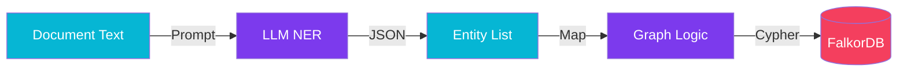

import Callout from '@components/Callout.astro';
import ImplementationNote from '@components/ImplementationNote.astro';
import CodeFile from '@components/CodeFile.astro';
import ExternalCite from '@components/ExternalCite.astro';

## Introduction

Vector databases like Qdrant are amazing for "similarity search," but they struggle with structured relationships. If you ask, "Who are all the vendors connected to Project Alpha?", a vector search might fail. This is where a Graph Database (FalkorDB) shines.

**Why Graph Modeling Matters:**

- **Structured Knowledge**: Maps real-world relationships (Person `WORKS_ON` Project).
- **Multi-Hop Reasoning**: Allows queries that traverse connections (Friends of Friends).
- **Entity Disambiguation**: Distinguishes between "Apple" (the fruit) and "Apple" (the company).

### What We'll Build

We will build a pipeline that extracts entities from our documents and inserts them into FalkorDB.

1. **Perform NER (Named Entity Recognition)**: Use an LLM to find People, Organizations, and Locations.
2. **Model the Schema**: Define distinct Nodes and Relationships.
3. **Ingest into FalkorDB**: Use Cypher queries to build the graph.

## Architecture Overview

The flow runs in parallel with our vector embedding pipeline.



## Section 1: Extracting Entities with LLMs

Traditional NLP libraries (like spaCy) are fast but often struggle with custom domain contexts. LLMs represent a leap forward in zero-shot NER.

We design a prompt that asks the LLM to return a structured JSON response.

```csharp
var systemPrompt = @"
You are an expert data analyst. Extract the following entities from the text:
- Person
- Organization
- Project
- Contract

Return ONLY JSON format:
{
  ""entities"": [
    { ""type"": ""Person"", ""name"": ""Alice Smith"", ""role"": ""Manager"" },
    { ""type"": ""Organization"", ""name"": ""BlueRobin Inc"" }
  ],
  ""relationships"": [
    { ""from"": ""Alice Smith"", ""to"": ""BlueRobin Inc"", ""type"": ""WORKS_FOR"" }
  ]
}";
```

<Callout type="warning" title="Token Costs">
    Running this on every document is expensive. Consider using smaller models (e.g., encoded 8B models or fine-tuned 3B models) for this specific task.
</Callout>

## Section 2: Modeling for FalkorDB

In FalkorDB (which uses the Redis protocol and Cypher query language), we need to be careful about **node merging**. We don't want five "Alice Smith" nodes; we want one node with multiple connections.

### Cypher Merge Strategy

Use the `MERGE` keyword to ensure idempotency.

```cypher
MERGE (p:Person {name: 'Alice Smith'})
MERGE (o:Organization {name: 'BlueRobin Inc'})
MERGE (p)-[:WORKS_FOR]->(o)
```

In C#, using the NRedisStack or a Redis client:

```csharp
public async Task IngestGraphAsync(GraphData data)
{
    var db = _redis.GetDatabase();
    // Construct Cypher query dynamically or use parameters
    foreach (var rel in data.Relationships)
    {
        string query = "MERGE (a {name: $from}) MERGE (b {name: $to}) MERGE (a)-[:" + rel.Type + "]->(b)";
        await db.GraphQueryAsync("files", query, new { from = rel.From, to = rel.To });
    }
}
```

## Section 3: Querying the Graph

Now that the data is in, we can perform powerful queries that RAG alone cannot handle.

**Question**: "Find all contracts signed by anyone who works for BlueRobin."

```cypher
MATCH (p:Person)-[:WORKS_FOR]->(o:Organization {name: 'BlueRobin'})
MATCH (p)-[:SIGNED]->(c:Contract)
RETURN c.title, p.name
```

## Conclusion

By combining the fuzzy search capabilities of Qdrant with the structured relationship modeling of FalkorDB, we create a "GraphRAG" system. This gives our AI two brains: one for "vibe" (vectors) and one for "facts" (graph).

**Next Steps**:
- See how we [Benchmark Microservices](/blog/microservices-benchmarking-and-stress-testing) to handle graph ingestion load.
- specific optimization techniques in [Kubernetes Image Optimization](/blog/kubernetes-image-optimization-small-pods).
