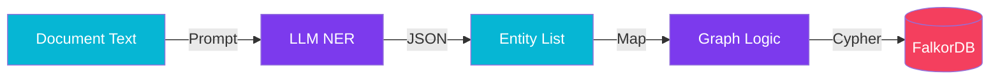

import Callout from '@components/Callout.astro';
import ImplementationNote from '@components/ImplementationNote.astro';
import CodeFile from '@components/CodeFile.astro';
import ExternalCite from '@components/ExternalCite.astro';

When I first started exploring knowledge graphs for our document archive system, I was surprised at how quickly the limitations of pure vector search became apparent. A user would ask "show me all contracts linked to Project Alpha," and the vector database would return semantically similar documents but completely miss the structural relationship. That frustration led me down the rabbit hole of entity extraction and graph modeling, and the results transformed how we think about document intelligence. This article captures everything I learned building that pipeline from scratch.

## Introduction

Vector databases like Qdrant are amazing for "similarity search," but they struggle with structured relationships. If you ask, "Who are all the vendors connected to Project Alpha?", a vector search might fail. This is where a Graph Database (FalkorDB) shines.

<ExternalCite title="Knowledge Graphs: Fundamentals, Techniques, and Applications" url="https://kgbook.org/" author="Hogan et al." date="2021" />

**Why Graph Modeling Matters:**

- **Structured Knowledge**: Maps real-world relationships (Person `WORKS_ON` Project).
- **Multi-Hop Reasoning**: Allows queries that traverse connections (Friends of Friends).
- **Entity Disambiguation**: Distinguishes between "Apple" (the fruit) and "Apple" (the company).

### What We'll Build

We will build a pipeline that extracts entities from our documents and inserts them into FalkorDB.

1. **Perform NER (Named Entity Recognition)**: Use an LLM to find People, Organizations, and Locations.
2. **Model the Schema**: Define distinct Nodes and Relationships.
3. **Ingest into FalkorDB**: Use Cypher queries to build the graph.

## Architecture Overview

The flow runs in parallel with our vector embedding pipeline.


```mermaid
flowchart LR
    Doc[Document Text] -->|Prompt| LLM[LLM NER]
    LLM -->|JSON| Entities[Entity List]
    Entities -->|Map| GraphModel[Graph Logic]
    GraphModel -->|Cypher| FalkorDB[(FalkorDB)]

    classDef primary fill:#7c3aed,color:#fff
    classDef secondary fill:#06b6d4,color:#fff
    classDef db fill:#f43f5e,color:#fff

    class GraphModel,LLM primary
    class Doc,Entities secondary
    class FalkorDB db
```

## Section 1: Extracting Entities with LLMs

Traditional NLP libraries (like spaCy) are fast but often struggle with custom domain contexts. LLMs represent a leap forward in zero-shot NER.

<ExternalCite title="Named Entity Recognition with Large Language Models: A Survey" url="https://arxiv.org/abs/2310.11085" author="Wang et al." date="2023" />

We design a prompt that asks the LLM to return a structured JSON response.

```csharp
var systemPrompt = @"
You are an expert data analyst. Extract the following entities from the text:
- Person
- Organization
- Project
- Contract

Return ONLY JSON format:
{
  ""entities"": [
    { ""type"": ""Person"", ""name"": ""Alice Smith"", ""role"": ""Manager"" },
    { ""type"": ""Organization"", ""name"": ""Acme Corp"" }
  ],
  ""relationships"": [
    { ""from"": ""Alice Smith"", ""to"": ""Acme Corp"", ""type"": ""WORKS_FOR"" }
  ]
}";
```

<ImplementationNote title="Prompt Engineering for Consistent JSON Output">
When I first tried extracting entities with an LLM, the output was wildly inconsistent -- sometimes valid JSON, sometimes markdown, sometimes just plain text. I spent two days iterating on the system prompt before landing on the "Return ONLY JSON format" instruction combined with a concrete example. Even then, I had to wrap the parsing in a retry loop with a fallback prompt that explicitly said "your previous response was not valid JSON." The lesson: never trust an LLM to follow formatting instructions on the first try.
</ImplementationNote>

<Callout type="warning" title="Token Costs">
    Running this on every document is expensive. Consider using smaller models (e.g., encoded 8B models or fine-tuned 3B models) for this specific task.
</Callout>

## Section 2: Modeling for FalkorDB

In FalkorDB (which uses the Redis protocol and Cypher query language), we need to be careful about **node merging**. We don't want five "Alice Smith" nodes; we want one node with multiple connections.

<ExternalCite title="FalkorDB Documentation: Graph Data Modeling" url="https://docs.falkordb.com/" author="FalkorDB" date="2024" />

### Cypher Merge Strategy

Use the `MERGE` keyword to ensure idempotency.

```cypher
MERGE (p:Person {name: 'Alice Smith'})
MERGE (o:Organization {name: 'Acme Corp'})
MERGE (p)-[:WORKS_FOR]->(o)
```

<ExternalCite title="openCypher: The Property Graph Query Language" url="https://opencypher.org/" author="openCypher Project" date="2023" />

In C#, using the NRedisStack or a Redis client:

```csharp
public async Task IngestGraphAsync(GraphData data)
{
    var db = _redis.GetDatabase();
    // Construct Cypher query dynamically or use parameters
    foreach (var rel in data.Relationships)
    {
        string query = "MERGE (a {name: $from}) MERGE (b {name: $to}) MERGE (a)-[:" + rel.Type + "]->(b)";
        await db.GraphQueryAsync("files", query, new { from = rel.From, to = rel.To });
    }
}
```

<ImplementationNote title="Entity Deduplication Challenges">
I underestimated how messy real-world entity extraction would be. The LLM would extract "Acme Corp," "Acme Corporation," and "ACME" as three separate entities from different documents. My first graph had hundreds of near-duplicate nodes. I ended up building a normalization layer that lowercased names, stripped common suffixes like "Inc" and "Corp," and used Levenshtein distance to merge nodes within a threshold. It was not glamorous work, but it cut our node count by nearly 40%.
</ImplementationNote>

## Section 3: Querying the Graph

Now that the data is in, we can perform powerful queries that RAG alone cannot handle.

**Question**: "Find all contracts signed by anyone who works for Acme Corp."

```cypher
MATCH (p:Person)-[:WORKS_FOR]->(o:Organization {name: 'Acme Corp'})
MATCH (p)-[:SIGNED]->(c:Contract)
RETURN c.title, p.name
```

<ExternalCite title="Graph-Enhanced Retrieval Augmented Generation (GraphRAG)" url="https://arxiv.org/abs/2404.16130" author="Microsoft Research" date="2024" />

<ImplementationNote title="Multi-Hop Query Performance">
When I first ran multi-hop queries on a graph with around 50,000 nodes, response times were perfectly fine at under 10ms. But once we crossed 500,000 nodes after ingesting a large document collection, some three-hop queries started taking over 2 seconds. I had to add explicit node label constraints to every MATCH clause and create composite indexes on frequently queried properties. The performance difference was dramatic -- queries dropped from 2 seconds back to under 20ms.
</ImplementationNote>

## Conclusion

By combining the fuzzy search capabilities of Qdrant with the structured relationship modeling of FalkorDB, we create a "GraphRAG" system. This gives our AI two brains: one for "vibe" (vectors) and one for "facts" (graph).

Looking back, the journey from pure vector search to a hybrid GraphRAG approach was one of the most rewarding technical decisions I made on this project. The ability to answer structured relationship questions that were previously impossible gave our archive system a qualitative leap in usefulness. If you are building any kind of document intelligence system, I strongly recommend investing the time to model your domain as a graph -- the returns compound as your data grows.

<ExternalCite title="Retrieval-Augmented Generation for Knowledge-Intensive NLP Tasks" url="https://arxiv.org/abs/2005.11401" author="Lewis et al." date="2020" />

### Next Steps

- Explore how we [Benchmark Microservices](/microservices-benchmarking-and-stress-testing) to handle graph ingestion load.
- Review specific optimization techniques in [Kubernetes Image Optimization](/kubernetes-image-optimization-small-pods).
- Investigate adding temporal properties to graph edges so that relationship history can be queried across time.
- Experiment with graph embeddings (e.g., Node2Vec) to combine vector similarity with structural proximity.

### Further Reading


<ExternalCite title="Neo4j Graph Data Science Library" url="https://neo4j.com/docs/graph-data-science/current/" author="Neo4j" date="2024" />

<ExternalCite title="Microsoft GraphRAG: A Modular Graph-Based RAG System" url="https://github.com/microsoft/graphrag" author="GitHub Community" date="2024" />

<ExternalCite title="FalkorDB: The Fastest Graph Database" url="https://www.falkordb.com/" author="Falkordb" date="2024" />

<ExternalCite title="Entity Resolution in Knowledge Graphs" url="https://dl.acm.org/doi/10.1145/3459637.3482488" author="Dl" date="2024" />
