import Callout from '@components/Callout.astro';
import ImplementationNote from '@components/ImplementationNote.astro';
import ExternalCite from '@components/ExternalCite.astro';

## Introduction

Robust systems must anticipate and handle failures gracefully. In distributed architectures, errors are inevitable—services timeout, databases lock, and networks partition. Relying solely on try-catch blocks often leads to "exception-driven logic" which is hard to reason about and expensive at runtime. This guide explores implementing resilient error handling in .NET using the Result pattern for domain logic and Polly policies for infrastructure resilience, ensuring system stability under pressure.

## Architecture Overview

The following diagram illustrates the multi-layered error handling strategy, from the domain layer up to the API and external integrations.

```mermaid
flowchart TB
    Client["📱 Client"] --> API["🛡️ API Endpoint<br/>(Global Exception Handler)"]
    
    subgraph App["Application Layer"]
        Service["⚙️ Service Layer<br/>(Result Pattern)"]
        Retry["🔄 Polly Retry Policy"]
        Breaker["⚡ Circuit Breaker"]
    end
    
    subgraph Ext["External Systems"]
        DB[("🗄️ Database")]
        Remote["☁️ External API"]
    end

    API --> Service
    Service -->|Success/Failure| API
    
    Service --> DB
    Service --> Retry
    Retry --> Breaker
    Breaker --> Remote

    classDef primary fill:#7c3aed,color:#fff
    classDef secondary fill:#06b6d4,color:#fff
    classDef db fill:#f43f5e,color:#fff
    classDef warning fill:#fbbf24,color:#000

    class Service,API primary
    class Retry,Breaker secondary
    class Client,Remote warning
    class DB db
```



## Implementation

### Result Pattern

#### Result Type Implementation

```csharp
// Core/Common/Result.cs
public sealed class Result<T>
{
    public T? Value { get; }
    public Error? Error { get; }
    // ...existing code...
    public bool IsSuccess => Error is null;
    public bool IsFailure => !IsSuccess;

    private Result(T value)
    {
        Value = value;
        Error = null;
    }

    private Result(Error error)
    {
        Value = default;
        Error = error;
    }

    public static Result<T> Success(T value) => new(value);
    public static Result<T> Failure(Error error) => new(error);

    public TResult Match<TResult>(
        Func<T, TResult> onSuccess,
        Func<Error, TResult> onFailure) =>
        IsSuccess ? onSuccess(Value!) : onFailure(Error!);

    public async Task<TResult> MatchAsync<TResult>(
        Func<T, Task<TResult>> onSuccess,
        Func<Error, Task<TResult>> onFailure) =>
        IsSuccess ? await onSuccess(Value!) : await onFailure(Error!);
}

public static class Result
{
    public static Result<T> Success<T>(T value) => Result<T>.Success(value);
    public static Result<T> Failure<T>(Error error) => Result<T>.Failure(error);
}
```

#### Error Type

```csharp
// Core/Common/Error.cs
public sealed record Error(string Code, string Message, ErrorType Type = ErrorType.Failure)
{
    public static Error NotFound(string resource, string id) =>
        new($"{resource}.NotFound", $"{resource} with ID '{id}' was not found", ErrorType.NotFound);

    public static Error Validation(string code, string message) =>
        new(code, message, ErrorType.Validation);

    public static Error Conflict(string code, string message) =>
        new(code, message, ErrorType.Conflict);

    public static Error Forbidden(string code, string message) =>
        new(code, message, ErrorType.Forbidden);

    public static Error Internal(string message) =>
        new("Internal.Error", message, ErrorType.Internal);
}

public enum ErrorType
{
    Failure,
    Validation,
    NotFound,
    Conflict,
    Forbidden,
    Internal
}
```

#### Using Result in Services

```csharp
// Application/Services/DocumentService.cs
public sealed class DocumentService : IDocumentService
{
    private readonly IDocumentRepository _repository;

    public async Task<Result<Document>> GetByIdAsync(
        DocumentId id,
        BlueRobinId userId,
        CancellationToken ct = default)
    {
        var document = await _repository.GetByIdAsync(id, ct);
        
        if (document is null)
        {
            return Result.Failure<Document>(
                Error.NotFound("Document", id.Value.ToString()));
        }

        if (document.OwnerId != userId)
        {
            return Result.Failure<Document>(
                Error.Forbidden("Document.Access", "You don't have access to this document"));
        }

        return Result.Success(document);
    }

    public async Task<Result<DocumentId>> CreateAsync(
        CreateDocumentCommand command,
        CancellationToken ct = default)
    {
        // Validation
        if (string.IsNullOrWhiteSpace(command.Name))
        {
            return Result.Failure<DocumentId>(
                Error.Validation("Document.Name.Required", "Document name is required"));
        }

        var document = Document.Create(command.Name, command.OwnerId);
        await _repository.AddAsync(document, ct);
        
        return Result.Success(document.Id);
    }
}
```

<ImplementationNote>
The Result pattern makes errors explicit in method signatures, forcing callers to handle both success and failure cases. This eliminates null checks and exception catching throughout the codebase.
</ImplementationNote>

### FastEndpoints Error Handling

#### Endpoint with Result Pattern

```csharp
// Api/Endpoints/Documents/GetDocumentEndpoint.cs
public sealed class GetDocumentEndpoint : Endpoint<GetDocumentRequest, DocumentResponse>
{
    private readonly IDocumentService _service;

    public override void Configure()
    {
        Get("/api/documents/{id}");
    }

    public override async Task HandleAsync(GetDocumentRequest req, CancellationToken ct)
    {
        var userId = BlueRobinId.From(User.FindFirst("bluerobin_id")!.Value);
        var result = await _service.GetByIdAsync(req.Id, userId, ct);

        await result.Match(
            onSuccess: async document =>
            {
                await SendAsync(document.ToResponse(), cancellation: ct);
            },
            onFailure: async error =>
            {
                await SendErrorAsync(error, ct);
            });
    }

    private Task SendErrorAsync(Error error, CancellationToken ct)
    {
        return error.Type switch
        {
            ErrorType.NotFound => SendNotFoundAsync(ct),
            ErrorType.Validation => SendAsync(new ErrorResponse(error), 400, ct),
            ErrorType.Forbidden => SendForbiddenAsync(ct),
            ErrorType.Conflict => SendAsync(new ErrorResponse(error), 409, ct),
            _ => SendAsync(new ErrorResponse(error), 500, ct)
        };
    }
}
```

### Global Exception Handler

#### Exception Handling Middleware

```csharp
// Api/Middleware/GlobalExceptionHandler.cs
public sealed class GlobalExceptionHandler : IExceptionHandler
{
    private readonly ILogger<GlobalExceptionHandler> _logger;

    public GlobalExceptionHandler(ILogger<GlobalExceptionHandler> logger)
    {
        _logger = logger;
    }

    public async ValueTask<bool> TryHandleAsync(
        HttpContext context,
        Exception exception,
        CancellationToken ct)
    {
        _logger.LogError(exception, "Unhandled exception: {Message}", exception.Message);

        var (statusCode, errorResponse) = exception switch
        {
            ValidationException ex => (400, new ProblemDetails
            {
                Status = 400,
                Title = "Validation Error",
                Detail = ex.Message,
                Extensions = { ["errors"] = ex.Errors }
            }),
            
            NotFoundException ex => (404, new ProblemDetails
            {
                Status = 404,
                Title = "Not Found",
                Detail = ex.Message
            }),
            
            UnauthorizedAccessException => (403, new ProblemDetails
            {
                Status = 403,
                Title = "Forbidden",
                Detail = "You don't have permission to access this resource"
            }),
            
            OperationCanceledException => (499, new ProblemDetails
            {
                Status = 499,
                Title = "Request Cancelled",
                Detail = "The request was cancelled"
            }),
            
            _ => (500, new ProblemDetails
            {
                Status = 500,
                Title = "Internal Server Error",
                Detail = "An unexpected error occurred"
            })
        };

        context.Response.StatusCode = statusCode;
        context.Response.ContentType = "application/problem+json";
        
        await context.Response.WriteAsJsonAsync(errorResponse, ct);
        
        return true;
    }
}
```

<Callout type="warning">
Never expose internal exception details in production. Use `ProblemDetails` with generic messages while logging full details server-side.
</Callout>

### Polly Resilience

#### Resilience Pipeline Configuration

```csharp
// Infrastructure/Extensions/ResilienceExtensions.cs
public static class ResilienceExtensions
{
    public static IServiceCollection AddResiliencePolicies(this IServiceCollection services)
    {
        services.AddResiliencePipeline("default", builder =>
        {
            builder
                .AddRetry(new RetryStrategyOptions
                {
                    MaxRetryAttempts = 3,
                    Delay = TimeSpan.FromMilliseconds(500),
                    BackoffType = DelayBackoffType.Exponential,
                    UseJitter = true,
                    ShouldHandle = new PredicateBuilder()
                        .Handle<HttpRequestException>()
                        .Handle<TimeoutException>()
                })
                .AddCircuitBreaker(new CircuitBreakerStrategyOptions
                {
                    FailureRatio = 0.5,
                    SamplingDuration = TimeSpan.FromSeconds(30),
                    MinimumThroughput = 10,
                    BreakDuration = TimeSpan.FromSeconds(30),
                    ShouldHandle = new PredicateBuilder()
                        .Handle<HttpRequestException>()
                        .Handle<TimeoutException>()
                })
                .AddTimeout(TimeSpan.FromSeconds(30));
        });

        return services;
    }
}
```

#### Using Resilience in HttpClient

```csharp
// Program.cs
builder.Services.AddHttpClient<IOcrService, DoclingOcrService>(client =>
{
    client.BaseAddress = new Uri(builder.Configuration["Docling:Endpoint"]!);
    client.Timeout = TimeSpan.FromMinutes(5);
})
.AddStandardResilienceHandler(options =>
{
    options.Retry.MaxRetryAttempts = 3;
    options.Retry.BackoffType = DelayBackoffType.Exponential;
    options.CircuitBreaker.BreakDuration = TimeSpan.FromSeconds(30);
    options.TotalRequestTimeout.Timeout = TimeSpan.FromMinutes(5);
});
```

#### Manual Resilience Execution

```csharp
// Application/Services/EmbeddingService.cs
public sealed class EmbeddingService : IEmbeddingService
{
    private readonly ResiliencePipeline _pipeline;
    private readonly IEmbeddingClient _client;
    private readonly ILogger<EmbeddingService> _logger;

    public async Task<float[]> GenerateAsync(
        string text,
        CancellationToken ct = default)
    {
        return await _pipeline.ExecuteAsync(async token =>
        {
            try
            {
                return await _client.EmbedAsync(text, token);
            }
            catch (RpcException ex) when (ex.StatusCode == StatusCode.Unavailable)
            {
                _logger.LogWarning("Embedding service unavailable, retrying...");
                throw;
            }
        }, ct);
    }
}
```

### Domain Exceptions

#### Custom Exception Types

```csharp
// Core/Exceptions/DomainException.cs
public abstract class DomainException : Exception
{
    public string Code { get; }

    protected DomainException(string code, string message) : base(message)
    {
        Code = code;
    }
}

public sealed class NotFoundException : DomainException
{
    public NotFoundException(string resource, object id)
        : base($"{resource}.NotFound", $"{resource} with ID '{id}' was not found")
    {
    }
}

public sealed class ValidationException : DomainException
{
    public IDictionary<string, string[]> Errors { get; }

    public ValidationException(IDictionary<string, string[]> errors)
        : base("Validation.Failed", "One or more validation errors occurred")
    {
        Errors = errors;
    }
}

public sealed class ConflictException : DomainException
{
    public ConflictException(string resource, string reason)
        : base($"{resource}.Conflict", reason)
    {
    }
}
```

### Error Response Models

#### Standard Error Response

```csharp
// Api/Models/ErrorResponse.cs
public sealed record ErrorResponse(
    string Code,
    string Message,
    IDictionary<string, string[]>? Errors = null)
{
    public ErrorResponse(Error error) : this(error.Code, error.Message)
    {
    }
}

public sealed record ValidationErrorResponse(
    string Code,
    string Message,
    IDictionary<string, string[]> Errors)
    : ErrorResponse(Code, Message, Errors)
{
    public ValidationErrorResponse(IDictionary<string, string[]> errors)
        : this("Validation.Failed", "One or more validation errors occurred", errors)
    {
    }
}
```

## Conclusion

By combining the Result pattern for domain logic with Polly's resilience strategies, we create a defense-in-depth approach to error handling. This limits the blast radius of failures and provides a predictable experience for both developers and end-users. The Result pattern eliminates the ambiguity of exceptions for flow control, while Polly ensures that transient faults in external systems don't cascade through the application.

<ExternalCite 
  title="Polly Documentation" 
  url="https://github.com/App-vNext/Polly"
  author="Polly Project"
/>
