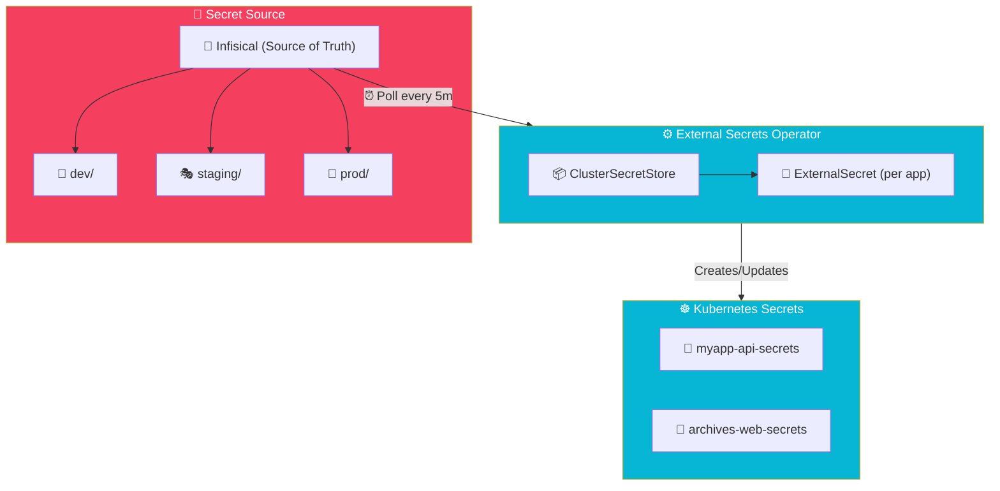

import Callout from '@components/Callout.astro';
import ImplementationNote from '@components/ImplementationNote.astro';
import ExternalCite from '@components/ExternalCite.astro';

When I first configured External Secrets Operator to sync secrets from Infisical into our Kubernetes cluster, I underestimated how many moving parts were involved. The initial setup seemed straightforward -- install the operator, point it at Infisical, define your ExternalSecret resources -- but the reality was a maze of authentication scopes, environment slugs, and Go template syntax that took me several frustrating evenings to sort out. One particularly painful lesson came when a secret rotation in Infisical silently failed to propagate because I had misconfigured the `refreshInterval`, and our staging database connections started dropping at 2 AM. That experience taught me to treat the sync pipeline as a first-class concern with proper monitoring and alerting from day one.

<Callout type="warning" title="Update — August 2026">
Two things have changed since this was written: the staging environment is gone (prod-only collapse, ADR-034), and the `MINIO_ACCESS_KEY`/`MINIO_SECRET_KEY` examples are now Cloudflare R2 credentials — MinIO is retired (ADR-006). The ESO + Infisical sync pattern itself is unchanged.
</Callout>

## Introduction

GitOps requires declarative configuration in Git, but secrets shouldn't be stored in repositories. External Secrets Operator bridges this gap by synchronizing secrets from Infisical to Kubernetes.

<ExternalCite title="External Secrets Operator Documentation" url="https://external-secrets.io/latest/" author="External Secrets Community" date="2024-06-01" />

<ExternalCite title="Infisical Documentation - Kubernetes Integration" url="https://infisical.com/docs/integrations/platforms/kubernetes" author="Infisical" date="2024-05-15" />

## Architecture Overview


```mermaid
flowchart TB
    subgraph Source["🏦 Secret Source"]
        Infisical["🔐 Infisical (Source of Truth)"]
        Infisical --> Dev["🧪 dev/"]
        Infisical --> Staging["🎭 staging/"]
        Infisical --> Prod["🚀 prod/"]
    end
    
    Infisical -->|"⏰ Poll every 5m"| ESO
    
    subgraph ESO["⚙️ External Secrets Operator"]
        Store["📦 ClusterSecretStore"] --> ExtSec["🔗 ExternalSecret (per app)"]
    end
    
    ESO -->|"Creates/Updates"| K8s
    
    subgraph K8s["☸️ Kubernetes Secrets"]
        ApiSec["🔑 myapp-api-secrets"]
        WebSec["🔑 archives-web-secrets"]
    end

    classDef primary fill:#7c3aed,color:#fff
    classDef secondary fill:#06b6d4,color:#fff
    classDef db fill:#f43f5e,color:#fff
    classDef warning fill:#fbbf24,color:#000

    class Source db
    class ESO secondary
    class K8s secondary
```

## Implementation

## Installation

<ExternalCite title="External Secrets Operator Helm Chart" url="https://external-secrets.io/latest/introduction/getting-started/" author="External Secrets Community" date="2024-04-10" />

### HelmRelease

```yaml
# platform/external-secrets/helmrelease.yaml
apiVersion: helm.toolkit.fluxcd.io/v2
kind: HelmRelease
metadata:
  name: external-secrets
  namespace: external-secrets
spec:
  interval: 30m
  chart:
    spec:
      chart: external-secrets
      version: ">=0.9.0"
      sourceRef:
        kind: HelmRepository
        name: external-secrets
        namespace: flux-system
  values:
    installCRDs: true
    serviceMonitor:
      enabled: true
    webhook:
      create: true
    certController:
      create: true
    resources:
      requests:
        cpu: 10m
        memory: 64Mi
      limits:
        cpu: 100m
        memory: 128Mi
```

## ClusterSecretStore

### Infisical Configuration

```yaml
# platform/external-secrets/infisical-store.yaml
apiVersion: external-secrets.io/v1beta1
kind: ClusterSecretStore
metadata:
  name: infisical-store
spec:
  provider:
    infisical:
      hostAPI: https://app.infisical.com
      auth:
        universalAuthCredentials:
          clientId:
            key: clientId
            name: infisical-credentials
            namespace: external-secrets
          clientSecret:
            key: clientSecret
            name: infisical-credentials
            namespace: external-secrets
      secretsScope:
        projectSlug: my-project
```

### Authentication Secret

```yaml
# platform/external-secrets/infisical-credentials.yaml
apiVersion: v1
kind: Secret
metadata:
  name: infisical-credentials
  namespace: external-secrets
type: Opaque
stringData:
  clientId: "${INFISICAL_CLIENT_ID}"
  clientSecret: "${INFISICAL_CLIENT_SECRET}"
```

<ImplementationNote>
The Infisical credentials secret is the only secret that must be manually created or bootstrapped. Use `kubectl create secret` or seal it with Sealed Secrets for initial setup.
</ImplementationNote>

<ImplementationNote title="Credential Bootstrap Gotcha">
I initially tried to use Flux to manage the Infisical credentials secret alongside everything else, which created a chicken-and-egg problem: ESO needed the credentials to start syncing, but the credentials were supposed to come from ESO. I ended up writing a small shell script that runs during cluster bootstrap to create this one secret manually via `kubectl create secret`. It is not elegant, but it cleanly breaks the circular dependency and only needs to run once per cluster provisioning.
</ImplementationNote>

## ExternalSecret Resources

### API Secrets

```yaml
# apps/myapp-api/externalsecret.yaml
apiVersion: external-secrets.io/v1beta1
kind: ExternalSecret
metadata:
  name: myapp-api-secrets
  namespace: myapp-staging
spec:
  refreshInterval: 5m
  secretStoreRef:
    name: infisical-store
    kind: ClusterSecretStore
  target:
    name: myapp-api-secrets
    creationPolicy: Owner
    template:
      type: Opaque
      data:
        ConnectionStrings__AppDb: |
          Host={{ .POSTGRES_HOST }};Port={{ .POSTGRES_PORT }};Database={{ .APP_DB_NAME }};Username={{ .APP_DB_USER }};Password={{ .APP_DB_PASSWORD }};Include Error Detail=true
        Nats__Url: "nats://{{ .NATS_USER }}:{{ .NATS_PASSWORD }}@{{ .NATS_HOST }}:{{ .NATS_PORT }}"
        Qdrant__ApiKey: "{{ .QDRANT_API_KEY }}"
        MinIO__AccessKey: "{{ .MINIO_ACCESS_KEY }}"
        MinIO__SecretKey: "{{ .MINIO_SECRET_KEY }}"
        Ollama__ApiKey: "{{ .OLLAMA_API_KEY }}"
  data:
    - secretKey: POSTGRES_HOST
      remoteRef:
        key: POSTGRES_HOST
        property: ""
    - secretKey: POSTGRES_PORT
      remoteRef:
        key: POSTGRES_PORT
    - secretKey: APP_DB_NAME
      remoteRef:
        key: APP_DB_NAME
    - secretKey: APP_DB_USER
      remoteRef:
        key: APP_DB_USER
    - secretKey: APP_DB_PASSWORD
      remoteRef:
        key: APP_DB_PASSWORD
    - secretKey: NATS_USER
      remoteRef:
        key: NATS_USER
    - secretKey: NATS_PASSWORD
      remoteRef:
        key: NATS_PASSWORD
    - secretKey: NATS_HOST
      remoteRef:
        key: NATS_HOST
    - secretKey: NATS_PORT
      remoteRef:
        key: NATS_PORT
    - secretKey: QDRANT_API_KEY
      remoteRef:
        key: QDRANT_API_KEY
    - secretKey: MINIO_ACCESS_KEY
      remoteRef:
        key: MINIO_ACCESS_KEY
    - secretKey: MINIO_SECRET_KEY
      remoteRef:
        key: MINIO_SECRET_KEY
    - secretKey: OLLAMA_API_KEY
      remoteRef:
        key: OLLAMA_API_KEY
```

### Web Application Secrets

```yaml
# apps/my-web-client/externalsecret.yaml
apiVersion: external-secrets.io/v1beta1
kind: ExternalSecret
metadata:
  name: my-web-client-secrets
  namespace: myapp-staging
spec:
  refreshInterval: 5m
  secretStoreRef:
    name: infisical-store
    kind: ClusterSecretStore
  target:
    name: my-web-client-secrets
    creationPolicy: Owner
    template:
      type: Opaque
      data:
        OIDC__Authority: "{{ .OIDC_AUTHORITY }}"
        OIDC__ClientId: "{{ .OIDC_CLIENT_ID }}"
        OIDC__ClientSecret: "{{ .OIDC_CLIENT_SECRET }}"
        Api__BaseUrl: "{{ .API_BASE_URL }}"
  data:
    - secretKey: OIDC_AUTHORITY
      remoteRef:
        key: OIDC_AUTHORITY
    - secretKey: OIDC_CLIENT_ID
      remoteRef:
        key: OIDC_CLIENT_ID
    - secretKey: OIDC_CLIENT_SECRET
      remoteRef:
        key: OIDC_CLIENT_SECRET
    - secretKey: API_BASE_URL
      remoteRef:
        key: API_BASE_URL
```

<Callout type="tip">
Use templates to construct connection strings from individual secrets. This keeps Infisical secrets atomic and reusable across applications.
</Callout>

## Environment-Specific Configuration

<ExternalCite title="Managing Secrets in Kubernetes: A Practical Guide" url="https://kubernetes.io/docs/concepts/configuration/secret/" author="Kubernetes Authors" date="2024-03-20" />

### Using Infisical Environments

```yaml
# apps/myapp-api/externalsecret-staging.yaml
apiVersion: external-secrets.io/v1beta1
kind: ExternalSecret
metadata:
  name: myapp-api-secrets
  namespace: myapp-staging
spec:
  refreshInterval: 5m
  secretStoreRef:
    name: infisical-store
    kind: ClusterSecretStore
  target:
    name: myapp-api-secrets
    creationPolicy: Owner
  dataFrom:
    - extract:
        key: ""  # Empty key = all secrets
      rewrite:
        - regexp:
            source: "(.*)"
            target: "$1"
    # Scope to staging environment
  secretStoreRef:
    name: infisical-staging-store
    kind: ClusterSecretStore
```

### Per-Environment Stores

<ImplementationNote title="Environment Slug Mismatch">
I spent an embarrassing amount of time debugging why our staging secrets were pulling production values. The root cause was a mismatch between the `environmentSlug` in the ClusterSecretStore and the actual environment name in Infisical. Infisical uses slugs like `staging` and `prod`, but I had accidentally written `production` in the store config. The operator did not throw an error -- it just returned empty values, which caused silent failures downstream. Now I always verify the exact slug by checking the Infisical dashboard URL before configuring a new environment store.
</ImplementationNote>

```yaml
# platform/external-secrets/infisical-staging-store.yaml
apiVersion: external-secrets.io/v1beta1
kind: ClusterSecretStore
metadata:
  name: infisical-staging-store
spec:
  provider:
    infisical:
      hostAPI: https://app.infisical.com
      auth:
        universalAuthCredentials:
          clientId:
            key: clientId
            name: infisical-credentials
            namespace: external-secrets
          clientSecret:
            key: clientSecret
            name: infisical-credentials
            namespace: external-secrets
      secretsScope:
        projectSlug: my-project
        environmentSlug: staging  # Environment-specific
        secretsPath: /           # Root path
```

## Deployment Integration

### Using Secrets in Deployments

```yaml
# apps/myapp-api/deployment.yaml
apiVersion: apps/v1
kind: Deployment
metadata:
  name: myapp-api
  namespace: myapp-staging
spec:
  template:
    spec:
      containers:
        - name: api
          image: registry.example.com/myapp/myapp-api:latest
          envFrom:
            - secretRef:
                name: myapp-api-secrets
          env:
            - name: Environment
              value: "staging"
```

## Monitoring

<ExternalCite title="Secrets Management Best Practices for Kubernetes" url="https://cheatsheetseries.owasp.org/cheatsheets/Secrets_Management_Cheat_Sheet.html" author="OWASP Foundation" date="2024-01-15" />

### Check Sync Status

```bash
# View ExternalSecret status
kubectl get externalsecrets -A

# Describe specific ExternalSecret
kubectl describe externalsecret myapp-api-secrets -n myapp-staging

# Check events
kubectl get events -n myapp-staging --field-selector reason=Updated
```

### Prometheus Metrics

```yaml
# Alerting on sync failures
apiVersion: monitoring.coreos.com/v1
kind: PrometheusRule
metadata:
  name: external-secrets-alerts
  namespace: external-secrets
spec:
  groups:
    - name: external-secrets
      rules:
        - alert: ExternalSecretSyncFailed
          expr: externalsecret_status_condition{condition="Ready", status="False"} == 1
          for: 10m
          labels:
            severity: critical
          annotations:
            summary: "ExternalSecret {{ $labels.name }} sync failed"
```

## Troubleshooting

| Issue | Diagnosis | Solution |
|-------|-----------|----------|
| Secret not created | Check ESO logs | Verify ClusterSecretStore credentials |
| Stale values | Check refreshInterval | Force refresh: delete K8s secret |
| Template errors | Describe ExternalSecret | Fix Go template syntax |
| Auth failures | Check Infisical credentials | Rotate machine identity |

## Summary

External Secrets Operator enables:

| Feature | Benefit |
|---------|---------|
| GitOps Compatibility | Secret references in Git, values in Infisical |
| Auto-Sync | Secrets refresh every 5 minutes |
| Templates | Construct connection strings from parts |
| Environment Scoping | Separate dev/staging/prod secrets |
| Audit Trail | All changes tracked in Infisical |

Combined with Flux CD, this enables fully declarative Kubernetes deployments with secure secret management.

Looking back, the time I invested in getting this pipeline right has paid dividends many times over. Before adopting External Secrets Operator with Infisical, rotating a database password meant manually updating secrets across multiple namespaces and hoping I did not miss one. Now, I update the value in Infisical and within five minutes every service picks up the change automatically. The peace of mind alone is worth the initial setup complexity.

<ExternalCite title="External Secrets Operator" url="https://external-secrets.io/" author="External Secrets Community" date="2024-06-01" />

<ExternalCite title="GitOps and Secret Management" url="https://fluxcd.io/flux/guides/sealed-secrets/" author="Flux CD Project" date="2024-02-10" />

## Next Steps

- Set up Prometheus alerts for `externalsecret_status_condition` to catch sync failures before they impact services.
- Implement secret versioning in Infisical to enable rollback if a rotation introduces a bad value.
- Explore [Infisical's dynamic secrets](https://infisical.com/docs/documentation/platform/dynamic-secrets/overview) for short-lived database credentials that automatically expire.
- Review the [Health Checks guide](/dotnet-health-checks-kubernetes) to ensure your services detect stale secrets quickly.

### Further Reading


<ExternalCite title="External Secrets Operator - Provider Documentation" url="https://external-secrets.io/latest/provider/infisical/" author="External Secrets Community" date="2024" />

<ExternalCite title="Kubernetes Secrets Best Practices" url="https://kubernetes.io/docs/concepts/configuration/secret/#best-practices" author="Kubernetes Authors" date="2024" />

<ExternalCite title="OWASP Secrets Management Cheat Sheet" url="https://cheatsheetseries.owasp.org/cheatsheets/Secrets_Management_Cheat_Sheet.html" author="OWASP" date="2024" />
