import Callout from '@components/Callout.astro';
import ImplementationNote from '@components/ImplementationNote.astro';
import ExternalCite from '@components/ExternalCite.astro';

## Introduction

GitOps requires declarative configuration in Git, but secrets shouldn't be stored in repositories. External Secrets Operator bridges this gap by synchronizing secrets from Infisical to Kubernetes.

## Architecture Overview

```mermaid
flowchart TB
    subgraph Source["🏦 Secret Source"]
        Infisical["🔐 Infisical (Source of Truth)"]
        Infisical --> Dev["🧪 dev/"]
        Infisical --> Staging["🎭 staging/"]
        Infisical --> Prod["🚀 prod/"]
    end
    
    Infisical -->|"⏰ Poll every 5m"| ESO
    
    subgraph ESO["⚙️ External Secrets Operator"]
        Store["📦 ClusterSecretStore"] --> ExtSec["🔗 ExternalSecret (per app)"]
    end
    
    ESO -->|"Creates/Updates"| K8s
    
    subgraph K8s["☸️ Kubernetes Secrets"]
        ApiSec["🔑 archives-api-secrets"]
        WebSec["🔑 archives-web-secrets"]
    end

    classDef primary fill:#7c3aed,color:#fff
    classDef secondary fill:#06b6d4,color:#fff
    classDef db fill:#f43f5e,color:#fff
    classDef warning fill:#fbbf24,color:#000

    class Source db
    class ESO secondary
    class K8s secondary
```



## Implementation

## Installation

### HelmRelease

```yaml
# platform/external-secrets/helmrelease.yaml
apiVersion: helm.toolkit.fluxcd.io/v2
kind: HelmRelease
metadata:
  name: external-secrets
  namespace: external-secrets
spec:
  interval: 30m
  chart:
    spec:
      chart: external-secrets
      version: ">=0.9.0"
      sourceRef:
        kind: HelmRepository
        name: external-secrets
        namespace: flux-system
  values:
    installCRDs: true
    serviceMonitor:
      enabled: true
    webhook:
      create: true
    certController:
      create: true
    resources:
      requests:
        cpu: 10m
        memory: 64Mi
      limits:
        cpu: 100m
        memory: 128Mi
```

## ClusterSecretStore

### Infisical Configuration

```yaml
# platform/external-secrets/infisical-store.yaml
apiVersion: external-secrets.io/v1beta1
kind: ClusterSecretStore
metadata:
  name: infisical-store
spec:
  provider:
    infisical:
      hostAPI: https://app.infisical.com
      auth:
        universalAuthCredentials:
          clientId:
            key: clientId
            name: infisical-credentials
            namespace: external-secrets
          clientSecret:
            key: clientSecret
            name: infisical-credentials
            namespace: external-secrets
      secretsScope:
        projectSlug: bluerobin
```

### Authentication Secret

```yaml
# platform/external-secrets/infisical-credentials.yaml
apiVersion: v1
kind: Secret
metadata:
  name: infisical-credentials
  namespace: external-secrets
type: Opaque
stringData:
  clientId: "${INFISICAL_CLIENT_ID}"
  clientSecret: "${INFISICAL_CLIENT_SECRET}"
```

<ImplementationNote>
The Infisical credentials secret is the only secret that must be manually created or bootstrapped. Use `kubectl create secret` or seal it with Sealed Secrets for initial setup.
</ImplementationNote>

## ExternalSecret Resources

### API Secrets

```yaml
# apps/archives-api/externalsecret.yaml
apiVersion: external-secrets.io/v1beta1
kind: ExternalSecret
metadata:
  name: archives-api-secrets
  namespace: archives-staging
spec:
  refreshInterval: 5m
  secretStoreRef:
    name: infisical-store
    kind: ClusterSecretStore
  target:
    name: archives-api-secrets
    creationPolicy: Owner
    template:
      type: Opaque
      data:
        ConnectionStrings__BlueRobinDb: |
          Host={{ .POSTGRES_HOST }};Port={{ .POSTGRES_PORT }};Database={{ .ARCHIVES_DB_NAME }};Username={{ .ARCHIVES_DB_USER }};Password={{ .ARCHIVES_DB_PASSWORD }};Include Error Detail=true
        Nats__Url: "nats://{{ .NATS_USER }}:{{ .NATS_PASSWORD }}@{{ .NATS_HOST }}:{{ .NATS_PORT }}"
        Qdrant__ApiKey: "{{ .QDRANT_API_KEY }}"
        MinIO__AccessKey: "{{ .MINIO_ACCESS_KEY }}"
        MinIO__SecretKey: "{{ .MINIO_SECRET_KEY }}"
        Ollama__ApiKey: "{{ .OLLAMA_API_KEY }}"
  data:
    - secretKey: POSTGRES_HOST
      remoteRef:
        key: POSTGRES_HOST
        property: ""
    - secretKey: POSTGRES_PORT
      remoteRef:
        key: POSTGRES_PORT
    - secretKey: ARCHIVES_DB_NAME
      remoteRef:
        key: ARCHIVES_DB_NAME
    - secretKey: ARCHIVES_DB_USER
      remoteRef:
        key: ARCHIVES_DB_USER
    - secretKey: ARCHIVES_DB_PASSWORD
      remoteRef:
        key: ARCHIVES_DB_PASSWORD
    - secretKey: NATS_USER
      remoteRef:
        key: NATS_USER
    - secretKey: NATS_PASSWORD
      remoteRef:
        key: NATS_PASSWORD
    - secretKey: NATS_HOST
      remoteRef:
        key: NATS_HOST
    - secretKey: NATS_PORT
      remoteRef:
        key: NATS_PORT
    - secretKey: QDRANT_API_KEY
      remoteRef:
        key: QDRANT_API_KEY
    - secretKey: MINIO_ACCESS_KEY
      remoteRef:
        key: MINIO_ACCESS_KEY
    - secretKey: MINIO_SECRET_KEY
      remoteRef:
        key: MINIO_SECRET_KEY
    - secretKey: OLLAMA_API_KEY
      remoteRef:
        key: OLLAMA_API_KEY
```

### Web Application Secrets

```yaml
# apps/bluerobin-web/externalsecret.yaml
apiVersion: external-secrets.io/v1beta1
kind: ExternalSecret
metadata:
  name: bluerobin-web-secrets
  namespace: archives-staging
spec:
  refreshInterval: 5m
  secretStoreRef:
    name: infisical-store
    kind: ClusterSecretStore
  target:
    name: bluerobin-web-secrets
    creationPolicy: Owner
    template:
      type: Opaque
      data:
        OIDC__Authority: "{{ .OIDC_AUTHORITY }}"
        OIDC__ClientId: "{{ .OIDC_CLIENT_ID }}"
        OIDC__ClientSecret: "{{ .OIDC_CLIENT_SECRET }}"
        Api__BaseUrl: "{{ .API_BASE_URL }}"
  data:
    - secretKey: OIDC_AUTHORITY
      remoteRef:
        key: OIDC_AUTHORITY
    - secretKey: OIDC_CLIENT_ID
      remoteRef:
        key: OIDC_CLIENT_ID
    - secretKey: OIDC_CLIENT_SECRET
      remoteRef:
        key: OIDC_CLIENT_SECRET
    - secretKey: API_BASE_URL
      remoteRef:
        key: API_BASE_URL
```

<Callout type="tip">
Use templates to construct connection strings from individual secrets. This keeps Infisical secrets atomic and reusable across applications.
</Callout>

## Environment-Specific Configuration

### Using Infisical Environments

```yaml
# apps/archives-api/externalsecret-staging.yaml
apiVersion: external-secrets.io/v1beta1
kind: ExternalSecret
metadata:
  name: archives-api-secrets
  namespace: archives-staging
spec:
  refreshInterval: 5m
  secretStoreRef:
    name: infisical-store
    kind: ClusterSecretStore
  target:
    name: archives-api-secrets
    creationPolicy: Owner
  dataFrom:
    - extract:
        key: ""  # Empty key = all secrets
      rewrite:
        - regexp:
            source: "(.*)"
            target: "$1"
    # Scope to staging environment
  secretStoreRef:
    name: infisical-staging-store
    kind: ClusterSecretStore
```

### Per-Environment Stores

```yaml
# platform/external-secrets/infisical-staging-store.yaml
apiVersion: external-secrets.io/v1beta1
kind: ClusterSecretStore
metadata:
  name: infisical-staging-store
spec:
  provider:
    infisical:
      hostAPI: https://app.infisical.com
      auth:
        universalAuthCredentials:
          clientId:
            key: clientId
            name: infisical-credentials
            namespace: external-secrets
          clientSecret:
            key: clientSecret
            name: infisical-credentials
            namespace: external-secrets
      secretsScope:
        projectSlug: bluerobin
        environmentSlug: staging  # Environment-specific
        secretsPath: /           # Root path
```

## Deployment Integration

### Using Secrets in Deployments

```yaml
# apps/archives-api/deployment.yaml
apiVersion: apps/v1
kind: Deployment
metadata:
  name: archives-api
  namespace: archives-staging
spec:
  template:
    spec:
      containers:
        - name: api
          image: registry.bluerobin.local/archives-api:latest
          envFrom:
            - secretRef:
                name: archives-api-secrets
          env:
            - name: Environment
              value: "staging"
```

## Monitoring

### Check Sync Status

```bash
# View ExternalSecret status
kubectl get externalsecrets -A

# Describe specific ExternalSecret
kubectl describe externalsecret archives-api-secrets -n archives-staging

# Check events
kubectl get events -n archives-staging --field-selector reason=Updated
```

### Prometheus Metrics

```yaml
# Alerting on sync failures
apiVersion: monitoring.coreos.com/v1
kind: PrometheusRule
metadata:
  name: external-secrets-alerts
  namespace: external-secrets
spec:
  groups:
    - name: external-secrets
      rules:
        - alert: ExternalSecretSyncFailed
          expr: externalsecret_status_condition{condition="Ready", status="False"} == 1
          for: 10m
          labels:
            severity: critical
          annotations:
            summary: "ExternalSecret {{ $labels.name }} sync failed"
```

## Troubleshooting

| Issue | Diagnosis | Solution |
|-------|-----------|----------|
| Secret not created | Check ESO logs | Verify ClusterSecretStore credentials |
| Stale values | Check refreshInterval | Force refresh: delete K8s secret |
| Template errors | Describe ExternalSecret | Fix Go template syntax |
| Auth failures | Check Infisical credentials | Rotate machine identity |

## Summary

External Secrets Operator enables:

| Feature | Benefit |
|---------|---------|
| GitOps Compatibility | Secret references in Git, values in Infisical |
| Auto-Sync | Secrets refresh every 5 minutes |
| Templates | Construct connection strings from parts |
| Environment Scoping | Separate dev/staging/prod secrets |
| Audit Trail | All changes tracked in Infisical |

Combined with Flux CD, this enables fully declarative Kubernetes deployments with secure secret management.

<ExternalCite 
  title="External Secrets Operator" 
  url="https://external-secrets.io/"
  author="External Secrets Community"
/>
