import Callout from '@components/Callout.astro';
import ImplementationNote from '@components/ImplementationNote.astro';
import ExternalCite from '@components/ExternalCite.astro';

## Introduction

Graph databases excel at modeling relationships between entities. FalkorDB (formerly RedisGraph) provides a high-performance graph database with Cypher query support, ideal for knowledge graphs extracted from documents.

## Architecture Overview

```mermaid
graph LR
    subgraph Graph["🕸️ Knowledge Graph Model"]
        Doc["📄 Document\nid: abc12\ntitle: ..."]
        Person["👤 Person\nname: Joe"]
        Topic1["🏷️ Topic\nname: AI"]
        Topic2["🏷️ Topic\nname: ML"]
        Org["🏢 Organization\nname: Acme Inc"]
        Loc["📍 Location\nname: NYC"]
        
        Doc -->|MENTIONS| Person
        Doc -->|MENTIONS| Topic1
        Person -->|WORKS_AT| Org
        Topic1 -->|RELATED_TO| Topic2
        Org -->|LOCATED_IN| Loc
    end

    classDef primary fill:#7c3aed,color:#fff
    classDef secondary fill:#06b6d4,color:#fff
    classDef db fill:#f43f5e,color:#fff
    classDef warning fill:#fbbf24,color:#000

    class Graph db
```



## Implementation

## Kubernetes Deployment

### StatefulSet

```yaml
# infrastructure/data-layer/falkordb/statefulset.yaml
apiVersion: apps/v1
kind: StatefulSet
metadata:
  name: falkordb
  namespace: data-layer
spec:
  serviceName: falkordb
  replicas: 1
  selector:
    matchLabels:
      app: falkordb
  template:
    metadata:
      labels:
        app: falkordb
    spec:
      containers:
        - name: falkordb
          image: falkordb/falkordb:v4.2.0
          ports:
            - containerPort: 6379
              name: redis
          args:
            - --loadmodule
            - /FalkorDB/bin/linux-x64-release/src/falkordb.so
            - --appendonly
            - "yes"
            - --maxmemory
            - "1gb"
            - --maxmemory-policy
            - noeviction
          volumeMounts:
            - name: data
              mountPath: /data
          resources:
            requests:
              memory: "512Mi"
              cpu: "200m"
            limits:
              memory: "2Gi"
              cpu: "2000m"
          readinessProbe:
            exec:
              command:
                - redis-cli
                - ping
            initialDelaySeconds: 5
            periodSeconds: 10
  volumeClaimTemplates:
    - metadata:
        name: data
      spec:
        accessModes: ["ReadWriteOnce"]
        storageClassName: local-path
        resources:
          requests:
            storage: 10Gi
```

### Service

```yaml
# infrastructure/data-layer/falkordb/service.yaml
apiVersion: v1
kind: Service
metadata:
  name: falkordb
  namespace: data-layer
spec:
  selector:
    app: falkordb
  ports:
    - port: 6379
      targetPort: 6379
  clusterIP: None
---
apiVersion: v1
kind: Service
metadata:
  name: falkordb-api
  namespace: data-layer
spec:
  selector:
    app: falkordb
  ports:
    - port: 6379
      targetPort: 6379
      nodePort: 30637
  type: NodePort
```

## .NET Integration

### Client Setup

```csharp
// Infrastructure/DependencyInjection.cs
public static IServiceCollection AddFalkorDbServices(
    this IServiceCollection services,
    IConfiguration configuration)
{
    services.AddSingleton(sp =>
    {
        var connectionString = configuration.GetConnectionString("FalkorDb")
            ?? "falkordb-api.data-layer.svc.cluster.local:6379";
        
        return ConnectionMultiplexer.Connect(connectionString);
    });
    
    services.AddScoped<IGraphDatabase, FalkorDbService>();
    services.AddScoped<IEntityRelationshipService, EntityRelationshipService>();
    
    return services;
}
```

### Graph Database Service

```csharp
// Infrastructure/Graph/FalkorDbService.cs
public sealed class FalkorDbService : IGraphDatabase
{
    private readonly IConnectionMultiplexer _redis;
    private readonly IConfiguration _config;
    private readonly ILogger<FalkorDbService> _logger;
    
    public FalkorDbService(
        IConnectionMultiplexer redis,
        IConfiguration config,
        ILogger<FalkorDbService> logger)
    {
        _redis = redis;
        _config = config;
        _logger = logger;
    }
    
    public async Task<IReadOnlyList<T>> QueryAsync<T>(
        string cypher,
        object? parameters = null,
        CancellationToken ct = default) where T : class, new()
    {
        var db = _redis.GetDatabase();
        var graphName = GetGraphName();
        
        var paramString = parameters != null
            ? SerializeParameters(parameters)
            : "";
        
        var fullQuery = string.IsNullOrEmpty(paramString)
            ? cypher
            : $"CYPHER {paramString} {cypher}";
        
        try
        {
            var result = await db.ExecuteAsync(
                "GRAPH.QUERY",
                graphName,
                fullQuery);
            
            return ParseResults<T>(result);
        }
        catch (RedisException ex)
        {
            _logger.LogError(ex, "Graph query failed: {Query}", cypher);
            throw;
        }
    }
    
    public async Task ExecuteAsync(
        string cypher,
        object? parameters = null,
        CancellationToken ct = default)
    {
        var db = _redis.GetDatabase();
        var graphName = GetGraphName();
        
        var paramString = parameters != null
            ? SerializeParameters(parameters)
            : "";
        
        var fullQuery = string.IsNullOrEmpty(paramString)
            ? cypher
            : $"CYPHER {paramString} {cypher}";
        
        await db.ExecuteAsync("GRAPH.QUERY", graphName, fullQuery);
    }
    
    public async Task CreateIndexAsync(
        string label,
        string property,
        CancellationToken ct = default)
    {
        await ExecuteAsync(
            $"CREATE INDEX FOR (n:{label}) ON (n.{property})",
            ct: ct);
    }
    
    private string GetGraphName()
    {
        var env = _config["Environment"] ?? "dev";
        return $"{env}-knowledge-graph";
    }
    
    private static string SerializeParameters(object parameters)
    {
        var props = parameters.GetType().GetProperties();
        var parts = props.Select(p =>
        {
            var value = p.GetValue(parameters);
            var serialized = value switch
            {
                string s => $"'{s.Replace("'", "\\'")}'",
                int i => i.ToString(),
                bool b => b.ToString().ToLower(),
                _ => $"'{value}'"
            };
            return $"{p.Name}={serialized}";
        });
        
        return string.Join(" ", parts);
    }
    
    private static IReadOnlyList<T> ParseResults<T>(RedisResult result) 
        where T : class, new()
    {
        // FalkorDB returns results as nested arrays
        // Parse based on T's properties
        var results = new List<T>();
        
        if (result.IsNull) return results;
        
        var rows = (RedisResult[])result!;
        if (rows.Length < 2) return results;
        
        var headers = ((RedisResult[])rows[0]).Select(h => h.ToString()).ToArray();
        var data = (RedisResult[])rows[1];
        
        foreach (RedisResult row in data)
        {
            var values = (RedisResult[])row!;
            var item = new T();
            
            for (int i = 0; i < headers.Length && i < values.Length; i++)
            {
                var prop = typeof(T).GetProperty(headers[i], 
                    BindingFlags.Public | BindingFlags.Instance | BindingFlags.IgnoreCase);
                
                if (prop != null && !values[i].IsNull)
                {
                    var value = ConvertValue(values[i], prop.PropertyType);
                    prop.SetValue(item, value);
                }
            }
            
            results.Add(item);
        }
        
        return results;
    }
    
    private static object? ConvertValue(RedisResult value, Type targetType)
    {
        if (value.IsNull) return null;
        
        return targetType switch
        {
            Type t when t == typeof(string) => value.ToString(),
            Type t when t == typeof(int) => (int)(long)value,
            Type t when t == typeof(long) => (long)value,
            Type t when t == typeof(bool) => value.ToString() == "1",
            Type t when t == typeof(double) => (double)value,
            _ => value.ToString()
        };
    }
}
```

<ImplementationNote>
FalkorDB uses the Cypher query language (like Neo4j). Query results are returned as nested arrays that need to be parsed into strongly-typed objects.
</ImplementationNote>

## Entity Relationship Service

### Managing Relationships

```csharp
// Application/Services/EntityRelationshipService.cs
public sealed class EntityRelationshipService : IEntityRelationshipService
{
    private readonly IGraphDatabase _graph;
    private readonly ILogger<EntityRelationshipService> _logger;
    
    public EntityRelationshipService(
        IGraphDatabase graph,
        ILogger<EntityRelationshipService> logger)
    {
        _graph = graph;
        _logger = logger;
    }
    
    public async Task AddDocumentEntitiesAsync(
        BlueRobinId documentId,
        BlueRobinId ownerId,
        IReadOnlyList<ExtractedEntity> entities,
        CancellationToken ct = default)
    {
        // Create document node
        await _graph.ExecuteAsync("""
            MERGE (d:Document {id: $documentId, ownerId: $ownerId})
            """,
            new { documentId = documentId.Value, ownerId = ownerId.Value },
            ct);
        
        foreach (var entity in entities)
        {
            // Create entity node based on type
            var label = entity.Type switch
            {
                EntityType.Person => "Person",
                EntityType.Organization => "Organization",
                EntityType.Location => "Location",
                EntityType.Topic => "Topic",
                EntityType.Date => "Date",
                _ => "Entity"
            };
            
            await _graph.ExecuteAsync($"""
                MERGE (e:{label} {{name: $name, ownerId: $ownerId}})
                WITH e
                MATCH (d:Document {{id: $documentId}})
                MERGE (d)-[:MENTIONS {{confidence: $confidence}}]->(e)
                """,
                new 
                { 
                    name = entity.Value, 
                    ownerId = ownerId.Value,
                    documentId = documentId.Value,
                    confidence = entity.Confidence
                },
                ct);
        }
        
        // Create relationships between co-occurring entities
        foreach (var (entity1, entity2) in GetEntityPairs(entities))
        {
            if (entity1.Type == entity2.Type) continue;
            
            await _graph.ExecuteAsync($"""
                MATCH (e1 {{name: $name1, ownerId: $ownerId}})
                MATCH (e2 {{name: $name2, ownerId: $ownerId}})
                MERGE (e1)-[:RELATED_TO]->(e2)
                """,
                new
                {
                    name1 = entity1.Value,
                    name2 = entity2.Value,
                    ownerId = ownerId.Value
                },
                ct);
        }
        
        _logger.LogInformation(
            "Added {Count} entities for document {DocumentId}",
            entities.Count,
            documentId);
    }
    
    public async Task<IReadOnlyList<RelatedEntity>> FindRelatedEntitiesAsync(
        string entityName,
        BlueRobinId ownerId,
        int depth = 2,
        int limit = 20,
        CancellationToken ct = default)
    {
        var results = await _graph.QueryAsync<RelatedEntity>($"""
            MATCH path = (start {{name: $name, ownerId: $ownerId}})-[*1..{depth}]-(related)
            WHERE related.ownerId = $ownerId
            RETURN DISTINCT 
                related.name AS Name,
                labels(related)[0] AS Type,
                length(path) AS Distance
            ORDER BY Distance
            LIMIT {limit}
            """,
            new { name = entityName, ownerId = ownerId.Value },
            ct);
        
        return results;
    }
    
    public async Task<IReadOnlyList<EntityConnection>> GetEntityConnectionsAsync(
        BlueRobinId ownerId,
        int limit = 100,
        CancellationToken ct = default)
    {
        var results = await _graph.QueryAsync<EntityConnection>("""
            MATCH (e1)-[r]->(e2)
            WHERE e1.ownerId = $ownerId
            RETURN 
                e1.name AS Source,
                labels(e1)[0] AS SourceType,
                type(r) AS Relationship,
                e2.name AS Target,
                labels(e2)[0] AS TargetType
            LIMIT $limit
            """,
            new { ownerId = ownerId.Value, limit },
            ct);
        
        return results;
    }
    
    public async Task<IReadOnlyList<DocumentDto>> FindDocumentsByEntityAsync(
        string entityName,
        BlueRobinId ownerId,
        CancellationToken ct = default)
    {
        var results = await _graph.QueryAsync<DocumentDto>("""
            MATCH (d:Document)-[:MENTIONS]->(e {name: $name})
            WHERE d.ownerId = $ownerId
            RETURN d.id AS Id, d.title AS Title
            """,
            new { name = entityName, ownerId = ownerId.Value },
            ct);
        
        return results;
    }
    
    public async Task RemoveDocumentEntitiesAsync(
        BlueRobinId documentId,
        CancellationToken ct = default)
    {
        // Remove all relationships from document
        await _graph.ExecuteAsync("""
            MATCH (d:Document {id: $documentId})-[r]-()
            DELETE r
            """,
            new { documentId = documentId.Value },
            ct);
        
        // Delete document node
        await _graph.ExecuteAsync("""
            MATCH (d:Document {id: $documentId})
            DELETE d
            """,
            new { documentId = documentId.Value },
            ct);
        
        // Clean up orphaned entities
        await _graph.ExecuteAsync("""
            MATCH (e)
            WHERE NOT (e)--() AND NOT e:Document
            DELETE e
            """,
            ct: ct);
    }
    
    private static IEnumerable<(ExtractedEntity, ExtractedEntity)> GetEntityPairs(
        IReadOnlyList<ExtractedEntity> entities)
    {
        for (int i = 0; i < entities.Count; i++)
        {
            for (int j = i + 1; j < entities.Count; j++)
            {
                yield return (entities[i], entities[j]);
            }
        }
    }
}

public sealed record RelatedEntity
{
    public required string Name { get; init; }
    public required string Type { get; init; }
    public required int Distance { get; init; }
}

public sealed record EntityConnection
{
    public required string Source { get; init; }
    public required string SourceType { get; init; }
    public required string Relationship { get; init; }
    public required string Target { get; init; }
    public required string TargetType { get; init; }
}
```

<Callout type="tip">
Create indexes on frequently queried properties (name, ownerId) to improve query performance:
```cypher
CREATE INDEX FOR (n:Person) ON (n.name)
CREATE INDEX FOR (n:Organization) ON (n.ownerId)
```
</Callout>

## Graph Visualization API

```csharp
// Api/Endpoints/Graph/GetGraphEndpoint.cs
public sealed class GetGraphEndpoint 
    : EndpointWithoutRequest<GraphVisualizationResponse>
{
    private readonly IEntityRelationshipService _relationships;
    private readonly IUserContext _userContext;
    
    public override void Configure()
    {
        Get("/api/graph");
        Description(d => d
            .WithTags("Graph")
            .WithSummary("Get entity graph for visualization")
            .Produces<GraphVisualizationResponse>(200));
    }
    
    public override async Task HandleAsync(CancellationToken ct)
    {
        var ownerId = _userContext.BlueRobinId;
        
        var connections = await _relationships.GetEntityConnectionsAsync(
            ownerId, 
            limit: 200, 
            ct);
        
        var nodes = new HashSet<GraphNode>();
        var edges = new List<GraphEdge>();
        
        foreach (var conn in connections)
        {
            nodes.Add(new GraphNode 
            { 
                Id = conn.Source, 
                Label = conn.Source, 
                Type = conn.SourceType 
            });
            nodes.Add(new GraphNode 
            { 
                Id = conn.Target, 
                Label = conn.Target, 
                Type = conn.TargetType 
            });
            edges.Add(new GraphEdge
            {
                Source = conn.Source,
                Target = conn.Target,
                Relationship = conn.Relationship
            });
        }
        
        await SendOkAsync(new GraphVisualizationResponse
        {
            Nodes = nodes.ToList(),
            Edges = edges
        }, ct);
    }
}
```

## Summary

FalkorDB enables:

| Feature | Use Case |
|---------|----------|
| Entity Nodes | Store extracted entities (people, orgs, topics) |
| Relationships | Model connections between entities |
| Cypher Queries | Traverse relationships efficiently |
| Graph Visualization | Explore knowledge graph visually |
| Document Linking | Find documents by entity mentions |

Combined with NER extraction, FalkorDB builds a searchable knowledge graph from your documents.

<ExternalCite 
  title="FalkorDB Documentation" 
  url="https://docs.falkordb.com/"
  author="FalkorDB"
/>
