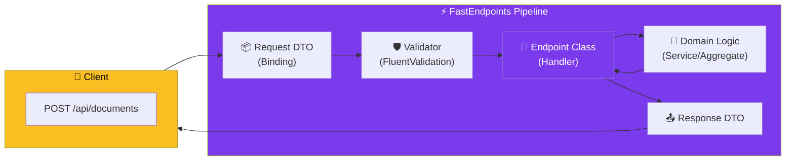

import Callout from '@components/Callout.astro';
import ImplementationNote from '@components/ImplementationNote.astro';
import ExternalCite from '@components/ExternalCite.astro';

## Introduction

BlueRobin's API started as a traditional ASP.NET Core controller-based project. Within three months, I had a `DocumentsController` with 14 action methods, 6 injected dependencies, and over 800 lines of code. Every new endpoint required scrolling past unrelated methods. Switching to FastEndpoints was like going from a cluttered open-plan office to private offices—each endpoint got its own space, its own dependencies, and its own tests.

For years, ASP.NET Core developers have been stuck in the "Controller" trap. You have a `DocumentsController` that grows to 2,000 lines of code, managing Dependencies for Reading, Writing, Deleting, and Searching documents. It's a violation of the Single Responsibility Principle <ExternalCite title="Clean Architecture" url="https://blog.cleancoder.com/uncle-bob/2012/08/13/the-clean-architecture.html" author="Robert C. Martin" date="2012" />.

**FastEndpoints** <ExternalCite title="FastEndpoints Documentation" url="https://fast-endpoints.com/" author="Dhananjay Kumar" date="2024" /> implements the **REPR Pattern** (Request-Endpoint-Response) <ExternalCite title="REPR Design Pattern" url="https://deviq.com/design-patterns/repr-design-pattern" author="Steve Smith" date="2024" />. Every endpoint is a distinct class. It's like having a Controller with exactly one method. This naturally guides you toward **Vertical Slice Architecture** <ExternalCite title="Vertical Slice Architecture" url="https://jimmybogard.com/vertical-slice-architecture/" author="Jimmy Bogard" date="2018" />.

**Why FastEndpoints Matters:**

-   **Performance**: It's faster than MVC Controllers and uses less memory <ExternalCite title="ASP.NET Core Performance Benchmarks" url="https://www.techempower.com/benchmarks/" author="TechEmpower" date="2024" />.
-   **Organization**: Related logic (Request, Response, Validation, Handler) stays together in one file or folder.
-   **No More Bloat**: You never need `private` helper methods shared by 10 unrelated actions.

### What We'll Build

In this guide, we will replace a traditional Controller action with a FastEndpoint. We will cover:
1.  **The Request DTO**: Binding data from JSON, Route, or Query.
2.  **The Validator**: FluentValidation integration without boilerplate.
3.  **The Endpoint**: Implementing the handler logic.
4.  **The Response**: Sending typed responses with 200/201/400 status codes.

## Architecture Overview


```mermaid
flowchart LR
    subgraph Client["📱 Client"]
        Req["POST /api/documents"]
    end

    subgraph Server["⚡ FastEndpoints Pipeline"]
        DTO["📦 Request DTO\n(Binding)"] --> Val["🛡️ Validator\n(FluentValidation)"]
        Val --> EP["💼 Endpoint Class\n(Handler)"]
        EP --> Dom["🧱 Domain Logic\n(Service/Aggregate)"]
        Dom --> EP
        EP --> Resp["📤 Response DTO"]
    end

    Client --> DTO
    Resp --> Client

    classDef primary fill:#7c3aed,color:#fff
    classDef secondary fill:#06b6d4,color:#fff
    classDef db fill:#f43f5e,color:#fff
    classDef warning fill:#fbbf24,color:#000

    class Client warning
    class Server primary
    class EP primary
```

## Implementation

### The Request & Validation

FastEndpoints has FluentValidation <ExternalCite title="FluentValidation Documentation" url="https://docs.fluentvalidation.net/" author="Jeremy Skinner" date="2024" /> built-in. You don't need to register validators manually; it scans and registers them automatically.

```csharp
// 1. The Request DTO
public sealed record CreateDocumentRequest
{
    public string Title { get; init; }
    public IFormFile File { get; init; }
    public string[] Tags { get; init; }
}

// 2. The Validator
public sealed class CreateDocumentValidator : Validator<CreateDocumentRequest>
{
    public CreateDocumentValidator()
    {
        RuleFor(x => x.Title)
            .NotEmpty()
            .MaximumLength(100)
            .WithMessage("Title prevents chaos.");

        RuleFor(x => x.File)
            .NotNull()
            .Must(f => f.Length > 0)
            .WithMessage("Cannot upload empty air.");
    }
}
```

<ImplementationNote>
    I initially put domain validation inside the FluentValidation validators, checking things like "does this archive exist?" in the validator itself. This was a mistake—validators should only handle input sanitization (format, length, required fields), not business rules. Business rule validation belongs in the domain layer. Once I separated these concerns, the validators became fast and stateless, while domain validation errors were returned as proper 422 responses from the handler.
</ImplementationNote>

### The Endpoint

The Endpoint class replaces the Controller Action. It inherits from `Endpoint<TRequest, TResponse>`.

```csharp
public sealed class CreateDocumentEndpoint : Endpoint<CreateDocumentRequest, CreateDocumentResponse>
{
    private readonly IDocumentService _service;
    private readonly IUserContext _user;

    public CreateDocumentEndpoint(IDocumentService service, IUserContext user)
    {
        _service = service;
        _user = user;
    }

    public override void Configure()
    {
        Post("/api/documents");
        AllowFileUploads(); // Helper for multipart/form-data
        Policies("StartProcessing"); // Auth Policy
        Summary(s => 
        {
            s.Summary = "Uploads a new document";
            s.Description = "Uploads a file and starts the OCR process.";
            s.Response<CreateDocumentResponse>(201, "Document created successfully");
        });
    }

    public override async Task HandleAsync(CreateDocumentRequest req, CancellationToken ct)
    {
        // 1. Call Domain Logic
        var result = await _service.UploadAsync(
            ownerId: _user.CustomId, 
            title: req.Title, 
            stream: req.File.OpenReadStream(),
            ct: ct
        );

        // 2. Map Response
        var response = new CreateDocumentResponse
        {
            DocumentId = result.Id.Value,
            Status = "Processing",
            EstimatedTime = "5 seconds"
        };

        // 3. Send 201 Created
        await SendCreatedAtAsync<GetDocumentEndpoint>(
            new { id = result.Id.Value }, 
            response, 
            cancellation: ct
        );
    }
}
```

<ImplementationNote>
    Notice `SendCreatedAtAsync`. It automatically generates the `Location` header pointing to the `GetDocumentEndpoint`. This enforces HATEOAS best practices with strong typing—if you rename the Get endpoint, this code won't compile unless you update it.
</ImplementationNote>

<ImplementationNote>
    One challenge I faced was endpoint discovery during testing. FastEndpoints auto-discovers endpoints by scanning assemblies, which is convenient in production but made integration tests unpredictable—sometimes test endpoints would leak into the production assembly scan. I solved this by configuring explicit assembly scanning in `Program.cs` and using a separate test project with its own endpoint configuration. This also made startup faster since FastEndpoints wasn't scanning unnecessary assemblies.
</ImplementationNote>

### Vertical Slice Organization

Files should be grouped by **Feature**, not by **Type**.

**✅ Do this:**
```text
/Features
  /Documents
    /Create
      CreateDocumentEndpoint.cs
      CreateDocumentRequest.cs
      CreateDocumentValidator.cs
      CreateDocumentResponse.cs
    /Get
      GetDocumentEndpoint.cs
```

**❌ NOT this:**
```text
/Controllers
  DocumentsController.cs
/Models
  CreateDocumentRequest.cs
/Validators
  CreateDocumentValidator.cs
```

<ImplementationNote>
    The vertical slice folder structure was initially controversial in code reviews because it felt "wrong" to have four files in a folder instead of grouping all validators together. But the moment I needed to delete an endpoint, I just deleted the folder—no hunting through separate Controllers, Models, and Validators directories. The cognitive load of understanding a feature dropped dramatically because everything you need is in one place.
</ImplementationNote>

## Conclusion

FastEndpoints removes the friction from API development. It gives you the raw speed of Minimal APIs with the structure and discipline required for large enterprise systems.

After migrating BlueRobin's API from controllers to FastEndpoints, the codebase went from 3 controller files averaging 600 lines each to 45 endpoint files averaging 40 lines each. The total line count barely changed, but the navigability and testability improved dramatically. Every endpoint is independently testable, independently deployable (conceptually), and independently understandable. If you are starting a new .NET API project, I strongly recommend starting with FastEndpoints from day one rather than retrofitting later.

**Next Steps:**
- Combine this with [Domain Events](/ddd-domain-events-csharp) to trigger processing after the API response.
- Learn how [Aggregates](/ddd-aggregates-consistency-boundaries) handle the actual logic inside `_service.UploadAsync`.
- See the [Shared Kernel](/ddd-shared-kernel-implementation-dotnet) that provides the base types used across all endpoints.

### Further Reading

- <ExternalCite title="FastEndpoints Documentation" url="https://fast-endpoints.com/" author="Dhananjay Kumar" date="2024" /> — The official documentation covering all features including versioning, rate limiting, and Swagger integration.
- <ExternalCite title="Vertical Slice Architecture" url="https://jimmybogard.com/vertical-slice-architecture/" author="Jimmy Bogard" date="2018" /> — Jimmy Bogard's influential post on organizing code by feature rather than technical layer.
- <ExternalCite title="REPR Design Pattern" url="https://deviq.com/design-patterns/repr-design-pattern" author="Steve Smith" date="2024" /> — The Request-Endpoint-Response pattern that FastEndpoints implements, explained by Steve Smith.
