import Callout from '@components/Callout.astro';
import ImplementationNote from '@components/ImplementationNote.astro';
import ExternalCite from '@components/ExternalCite.astro';

FastEndpoints provides a REPR (Request-Endpoint-Response) pattern for building APIs that's faster than MVC controllers and more structured than minimal APIs. This guide covers building production-ready APIs with FastEndpoints.

## Architecture

```mermaid
flowchart TB
    subgraph Flow["⚡ FastEndpoints Flow"]
        Req["📥 Request\nHTTP POST /api/documents"] --> MW["🔗 Middleware\nAuth, CORS, Compression"]
        MW --> Bind["🔄 Binding\nJSON → CreateDocumentRequest"]
        Bind --> Val["✅ Validation\nFluentValidation rules"]
        Val --> Pre["⚙️ Pre-Processor\nLogging, Transformation"]
        Pre --> Handle["💼 HandleAsync\nBusiness Logic"]
        Handle --> Post["📤 Post-Processor\nCaching, Audit"]
        Post --> Resp["📨 Response\nCreateDocumentResponse → JSON"]
    end

    style Flow fill:#512bd4,color:#fff
```



## Basic Endpoint Structure

### Create Document Endpoint

```csharp
// Api/Endpoints/Documents/CreateDocumentEndpoint.cs
public sealed class CreateDocumentEndpoint 
    : Endpoint<CreateDocumentRequest, CreateDocumentResponse>
{
    private readonly IDocumentService _documentService;
    private readonly IUserContext _userContext;
    
    public CreateDocumentEndpoint(
        IDocumentService documentService,
        IUserContext userContext)
    {
        _documentService = documentService;
        _userContext = userContext;
    }
    
    public override void Configure()
    {
        Post("/api/documents");
        Description(d => d
            .WithTags("Documents")
            .WithSummary("Create a new document")
            .WithDescription("Upload and create a new document for processing")
            .Produces<CreateDocumentResponse>(201)
            .ProducesProblem(400)
            .ProducesProblem(401));
        
        AllowFileUploads();
    }
    
    public override async Task HandleAsync(
        CreateDocumentRequest req, 
        CancellationToken ct)
    {
        var ownerId = _userContext.BlueRobinId;
        
        var document = await _documentService.CreateAsync(
            new CreateDocumentCommand
            {
                Title = req.Title,
                File = req.File,
                Tags = req.Tags,
                OwnerId = ownerId
            },
            ct);
        
        await SendCreatedAtAsync<GetDocumentEndpoint>(
            new { id = document.Id.Value },
            new CreateDocumentResponse
            {
                Id = document.Id.Value,
                Title = document.Title,
                Status = document.Status.ToString(),
                CreatedAt = document.CreatedAt
            },
            cancellation: ct);
    }
}
```

### Request and Response Models

```csharp
// Api/Endpoints/Documents/CreateDocumentRequest.cs
public sealed record CreateDocumentRequest
{
    public string Title { get; init; } = "";
    public IFormFile? File { get; init; }
    public IReadOnlyList<string> Tags { get; init; } = [];
}

// Api/Endpoints/Documents/CreateDocumentResponse.cs
public sealed record CreateDocumentResponse
{
    public required string Id { get; init; }
    public required string Title { get; init; }
    public required string Status { get; init; }
    public required DateTimeOffset CreatedAt { get; init; }
}
```

### Validator

```csharp
// Api/Endpoints/Documents/CreateDocumentValidator.cs
public sealed class CreateDocumentValidator 
    : Validator<CreateDocumentRequest>
{
    public CreateDocumentValidator()
    {
        RuleFor(x => x.Title)
            .NotEmpty()
            .WithMessage("Title is required")
            .MaximumLength(200)
            .WithMessage("Title cannot exceed 200 characters");
        
        RuleFor(x => x.File)
            .NotNull()
            .WithMessage("File is required")
            .Must(BeValidFileType)
            .WithMessage("Only PDF, DOCX, and TXT files are allowed")
            .Must(BeWithinSizeLimit)
            .WithMessage("File size cannot exceed 50MB");
        
        RuleForEach(x => x.Tags)
            .MaximumLength(50)
            .WithMessage("Each tag cannot exceed 50 characters");
    }
    
    private static bool BeValidFileType(IFormFile? file)
    {
        if (file == null) return false;
        
        var allowedTypes = new[] 
        { 
            "application/pdf", 
            "application/vnd.openxmlformats-officedocument.wordprocessingml.document",
            "text/plain"
        };
        
        return allowedTypes.Contains(file.ContentType);
    }
    
    private static bool BeWithinSizeLimit(IFormFile? file)
    {
        const long maxSize = 50 * 1024 * 1024; // 50MB
        return file?.Length <= maxSize;
    }
}
```

<ImplementationNote>
Validators are auto-discovered when placed in the same assembly. FastEndpoints runs validation before `HandleAsync`, returning a 400 response with errors if validation fails.
</ImplementationNote>

## Query Endpoints

### List Documents

```csharp
// Api/Endpoints/Documents/ListDocumentsEndpoint.cs
public sealed class ListDocumentsEndpoint 
    : Endpoint<ListDocumentsRequest, ListDocumentsResponse>
{
    private readonly IDocumentRepository _repository;
    private readonly IUserContext _userContext;
    
    public ListDocumentsEndpoint(
        IDocumentRepository repository,
        IUserContext userContext)
    {
        _repository = repository;
        _userContext = userContext;
    }
    
    public override void Configure()
    {
        Get("/api/documents");
        Description(d => d
            .WithTags("Documents")
            .WithSummary("List documents")
            .Produces<ListDocumentsResponse>(200));
    }
    
    public override async Task HandleAsync(
        ListDocumentsRequest req, 
        CancellationToken ct)
    {
        var ownerId = _userContext.BlueRobinId;
        
        var documents = await _repository.GetByOwnerAsync(
            ownerId,
            req.Status,
            req.Skip,
            req.Take,
            ct);
        
        var total = await _repository.CountByOwnerAsync(ownerId, req.Status, ct);
        
        await SendOkAsync(new ListDocumentsResponse
        {
            Items = documents.Select(MapToDto).ToList(),
            Total = total,
            Skip = req.Skip,
            Take = req.Take
        }, ct);
    }
    
    private static DocumentDto MapToDto(Document doc) => new()
    {
        Id = doc.Id.Value,
        Title = doc.Title,
        Status = doc.Status.ToString(),
        Tags = doc.Tags,
        CreatedAt = doc.CreatedAt,
        UpdatedAt = doc.UpdatedAt
    };
}

public sealed record ListDocumentsRequest
{
    [QueryParam]
    public DocumentStatus? Status { get; init; }
    
    [QueryParam]
    public int Skip { get; init; } = 0;
    
    [QueryParam]
    public int Take { get; init; } = 20;
}

public sealed record ListDocumentsResponse
{
    public required IReadOnlyList<DocumentDto> Items { get; init; }
    public required int Total { get; init; }
    public required int Skip { get; init; }
    public required int Take { get; init; }
}
```

### Get Document by ID

```csharp
// Api/Endpoints/Documents/GetDocumentEndpoint.cs
public sealed class GetDocumentEndpoint 
    : EndpointWithoutRequest<DocumentDetailResponse>
{
    private readonly IDocumentRepository _repository;
    private readonly IUserContext _userContext;
    
    public GetDocumentEndpoint(
        IDocumentRepository repository,
        IUserContext userContext)
    {
        _repository = repository;
        _userContext = userContext;
    }
    
    public override void Configure()
    {
        Get("/api/documents/{id}");
        Description(d => d
            .WithTags("Documents")
            .WithSummary("Get document by ID")
            .Produces<DocumentDetailResponse>(200)
            .ProducesProblem(404));
    }
    
    public override async Task HandleAsync(CancellationToken ct)
    {
        var id = Route<string>("id");
        if (!BlueRobinId.TryParse(id, out var documentId))
        {
            await SendNotFoundAsync(ct);
            return;
        }
        
        var document = await _repository.GetByIdAsync(documentId, ct);
        
        if (document == null || document.OwnerId != _userContext.BlueRobinId)
        {
            await SendNotFoundAsync(ct);
            return;
        }
        
        await SendOkAsync(new DocumentDetailResponse
        {
            Id = document.Id.Value,
            Title = document.Title,
            MimeType = document.MimeType,
            FileSize = document.FileSize,
            Status = document.Status.ToString(),
            Tags = document.Tags,
            ProcessingDetails = document.ProcessingDetails,
            CreatedAt = document.CreatedAt,
            UpdatedAt = document.UpdatedAt
        }, ct);
    }
}
```

## Pre/Post Processors

### Audit Logging Processor

```csharp
// Api/Processors/AuditLogProcessor.cs
public sealed class AuditLogProcessor<TRequest, TResponse> 
    : IPostProcessor<TRequest, TResponse>
    where TRequest : notnull
{
    private readonly IAuditLogService _auditLog;
    private readonly IUserContext _userContext;
    
    public AuditLogProcessor(
        IAuditLogService auditLog,
        IUserContext userContext)
    {
        _auditLog = auditLog;
        _userContext = userContext;
    }
    
    public async Task PostProcessAsync(
        IPostProcessorContext<TRequest, TResponse> context,
        CancellationToken ct)
    {
        // Only log successful write operations
        if (context.HttpContext.Response.StatusCode >= 400) return;
        
        var method = context.HttpContext.Request.Method;
        if (method is "GET" or "HEAD" or "OPTIONS") return;
        
        await _auditLog.LogAsync(new AuditEntry
        {
            UserId = _userContext.BlueRobinId.Value,
            Action = $"{method} {context.HttpContext.Request.Path}",
            ResourceType = typeof(TRequest).Name,
            Timestamp = DateTimeOffset.UtcNow,
            StatusCode = context.HttpContext.Response.StatusCode
        }, ct);
    }
}
```

### Rate Limiting Pre-Processor

```csharp
// Api/Processors/RateLimitProcessor.cs
public sealed class RateLimitProcessor<TRequest> : IPreProcessor<TRequest>
    where TRequest : notnull
{
    private readonly IRateLimiter _rateLimiter;
    private readonly IUserContext _userContext;
    
    public RateLimitProcessor(
        IRateLimiter rateLimiter,
        IUserContext userContext)
    {
        _rateLimiter = rateLimiter;
        _userContext = userContext;
    }
    
    public async Task PreProcessAsync(
        IPreProcessorContext<TRequest> context,
        CancellationToken ct)
    {
        var userId = _userContext.BlueRobinId.Value;
        var endpoint = context.HttpContext.Request.Path.Value ?? "";
        
        var result = await _rateLimiter.CheckAsync(userId, endpoint, ct);
        
        if (!result.IsAllowed)
        {
            context.HttpContext.Response.Headers.RetryAfter = 
                result.RetryAfter.TotalSeconds.ToString("F0");
            
            await context.HttpContext.Response.SendAsync(
                new { Error = "Rate limit exceeded" },
                429,
                cancellation: ct);
        }
    }
}
```

<Callout type="tip">
Apply processors globally in Program.cs or per-endpoint using `PreProcessor<>()` and `PostProcessor<>()` in Configure().
</Callout>

## OpenAPI Documentation

### Swagger Setup

```csharp
// Program.cs
builder.Services.SwaggerDocument(o =>
{
    o.DocumentSettings = s =>
    {
        s.Title = "BlueRobin Archives API";
        s.Version = "v1";
        s.Description = "API for document management and AI-powered search";
    };
    
    o.EnableJWTBearerAuth = true;
    o.ShortSchemaNames = true;
    o.RemoveEmptyRequestSchema = true;
});

// ...

app.UseSwaggerGen();
```

### Endpoint Documentation

```csharp
public override void Configure()
{
    Post("/api/documents/{id}/analyze");
    Description(d => d
        .WithTags("Documents", "AI")
        .WithSummary("Analyze document content")
        .WithDescription(@"
            Triggers AI analysis on the document, extracting:
            - Named entities (people, organizations, locations)
            - Key phrases and topics
            - Document summary
            
            Analysis runs asynchronously. Subscribe to NATS 
            events for completion notifications.")
        .Produces<AnalyzeResponse>(202)
        .ProducesProblem(404)
        .ProducesProblem(409, "Document already being analyzed"));
}
```

## Error Handling

### Global Exception Handler

```csharp
// Api/ErrorHandling/GlobalExceptionHandler.cs
public sealed class GlobalExceptionHandler : IExceptionHandler
{
    private readonly ILogger<GlobalExceptionHandler> _logger;
    
    public GlobalExceptionHandler(ILogger<GlobalExceptionHandler> logger)
    {
        _logger = logger;
    }
    
    public async ValueTask<bool> TryHandleAsync(
        HttpContext context,
        Exception exception,
        CancellationToken ct)
    {
        var (statusCode, message) = exception switch
        {
            ValidationException ve => 
                (400, ve.Errors.FirstOrDefault()?.ErrorMessage ?? "Validation failed"),
            
            NotFoundException => 
                (404, "Resource not found"),
            
            ConflictException ce => 
                (409, ce.Message),
            
            UnauthorizedException => 
                (401, "Unauthorized"),
            
            _ => (500, "An unexpected error occurred")
        };
        
        if (statusCode >= 500)
        {
            _logger.LogError(exception, "Unhandled exception");
        }
        
        context.Response.StatusCode = statusCode;
        await context.Response.WriteAsJsonAsync(new
        {
            Error = message,
            TraceId = Activity.Current?.Id ?? context.TraceIdentifier
        }, ct);
        
        return true;
    }
}
```

## Summary

FastEndpoints provides:

| Feature | Benefit |
|---------|---------|
| REPR Pattern | Clear separation of concerns |
| Auto-Discovery | Convention-based endpoint registration |
| FluentValidation | Declarative request validation |
| Processors | Reusable cross-cutting concerns |
| OpenAPI | Auto-generated API documentation |

Combined with dependency injection and proper error handling, FastEndpoints enables building high-performance, maintainable APIs.

<ExternalCite 
  title="FastEndpoints Documentation" 
  url="https://fast-endpoints.com/"
  author="Dĵ ΛL"
/>
