import Callout from '@components/Callout.astro';
import ImplementationNote from '@components/ImplementationNote.astro';
import ExternalCite from '@components/ExternalCite.astro';

## Introduction

For years, ASP.NET Core developers have been stuck in the "Controller" trap. You have a `DocumentsController` that grows to 2,000 lines of code, managing Dependencies for Reading, Writing, Deleting, and Searching documents. It's a violation of the Single Responsibility Principle.

**FastEndpoints** implements the **REPR Pattern** (Request-Endpoint-Response). Every endpoint is a distinct class. It’s like having a Controller with exactly one method. This naturally guides you toward **Vertical Slice Architecture**.

**Why FastEndpoints Matters:**

-   **Performance**: It's faster than MVC Controllers and uses less memory.
-   **Organization**: Related logic (Request, Response, Validation, Handler) stays together in one file or folder.
-   **No More Bloat**: You never need `private` helper methods shared by 10 unrelated actions.

### What We'll Build

In this guide, we will replace a traditional Controller action with a FastEndpoint. We will cover:
1.  **The Request DTO**: Binding data from JSON, Route, or Query.
2.  **The Validator**: FluentValidation integration without boilerplate.
3.  **The Endpoint**: Implementing the handler logic.
4.  **The Response**: Sending typed responses with 200/201/400 status codes.

## Architecture Overview

```mermaid
flowchart LR
    subgraph Client["📱 Client"]
        Req["POST /api/documents"]
    end

    subgraph Server["⚡ FastEndpoints Pipeline"]
        DTO["📦 Request DTO\n(Binding)"] --> Val["🛡️ Validator\n(FluentValidation)"]
        Val --> EP["💼 Endpoint Class\n(Handler)"]
        EP --> Dom["🧱 Domain Logic\n(Service/Aggregate)"]
        Dom --> EP
        EP --> Resp["📤 Response DTO"]
    end

    Client --> DTO
    Resp --> Client

    classDef primary fill:#7c3aed,color:#fff
    classDef secondary fill:#06b6d4,color:#fff
    classDef db fill:#f43f5e,color:#fff
    classDef warning fill:#fbbf24,color:#000

    class Client warning
    class Server primary
    class EP primary
```



## Implementation

### The Request & Validation

FastEndpoints has FluentValidation built-in. You don't need to register validators manually; it scans and registers them automatically.

```csharp
// 1. The Request DTO
public sealed record CreateDocumentRequest
{
    public string Title { get; init; }
    public IFormFile File { get; init; }
    public string[] Tags { get; init; }
}

// 2. The Validator
public sealed class CreateDocumentValidator : Validator<CreateDocumentRequest>
{
    public CreateDocumentValidator()
    {
        RuleFor(x => x.Title)
            .NotEmpty()
            .MaximumLength(100)
            .WithMessage("Title prevents chaos.");

        RuleFor(x => x.File)
            .NotNull()
            .Must(f => f.Length > 0)
            .WithMessage("Cannot upload empty air.");
    }
}
```

### The Endpoint

The Endpoint class replaces the Controller Action. It inherits from `Endpoint<TRequest, TResponse>`.

```csharp
public sealed class CreateDocumentEndpoint : Endpoint<CreateDocumentRequest, CreateDocumentResponse>
{
    private readonly IDocumentService _service;
    private readonly IUserContext _user;

    public CreateDocumentEndpoint(IDocumentService service, IUserContext user)
    {
        _service = service;
        _user = user;
    }

    public override void Configure()
    {
        Post("/api/documents");
        AllowFileUploads(); // Helper for multipart/form-data
        Policies("StartProcessing"); // Auth Policy
        Summary(s => 
        {
            s.Summary = "Uploads a new document";
            s.Description = "Uploads a file and starts the OCR process.";
            s.Response<CreateDocumentResponse>(201, "Document created successfully");
        });
    }

    public override async Task HandleAsync(CreateDocumentRequest req, CancellationToken ct)
    {
        // 1. Call Domain Logic
        var result = await _service.UploadAsync(
            ownerId: _user.BlueRobinId, 
            title: req.Title, 
            stream: req.File.OpenReadStream(),
            ct: ct
        );

        // 2. Map Response
        var response = new CreateDocumentResponse
        {
            DocumentId = result.Id.Value,
            Status = "Processing",
            EstimatedTime = "5 seconds"
        };

        // 3. Send 201 Created
        await SendCreatedAtAsync<GetDocumentEndpoint>(
            new { id = result.Id.Value }, 
            response, 
            cancellation: ct
        );
    }
}
```

<ImplementationNote>
    Notice `SendCreatedAtAsync`. It automatically generates the `Location` header pointing to the `GetDocumentEndpoint`. This enforces HATEOAS best practices with strong typing—if you rename the Get endpoint, this code won't compile unless you update it.
</ImplementationNote>

### Vertical Slice Organization

Files should be grouped by **Feature**, not by **Type**.

**✅ Do this:**
```text
/Features
  /Documents
    /Create
      CreateDocumentEndpoint.cs
      CreateDocumentRequest.cs
      CreateDocumentValidator.cs
      CreateDocumentResponse.cs
    /Get
      GetDocumentEndpoint.cs
```

**❌ NOT this:**
```text
/Controllers
  DocumentsController.cs
/Models
  CreateDocumentRequest.cs
/Validators
  CreateDocumentValidator.cs
```

## Conclusion

FastEndpoints removes the friction from API development. It gives you the raw speed of Minimal APIs with the structure and discipline required for large enterprise systems.

**Next Steps:**
- Combine this with [Domain Events](/blog/ddd-domain-events-csharp) to trigger processing after the API response.
- Learn how [Aggregates](/blog/ddd-aggregates-consistency-boundaries) handle the actual logic inside `_service.UploadAsync`.
