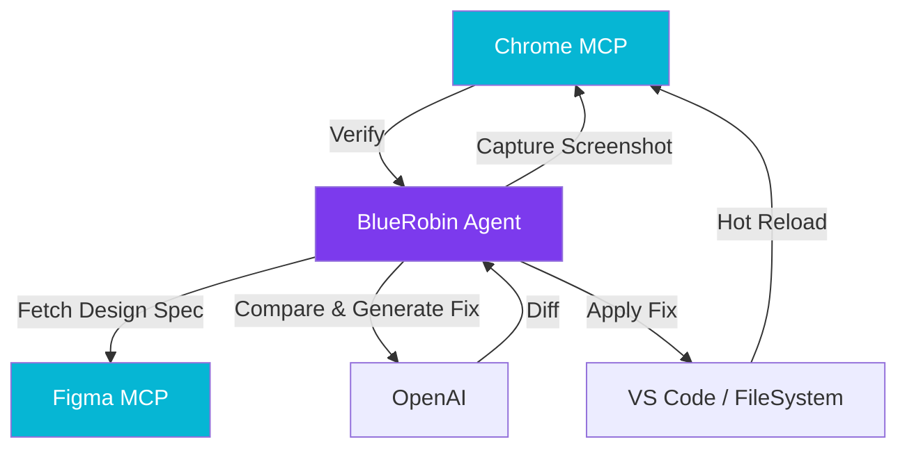

import Callout from '@components/Callout.astro';
import ImplementationNote from '@components/ImplementationNote.astro';
import CodeFile from '@components/CodeFile.astro';
import ExternalCite from '@components/ExternalCite.astro';

## Introduction

The "handover gap" between Design and Engineering is where pixels go to die. Traditionally, this is solved by manual QA or visual regression testing. At BlueRobin, we're experimenting with a "Self-Optimizing Design Loop" using the Model Context Protocol (MCP).

**Why This Matters:**

- **Zero Variance**: Ensures the implemented code matches the design intent pixel-perfectly.
- **Automated Refinement**: Frees developers from tweaking CSS margins manually.
- **Living System**: The code actively updates itself to match the Figma "source of truth".

### What We'll Build

We will explore a workflow that links Figma, a local browser, and our codebase:

1.  **Code -> Screenshot**: Agent captures the current state of a component.
2.  **Figma -> Design**: Agent retrieves the reference image from Figma.
3.  **Visual Diff & Patch**: Agent computes the difference and applies CSS fixes.

## Architecture Overview

The loop relies on MCP servers for both Figma and the Chrome browser.



## Section 1: The Figma MCP Connector

First, we need the agent to "see" what the designer intended. We expose the Figma API as an MCP tool.

```typescript
// MCP Tool Definition
{
  name: "get_figma_node_image",
  description: "Render a specific node from a Figma file as an image",
  inputSchema: {
    type: "object",
    properties: {
      fileKey: { type: "string" },
      nodeId: { type: "string" }
    }
  }
}
```

## Section 2: Automated Visual Regression

The agent doesn't just look for "diffs"; it iterates.

<Callout type="warning" title="Iteration Limits">
    We limit the agent to 3 retry loops to prevent it from cycling endlessly on sub-pixel rendering differences between Figma and Chrome.
</Callout>

The prompt strategy is key:
> "Compare Image A (Figma) and Image B (Browser). List the visual discrepancies (e.g., padding is too large, shadow is missing). specific which CSS classes in Tailwind v4 would resolve this."

## Section 3: The Update Loop

Once the discrepancies are identified, the agent uses `edits` to apply changes.

```typescript
// Agent Logic
async function visualLoop(componentPath, figmaNodeId) {
    let attempts = 0;
    while(attempts < 3) {
        const currentShot = await browser.screenshot();
        const designShot = await figma.getImage(figmaNodeId);
        
        const diff = await ai.compare(currentShot, designShot);
        if (diff.score > 0.98) break; // Good enough
        
        await ai.applyFixes(componentPath, diff.suggestions);
        await browser.waitForReload();
        attempts++;
    }
}
```

## Conclusion

This self-optimizing loop turns the "Design System" from a static documentation site into an active, enforcing agent. It ensures that if the Design changes, the Code follows—not eventually, but immediately.

**Next Steps**:
- Read about our **Backdrop Blur** implementation in the previous article.
- Learn about the **MCP** standard to build your own connectors.
