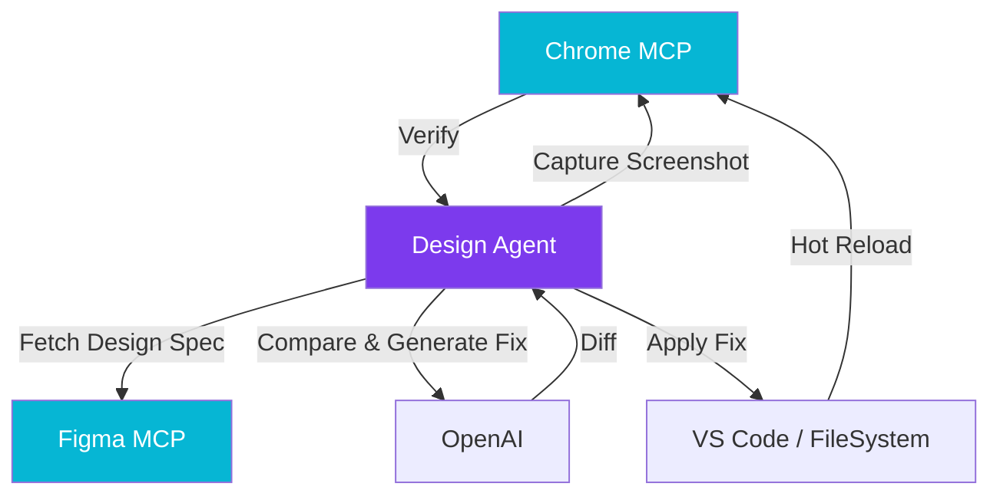

import Callout from '@components/Callout.astro';
import ImplementationNote from '@components/ImplementationNote.astro';
import CodeFile from '@components/CodeFile.astro';
import ExternalCite from '@components/ExternalCite.astro';

When I first configured the self-optimizing design loop, I was skeptical it would work beyond a toy demo. The idea of an agent autonomously comparing a Figma render to a browser screenshot, identifying CSS discrepancies, and patching the code sounded great in theory but felt fragile. My first attempt failed spectacularly -- the agent entered an infinite loop, oscillating between adding and removing the same `padding-2` class because sub-pixel rendering differences between Figma and Chrome gave inconsistent diff scores. It took careful iteration-limit tuning and a rethinking of what "good enough" means for visual diffs before the loop became genuinely useful. This article documents the architecture and the hard-won lessons from building it.

## Introduction

The "handover gap" between Design and Engineering is where pixels go to die. Traditionally, this is solved by manual QA or visual regression testing. In our project, we're experimenting with a "Self-Optimizing Design Loop" using the Model Context Protocol (MCP).

**Why This Matters:**

- **Zero Variance**: Ensures the implemented code matches the design intent pixel-perfectly.
- **Automated Refinement**: Frees developers from tweaking CSS margins manually.
- **Living System**: The code actively updates itself to match the Figma "source of truth".

<ExternalCite title="Model Context Protocol Specification" url="https://modelcontextprotocol.io/specification" author="Anthropic" date="2024-11-25" />

### What We'll Build

We will explore a workflow that links Figma, a local browser, and our codebase:

1.  **Code -> Screenshot**: Agent captures the current state of a component.
2.  **Figma -> Design**: Agent retrieves the reference image from Figma.
3.  **Visual Diff & Patch**: Agent computes the difference and applies CSS fixes.

## Architecture Overview

The loop relies on MCP servers for both Figma and the Chrome browser.

<ExternalCite title="Figma REST API - Export Images" url="https://www.figma.com/developers/api#get-images-endpoint" author="Figma" date="2024-08-15" />


```mermaid
flowchart TD
    Figma[Figma MCP]
    Browser[Chrome MCP]
    Agent[Design Agent]
    FileSystem[VS Code / FileSystem]

    Agent -->|Fetch Design Spec| Figma
    Agent -->|Capture Screenshot| Browser
    Agent -->|Compare & Generate Fix| OpenAI
    OpenAI -- Diff --> Agent
    Agent -->|Apply Fix| FileSystem
    FileSystem -->|Hot Reload| Browser
    Browser -->|Verify| Agent

    classDef primary fill:#7c3aed,color:#fff
    classDef secondary fill:#06b6d4,color:#fff
    classDef db fill:#f43f5e,color:#fff
    classDef warning fill:#fbbf24,color:#000

    class Agent primary
    class Figma,Browser secondary
```

## Section 1: The Figma MCP Connector

First, we need the agent to "see" what the designer intended. We expose the Figma API as an MCP tool.

<ExternalCite title="Building MCP Servers" url="https://modelcontextprotocol.io/docs/concepts/servers" author="Anthropic" date="2024-11-25" />

```typescript
// MCP Tool Definition
{
  name: "get_figma_node_image",
  description: "Render a specific node from a Figma file as an image",
  inputSchema: {
    type: "object",
    properties: {
      fileKey: { type: "string" },
      nodeId: { type: "string" }
    }
  }
}
```

<ImplementationNote title="Figma Image Export Latency">
I discovered that calling the Figma image export endpoint for individual nodes is surprisingly slow -- often 3-5 seconds per node. When the agent needs to compare multiple components in a single loop iteration, this adds up quickly. My solution was to batch export requests by collecting all node IDs first, then making a single export call with multiple IDs. The Figma API supports this via comma-separated node IDs in the export endpoint, cutting the total wait time by 60-70%.
</ImplementationNote>

## Section 2: Automated Visual Regression

The agent doesn't just look for "diffs"; it iterates.

<Callout type="warning" title="Iteration Limits">
    We limit the agent to 3 retry loops to prevent it from cycling endlessly on sub-pixel rendering differences between Figma and Chrome.
</Callout>

The prompt strategy is key:
> "Compare Image A (Figma) and Image B (Browser). List the visual discrepancies (e.g., padding is too large, shadow is missing). specific which CSS classes in Tailwind v4 would resolve this."

<ExternalCite title="Visual Regression Testing with AI" url="https://web.dev/articles/vitals-tools" author="Google Chrome Team" date="2024-05-15" />

<ImplementationNote title="Defining 'Good Enough' for Visual Diffs">
The hardest part of this loop was defining the similarity threshold. My first attempt used a strict pixel-level SSIM comparison, but Figma renders with anti-aliasing that Chrome does not match exactly. A 0.99 threshold caused infinite loops; a 0.90 threshold accepted obviously wrong layouts. After experimentation, I settled on 0.95 as the default and added the ability to override per-component for cases where font rendering differences are unavoidable. The lesson: visual "equality" between two renderers is an approximation, not a binary.
</ImplementationNote>

## Section 3: The Update Loop

Once the discrepancies are identified, the agent uses `edits` to apply changes.

<ExternalCite title="Tailwind CSS v4 Documentation" url="https://tailwindcss.com/docs" author="Tailwind Labs" date="2024-11-20" />

```typescript
// Agent Logic
async function visualLoop(componentPath, figmaNodeId) {
    let attempts = 0;
    while(attempts < 3) {
        const currentShot = await browser.screenshot();
        const designShot = await figma.getImage(figmaNodeId);
        
        const diff = await ai.compare(currentShot, designShot);
        if (diff.score > 0.98) break; // Good enough
        
        await ai.applyFixes(componentPath, diff.suggestions);
        await browser.waitForReload();
        attempts++;
    }
}
```

<ImplementationNote title="Hot Reload Timing Issues">
A subtle bug in the loop was that the agent would capture a screenshot immediately after writing the file, before the browser had finished hot-reloading. The result was a diff against stale content, which the agent would then "fix" -- essentially reverting the previous change. I added a 2-second `waitForReload` delay plus a hash check on the served content to ensure the browser was actually displaying the updated code before capturing the screenshot. Without this, the loop would oscillate between two states indefinitely.
</ImplementationNote>

## Conclusion

This self-optimizing loop turns the "Design System" from a static documentation site into an active, enforcing agent. It ensures that if the Design changes, the Code follows -- not eventually, but immediately.

The experience of building this system changed how I think about the design-to-code relationship. Traditionally, design fidelity erodes gradually -- small deviations accumulate until the implementation barely resembles the original spec. With the loop in place, drift is caught and corrected within seconds. That said, this approach works best for component-level refinements (padding, color, spacing). For structural layout changes, I still find that a human review step is necessary before the agent applies fixes. The loop is a powerful tool, but it is not a replacement for design judgment.

## Next Steps

- **Extend the loop to handle responsive breakpoints** by capturing screenshots at multiple viewport widths and comparing each against the corresponding Figma frame
- **Add a "dry run" mode** that generates a diff report without applying changes, allowing developers to review proposed fixes before they land
- **Integrate with pull request workflows** so that design drift detected in CI triggers an automated PR with the visual diff and proposed fixes
- **Support dark mode variants** by running the loop against both light and dark Figma frames and their corresponding browser states

## Further Reading

- [Model Context Protocol Documentation](https://modelcontextprotocol.io/) -- The official MCP specification and guides for building servers and clients
- [Figma REST API Reference](https://www.figma.com/developers/api) -- Complete API reference including the image export endpoints used by the loop
- [Chrome DevTools Protocol](https://chromedevtools.github.io/devtools-protocol/) -- The protocol underlying the Chrome MCP server for screenshot capture
- [Visual Regression Testing Strategies](https://web.dev/articles/vitals-tools) -- Google's guidance on measuring visual fidelity and web vitals
- [Tailwind CSS v4 Documentation](https://tailwindcss.com/docs) -- The utility-first CSS framework that the agent uses to generate fix patches
