import Callout from '@components/Callout.astro';
import ImplementationNote from '@components/ImplementationNote.astro';
import ExternalCite from '@components/ExternalCite.astro';

GitHub Actions provides powerful CI/CD capabilities integrated directly with your repository. This guide covers building comprehensive pipelines for .NET applications with Docker and Kubernetes deployment.

## Pipeline Architecture

```mermaid
flowchart TB
    subgraph Pipeline["⚡ CI/CD Pipeline Flow"]
        Trigger["🚀 Push/PR Trigger"]
        
        subgraph CI["🔄 CI Pipeline"]
            Build["🔨 Build"] --> Test["🧪 Test"] --> Lint["✨ Lint"] --> Scan["🔍 Scan"] --> Quality["📊 Code Quality"]
        end
        
        Trigger --> CI
        
        CI -->|"main branch only"| CD
        
        subgraph CD["🚢 CD Pipeline"]
            Docker["🐳 Docker Build"] --> Push["📤 Push Registry"] --> Manifest["📝 Update Manifest"] --> Deploy["☸️ Deploy (Flux)"]
        end
    end

    style Pipeline fill:#24292e,color:#fff
    style CI fill:#2088ff,color:#fff
    style CD fill:#28a745,color:#fff
```



## CI Workflow

### Build and Test

```yaml
# .github/workflows/ci.yml
name: CI

on:
  push:
    branches: [main, develop]
    paths:
      - 'src/**'
      - 'tests/**'
      - '*.sln'
      - 'Directory.Build.props'
  pull_request:
    branches: [main]

env:
  DOTNET_VERSION: '10.0.x'
  DOTNET_SKIP_FIRST_TIME_EXPERIENCE: true
  DOTNET_CLI_TELEMETRY_OPTOUT: true

jobs:
  build:
    name: Build & Test
    runs-on: ubuntu-latest
    
    services:
      postgres:
        image: postgres:16
        env:
          POSTGRES_DB: test_db
          POSTGRES_USER: test_user
          POSTGRES_PASSWORD: test_password
        ports:
          - 5432:5432
        options: >-
          --health-cmd pg_isready
          --health-interval 10s
          --health-timeout 5s
          --health-retries 5
    
    steps:
      - name: Checkout
        uses: actions/checkout@v4
      
      - name: Setup .NET
        uses: actions/setup-dotnet@v4
        with:
          dotnet-version: ${{ env.DOTNET_VERSION }}
      
      - name: Restore dependencies
        run: dotnet restore
      
      - name: Build
        run: dotnet build --no-restore --configuration Release
      
      - name: Test
        run: |
          dotnet test \
            --no-build \
            --configuration Release \
            --logger "trx;LogFileName=test-results.trx" \
            --collect:"XPlat Code Coverage" \
            --results-directory ./coverage
        env:
          ConnectionStrings__BlueRobinDb: "Host=localhost;Port=5432;Database=test_db;Username=test_user;Password=test_password"
      
      - name: Upload test results
        uses: actions/upload-artifact@v4
        if: always()
        with:
          name: test-results
          path: ./coverage/**/*.trx
      
      - name: Upload coverage
        uses: codecov/codecov-action@v4
        with:
          directory: ./coverage
          fail_ci_if_error: false

  lint:
    name: Code Quality
    runs-on: ubuntu-latest
    
    steps:
      - name: Checkout
        uses: actions/checkout@v4
      
      - name: Setup .NET
        uses: actions/setup-dotnet@v4
        with:
          dotnet-version: ${{ env.DOTNET_VERSION }}
      
      - name: Restore
        run: dotnet restore
      
      - name: Format check
        run: dotnet format --verify-no-changes --verbosity diagnostic
      
      - name: Analyze
        run: dotnet build /p:TreatWarningsAsErrors=true

  security:
    name: Security Scan
    runs-on: ubuntu-latest
    
    steps:
      - name: Checkout
        uses: actions/checkout@v4
      
      - name: Setup .NET
        uses: actions/setup-dotnet@v4
        with:
          dotnet-version: ${{ env.DOTNET_VERSION }}
      
      - name: Restore
        run: dotnet restore
      
      - name: Security scan
        run: |
          dotnet list package --vulnerable --include-transitive 2>&1 | tee vulnerabilities.txt
          if grep -q "has the following vulnerable packages" vulnerabilities.txt; then
            echo "::warning::Vulnerable packages detected"
          fi
      
      - name: Secret scan
        uses: trufflesecurity/trufflehog@main
        with:
          path: ./
          base: ${{ github.event.repository.default_branch }}
          head: HEAD
```

<ImplementationNote>
The CI workflow runs in parallel jobs (build, lint, security) to minimize total pipeline time. Only the build job requires the PostgreSQL service container.
</ImplementationNote>

## CD Workflow

### Docker Build and Deploy

```yaml
# .github/workflows/cd.yml
name: CD

on:
  push:
    branches: [main]
    paths:
      - 'src/**'
      - 'Dockerfile'
  workflow_dispatch:
    inputs:
      environment:
        description: 'Deployment environment'
        required: true
        default: 'staging'
        type: choice
        options:
          - staging
          - prod

env:
  REGISTRY: registry.bluerobin.local
  IMAGE_NAME: archives-api

jobs:
  build-and-push:
    name: Build & Push Docker Image
    runs-on: [self-hosted, linux, arm64]
    outputs:
      image_tag: ${{ steps.meta.outputs.tags }}
      version: ${{ steps.version.outputs.version }}
    
    steps:
      - name: Checkout
        uses: actions/checkout@v4
        with:
          fetch-depth: 0
      
      - name: Generate version
        id: version
        run: |
          VERSION=$(date +%Y%m%d)-$(git rev-parse --short HEAD)
          echo "version=$VERSION" >> $GITHUB_OUTPUT
      
      - name: Set up Docker Buildx
        uses: docker/setup-buildx-action@v3
      
      - name: Login to Registry
        uses: docker/login-action@v3
        with:
          registry: ${{ env.REGISTRY }}
          username: ${{ secrets.REGISTRY_USERNAME }}
          password: ${{ secrets.REGISTRY_PASSWORD }}
      
      - name: Extract metadata
        id: meta
        uses: docker/metadata-action@v5
        with:
          images: ${{ env.REGISTRY }}/${{ env.IMAGE_NAME }}
          tags: |
            type=raw,value=${{ steps.version.outputs.version }}
            type=raw,value=latest,enable={{is_default_branch}}
      
      - name: Build and push
        uses: docker/build-push-action@v5
        with:
          context: .
          push: true
          tags: ${{ steps.meta.outputs.tags }}
          labels: ${{ steps.meta.outputs.labels }}
          cache-from: type=registry,ref=${{ env.REGISTRY }}/${{ env.IMAGE_NAME }}:buildcache
          cache-to: type=registry,ref=${{ env.REGISTRY }}/${{ env.IMAGE_NAME }}:buildcache,mode=max
          build-args: |
            VERSION=${{ steps.version.outputs.version }}
  
  update-manifests:
    name: Update Kubernetes Manifests
    needs: build-and-push
    runs-on: ubuntu-latest
    
    steps:
      - name: Checkout infra repo
        uses: actions/checkout@v4
        with:
          repository: viktorrobin/bluerobin-infra
          token: ${{ secrets.INFRA_REPO_TOKEN }}
          path: infra
      
      - name: Update image tag
        run: |
          cd infra
          ENVIRONMENT=${{ inputs.environment || 'staging' }}
          yq eval -i ".spec.template.spec.containers[0].image = \"${{ env.REGISTRY }}/${{ env.IMAGE_NAME }}:${{ needs.build-and-push.outputs.version }}\"" \
            apps/archives-api/overlays/${ENVIRONMENT}/deployment-patch.yaml
      
      - name: Commit and push
        run: |
          cd infra
          git config user.name "GitHub Actions"
          git config user.email "actions@github.com"
          git add .
          git commit -m "chore: update ${{ env.IMAGE_NAME }} to ${{ needs.build-and-push.outputs.version }}" || exit 0
          git push

  notify:
    name: Notify
    needs: [build-and-push, update-manifests]
    runs-on: ubuntu-latest
    if: always()
    
    steps:
      - name: Notify on success
        if: ${{ needs.update-manifests.result == 'success' }}
        run: |
          echo "::notice::Deployment triggered for version ${{ needs.build-and-push.outputs.version }}"
      
      - name: Notify on failure
        if: ${{ needs.update-manifests.result == 'failure' }}
        run: |
          echo "::error::Deployment failed"
```

<Callout type="warning">
Docker builds run on self-hosted runners (`arm64`) to match the production architecture. Never build on GitHub-hosted runners if deploying to ARM clusters.
</Callout>

## Dockerfile

### Multi-Stage Build

```dockerfile
# Dockerfile
FROM mcr.microsoft.com/dotnet/sdk:10.0 AS build
ARG VERSION=0.0.0

WORKDIR /src

# Copy csproj files and restore
COPY *.sln Directory.Build.props ./
COPY src/Archives.Api/*.csproj src/Archives.Api/
COPY src/Archives.Application/*.csproj src/Archives.Application/
COPY src/Archives.Core/*.csproj src/Archives.Core/
COPY src/Archives.Infrastructure/*.csproj src/Archives.Infrastructure/

RUN dotnet restore

# Copy source and build
COPY src/ src/
RUN dotnet publish src/Archives.Api/Archives.Api.csproj \
    -c Release \
    -o /app/publish \
    /p:Version=${VERSION} \
    /p:UseAppHost=false

# Runtime image
FROM mcr.microsoft.com/dotnet/aspnet:10.0 AS runtime
WORKDIR /app

# Create non-root user
RUN groupadd -r appgroup && useradd -r -g appgroup appuser
USER appuser

COPY --from=build /app/publish .

ENV ASPNETCORE_URLS=http://+:8080
EXPOSE 8080

ENTRYPOINT ["dotnet", "Archives.Api.dll"]
```

## Reusable Workflows

### Shared Test Workflow

```yaml
# .github/workflows/test-reusable.yml
name: Reusable Test Workflow

on:
  workflow_call:
    inputs:
      dotnet-version:
        required: false
        type: string
        default: '10.0.x'
      configuration:
        required: false
        type: string
        default: 'Release'

jobs:
  test:
    runs-on: ubuntu-latest
    
    services:
      postgres:
        image: postgres:16
        env:
          POSTGRES_DB: test_db
          POSTGRES_USER: test_user
          POSTGRES_PASSWORD: test_password
        ports:
          - 5432:5432
        options: >-
          --health-cmd pg_isready
          --health-interval 10s
          --health-timeout 5s
          --health-retries 5
    
    steps:
      - uses: actions/checkout@v4
      
      - uses: actions/setup-dotnet@v4
        with:
          dotnet-version: ${{ inputs.dotnet-version }}
      
      - run: dotnet restore
      
      - run: dotnet test --configuration ${{ inputs.configuration }}
        env:
          ConnectionStrings__BlueRobinDb: "Host=localhost;Port=5432;Database=test_db;Username=test_user;Password=test_password"
```

### Calling Reusable Workflow

```yaml
# .github/workflows/pr.yml
name: PR Checks

on:
  pull_request:
    branches: [main]

jobs:
  test:
    uses: ./.github/workflows/test-reusable.yml
    with:
      configuration: Debug
```

## Summary

GitHub Actions CI/CD provides:

| Feature | Implementation |
|---------|----------------|
| Parallel Jobs | Build, lint, security run concurrently |
| Service Containers | PostgreSQL for integration tests |
| Docker Build Cache | Registry-based layer caching |
| GitOps Deploy | Update manifests, Flux reconciles |
| Self-Hosted Runners | ARM64 architecture support |

Combined with Flux CD, this enables automated deployments triggered by Git commits.

<ExternalCite 
  title="GitHub Actions Documentation" 
  url="https://docs.github.com/en/actions"
  author="GitHub"
/>
