import Callout from '@components/Callout.astro';
import ImplementationNote from '@components/ImplementationNote.astro';
import CodeFile from '@components/CodeFile.astro';
import ExternalCite from '@components/ExternalCite.astro';

GitOps is a deployment paradigm where Git is the single source of truth for your infrastructure and applications. **Flux CD** is a CNCF graduated project that makes GitOps work seamlessly with Kubernetes.

In this guide, we'll set up Flux from scratch and build a complete GitOps workflow for a multi-environment deployment.

## Why GitOps?

| Traditional CI/CD | GitOps |
|-------------------|--------|
| Push-based deployments | Pull-based reconciliation |
| CI system has cluster access | Git has cluster access |
| Manual rollback | Git revert = rollback |
| Drift goes undetected | Continuous reconciliation |
| Complex deployment scripts | Declarative manifests |

**Key Benefits**:
- **Audit trail**: Every change is a Git commit
- **Drift correction**: Cluster automatically syncs to Git state
- **Developer experience**: Deploy by merging PRs
- **Disaster recovery**: Rebuild cluster from Git

<ExternalCite 
  title="Flux - the GitOps family of projects" 
  url="https://fluxcd.io/"
  author="CNCF"
/>

## Prerequisites

- K3s or Kubernetes cluster (see our K3s setup guide)
- GitHub repository for infrastructure manifests
- GitHub Personal Access Token with `repo` scope
- kubectl configured to access your cluster

## Installing Flux

### Bootstrap Flux

Flux uses a bootstrap process that installs itself and connects to your Git repository:

```bash
# Install Flux CLI
brew install fluxcd/tap/flux

# Verify cluster compatibility
flux check --pre

# Bootstrap Flux with GitHub
flux bootstrap github \
  --owner=YOUR_GITHUB_USERNAME \
  --repository=bluerobin-infra \
  --branch=main \
  --path=clusters/bluerobin \
  --personal
```

This command:
1. Creates the repository if it doesn't exist
2. Installs Flux controllers in `flux-system` namespace
3. Configures Flux to watch the specified path
4. Commits Flux manifests to your repository

<Callout type="warning">
Store your GitHub token securely. The bootstrap creates a deploy key for ongoing access—you only need the token once.
</Callout>

### Verify Installation

```bash
# Check Flux components
flux check

# View reconciliation status
flux get all -A

# Watch for events
kubectl -n flux-system get events --watch
```

## Repository Structure

Organize your GitOps repository for clarity and maintainability:

```
bluerobin-infra/
├── clusters/
│   └── bluerobin/              # Cluster entry point
│       ├── flux-system/        # Flux configuration (auto-generated)
│       └── kustomization.yaml  # Points to other directories
├── apps/
│   ├── kustomization.yaml      # All applications
│   ├── archives-api/
│   │   ├── kustomization.yaml
│   │   ├── deployment.yaml
│   │   ├── service.yaml
│   │   └── ingress.yaml
│   └── archives-web/
│       └── ...
├── infrastructure/
│   ├── kustomization.yaml      # All infrastructure
│   └── data-layer/
│       ├── postgres/
│       ├── nats/
│       └── qdrant/
└── platform/
    ├── kustomization.yaml      # Platform services
    ├── monitoring/
    └── ai/
```

### Root Kustomization

The cluster entry point references all top-level directories:

```yaml
# clusters/bluerobin/kustomization.yaml
apiVersion: kustomize.config.k8s.io/v1beta1
kind: Kustomization
resources:
  - ../../infrastructure
  - ../../platform
  - ../../apps
```

<ImplementationNote>
Flux processes resources in order. Place infrastructure before apps to ensure databases exist before applications try to connect.
</ImplementationNote>

## Flux Custom Resources

### Kustomization

Flux's `Kustomization` CRD tells Flux where to find manifests:

```yaml
# clusters/bluerobin/apps.yaml
apiVersion: kustomize.toolkit.fluxcd.io/v1
kind: Kustomization
metadata:
  name: apps
  namespace: flux-system
spec:
  interval: 10m
  sourceRef:
    kind: GitRepository
    name: flux-system
  path: ./apps
  prune: true
  wait: true
  timeout: 5m
  healthChecks:
    - apiVersion: apps/v1
      kind: Deployment
      name: archives-api
      namespace: archives-staging
```

Key fields:
- **interval**: How often to check for changes
- **prune**: Delete resources removed from Git
- **wait**: Wait for resources to be ready before marking successful
- **healthChecks**: Custom readiness conditions

### GitRepository

Define additional Git sources beyond the bootstrap repository:

```yaml
# clusters/bluerobin/sources/app-source.yaml
apiVersion: source.toolkit.fluxcd.io/v1
kind: GitRepository
metadata:
  name: bluerobin-app
  namespace: flux-system
spec:
  interval: 1m
  url: https://github.com/yourusername/bluerobin-app
  ref:
    branch: main
  secretRef:
    name: github-token
```

### HelmRepository

Use Helm charts from external repositories:

```yaml
# infrastructure/sources/helm-repos.yaml
apiVersion: source.toolkit.fluxcd.io/v1
kind: HelmRepository
metadata:
  name: bitnami
  namespace: flux-system
spec:
  interval: 1h
  url: https://charts.bitnami.com/bitnami
---
apiVersion: source.toolkit.fluxcd.io/v1
kind: HelmRepository
metadata:
  name: jetstack
  namespace: flux-system
spec:
  interval: 1h
  url: https://charts.jetstack.io
```

### HelmRelease

Deploy Helm charts declaratively:

```yaml
# infrastructure/data-layer/nats/helmrelease.yaml
apiVersion: helm.toolkit.fluxcd.io/v2
kind: HelmRelease
metadata:
  name: nats
  namespace: data-layer
spec:
  interval: 15m
  chart:
    spec:
      chart: nats
      version: "1.x"
      sourceRef:
        kind: HelmRepository
        name: nats
        namespace: flux-system
  values:
    cluster:
      enabled: true
      replicas: 3
    jetstream:
      enabled: true
      memStorage:
        enabled: true
        size: 2Gi
      fileStorage:
        enabled: true
        size: 10Gi
        storageClassName: local-path
```

## Multi-Environment Setup

Use Kustomize overlays for environment-specific configuration:

```
apps/archives-api/
├── base/
│   ├── kustomization.yaml
│   ├── deployment.yaml
│   ├── service.yaml
│   └── configmap.yaml
├── staging/
│   ├── kustomization.yaml
│   ├── namespace.yaml
│   └── patches/
│       └── replicas.yaml
└── production/
    ├── kustomization.yaml
    ├── namespace.yaml
    └── patches/
        ├── replicas.yaml
        └── resources.yaml
```

### Base Configuration

```yaml
# apps/archives-api/base/kustomization.yaml
apiVersion: kustomize.config.k8s.io/v1beta1
kind: Kustomization
resources:
  - deployment.yaml
  - service.yaml
  - configmap.yaml
```

```yaml
# apps/archives-api/base/deployment.yaml
apiVersion: apps/v1
kind: Deployment
metadata:
  name: archives-api
spec:
  selector:
    matchLabels:
      app: archives-api
  template:
    metadata:
      labels:
        app: archives-api
    spec:
      containers:
        - name: api
          image: ghcr.io/bluerobin/archives-api:latest
          ports:
            - containerPort: 8080
          envFrom:
            - configMapRef:
                name: archives-api-config
            - secretRef:
                name: archives-secrets
          resources:
            requests:
              memory: "256Mi"
              cpu: "100m"
            limits:
              memory: "512Mi"
              cpu: "500m"
```

### Staging Overlay

```yaml
# apps/archives-api/staging/kustomization.yaml
apiVersion: kustomize.config.k8s.io/v1beta1
kind: Kustomization
namespace: archives-staging
resources:
  - namespace.yaml
  - ../base
patches:
  - path: patches/replicas.yaml
configMapGenerator:
  - name: archives-api-config
    behavior: merge
    literals:
      - ENVIRONMENT=staging
      - DATABASE_NAME=archives_staging
```

```yaml
# apps/archives-api/staging/patches/replicas.yaml
apiVersion: apps/v1
kind: Deployment
metadata:
  name: archives-api
spec:
  replicas: 1
```

### Production Overlay

```yaml
# apps/archives-api/production/kustomization.yaml
apiVersion: kustomize.config.k8s.io/v1beta1
kind: Kustomization
namespace: archives-prod
resources:
  - namespace.yaml
  - ../base
patches:
  - path: patches/replicas.yaml
  - path: patches/resources.yaml
configMapGenerator:
  - name: archives-api-config
    behavior: merge
    literals:
      - ENVIRONMENT=production
      - DATABASE_NAME=archives_prod
```

```yaml
# apps/archives-api/production/patches/replicas.yaml
apiVersion: apps/v1
kind: Deployment
metadata:
  name: archives-api
spec:
  replicas: 3
```

```yaml
# apps/archives-api/production/patches/resources.yaml
apiVersion: apps/v1
kind: Deployment
metadata:
  name: archives-api
spec:
  template:
    spec:
      containers:
        - name: api
          resources:
            requests:
              memory: "512Mi"
              cpu: "250m"
            limits:
              memory: "1Gi"
              cpu: "1000m"
```

## Image Automation

Flux can automatically update image tags when new versions are pushed:

### Image Repository

Define which container registries to watch:

```yaml
# clusters/bluerobin/image-automation/image-repos.yaml
apiVersion: image.toolkit.fluxcd.io/v1beta2
kind: ImageRepository
metadata:
  name: archives-api
  namespace: flux-system
spec:
  image: ghcr.io/bluerobin/archives-api
  interval: 5m
  secretRef:
    name: ghcr-auth
```

### Image Policy

Define which tags to track:

```yaml
# clusters/bluerobin/image-automation/image-policies.yaml
apiVersion: image.toolkit.fluxcd.io/v1beta2
kind: ImagePolicy
metadata:
  name: archives-api
  namespace: flux-system
spec:
  imageRepositoryRef:
    name: archives-api
  policy:
    semver:
      range: ">=1.0.0"
```

Alternative policies:

```yaml
# Alphabetical (for date-based tags like 2024-01-15-abc123)
policy:
  alphabetical:
    order: asc

# Numerical (for build numbers)
policy:
  numerical:
    order: asc
```

### Image Update Automation

Configure automatic commits when new images are found:

```yaml
# clusters/bluerobin/image-automation/image-update.yaml
apiVersion: image.toolkit.fluxcd.io/v1beta2
kind: ImageUpdateAutomation
metadata:
  name: flux-system
  namespace: flux-system
spec:
  interval: 30m
  sourceRef:
    kind: GitRepository
    name: flux-system
  git:
    checkout:
      ref:
        branch: main
    commit:
      author:
        email: flux@bluerobin.local
        name: Flux
      messageTemplate: |
        Automated image update
        
        Automation: {{ .AutomationObject }}
        
        Files:
        {{ range $filename, $_ := .Changed.FileChanges -}}
        - {{ $filename }}
        {{ end }}
    push:
      branch: main
  update:
    path: ./apps
    strategy: Setters
```

### Marking Images for Updates

Add markers to your deployment manifests:

```yaml
# apps/archives-api/base/deployment.yaml
apiVersion: apps/v1
kind: Deployment
metadata:
  name: archives-api
spec:
  template:
    spec:
      containers:
        - name: api
          image: ghcr.io/bluerobin/archives-api:1.0.0 # {"$imagepolicy": "flux-system:archives-api"}
```

<Callout type="tip">
The comment `# {"$imagepolicy": "flux-system:archives-api"}` tells Flux to update this line when a new image matching the policy is found.
</Callout>

## Secrets Management with External Secrets

Integrate with Infisical for secrets:

```yaml
# infrastructure/secrets/external-secrets.yaml
apiVersion: external-secrets.io/v1beta1
kind: ClusterSecretStore
metadata:
  name: infisical-store
spec:
  provider:
    infisical:
      host: https://app.infisical.com
      auth:
        universalAuth:
          credentialsRef:
            clientId:
              key: clientId
              name: infisical-credentials
              namespace: external-secrets
            clientSecret:
              key: clientSecret
              name: infisical-credentials
              namespace: external-secrets
---
apiVersion: external-secrets.io/v1beta1
kind: ExternalSecret
metadata:
  name: archives-secrets
  namespace: archives-staging
spec:
  refreshInterval: 5m
  secretStoreRef:
    kind: ClusterSecretStore
    name: infisical-store
  target:
    name: archives-secrets
  data:
    - secretKey: DATABASE_PASSWORD
      remoteRef:
        key: ARCHIVES_DB_PASSWORD
        property: value
```

## Notifications

Configure Flux to send deployment notifications:

### Slack Notifications

```yaml
# clusters/bluerobin/notifications/slack.yaml
apiVersion: notification.toolkit.fluxcd.io/v1beta3
kind: Provider
metadata:
  name: slack
  namespace: flux-system
spec:
  type: slack
  channel: deployments
  secretRef:
    name: slack-webhook
---
apiVersion: notification.toolkit.fluxcd.io/v1beta3
kind: Alert
metadata:
  name: deployment-alerts
  namespace: flux-system
spec:
  providerRef:
    name: slack
  eventSeverity: info
  eventSources:
    - kind: Kustomization
      name: "*"
    - kind: HelmRelease
      name: "*"
  inclusionList:
    - ".*succeeded.*"
    - ".*failed.*"
```

### GitHub Commit Status

```yaml
# clusters/bluerobin/notifications/github.yaml
apiVersion: notification.toolkit.fluxcd.io/v1beta3
kind: Provider
metadata:
  name: github-status
  namespace: flux-system
spec:
  type: github
  address: https://github.com/yourusername/bluerobin-infra
  secretRef:
    name: github-token
---
apiVersion: notification.toolkit.fluxcd.io/v1beta3
kind: Alert
metadata:
  name: github-status
  namespace: flux-system
spec:
  providerRef:
    name: github-status
  eventSeverity: info
  eventSources:
    - kind: Kustomization
      name: "*"
```

## Deployment Workflow

With Flux configured, your deployment workflow becomes:

1. **Developer** pushes code to application repository
2. **GitHub Actions** builds and pushes Docker image with version tag
3. **Flux Image Automation** detects new image tag
4. **Flux** commits updated tag to infra repository
5. **Flux Kustomization** reconciles the change to cluster
6. **Notification** sent to Slack on success/failure

```mermaid
flowchart LR
    subgraph CI["🔄 CI/CD Flow"]
        Push["📤 Code Push"] --> Build["🔨 CI Build\n(GH Actions)"]
        Build --> Reg["📦 Registry\n(GHCR)"]
        Reg --> IR["🔍 Flux\nImage Refl."]
    end
    
    subgraph CD["🚀 GitOps Flow"]
        IR --> Git["📝 Git Commit"]
        Git --> Kust["☸️ Flux\nKustomize"]
        Kust --> K8s["🌐 K8s Cluster"]
        K8s --> Slack["💬 Slack Notif."]
    end

    style CI fill:#2088ff,color:#fff
    style CD fill:#326ce5,color:#fff
```



## Common Operations

### Manual Reconciliation

```bash
# Force immediate reconciliation
flux reconcile kustomization apps --with-source

# Reconcile a specific HelmRelease
flux reconcile helmrelease nats -n data-layer
```

### Suspend/Resume

```bash
# Pause reconciliation (e.g., during maintenance)
flux suspend kustomization apps

# Resume
flux resume kustomization apps
```

### Debugging

```bash
# View Flux logs
flux logs --all-namespaces

# Check sync status
flux get all -A

# Describe a failing resource
flux describe kustomization apps

# View events
kubectl -n flux-system get events --sort-by=.lastTimestamp
```

### Rollback

Rolling back is as simple as reverting a Git commit:

```bash
# Find the commit to revert
git log --oneline -10

# Revert the commit
git revert abc123

# Push (Flux will reconcile)
git push
```

## Best Practices

1. **Keep base manifests minimal** — Put environment-specific config in overlays
2. **Use semantic versioning** for image tags — Enables predictable policies
3. **Set appropriate intervals** — 5m for apps, 1h for stable infrastructure
4. **Enable pruning carefully** — Start with `prune: false` until confident
5. **Use health checks** — Ensure deployments are actually ready
6. **Secure your repository** — Branch protection, required reviews
7. **Monitor reconciliation** — Alert on failures, track duration

## Summary

We've built a complete GitOps workflow with Flux CD:

- **Bootstrap** — Install Flux and connect to Git
- **Structure** — Organized repository layout
- **Multi-environment** — Kustomize overlays for staging/production
- **Image automation** — Automatic tag updates on new builds
- **Secrets** — External Secrets integration with Infisical
- **Notifications** — Slack and GitHub status updates

GitOps transforms deployments from imperative scripts to declarative, auditable Git operations. In the next article, we'll explore **advanced Flux patterns** including multi-cluster management and progressive delivery with Flagger.
