import Callout from '@components/Callout.astro';
import ImplementationNote from '@components/ImplementationNote.astro';
import CodeFile from '@components/CodeFile.astro';
import ExternalCite from '@components/ExternalCite.astro';

## Introduction

GitOps is a deployment paradigm where Git is the single source of truth for your infrastructure and applications. By treating infrastructure as code (IaC) and using pull-based mechanisms, we eliminate configuration drift and enhance security. **Flux CD** is a CNCF graduated project that makes GitOps work seamlessly with Kubernetes.

**Why GitOps Matters:**

- **Audit Trail**: Every change to your cluster is committed, versioned, and attributed in Git.
- **Drift Correction**: The cluster automatically resets any manual changes that conflict with the Git state.
- **Disaster Recovery**: You can rebuild your entire cluster state from scratch just by pointing Flux to your repository.
- **Developer Agency**: Developers deploy by merging Pull Requests, not by running imperative CLI commands.

### What We'll Build

In this guide, we'll implement a complete GitOps workflow. You will learn how to:

1. **Bootstrap Flux**: Install controllers and connect them to a GitHub repository.
2. **Structure the Repo**: Organize manifests for multi-environment deployments (Staging vs. Production).
3. **Automate Updates**: Configure Flux to watch image registries and auto-update image tags in Git.
4. **Integrate Secrets**: Use External Secrets Operator to securely inject credentials.

## Architecture Overview

Before we start, let's look at the flow of data. Unlike traditional CI/CD where a pipeline "pushes" to the cluster, Flux runs *inside* the cluster and "pulls" configuration.

```mermaid
flowchart LR
    subgraph CI["🔄 CI Flow (Push)"]
        Push["👩‍💻 Code Push"] --> Build["🔨 CI Build\n(GH Actions)"]
        Build --> Reg["📦 Registry\n(GHCR)"]
    end
    
    subgraph CD["🚀 GitOps Flow (Pull)"]
        Reg --> IR["🔍 Flux\nImage Reflector"]
        IR --> Git["📝 Git Commit\n(Auto-update)"]
        Git --> Kust["☸️ Flux\nKustomize"]
        Kust --> K8s["🌐 K8s Cluster"]
        K8s --> Slack["💬 Slack Notif."]
    end

    classDef primary fill:#7c3aed,color:#fff
    classDef secondary fill:#06b6d4,color:#fff
    classDef db fill:#f43f5e,color:#fff
    classDef warning fill:#fbbf24,color:#000

    class CI,CD secondary
```



## Implementation

### Bootstrapping Flux

Flux uses a bootstrap command to install itself. This is the *one time* you need direct access to the cluster effectively.

### The Bootstrap Command

```bash
# Install Flux CLI
brew install fluxcd/tap/flux

# Bootstrap Flux with GitHub
flux bootstrap github \
  --owner=YOUR_GITHUB_USERNAME \
  --repository=bluerobin-infra \
  --branch=main \
  --path=clusters/bluerobin \
  --personal
```

This command performs several critical actions:
1.  Creates the repository if it doesn't exist.
2.  Installs Flux controllers (`source-controller`, `kustomize-controller`, etc.) in the `flux-system` namespace.
3.  Generates a read/write deploy key and adds it to the GitHub repo.
4.  Commits its own manifests to `clusters/bluerobin/flux-system`.

<Callout type="warning">
    Store your specific GitHub credentials securely. After this step, you rarely need admin credentials; Flux manages the cluster using its own Service Account.
</Callout>

### Repository Structure Strategy

A well-structured repository is key to managing complexity. We follow a pattern of **Base** definitions and **Overlays** for environments.

```plaintext
bluerobin-infra/
├── clusters/
│   └── bluerobin/              # Cluster Entry Point
│       ├── flux-system/        # Flux Components
│       └── kustomization.yaml  # Root Pointer
├── apps/                       # Application Manifests
│   ├── base/                   # Shared Config (Deployment/Service)
│   ├── staging/                # Staging Overlays
│   └── production/             # Production Overlays
├── infrastructure/             # Shared Infra (DBs, Msg Queues)
└── platform/                   # Core Services (Ingress, Cert-Manager)
```

### Root Kustomization

The entry point tells Flux what to reconcile.

```yaml
# clusters/bluerobin/kustomization.yaml
apiVersion: kustomize.config.k8s.io/v1beta1
kind: Kustomization
resources:
  - ../../infrastructure
  - ../../platform
  - ../../apps
```

<ImplementationNote>
    Ordering matters. We typically place `infrastructure` (Databases) before `apps` to ensure dependencies valid when applications start.
</ImplementationNote>

### Multi-Environment Overlays

We use Kustomize to patch base resources for different environments. This allows us to keep our "Base" DRY (Don't Repeat Yourself).

### Base Configuration

This is the standard definition of your app.

```yaml
# apps/archives-api/base/deployment.yaml
apiVersion: apps/v1
kind: Deployment
metadata:
  name: archives-api
spec:
  template:
    spec:
      containers:
        - name: api
          image: ghcr.io/bluerobin/archives-api:1.0.0 # {"$imagepolicy": "flux-system:archives-api"}
```

<Callout type="tip">
    The comment `# {"$imagepolicy": "flux-system:archives-api"}` is a marker for Flux's Image Automation Controller. It tells Flux: "You are allowed to update this specific line when a new image matches our policy."
</Callout>

### Production Overlay

In production, we might want more replicas and higher resource limits.

```yaml
# apps/archives-api/production/patches/replicas.yaml
apiVersion: apps/v1
kind: Deployment
metadata:
  name: archives-api
spec:
  replicas: 3
  template:
    spec:
      containers:
        - name: api
          resources:
            requests:
              memory: "512Mi"
              cpu: "500m"
```

### Automated Image Updates

One of Flux's best features is closing the loop between CI and CD. We don't want to manually edit YAML files every time a build finishes.

### 1. Image Repository
Tells Flux where to check for tags.

```yaml
apiVersion: image.toolkit.fluxcd.io/v1beta2
kind: ImageRepository
metadata:
  name: archives-api
  namespace: flux-system
spec:
  image: ghcr.io/bluerobin/archives-api
  interval: 5m
```

### 2. Image Policy
Defines *which* tags are valid candidates for an update.

```yaml
apiVersion: image.toolkit.fluxcd.io/v1beta2
kind: ImagePolicy
metadata:
  name: archives-api
  namespace: flux-system
spec:
  imageRepositoryRef:
    name: archives-api
  policy:
    semver:
      range: ">=1.0.0"
```

### 3. Image Update Automation
Grants Flux permission to write to your Git repo.

```yaml
apiVersion: image.toolkit.fluxcd.io/v1beta2
kind: ImageUpdateAutomation
metadata:
  name: flux-system
  namespace: flux-system
spec:
  interval: 30m
  sourceRef:
    kind: GitRepository
    name: flux-system
  git:
    commit:
      author:
        email: flux@bluerobin.local
        name: Flux
      messageTemplate: "Automated image update\n\nFiles:\n{{ range $filename, $_ := .Changed.FileChanges -}}\n- {{ $filename }}\n{{ end }}"
    push:
      branch: main
  update:
    path: ./apps
    strategy: Setters
```

With this configured, when GitHub Actions pushes `v1.0.1`, Flux detects it, commits the change to `deployment.yaml`, and then reconciles the cluster to deploy the new version.

## Conclusion

We have established a robust GitOps pipeline. 
- **Git** is the source of truth.
- **Kustomize** manages environment differences.
- **Flux** automates the deployment of new container images.

This setup significantly reduces "fear of deployment" because every state change is versioned and reversible via `git revert`.

**Next Steps:**
- Explore [External Secrets](/blog/external-secrets-infisical-kubernetes) to handle sensitive data.
- Set up [Slack Notifications](/blog/nats-monitoring-prometheus-grafana) for deployment alerts.
