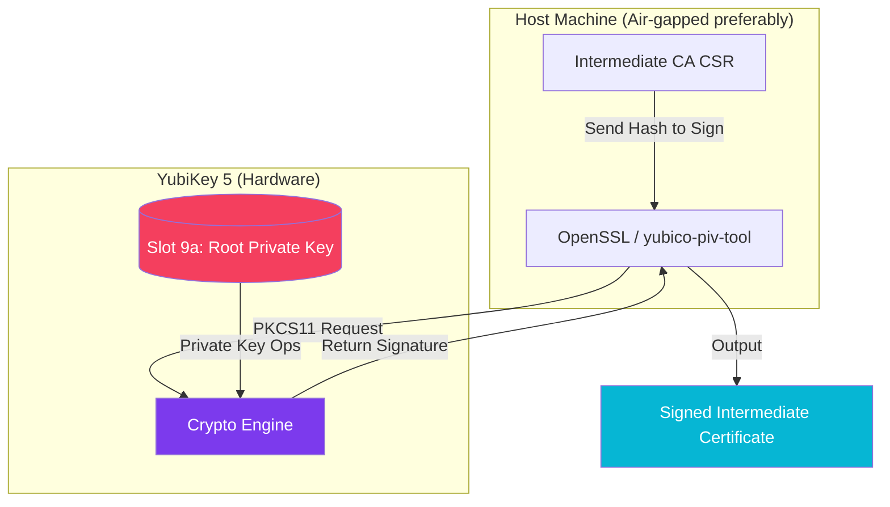

import Callout from '@components/Callout.astro';
import ImplementationNote from '@components/ImplementationNote.astro';
import CodeFile from '@components/CodeFile.astro';
import ExternalCite from '@components/ExternalCite.astro';

## Introduction

In the previous article, we built a Private PKI using OpenSSL files. While effective, file-based Root CAs have a critical weakness: **the private key exists on a general-purpose filesystem**. If that machine is compromised or an unencrypted backup is leaked, the entire trust chain collapses.

Hardware Security Modules (HSMs) solve this by generating and keeping the key *inside* the hardware. We can use a YubiKey 5 Series as a cost-effective HSM to hold our Root CA.

**Why Use Hardware Signing:**

- **Non-Exportable Keys**: The private key physically cannot leave the device.
- **Physical Presence**: Signing requires the device to be plugged in (and optionally touched).
- **PIN Protection**: Access is gated by a PIN, thwarting automated malware attacks.

### What We'll Build

In this guide, we will migrate our Root CA to hardware. You will learn how to:

1. **Configure YubiKey PIV**: Set up the Personal Identity Verification (PIV) interface.
2. **Generate Keys On-Device**: Create the RSA 4096 key directly on the chip (Slot 9a).
3. **Sign Artifacts**: Use `yubico-piv-tool` and OpenSSL via the PKCS#11 engine to sign Intermediate CAs.

## Architecture Overview

The signing operation moves from the CPU to the USB device.



## Section 1: Preparing the YubiKey

First, we need to ensure the YubiKey is in a clean state and change the default PINs.

<Callout type="warning" title="Irreversible Action">
    Resetting the PIV applet wipes all keys and certificates currently on the YubiKey.
</Callout>

```bash
# Reset PIV application
ykman piv reset

# Change Management Key (MGM) - Default is 010203040506070801020304050607080102030405060708
ykman piv access change-management-key --touch --generate

# Change PIN (Default 123456) and PUK (Default 12345678)
ykman piv access change-pin
ykman piv access change-puk
```

## Section 2: Generating the Root CA

We use **Slot 9c** (Digital Signature) or **9a** (Authentication). For a Root CA, 9c is standard for signing operations.

```bash
# Generate Keypair in Slot 9c
ykman piv keys generate 9c --algorithm RSA2048 --touch-policy ALWAYS

# Create a self-signed Root Certificate based on that key
ykman piv certificates generate 9c \
    --subject "CN=BlueRobin Hardware Root CA" \
    --days 3650
```

Now the Root CA certificate is public, but the key is trapped safely inside the silicon.

## Section 3: Signing with OpenSSL & PKCS#11

To sign an *Intermediate CA* using the hardware key, we need the OpenSSL PKCS#11 engine.

<ImplementationNote title="Dependencies">
    You will need `openssl`, `libengine-pkcs11-openssl`, and `yubico-piv-tool` installed.
</ImplementationNote>

```bash
# Verify the slot is visible
pkcs11-tool --module /usr/local/lib/libykcs11.dylib --list-slots

# Sign the Intermediate CSR
openssl ca -engine pkcs11 -keyform engine \
    -keyfile "pkcs11:id=%01;type=private" \
    -in intermediate.csr \
    -out intermediate.crt \
    -extensions v3_intermediate_ca
```

The terminal will pause and ask for the YubiKey PIN, and if configured, the LED on the key will blink, waiting for your physical touch to authorize the signature.

## Conclusion

We have elevated our security posture significantly. Even if an attacker gains root access to our CA jump box, they cannot steal the Root CA key without physical possession of the YubiKey and knowledge of the PIN.

**Next Steps**:
- [Building a Private PKI](/blog/building-private-pki-root-ca-certificates)
- [Better IDs: NanoID vs UUID](/blog/better-ids-switching-uuid-to-nanoid)
