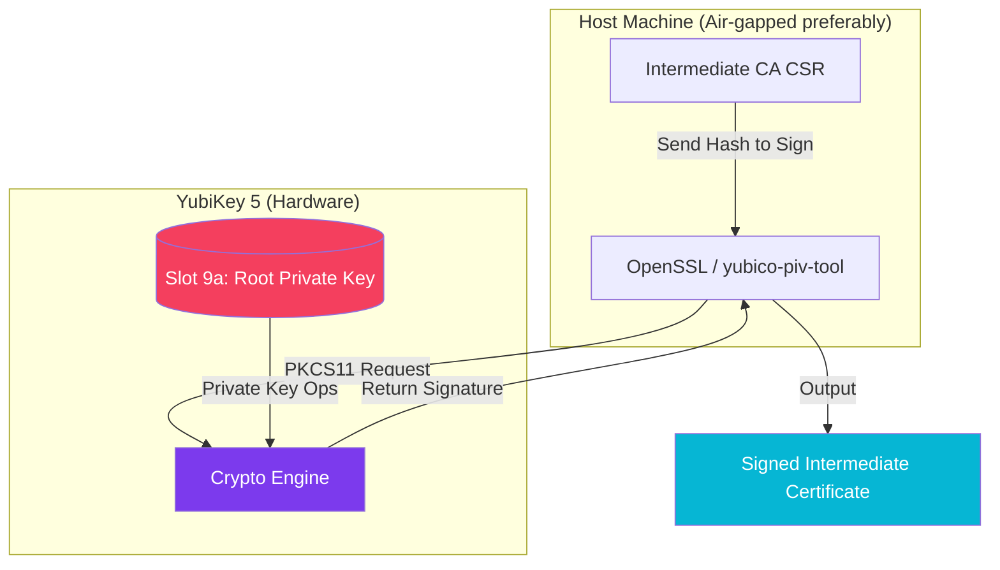

import Callout from '@components/Callout.astro';
import ImplementationNote from '@components/ImplementationNote.astro';
import CodeFile from '@components/CodeFile.astro';
import ExternalCite from '@components/ExternalCite.astro';

When I first started managing my own PKI, I kept the Root CA private key in an encrypted file on an air-gapped laptop. It worked, but every time I needed to sign an intermediate certificate, there was that nagging feeling that a single file compromise could bring the entire trust chain down. I remember the moment I plugged in a YubiKey for the first time and realized the private key would never leave the hardware -- it fundamentally changed how I thought about key management. This guide captures everything I learned along the way, including the pitfalls that cost me hours of debugging.

## Introduction

In the previous article, we built a Private PKI using OpenSSL files. While effective, file-based Root CAs have a critical weakness: **the private key exists on a general-purpose filesystem**. If that machine is compromised or an unencrypted backup is leaked, the entire trust chain collapses.

Hardware Security Modules (HSMs) solve this by generating and keeping the key *inside* the hardware. We can use a YubiKey 5 Series as a cost-effective HSM to hold our Root CA.

<ExternalCite title="YubiKey 5 Series Technical Manual" url="https://docs.yubico.com/hardware/yubikey/yk-tech-manual/" author="Yubico" date="2024" />

**Why Use Hardware Signing:**

- **Non-Exportable Keys**: The private key physically cannot leave the device.
- **Physical Presence**: Signing requires the device to be plugged in (and optionally touched).
- **PIN Protection**: Access is gated by a PIN, thwarting automated malware attacks.

<ExternalCite title="NIST SP 800-157: Guidelines for Personal Identity Verification (PIV)" url="https://csrc.nist.gov/publications/detail/sp/800-157/final" author="NIST" date="2023" />

### What We'll Build

In this guide, we will migrate our Root CA to hardware. You will learn how to:

1. **Configure YubiKey PIV**: Set up the Personal Identity Verification (PIV) interface.
2. **Generate Keys On-Device**: Create the RSA 4096 key directly on the chip (Slot 9a).
3. **Sign Artifacts**: Use `yubico-piv-tool` and OpenSSL via the PKCS#11 engine to sign Intermediate CAs.

## Architecture Overview

The signing operation moves from the CPU to the USB device.

<ExternalCite title="PKCS#11 Cryptographic Token Interface Standard" url="https://docs.oasis-open.org/pkcs11/pkcs11-base/v3.0/pkcs11-base-v3.0.html" author="OASIS" date="2020" />


```mermaid
flowchart TD
    subgraph Host ["Host Machine (Air-gapped preferably)"]
        CSR["Intermediate CA CSR"]
        OpenSSL["OpenSSL / yubico-piv-tool"]
    end

    subgraph YubiKey ["YubiKey 5 (Hardware)"]
        Slot9a[("Slot 9a: Root Private Key")]
        crypto["Crypto Engine"]
    end

    CSR -->|Send Hash to Sign| OpenSSL
    OpenSSL -->|PKCS11 Request| crypto
    Slot9a -->|Private Key Ops| crypto
    crypto -->|Return Signature| OpenSSL
    OpenSSL -->|Output| Cert["Signed Intermediate Certificate"]

    classDef primary fill:#7c3aed,color:#fff
    classDef secondary fill:#06b6d4,color:#fff
    classDef db fill:#f43f5e,color:#fff
    classDef warning fill:#fbbf24,color:#000

    class crypto primary
    class Cert secondary
    class Slot9a db
```

## Section 1: Preparing the YubiKey

First, we need to ensure the YubiKey is in a clean state and change the default PINs.

<ExternalCite title="Yubico PIV Tool Reference" url="https://developers.yubico.com/yubico-piv-tool/" author="Yubico" date="2024" />

<Callout type="warning" title="Irreversible Action">
    Resetting the PIV applet wipes all keys and certificates currently on the YubiKey.
</Callout>

```bash
# Reset PIV application
ykman piv reset

# Change Management Key (MGM) - Default is 010203040506070801020304050607080102030405060708
ykman piv access change-management-key --touch --generate

# Change PIN (Default 123456) and PUK (Default 12345678)
ykman piv access change-pin
ykman piv access change-puk
```

<ImplementationNote title="PIN Lockout Recovery">
When I first set up my YubiKey, I accidentally locked myself out by entering the wrong PIN three times in a row. The PIV applet has a strict lockout policy -- after three failed PIN attempts, you need the PUK (PIN Unlock Key) to reset it. I learned the hard way to store the PUK in a separate, secure location before starting any key generation. If both the PIN and PUK are exhausted, the entire PIV applet must be reset, destroying all keys on the device.
</ImplementationNote>

## Section 2: Generating the Root CA

We use **Slot 9c** (Digital Signature) or **9a** (Authentication). For a Root CA, 9c is standard for signing operations.

```bash
# Generate Keypair in Slot 9c
ykman piv keys generate 9c --algorithm RSA2048 --touch-policy ALWAYS

# Create a self-signed Root Certificate based on that key
ykman piv certificates generate 9c \
    --subject "CN=MyOrg Hardware Root CA" \
    --days 3650
```

Now the Root CA certificate is public, but the key is trapped safely inside the silicon.

<ExternalCite title="PIV Certificate Slots and Their Uses" url="https://developers.yubico.com/PIV/Introduction/Certificate_slots.html" author="Yubico" date="2024" />

## Section 3: Signing with OpenSSL & PKCS#11

To sign an *Intermediate CA* using the hardware key, we need the OpenSSL PKCS#11 engine.

<ImplementationNote title="Dependency Hell on macOS">
I spent an entire afternoon trying to get the PKCS#11 engine working on macOS. The challenge was that Homebrew-installed OpenSSL does not ship with engine support by default, and the `libykcs11.dylib` path varies depending on whether you installed `yubico-piv-tool` via Homebrew or from source. My breakthrough came when I realized I needed to explicitly set `OPENSSL_CONF` to point to an engine configuration file that referenced the correct `.dylib` path. On Linux, the experience was much smoother since `libengine-pkcs11-openssl` is a single `apt install` away.
</ImplementationNote>

```bash
# Verify the slot is visible
pkcs11-tool --module /usr/local/lib/libykcs11.dylib --list-slots

# Sign the Intermediate CSR
openssl ca -engine pkcs11 -keyform engine \
    -keyfile "pkcs11:id=%01;type=private" \
    -in intermediate.csr \
    -out intermediate.crt \
    -extensions v3_intermediate_ca
```

The terminal will pause and ask for the YubiKey PIN, and if configured, the LED on the key will blink, waiting for your physical touch to authorize the signature.

<ExternalCite title="OpenSSL PKCS#11 Engine Documentation" url="https://github.com/OpenSC/libp11" author="OpenSC Project" date="2024" />

<ImplementationNote title="Touch Policy Debugging">
I once spent two hours staring at a hanging `openssl ca` command, not realizing it was waiting for me to physically touch the YubiKey. When you configure `--touch-policy ALWAYS`, every single cryptographic operation requires a physical tap on the metal contact. The LED blinks to indicate it is waiting, but if your terminal is in another window or you are running the command via SSH, you can easily miss it. I now always run signing operations with the YubiKey directly in front of me and check for the blinking LED before assuming the command is stuck.
</ImplementationNote>

## Conclusion

We have elevated our security posture significantly. Even if an attacker gains root access to our CA jump box, they cannot steal the Root CA key without physical possession of the YubiKey and knowledge of the PIN.

Looking back on this journey, moving our Root CA to hardware was one of the best infrastructure decisions I have made. The initial setup had its frustrations -- dependency issues, lockout scares, and the learning curve of PKCS#11 -- but the peace of mind is worth every hour invested. Knowing that the most critical secret in our trust chain is physically bound to a tamper-resistant device lets me sleep soundly. If you are running any form of internal PKI, I strongly encourage you to make this leap.

### Next Steps

- Explore **backup YubiKey strategies**: Generate an identical key on a second YubiKey and store it in a physical safe as a disaster recovery measure.
- Implement **certificate revocation lists (CRLs)** or OCSP responders to handle compromised intermediate certificates.
- Automate the signing workflow with a **CI/CD-friendly script** that prompts for YubiKey insertion only when needed.
- Consider migrating to **ECDSA P-384** keys for smaller signatures and faster verification, if your infrastructure supports it.

### Further Reading

- [Yubico PIV Introduction](https://developers.yubico.com/PIV/Introduction/) - Comprehensive guide to YubiKey PIV functionality
- [OpenSSL Certificate Authority Guide](https://jamielinux.com/docs/openssl-certificate-authority/) - Step-by-step PKI setup with OpenSSL
- [NIST SP 800-63B: Digital Identity Guidelines](https://pages.nist.gov/800-63-3/sp800-63b.html) - Hardware token authentication standards
- [Building a Private PKI](/building-private-pki-root-ca-certificates) - The previous article in this series
