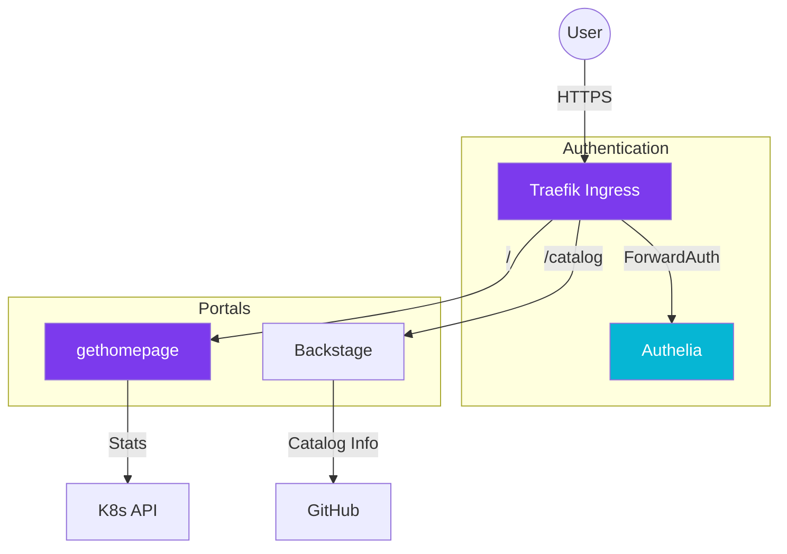

import Callout from '@components/Callout.astro';
import ImplementationNote from '@components/ImplementationNote.astro';
import CodeFile from '@components/CodeFile.astro';
import ExternalCite from '@components/ExternalCite.astro';

## Introduction

A homelab isn't complete without a proper landing page. But as services grow, a static list of links isn't enough. We need observability, service catalogs, and unified authentication. In this guide, we combine `gethomepage` for the "monitor" view and Backstage for the "developer" view.

**Why This Stack Matters:**

- **Quick Access**: `gethomepage` loads instantly and shows live stats (Docker, Traefik).
- **Service Catalog**: Backstage documents APIs and tracks ownership of our microservices.
- **Unified Security**: Authelia provides a single login for everything, passing headers downstream.

### What We'll Build

1. **Landing Page**: A beautiful dashboard with live service widgets.
2. **Developer Portal**: A Backstage instance tracking our BlueRobin microservices.
3. **SSO Gateway**: Enforcing 2FA in front of all internal tools.

## Architecture Overview

Traffic flows through Traefik, which checks Authelia before allowing access to the dashboards.



## Section 1: Configuring Homepage

We use `gethomepage` because it's fast and config-driven (YAML).

<ImplementationNote title="K8s Discovery">
  We run Homepage inside the cluster with a ServiceAccount that allows it to query ingress status automatically.
</ImplementationNote>

```yaml
# services.yaml
- Group: Core Infrastructure
  services:
    - Authelia:
        icon: authelia.png
        href: https://auth.bluerobin.local
        description: SSO Provider
        widget:
            type: authelia
            url: http://authelia.authelia.svc.cluster.local
```

## Section 2: Implementing Backstage

Backstage allows us to treat our homelab like a production platform. We map our `catalog-info.yaml` files.

```yaml
# catalog-info.yaml
apiVersion: backstage.io/v1alpha1
kind: Component
metadata:
  name: bluerobin-api
  description: The main API for document archives.
  tags:
    - dotnet
    - api
spec:
  type: service
  lifecycle: production
  owner: user:victor
```

## Section 3: Protecting with Authelia

Finally, we ensure no one accesses these dashboards without credentials.

<Callout type="info" title="Two-Factor Auth">
    We enforce 2FA for the administrative dashboard, but allow single-factor for the read-only catalog.
</Callout>

In our IngressRoute:

```yaml
apiVersion: traefik.io/v1alpha1
kind: Middleware
metadata:
  name: authelia
  namespace: data-layer
spec:
  forwardAuth:
    address: http://authelia.authelia.svc:9091/api/verify?rd=https://auth.bluerobin.local/
    trustForwardHeader: true
    authResponseHeaders:
      - Remote-User
      - Remote-Groups
```

## Conclusion

By layering these three tools, we get the best of both worlds: a flashy "NOC-style" dashboard for quick checks, and a deep, enterprisey catalog for managing the complexity of the BlueRobin microservices.

**Next Steps**:
- See how we deploy this with **Flux CD**.
- Check out the **Glassmorphism** guide to see how we styled the custom Backstage theme.
