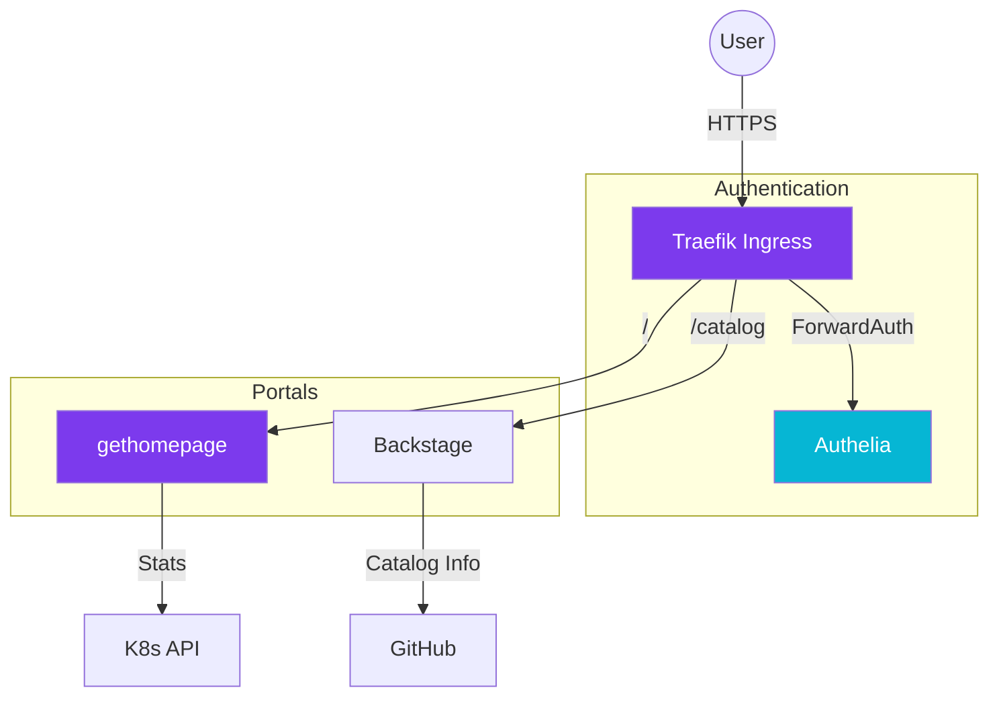

import Callout from '@components/Callout.astro';
import ImplementationNote from '@components/ImplementationNote.astro';
import CodeFile from '@components/CodeFile.astro';
import ExternalCite from '@components/ExternalCite.astro';

When I first started building dashboards for my homelab, I had a sprawling bookmarks folder with dozens of service URLs that I could never keep straight. I tried Heimdall, then Organizr, then a simple Nginx landing page with hardcoded links -- none of them stuck. The breakthrough came when I realized I needed two different views: a quick-glance operational dashboard for "is everything healthy?" and a deeper developer portal for "what services do we run and who owns them?" Combining gethomepage with Backstage behind Authelia SSO gave me exactly that, though getting Authelia's ForwardAuth headers to play nicely with Backstage's own auth took more debugging than I care to admit.

## Introduction

A homelab isn't complete without a proper landing page. But as services grow, a static list of links isn't enough. We need observability, service catalogs, and unified authentication. In this guide, we combine `gethomepage` for the "monitor" view and Backstage for the "developer" view.

**Why This Stack Matters:**

- **Quick Access**: `gethomepage` loads instantly and shows live stats (Docker, Traefik).
- **Service Catalog**: Backstage documents APIs and tracks ownership of our microservices.
- **Unified Security**: Authelia provides a single login for everything, passing headers downstream.

### What We'll Build

1. **Landing Page**: A beautiful dashboard with live service widgets.
2. **Developer Portal**: A Backstage instance tracking our our microservices.
3. **SSO Gateway**: Enforcing 2FA in front of all internal tools.

## Architecture Overview

Traffic flows through Traefik, which checks Authelia before allowing access to the dashboards.

<ExternalCite title="Traefik ForwardAuth Middleware" url="https://doc.traefik.io/traefik/middlewares/http/forwardauth/" author="Traefik Labs" date="2024-05-10" />


```mermaid
flowchart TD
    User((User)) -->|HTTPS| Traefik[Traefik Ingress]
    
    subgraph Auth ["Authentication"]
        Traefik -- ForwardAuth --> Authelia
    end
    
    subgraph Dashboards ["Portals"]
        Traefik -->|/| Homepage[gethomepage]
        Traefik -->|/catalog| Backstage
    end

    Homepage -->|Stats| K8s[K8s API]
    Backstage -->|Catalog Info| Git[GitHub]

    classDef primary fill:#7c3aed,color:#fff
    classDef secondary fill:#06b6d4,color:#fff
    classDef db fill:#f43f5e,color:#fff
    classDef warning fill:#fbbf24,color:#000

    class Traefik,Homepage primary
    class Authelia secondary
```

## Section 1: Configuring Homepage

We use `gethomepage` because it's fast and config-driven (YAML).

<ExternalCite title="Homepage - A modern, fully static, fast, secure fully proxied, highly customizable application dashboard" url="https://gethomepage.dev/configs/services/" author="gethomepage" date="2024-12-01" />

<ImplementationNote title="K8s Discovery">
  We run Homepage inside the cluster with a ServiceAccount that allows it to query ingress status automatically.
</ImplementationNote>

```yaml
# services.yaml
- Group: Core Infrastructure
  services:
    - Authelia:
        icon: authelia.png
        href: https://auth.bluerobin.local
        description: SSO Provider
        widget:
            type: authelia
            url: http://authelia.authelia.svc.cluster.local
```

## Section 2: Implementing Backstage

Backstage allows us to treat our homelab like a production platform. We map our `catalog-info.yaml` files.

<ExternalCite title="Backstage Software Catalog" url="https://backstage.io/docs/features/software-catalog/" author="Spotify / CNCF" date="2024-10-22" />

<ImplementationNote title="Backstage Build Times">
Building Backstage from source was the most frustrating part of this entire setup. The initial `yarn install` pulled over 1,200 packages and the TypeScript compilation took nearly 8 minutes on my mini PC. I eventually moved the build into a GitHub Actions workflow that produces a container image, so now I just deploy a pre-built image to the cluster. If you are running Backstage in a homelab, I strongly recommend containerizing the build rather than building on-node -- you will save yourself a lot of headaches with Node.js version mismatches and memory pressure.
</ImplementationNote>

```yaml
# catalog-info.yaml
apiVersion: backstage.io/v1alpha1
kind: Component
metadata:
  name: myapp-api
  description: The main API for document archives.
  tags:
    - dotnet
    - api
spec:
  type: service
  lifecycle: production
  owner: user:victor
```

## Section 3: Protecting with Authelia

Finally, we ensure no one accesses these dashboards without credentials.

<ExternalCite title="Authelia - Authentication and Authorization Server" url="https://www.authelia.com/integration/proxies/traefik/" author="Authelia Project" date="2024-08-30" />

<Callout type="info" title="Two-Factor Auth">
    We enforce 2FA for the administrative dashboard, but allow single-factor for the read-only catalog.
</Callout>

In our IngressRoute:

```yaml
apiVersion: traefik.io/v1alpha1
kind: Middleware
metadata:
  name: authelia
  namespace: data-layer
spec:
  forwardAuth:
    address: http://authelia.authelia.svc:9091/api/verify?rd=https://auth.bluerobin.local/
    trustForwardHeader: true
    authResponseHeaders:
      - Remote-User
      - Remote-Groups
```

<ExternalCite title="Kubernetes RBAC Authorization" url="https://kubernetes.io/docs/reference/access-authn-authz/rbac/" author="Kubernetes Documentation" date="2024-09-05" />

<ImplementationNote title="Authelia Session Cookie Scope">
I ran into a subtle issue where Authelia's session cookie was scoped to `auth.bluerobin.local`, which meant the ForwardAuth verification failed for requests coming in on `home.bluerobin.local`. The fix was setting `cookie_domain` to `.bluerobin.local` in Authelia's configuration so the session cookie would be sent on all subdomain requests. This took me an embarrassingly long time to figure out because the error messages from Traefik just said "403 Forbidden" with no additional context about why the ForwardAuth check was failing.
</ImplementationNote>

<ExternalCite title="Building Developer Portals with Backstage" url="https://www.oreilly.com/library/view/building-developer-portals/9781098ports/" author="Suzanne Daniels" date="2024-03-15" />

## Conclusion

By layering these three tools, we get the best of both worlds: a flashy "NOC-style" dashboard for quick checks, and a deep, enterprisey catalog for managing the complexity of the our microservices.

Looking back, the effort of setting up Backstage alongside gethomepage might seem like overkill for a homelab with fewer than twenty services. But the discipline of writing `catalog-info.yaml` for each service forced me to think about ownership, documentation, and API contracts in ways I had been neglecting. The dashboard became not just a tool for monitoring but a forcing function for better engineering practices at home.

## Next Steps

- Add custom Backstage plugins for NATS JetStream stream visualization
- Integrate Homepage widgets for Flux reconciliation status
- Set up Authelia notifications via the Telegram bot for failed login attempts
- Explore Backstage TechDocs for rendering Markdown documentation from each service repo

### Further Reading


<ExternalCite title="gethomepage Documentation" url="https://gethomepage.dev/" author="Gethomepage" date="2024" />

<ExternalCite title="Backstage Getting Started Guide" url="https://backstage.io/docs/getting-started/" author="Backstage" date="2024" />

<ExternalCite title="Authelia Configuration Reference" url="https://www.authelia.com/configuration/prologue/introduction/" author="Authelia" date="2024" />

<ExternalCite title="Traefik Middleware Documentation" url="https://doc.traefik.io/traefik/middlewares/overview/" author="Doc" date="2024" />
- See how we deploy this with **Flux CD**.
- Check out the **Glassmorphism** guide to see how we styled the custom Backstage theme.
