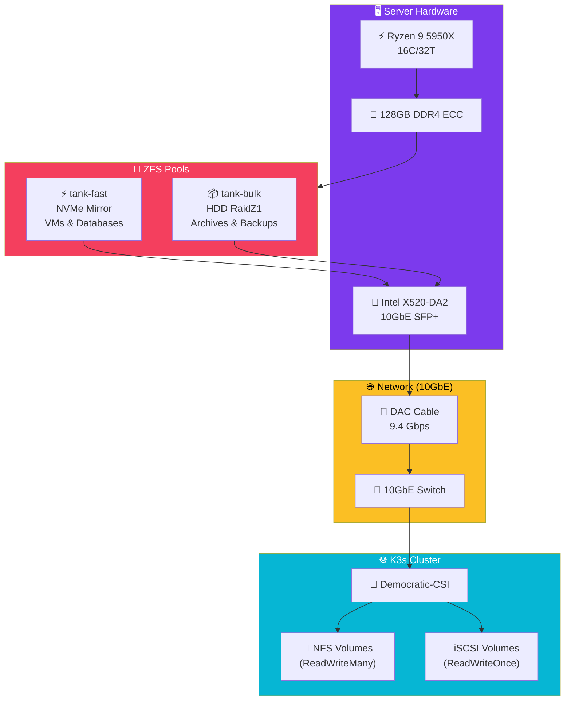
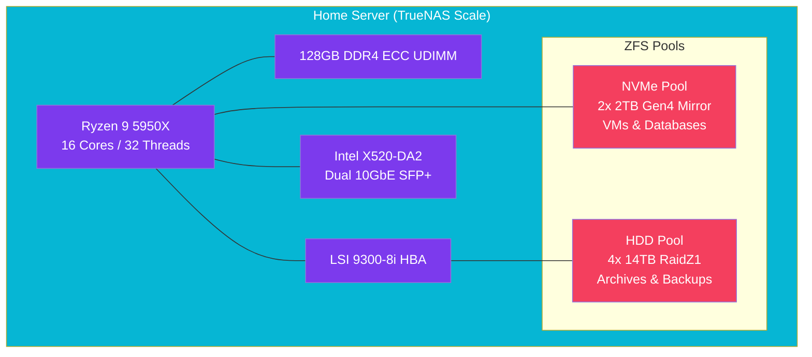

import Callout from '@components/Callout.astro';
import ImplementationNote from '@components/ImplementationNote.astro';
import CodeFile from '@components/CodeFile.astro';
import ExternalCite from '@components/ExternalCite.astro';

## Introduction

High-performance software needs high-performance hardware. When we decided to bring BlueRobin on-premise, we needed a foundation that could handle the simultaneous demands of Kubernetes virtualization, massive storage throughput for MinIO, and spare cycles for build agents. We chose a consolidated approach using a powerful workstation build running TrueNAS Scale.

**Why Proper Hardware Matters:**

- **Reliability**: ECC memory and ZFS protect against bit rot.
- **Bandwidth**: 10GbE overcomes the "network bottleneck," making remote storage feel local.
- **Density**: Running everything on one optimized rig saves power vs. a rack of noisy 1U servers.

### What We'll Build

In this guide, we will walk through the specifications and configuration of the BlueRobin homelab server. You will learn how to:

1. **Select Hardware**: Balancing CPU cores vs. PCIe lanes.
2. **Configure ZFS**: Setting up pools for speed (NVMe) and capacity (HDD).
3. **Expose Storage**: Connecting TrueNAS to Kubernetes via NFS and iSCSI.

## Architecture Overview

The homelab infrastructure connects enterprise-grade hardware with a Kubernetes cluster for seamless storage provisioning:



**Data Flow**:
1. **Hardware Layer**: High-core-count CPU and ECC RAM provide reliability
2. **Storage Layer**: ZFS pools tiered by performance (NVMe) and capacity (HDD)
3. **Network Layer**: 10GbE eliminates the storage bottleneck
4. **Kubernetes Layer**: Democratic-CSI dynamically provisions volumes via NFS/iSCSI

## Hardware Architecture

Our build centers on the AMD Ryzen platform, utilizing its high core count and ECC memory support (unofficial but functional on AsRock Rack boards).



## Section 1: The Hardware Selection

### The Brain: CPU & RAM
We chose the **Ryzen 9 5950X** for its incredible multi-threaded performance. Kubernetes creates many small containers, and having 32 threads allows us to over-provision efficiently. 

**128GB of RAM** is critical. ZFS loves RAM for its Adaptive Replacement Cache (ARC), and running a K3s cluster, Postgres, Qdrant, and local AI models eats memory for breakfast.

### The Spine: Networking
**10GbE is non-negotiable.** We use standardized Intel X520 cards with DAC (Direct Attach Copper) cables. This provides a steady 9.4 Gbps link between the server and our main workstation, enabling us to edit video directly off the NAS or restore gigantic database backups in seconds.

<Callout type="warning" title="PCIe Lanes">
    On consumer platforms like Ryzen (AM4), PCIe lanes are limited. We had to carefully bifurcate slots to ensure the GPU, HBA, and 10GbE card all received sufficient bandwidth.
</Callout>

## Section 2: TrueNAS Scale Configuration

TrueNAS Scale (Linux-based) was preferred over Core (BSD-based) for better Docker/Kubernetes compatibility and KVM support.

### Storage Tiers
We split our storage into two distinct pools:

1.  **`tank-fast` (NVMe Mirror)**:
    -   **Use Case**: Docker volumes, Postgres DB files, Qdrant vectors.
    -   **Why**: IOPS. Random I/O on HDDs kills database performance.
2.  **`tank-bulk` (HDD RaidZ1)**:
    -   **Use Case**: MinIO objects, Backups, Media.
    -   **Why**: Cost-effective bulk storage.

## Section 3: Connecting to Kubernetes

We use **Democratic-CSI** (configured via Flux) to automatically provision storage on TrueNAS from our K3s cluster.

### NFS vs iSCSI
- **NFS**: Used for `ReadWriteMany` volumes (e.g., shared configs, web assets). Faster to set up, easier to debug.
- **iSCSI**: Used for `ReadWriteOnce` volumes (e.g., Databases). Block-level access provides better performance and consistency guarantees for PostgreSQL.

```yaml
# Example StorageClass for TrueNAS iSCSI
apiVersion: storage.k8s.io/v1
kind: StorageClass
metadata:
  name: truenas-iscsi
provisioner: org.democratic-csi.iscsi
parameters:
  fsType: ext4
  # ... configuration linking to TrueNAS API
```

## Conclusion

This hardware setup provides the bedrock for the entire BlueRobin platform. By investing in quality components like ECC RAM and 10GbE, we've built a "private cloud" that outperforms standard cloud instances at a fraction of the long-term cost.

**Next Steps**:
- See how we [automated our workflows](/blog/workflow-automation-n8n-kubernetes) on this cluster.
- Read about our [observability stack](/blog/observability-lessons-why-we-dropped-signoz).
