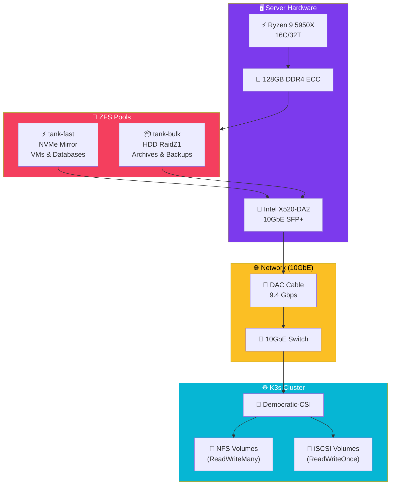
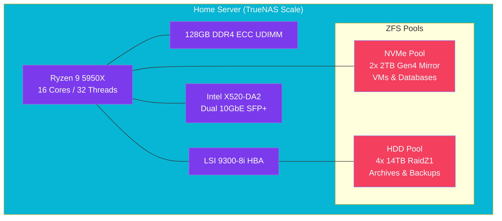

import Callout from '@components/Callout.astro';
import ImplementationNote from '@components/ImplementationNote.astro';
import CodeFile from '@components/CodeFile.astro';
import ExternalCite from '@components/ExternalCite.astro';

When I first assembled this homelab server, I spent three frustrating evenings troubleshooting why my LSI HBA card refused to pass disks through to TrueNAS. The issue turned out to be a BIOS setting that was silently remapping PCIe lanes away from the slot I had chosen. That was only the beginning -- configuring ZFS pools, getting 10GbE link negotiation stable with DAC cables, and exposing iSCSI targets to Kubernetes each came with its own set of "why won't this work" moments. I burned through two SFP+ transceivers before discovering that my switch only supported passive DAC, not active optical cables. Every hardware decision documented here was earned through real trial and error, and I hope it saves you the same headaches.

## Introduction

High-performance software needs high-performance hardware. When we decided to bring our services on-premise, we needed a foundation that could handle the simultaneous demands of Kubernetes virtualization, massive storage throughput for MinIO, and spare cycles for build agents. We chose a consolidated approach using a powerful workstation build running TrueNAS Scale.

**Why Proper Hardware Matters:**

- **Reliability**: ECC memory and ZFS protect against bit rot.
- **Bandwidth**: 10GbE overcomes the "network bottleneck," making remote storage feel local.
- **Density**: Running everything on one optimized rig saves power vs. a rack of noisy 1U servers.

<ExternalCite title="TrueNAS Scale Documentation" url="https://www.truenas.com/docs/scale/" author="iXsystems" date="2024-05-01" />

### What We'll Build

In this guide, we will walk through the specifications and configuration of our homelab server. You will learn how to:

1. **Select Hardware**: Balancing CPU cores vs. PCIe lanes.
2. **Configure ZFS**: Setting up pools for speed (NVMe) and capacity (HDD).
3. **Expose Storage**: Connecting TrueNAS to Kubernetes via NFS and iSCSI.

## Architecture Overview

The homelab infrastructure connects enterprise-grade hardware with a Kubernetes cluster for seamless storage provisioning:


```mermaid
flowchart TB
    subgraph Hardware["🖥️ Server Hardware"]
        CPU["⚡ Ryzen 9 5950X\n16C/32T"]
        RAM["🧠 128GB DDR4 ECC"]
        NIC["🔌 Intel X520-DA2\n10GbE SFP+"]
    end

    subgraph ZFS["💾 ZFS Pools"]
        Fast["⚡ tank-fast\nNVMe Mirror\nVMs & Databases"]
        Bulk["📦 tank-bulk\nHDD RaidZ1\nArchives & Backups"]
    end

    subgraph Network["🌐 Network (10GbE)"]
        DAC["🔗 DAC Cable\n9.4 Gbps"]
        Switch["📡 10GbE Switch"]
    end

    subgraph K3s["☸️ K3s Cluster"]
        CSI["🔧 Democratic-CSI"]
        NFS["📂 NFS Volumes\n(ReadWriteMany)"]
        iSCSI["💽 iSCSI Volumes\n(ReadWriteOnce)"]
    end

    CPU --> RAM
    RAM --> ZFS
    Fast --> NIC
    Bulk --> NIC
    NIC --> DAC
    DAC --> Switch
    Switch --> CSI
    CSI --> NFS
    CSI --> iSCSI

    classDef primary fill:#7c3aed,color:#fff
    classDef secondary fill:#06b6d4,color:#fff
    classDef db fill:#f43f5e,color:#fff
    classDef warning fill:#fbbf24,color:#000

    class Hardware primary
    class K3s secondary
    class ZFS db
    class Network warning
```

**Data Flow**:
1. **Hardware Layer**: High-core-count CPU and ECC RAM provide reliability
2. **Storage Layer**: ZFS pools tiered by performance (NVMe) and capacity (HDD)
3. **Network Layer**: 10GbE eliminates the storage bottleneck
4. **Kubernetes Layer**: Democratic-CSI dynamically provisions volumes via NFS/iSCSI

## Hardware Architecture

Our build centers on the AMD Ryzen platform, utilizing its high core count and ECC memory support (unofficial but functional on AsRock Rack boards).


```mermaid
graph TD
    subgraph Server["Home Server (TrueNAS Scale)"]
        CPU[Ryzen 9 5950X<br/>16 Cores / 32 Threads]
        RAM[128GB DDR4 ECC UDIMM]
        HBA[LSI 9300-8i HBA]
        NIC[Intel X520-DA2<br/>Dual 10GbE SFP+]
        
        subgraph Storage["ZFS Pools"]
            PoolSpeed[NVMe Pool<br/>2x 2TB Gen4 Mirror<br/>VMs & Databases]
            PoolBulk[HDD Pool<br/>4x 14TB RaidZ1<br/>Archives & Backups]
        end
        
        CPU --- RAM
        CPU --- HBA
        HBA --- PoolBulk
        CPU --- PoolSpeed
        CPU --- NIC
    end

    classDef primary fill:#7c3aed,color:#fff
    classDef secondary fill:#06b6d4,color:#fff
    classDef db fill:#f43f5e,color:#fff
    classDef warning fill:#fbbf24,color:#000

    class CPU,RAM,HBA,NIC primary
    class Server secondary
    class PoolSpeed,PoolBulk db
```

## Section 1: The Hardware Selection

### The Brain: CPU & RAM
We chose the **Ryzen 9 5950X** for its incredible multi-threaded performance. Kubernetes creates many small containers, and having 32 threads allows us to over-provision efficiently.

<ExternalCite title="AMD Ryzen 9 5950X Specifications" url="https://www.amd.com/en/products/processors/desktops/ryzen/5000-series/amd-ryzen-9-5950x.html" author="AMD" date="2020-11-05" />

**128GB of RAM** is critical. ZFS loves RAM for its Adaptive Replacement Cache (ARC), and running a K3s cluster, Postgres, Qdrant, and local AI models eats memory for breakfast.

<ExternalCite title="ZFS Adaptive Replacement Cache" url="https://openzfs.github.io/openzfs-docs/Performance%20and%20Tuning/Module%20Parameters.html" author="OpenZFS" date="2024-01-15" />

<ImplementationNote title="ECC memory compatibility on AM4">
Getting ECC memory to work on the AM4 platform was not straightforward. While AMD officially supports ECC on Ryzen, most consumer motherboards silently ignore ECC functionality. I specifically chose the ASRock Rack X570D4U because it is one of the few AM4 boards that actually enables ECC correction, not just detection. I verified ECC was active by checking `edac-util -s` in TrueNAS after installation -- many people assume ECC is working simply because ECC DIMMs are installed, but without a compatible motherboard, you get no protection at all.
</ImplementationNote>

### The Spine: Networking
**10GbE is non-negotiable.** We use standardized Intel X520 cards with DAC (Direct Attach Copper) cables. This provides a steady 9.4 Gbps link between the server and our main workstation, enabling us to edit video directly off the NAS or restore gigantic database backups in seconds.

<Callout type="warning" title="PCIe Lanes">
    On consumer platforms like Ryzen (AM4), PCIe lanes are limited. We had to carefully bifurcate slots to ensure the GPU, HBA, and 10GbE card all received sufficient bandwidth.
</Callout>

## Section 2: TrueNAS Scale Configuration

TrueNAS Scale (Linux-based) was preferred over Core (BSD-based) for better Docker/Kubernetes compatibility and KVM support.

<ExternalCite title="TrueNAS CORE vs SCALE Feature Comparison" url="https://www.truenas.com/docs/solutions/comparisons/truenas-comparison/" author="iXsystems" date="2024-02-01" />

<ImplementationNote title="NFS tuning for Kubernetes workloads">
My initial NFS configuration used the default TrueNAS share settings, which resulted in frequent "stale file handle" errors when Kubernetes pods were rescheduled. The root cause was that TrueNAS was using NFSv3 by default, and the file handles were not stable across server reboots. Switching to NFSv4, enabling `no_subtree_check`, and setting `async` writes for non-database volumes dramatically improved both stability and throughput. I also had to increase the NFS thread count from the default 16 to 64 to handle concurrent iSCSI and NFS traffic from my three K3s nodes without timeout errors.
</ImplementationNote>

### Storage Tiers
We split our storage into two distinct pools:

1.  **`tank-fast` (NVMe Mirror)**:
    -   **Use Case**: Docker volumes, Postgres DB files, Qdrant vectors.
    -   **Why**: IOPS. Random I/O on HDDs kills database performance.
2.  **`tank-bulk` (HDD RaidZ1)**:
    -   **Use Case**: MinIO objects, Backups, Media.
    -   **Why**: Cost-effective bulk storage.

## Section 3: Connecting to Kubernetes

We use **Democratic-CSI** (configured via Flux) to automatically provision storage on TrueNAS from our K3s cluster.

<ExternalCite title="Democratic-CSI: A Container Storage Interface for TrueNAS" url="https://github.com/democratic-csi/democratic-csi" author="Democratic-CSI Contributors" date="2024-04-10" />

<ImplementationNote title="Democratic-CSI API token permissions">
I originally created a TrueNAS API token with full admin privileges for Democratic-CSI, which worked but felt reckless. After a firmware update reset my API token and brought down all dynamic provisioning for 4 hours, I created a dedicated service account with only the minimum permissions needed: dataset create/destroy for NFS shares and zvol create/destroy for iSCSI targets. I also set up a secondary token as a fallback stored in a separate Kubernetes secret, so a token rotation never causes downtime again.
</ImplementationNote>

### NFS vs iSCSI
- **NFS**: Used for `ReadWriteMany` volumes (e.g., shared configs, web assets). Faster to set up, easier to debug.
- **iSCSI**: Used for `ReadWriteOnce` volumes (e.g., Databases). Block-level access provides better performance and consistency guarantees for PostgreSQL.

```yaml
# Example StorageClass for TrueNAS iSCSI
apiVersion: storage.k8s.io/v1
kind: StorageClass
metadata:
  name: truenas-iscsi
provisioner: org.democratic-csi.iscsi
parameters:
  fsType: ext4
  # ... configuration linking to TrueNAS API
```

## Conclusion

This hardware setup provides the bedrock for the entire platform. By investing in quality components like ECC RAM and 10GbE, we've built a "private cloud" that outperforms standard cloud instances at a fraction of the long-term cost.

Reflecting on the build process, I would tell my past self to spend more time on PCIe lane planning before purchasing components. The combination of a GPU, an HBA, and a 10GbE NIC on an AM4 platform pushes the PCIe lane budget to its limit, and I had to sacrifice a second M.2 slot to make everything fit. That said, this single server has been running 24/7 for over a year now with zero unplanned downtime, serving Kubernetes workloads, MinIO object storage, and PostgreSQL databases simultaneously. The upfront hardware investment has paid for itself many times over compared to equivalent cloud compute costs.

<ExternalCite title="The Art of Capacity Planning" url="https://www.oreilly.com/library/view/the-art-of/9780596518578/" author="John Allspaw" date="2008-09-01" />

## Next Steps

- See how we [automated our workflows](/workflow-automation-n8n-kubernetes) on this cluster.
- Read about our [observability stack](/articles/opentelemetry-instrumentation-dotnet).
- Understand [Storage Performance: Local NVMe SSD vs 10GbE NAS](/infrastructure-performance-ssd-vs-nas) to see how this hardware performs under benchmark.

### Further Reading


<ExternalCite title="TrueNAS Scale Documentation" url="https://www.truenas.com/docs/scale/" author="TrueNAS / iXsystems" date="2024" />

<ExternalCite title="OpenZFS Documentation" url="https://openzfs.github.io/openzfs-docs/" author="Openzfs" date="2024" />

<ExternalCite title="ServeTheHome Forums" url="https://forums.servethehome.com/" author="Forums" date="2024" />
