import Callout from '@components/Callout.astro';
import ImplementationNote from '@components/ImplementationNote.astro';
import ExternalCite from '@components/ExternalCite.astro';

## Introduction

Pure semantic search excels at understanding meaning but can miss exact matches. Keyword search finds precise terms but misses semantic relationships. Hybrid search combines both approaches for the best of both worlds. This article details the implementation of a hybrid search system in BlueRobin using Qdrant for vector search and PostgreSQL for full-text search, fused with Reciprocal Rank Fusion (RRF).

## Architecture Overview

The following diagram shows the parallel execution of search strategies and their fusion.

```mermaid
flowchart TB
    Q["💬 User Query<br/>'GDPR compliance 2024'"] --> Split

    Split --> Semantic
    Split --> Keyword

    subgraph Semantic["🧠 Semantic Path"]
        S1["🔄 Query → Embed"]
        S2[("🔮 Qdrant<br/>Vector Search")]
        S3["✅ Semantic Hits<br/>[doc1: 0.85]<br/>[doc4: 0.72]"]
        S1 --> S2 --> S3
    end

    subgraph Keyword["🔤 Keyword Path"]
        K1["📝 Query → BM25"]
        K2[("🐘 PostgreSQL<br/>Full Text")]
        K3["✅ Keyword Hits<br/>[doc3: 15.2]<br/>[doc1: 12.8]"]
        K1 --> K2 --> K3
    end

    S3 --> RRF
    K3 --> RRF

    RRF["⚖️ Reciprocal Rank Fusion"] --> Results["🎯 Combined Results<br/>[doc1, doc3, doc4, ...]"]

    classDef primary fill:#7c3aed,color:#fff
    classDef secondary fill:#06b6d4,color:#fff
    classDef db fill:#f43f5e,color:#fff
    classDef warning fill:#fbbf24,color:#000

    class Keyword,RRF primary
    class Semantic secondary
    class S2,K2 db
```



## Implementation

### Setting Up Full-Text Search

#### PostgreSQL with pg_trgm

```sql
-- Enable extensions
CREATE EXTENSION IF NOT EXISTS pg_trgm;
CREATE EXTENSION IF NOT EXISTS unaccent;
-- ...existing code...
-- Create search configuration
CREATE TEXT SEARCH CONFIGURATION english_unaccent (COPY = english);
ALTER TEXT SEARCH CONFIGURATION english_unaccent
  ALTER MAPPING FOR hword, hword_part, word
  WITH unaccent, english_stem;

-- Add full-text search column to documents
ALTER TABLE documents ADD COLUMN search_vector tsvector;

-- Create GIN index
CREATE INDEX idx_documents_search ON documents USING GIN(search_vector);

-- Create trigram index for fuzzy matching
CREATE INDEX idx_documents_title_trgm ON documents 
  USING GIN(title gin_trgm_ops);

-- Update trigger for search vector
CREATE OR REPLACE FUNCTION documents_search_vector_update() 
RETURNS trigger AS $$
BEGIN
  NEW.search_vector := 
    setweight(to_tsvector('english_unaccent', COALESCE(NEW.title, '')), 'A') ||
    setweight(to_tsvector('english_unaccent', COALESCE(NEW.description, '')), 'B') ||
    setweight(to_tsvector('english_unaccent', COALESCE(NEW.content_text, '')), 'C');
  RETURN NEW;
END;
$$ LANGUAGE plpgsql;

CREATE TRIGGER documents_search_vector_update
  BEFORE INSERT OR UPDATE ON documents
  FOR EACH ROW EXECUTE FUNCTION documents_search_vector_update();
```

#### EF Core Configuration

```csharp
// Infrastructure/Persistence/Configurations/DocumentConfiguration.cs
public void Configure(EntityTypeBuilder<Document> builder)
{
    // ... existing configuration ...
    
    // Full-text search column
    builder.Property<NpgsqlTsVector>("SearchVector")
        .HasColumnName("search_vector")
        .HasColumnType("tsvector")
        .IsRequired(false);
    
    builder.HasIndex("SearchVector")
        .HasMethod("GIN");
}
```

### Keyword Search Implementation

```csharp
// Infrastructure/Search/PostgresKeywordSearch.cs
public sealed class PostgresKeywordSearch : IKeywordSearch
{
    private readonly BlueRobinDbContext _context;
    private readonly ILogger<PostgresKeywordSearch> _logger;
    
    public PostgresKeywordSearch(
        BlueRobinDbContext context,
        ILogger<PostgresKeywordSearch> logger)
    {
        _context = context;
        _logger = logger;
    }
    
    public async Task<IReadOnlyList<KeywordSearchResult>> SearchAsync(
        BlueRobinId ownerId,
        string query,
        int limit = 20,
        CancellationToken ct = default)
    {
        if (string.IsNullOrWhiteSpace(query))
        {
            return [];
        }
        
        var tsQuery = ToTsQuery(query);
        
        var results = await _context.Documents
            .FromSqlRaw(@"
                SELECT 
                    d.*,
                    ts_rank_cd(d.search_vector, to_tsquery('english_unaccent', {0})) AS rank,
                    ts_headline('english_unaccent', d.content_text, to_tsquery('english_unaccent', {0}),
                        'MaxWords=50, MinWords=25, StartSel=<mark>, StopSel=</mark>') AS headline
                FROM documents d
                WHERE d.owner_id = {1}
                  AND d.search_vector @@ to_tsquery('english_unaccent', {0})
                ORDER BY rank DESC
                LIMIT {2}",
                tsQuery, ownerId.Value, limit)
            .Select(d => new KeywordSearchResult
            {
                DocumentId = d.Id,
                Title = d.Title.Value,
                Score = EF.Property<float>(d, "rank"),
                Headline = EF.Property<string>(d, "headline")
            })
            .ToListAsync(ct);
        
        _logger.LogDebug(
            "Keyword search for '{Query}' returned {Count} results",
            query,
            results.Count);
        
        return results;
    }
    
    public async Task<IReadOnlyList<KeywordSearchResult>> FuzzySearchAsync(
        BlueRobinId ownerId,
        string query,
        double similarityThreshold = 0.3,
        int limit = 20,
        CancellationToken ct = default)
    {
        var results = await _context.Documents
            .FromSqlRaw(@"
                SELECT 
                    d.*,
                    similarity(d.title, {0}) AS title_sim,
                    similarity(COALESCE(d.description, ''), {0}) AS desc_sim
                FROM documents d
                WHERE d.owner_id = {1}
                  AND (
                    similarity(d.title, {0}) > {2}
                    OR similarity(COALESCE(d.description, ''), {0}) > {2}
                  )
                ORDER BY GREATEST(similarity(d.title, {0}), similarity(COALESCE(d.description, ''), {0})) DESC
                LIMIT {3}",
                query, ownerId.Value, similarityThreshold, limit)
            .Select(d => new KeywordSearchResult
            {
                DocumentId = d.Id,
                Title = d.Title.Value,
                Score = Math.Max(
                    EF.Property<float>(d, "title_sim"),
                    EF.Property<float>(d, "desc_sim"))
            })
            .ToListAsync(ct);
        
        return results;
    }
    
    private static string ToTsQuery(string query)
    {
        // Convert natural language to tsquery format
        var words = query
            .Split(' ', StringSplitOptions.RemoveEmptyEntries)
            .Select(w => w.Trim())
            .Where(w => w.Length > 1);
        
        return string.Join(" & ", words);
    }
}

public sealed record KeywordSearchResult
{
    public required BlueRobinId DocumentId { get; init; }
    public required string Title { get; init; }
    public required float Score { get; init; }
    public string? Headline { get; init; }
}
```

### Semantic Search with Qdrant

```csharp
// Infrastructure/Search/QdrantSemanticSearch.cs
public sealed class QdrantSemanticSearch : ISemanticSearch
{
    private readonly QdrantClient _qdrant;
    private readonly IEmbeddingService _embeddings;
    private readonly IConfiguration _config;
    private readonly ILogger<QdrantSemanticSearch> _logger;
    
    public QdrantSemanticSearch(
        QdrantClient qdrant,
        IEmbeddingService embeddings,
        IConfiguration config,
        ILogger<QdrantSemanticSearch> logger)
    {
        _qdrant = qdrant;
        _embeddings = embeddings;
        _config = config;
        _logger = logger;
    }
    
    public async Task<IReadOnlyList<SemanticSearchResult>> SearchAsync(
        BlueRobinId ownerId,
        string query,
        int limit = 20,
        float scoreThreshold = 0.5f,
        CancellationToken ct = default)
    {
        // Generate query embedding
        var queryEmbedding = await _embeddings.GenerateEmbeddingAsync(query, ct);
        
        var env = _config["Environment"] ?? "dev";
        var collectionName = $"{env}-documents";
        
        // Search with owner filter
        var searchResult = await _qdrant.SearchAsync(
            collectionName,
            queryEmbedding,
            filter: new Filter
            {
                Must = 
                {
                    new Condition
                    {
                        Field = new FieldCondition
                        {
                            Key = "owner_id",
                            Match = new Match { Keyword = ownerId.Value }
                        }
                    }
                }
            },
            scoreThreshold: scoreThreshold,
            limit: (ulong)limit,
            cancellationToken: ct);
        
        var results = searchResult.Select(r => new SemanticSearchResult
        {
            ChunkId = BlueRobinId.From(r.Id.Uuid),
            DocumentId = BlueRobinId.From(r.Payload["document_id"].StringValue),
            Content = r.Payload["content"].StringValue,
            Score = r.Score,
            ChunkIndex = (int)r.Payload["chunk_index"].IntegerValue
        }).ToList();
        
        _logger.LogDebug(
            "Semantic search for '{Query}' returned {Count} results",
            query[..Math.Min(50, query.Length)],
            results.Count);
        
        return results;
    }
}

public sealed record SemanticSearchResult
{
    public required BlueRobinId ChunkId { get; init; }
    public required BlueRobinId DocumentId { get; init; }
    public required string Content { get; init; }
    public required float Score { get; init; }
    public required int ChunkIndex { get; init; }
}
```

### Reciprocal Rank Fusion

RRF combines rankings from multiple sources:

```csharp
// Application/Services/HybridSearchService.cs
public sealed class HybridSearchService : IHybridSearchService
{
    private readonly ISemanticSearch _semanticSearch;
    private readonly IKeywordSearch _keywordSearch;
    private readonly IDocumentRepository _documents;
    private readonly ILogger<HybridSearchService> _logger;
    
    private const int RrfConstant = 60; // Standard RRF constant
    
    public HybridSearchService(
        ISemanticSearch semanticSearch,
        IKeywordSearch keywordSearch,
        IDocumentRepository documents,
        ILogger<HybridSearchService> logger)
    {
        _semanticSearch = semanticSearch;
        _keywordSearch = keywordSearch;
        _documents = documents;
        _logger = logger;
    }
    
    public async Task<HybridSearchResponse> SearchAsync(
        BlueRobinId ownerId,
        string query,
        HybridSearchOptions? options = null,
        CancellationToken ct = default)
    {
        options ??= new HybridSearchOptions();
        
        var sw = Stopwatch.StartNew();
        
        // Execute both searches in parallel
        var semanticTask = _semanticSearch.SearchAsync(
            ownerId, 
            query, 
            options.SemanticLimit,
            options.SemanticThreshold,
            ct);
        
        var keywordTask = _keywordSearch.SearchAsync(
            ownerId, 
            query, 
            options.KeywordLimit, 
            ct);
        
        await Task.WhenAll(semanticTask, keywordTask);
        
        var semanticResults = await semanticTask;
        var keywordResults = await keywordTask;
        
        // Apply Reciprocal Rank Fusion
        var fusedResults = ApplyRRF(
            semanticResults, 
            keywordResults, 
            options.SemanticWeight,
            options.KeywordWeight);
        
        // Fetch full document details for top results
        var topDocumentIds = fusedResults
            .Take(options.Limit)
            .Select(r => r.DocumentId)
            .Distinct()
            .ToList();
        
        var documents = await _documents.GetByIdsAsync(topDocumentIds, ct);
        var documentsById = documents.ToDictionary(d => d.Id);
        
        var finalResults = fusedResults
            .Take(options.Limit)
            .Select(r => new HybridSearchResult
            {
                DocumentId = r.DocumentId,
                Document = documentsById.GetValueOrDefault(r.DocumentId),
                Score = r.FusedScore,
                SemanticScore = r.SemanticScore,
                KeywordScore = r.KeywordScore,
                MatchedChunks = r.MatchedChunks,
                Headline = r.Headline
            })
            .ToList();
        
        sw.Stop();
        
        _logger.LogInformation(
            "Hybrid search completed in {Duration}ms: {SemanticCount} semantic, {KeywordCount} keyword, {FusedCount} fused",
            sw.ElapsedMilliseconds,
            semanticResults.Count,
            keywordResults.Count,
            finalResults.Count);
        
        return new HybridSearchResponse
        {
            Query = query,
            Results = finalResults,
            TotalSemanticHits = semanticResults.Count,
            TotalKeywordHits = keywordResults.Count,
            SearchTimeMs = sw.ElapsedMilliseconds
        };
    }
    
    private List<FusedResult> ApplyRRF(
        IReadOnlyList<SemanticSearchResult> semanticResults,
        IReadOnlyList<KeywordSearchResult> keywordResults,
        float semanticWeight,
        float keywordWeight)
    {
        var documentScores = new Dictionary<BlueRobinId, FusedResult>();
        
        // Process semantic results
        for (int rank = 0; rank < semanticResults.Count; rank++)
        {
            var result = semanticResults[rank];
            var rrfScore = semanticWeight * (1.0f / (RrfConstant + rank + 1));
            
            if (!documentScores.TryGetValue(result.DocumentId, out var existing))
            {
                existing = new FusedResult { DocumentId = result.DocumentId };
                documentScores[result.DocumentId] = existing;
            }
            
            existing.FusedScore += rrfScore;
            existing.SemanticScore = result.Score;
            existing.MatchedChunks.Add(new MatchedChunk
            {
                ChunkId = result.ChunkId,
                Content = result.Content,
                ChunkIndex = result.ChunkIndex
            });
        }
        
        // Process keyword results
        for (int rank = 0; rank < keywordResults.Count; rank++)
        {
            var result = keywordResults[rank];
            var rrfScore = keywordWeight * (1.0f / (RrfConstant + rank + 1));
            
            if (!documentScores.TryGetValue(result.DocumentId, out var existing))
            {
                existing = new FusedResult { DocumentId = result.DocumentId };
                documentScores[result.DocumentId] = existing;
            }
            
            existing.FusedScore += rrfScore;
            existing.KeywordScore = result.Score;
            existing.Headline = result.Headline;
        }
        
        return documentScores.Values
            .OrderByDescending(r => r.FusedScore)
            .ToList();
    }
    
    private class FusedResult
    {
        public BlueRobinId DocumentId { get; init; }
        public float FusedScore { get; set; }
        public float? SemanticScore { get; set; }
        public float? KeywordScore { get; set; }
        public string? Headline { get; set; }
        public List<MatchedChunk> MatchedChunks { get; } = [];
    }
}
```

<ImplementationNote>
The RRF constant (k=60) is the standard value from the original paper. Lower values give more weight to top-ranked results; higher values flatten the distribution.
</ImplementationNote>

### Search Options

```csharp
// Application/Models/HybridSearchOptions.cs
public sealed record HybridSearchOptions
{
    public int Limit { get; init; } = 20;
    public int SemanticLimit { get; init; } = 50;
    public int KeywordLimit { get; init; } = 50;
    public float SemanticWeight { get; init; } = 0.6f;
    public float KeywordWeight { get; init; } = 0.4f;
    public float SemanticThreshold { get; init; } = 0.5f;
    public bool IncludeChunks { get; init; } = true;
    public IReadOnlyList<string>? FilterTags { get; init; }
    public DateTimeOffset? CreatedAfter { get; init; }
    public DateTimeOffset? CreatedBefore { get; init; }
}

public sealed record HybridSearchResponse
{
    public required string Query { get; init; }
    public required IReadOnlyList<HybridSearchResult> Results { get; init; }
    public required int TotalSemanticHits { get; init; }
    public required int TotalKeywordHits { get; init; }
    public required long SearchTimeMs { get; init; }
}

public sealed record HybridSearchResult
{
    public required BlueRobinId DocumentId { get; init; }
    public Document? Document { get; init; }
    public required float Score { get; init; }
    public float? SemanticScore { get; init; }
    public float? KeywordScore { get; init; }
    public IReadOnlyList<MatchedChunk>? MatchedChunks { get; init; }
    public string? Headline { get; init; }
}

public sealed record MatchedChunk
{
    public required BlueRobinId ChunkId { get; init; }
    public required string Content { get; init; }
    public required int ChunkIndex { get; init; }
}
```

### API Endpoint

```csharp
// Api/Endpoints/Search/HybridSearchEndpoint.cs
public sealed class HybridSearchEndpoint : Endpoint<HybridSearchRequest, HybridSearchResponse>
{
    private readonly IHybridSearchService _search;
    private readonly ICurrentUserService _currentUser;
    
    public HybridSearchEndpoint(
        IHybridSearchService search,
        ICurrentUserService currentUser)
    {
        _search = search;
        _currentUser = currentUser;
    }
    
    public override void Configure()
    {
        Post("/api/search");
        Description(d => d
            .WithTags("Search")
            .Produces<HybridSearchResponse>()
            .ProducesProblem(400));
    }
    
    public override async Task HandleAsync(
        HybridSearchRequest req,
        CancellationToken ct)
    {
        var userId = await _currentUser.GetUserIdAsync(ct);
        
        var options = new HybridSearchOptions
        {
            Limit = req.Limit ?? 20,
            SemanticWeight = req.SemanticWeight ?? 0.6f,
            KeywordWeight = req.KeywordWeight ?? 0.4f,
            FilterTags = req.Tags,
            CreatedAfter = req.CreatedAfter,
            CreatedBefore = req.CreatedBefore
        };
        
        var response = await _search.SearchAsync(userId, req.Query, options, ct);
        
        await SendOkAsync(response, ct);
    }
}

public sealed record HybridSearchRequest
{
    public required string Query { get; init; }
    public int? Limit { get; init; }
    public float? SemanticWeight { get; init; }
    public float? KeywordWeight { get; init; }
    public IReadOnlyList<string>? Tags { get; init; }
    public DateTimeOffset? CreatedAfter { get; init; }
    public DateTimeOffset? CreatedBefore { get; init; }
}
```

### Testing Hybrid Search

```csharp
public class HybridSearchServiceTests
{
    [Fact]
    public async Task Search_WithBothHits_CombinesResults()
    {
        // Arrange
        var semanticSearch = Substitute.For<ISemanticSearch>();
        var keywordSearch = Substitute.For<IKeywordSearch>();
        
        semanticSearch.SearchAsync(Arg.Any<BlueRobinId>(), Arg.Any<string>(), Arg.Any<int>(), Arg.Any<float>(), Arg.Any<CancellationToken>())
            .Returns([
                new SemanticSearchResult { DocumentId = BlueRobinId.From("doc1"), Score = 0.9f },
                new SemanticSearchResult { DocumentId = BlueRobinId.From("doc2"), Score = 0.7f }
            ]);
        
        keywordSearch.SearchAsync(Arg.Any<BlueRobinId>(), Arg.Any<string>(), Arg.Any<int>(), Arg.Any<CancellationToken>())
            .Returns([
                new KeywordSearchResult { DocumentId = BlueRobinId.From("doc2"), Score = 15.0f },
                new KeywordSearchResult { DocumentId = BlueRobinId.From("doc3"), Score = 10.0f }
            ]);
        
        var service = new HybridSearchService(semanticSearch, keywordSearch, ...);
        
        // Act
        var result = await service.SearchAsync(BlueRobinId.New(), "test query");
        
        // Assert
        result.Results.Should().HaveCount(3);
        result.Results[0].DocumentId.Value.Should().Be("doc2"); // Appears in both
    }
}
```

## Conclusion

Hybrid search provides comprehensive retrieval:

| Component | Strength | Weakness |
|-----------|----------|----------|
| Semantic | Understands meaning | Misses exact matches |
| Keyword | Finds exact terms | Misses synonyms |
| Hybrid | Best of both | Slightly more complex |

The RRF algorithm elegantly combines rankings without requiring score normalization.

<ExternalCite 
  title="Reciprocal Rank Fusion" 
  url="https://plg.uwaterloo.ca/~gvcormac/cormacksigir09-rrf.pdf"
  author="Cormack et al."
/>
