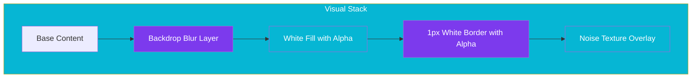

import Callout from '@components/Callout.astro';
import ImplementationNote from '@components/ImplementationNote.astro';
import CodeFile from '@components/CodeFile.astro';
import ExternalCite from '@components/ExternalCite.astro';

## Introduction

Glassmorphism has evolved from a trendy dribbble concept into a robust UI pattern for content-dense applications. By using translucent layers, we can establish visual hierarchy without overwhelming the user with heavy borders or solid backgrounds. In BlueRobin, we use this system to separate our "surface" layers (modals, sidebars) from our "content" layers (documents, data grids).

**Why Glassmorphism Matters:**

- **Visual Hierarchy**: Uses depth (z-index) and blur to signal context to the user.
- **Content Focus**: Keeps the background visible but unobtrusive, maintaining a sense of place.
- **Modern Aesthetic**: aligns with native OS design languages (macOS, Windows 11).

### What We'll Build

In this guide, we will implement the core of the BlueRobin design system. You will learn how to:

1. **Configure Tailwind v4**: Set up CSS variables for sophisticated layer compositing.
2. **Layer Composition**: Stack white opacity, variable blurs, and noise textures.
3. **Guard Accessibility**: Implement contrast checks to ensure readability on all backgrounds.

## Architecture Overview

The visual stack isn't just a single CSS property; it's a composition of layers.



## Section 1: Tailwind v4 Configuration

Tailwind v4 moves configuration from JS to CSS. We define our glass primitives directly in our CSS variables.

<Callout type="info" title="Tailwind v4">
    We leverage the new `@theme` and `@utility` directives to create composable glass utility classes.
</Callout>

```css
@theme {
  --color-glass-surface: rgba(255, 255, 255, 0.7);
  --color-glass-border: rgba(255, 255, 255, 0.5);
  --blur-glass-md: 12px;
  --blur-glass-lg: 20px;
}

@utility glass-panel {
  @apply backdrop-blur-[--blur-glass-md] bg-[--color-glass-surface] border border-[--color-glass-border];
  box-shadow: 0 4px 6px -1px rgba(0, 0, 0, 0.1), 0 2px 4px -1px rgba(0, 0, 0, 0.06);
}
```

## Section 2: The Noise Texture

To prevent the design from feeling too "plastic" or digital, we add a subtle noise texture. This mimics frosted glass more accurately.

```css
.bg-noise {
  position: relative;
}

.bg-noise::before {
  content: "";
  position: absolute;
  inset: 0;
  z-index: 10;
  pointer-events: none;
  background-image: url("data:image/svg+xml,..."); /* SVG Noise Pattern */
  opacity: 0.03;
  mix-blend-mode: overlay;
}
```

## Section 3: Handling Accessibility

The biggest risk with glassmorphism is poor contrast when the background changes.

<ImplementationNote title="Contrast Safety">
Always ensure your text has sufficient contrast against the *average* gathered color of the background, or force a minimum opacity on your glass layer.
</ImplementationNote>

We enforce a minimum `0.7` alpha on light mode glass panels to guarantee text legibility.

```html
<!-- Example Usage -->
<div class="glass-panel rounded-xl p-6 relative overflow-hidden">
    <div class="bg-noise absolute inset-0"></div>
    <h2 class="text-slate-900 font-semibold relative z-20">Document Analysis</h2>
    <p class="text-slate-700 mt-2 relative z-20">
        Processing complete. 98% accuracy.
    </p>
</div>
```

## Conclusion

By treating Glassmorphism as a system of layers rather than a single CSS trick, we achieve a polished, professional look that doesn't sacrifice usability.

**Next Steps**:
- Explore the **Figma MCP** article to see how we automate checking these designs.
- Check our **Frontend Architecture** documentation for component details.
