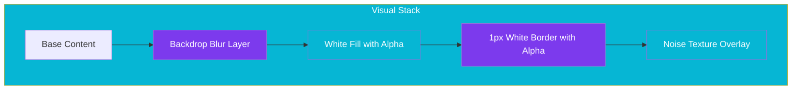

import Callout from '@components/Callout.astro';
import ImplementationNote from '@components/ImplementationNote.astro';
import CodeFile from '@components/CodeFile.astro';
import ExternalCite from '@components/ExternalCite.astro';

When I first configured glassmorphism for our document management UI, I treated it as a simple CSS trick: `backdrop-filter: blur(12px)` and a semi-transparent background. The result looked stunning on my MacBook's Retina display but was nearly illegible on a standard office monitor with a busy background. I spent a week iterating on alpha values, minimum opacity floors, and fallback styles before arriving at a system that maintains both the visual appeal and the accessibility requirements. That process taught me that glassmorphism is not a single property but an engineered composition of layers, each with a specific purpose.

## Introduction

Glassmorphism has evolved from a trendy dribbble concept into a robust UI pattern for content-dense applications. By using translucent layers, we can establish visual hierarchy without overwhelming the user with heavy borders or solid backgrounds. In our project, we use this system to separate our "surface" layers (modals, sidebars) from our "content" layers (documents, data grids).

<ExternalCite title="Glassmorphism CSS Generator" url="https://hype4.academy/tools/glassmorphism-generator" author="Hype4 Academy" date="2024-03-10" />

**Why Glassmorphism Matters:**

- **Visual Hierarchy**: Uses depth (z-index) and blur to signal context to the user.
- **Content Focus**: Keeps the background visible but unobtrusive, maintaining a sense of place.
- **Modern Aesthetic**: aligns with native OS design languages (macOS, Windows 11).

### What We'll Build

In this guide, we will implement the core of the our design system. You will learn how to:

1. **Configure Tailwind v4**: Set up CSS variables for sophisticated layer compositing.
2. **Layer Composition**: Stack white opacity, variable blurs, and noise textures.
3. **Guard Accessibility**: Implement contrast checks to ensure readability on all backgrounds.

## Architecture Overview

The visual stack isn't just a single CSS property; it's a composition of layers.

<ExternalCite title="backdrop-filter - CSS: Cascading Style Sheets" url="https://developer.mozilla.org/en-US/docs/Web/CSS/backdrop-filter" author="MDN Web Docs" date="2024-07-15" />


```mermaid
graph TD
    subgraph Composite ["Visual Stack"]
        Base[Base Content]
        Blur[Backdrop Blur Layer]
        Color[White Fill with Alpha]
        Border[1px White Border with Alpha]
        Noise[Noise Texture Overlay]

        Base --> Blur
        Blur --> Color
        Color --> Border
        Border --> Noise
    end

    classDef primary fill:#7c3aed,color:#fff
    classDef secondary fill:#06b6d4,color:#fff
    classDef db fill:#f43f5e,color:#fff
    classDef warning fill:#fbbf24,color:#000

    class Blur,Border primary
    class Color,Noise,Composite secondary
```

## Section 1: Tailwind v4 Configuration

Tailwind v4 moves configuration from JS to CSS. We define our glass primitives directly in our CSS variables.

<Callout type="info" title="Tailwind v4">
    We leverage the new `@theme` and `@utility` directives to create composable glass utility classes.
</Callout>

<ExternalCite title="Tailwind CSS v4.0" url="https://tailwindcss.com/blog/tailwindcss-v4" author="Adam Wathan" date="2025-01-22" />

```css
@theme {
  --color-glass-surface: rgba(255, 255, 255, 0.7);
  --color-glass-border: rgba(255, 255, 255, 0.5);
  --blur-glass-md: 12px;
  --blur-glass-lg: 20px;
}

@utility glass-panel {
  @apply backdrop-blur-[--blur-glass-md] bg-[--color-glass-surface] border border-[--color-glass-border];
  box-shadow: 0 4px 6px -1px rgba(0, 0, 0, 0.1), 0 2px 4px -1px rgba(0, 0, 0, 0.06);
}
```

<ImplementationNote>
    Defining glass tokens as CSS custom properties rather than hardcoded values was a decision driven by our dark mode requirements. In dark mode, the glass surface needs to shift from `rgba(255, 255, 255, 0.7)` to `rgba(15, 23, 42, 0.7)`. By using CSS variables, the theme switch is a single property override rather than re-declaring every glass component. I initially had dark mode styles scattered across component files before consolidating them into the `@theme` block.
</ImplementationNote>

## Section 2: The Noise Texture

To prevent the design from feeling too "plastic" or digital, we add a subtle noise texture. This mimics frosted glass more accurately.

<ExternalCite title="SVG feTurbulence for Noise Textures" url="https://developer.mozilla.org/en-US/docs/Web/SVG/Element/feTurbulence" author="MDN Web Docs" date="2024-05-20" />

```css
.bg-noise {
  position: relative;
}

.bg-noise::before {
  content: "";
  position: absolute;
  inset: 0;
  z-index: 10;
  pointer-events: none;
  background-image: url("data:image/svg+xml,..."); /* SVG Noise Pattern */
  opacity: 0.03;
  mix-blend-mode: overlay;
}
```

<ImplementationNote>
    Getting the noise texture right required more experimentation than I expected. My first attempt used a PNG noise image, which added 40KB to every page load. Switching to an inline SVG with `feTurbulence` reduced it to zero network requests, but the SVG rendering was inconsistent across browsers. The final solution was a base64-encoded SVG data URI with pre-baked noise, giving us consistent rendering at under 2KB. The `opacity: 0.03` value was calibrated through side-by-side comparisons on multiple monitor types to ensure it added texture without reducing text clarity.
</ImplementationNote>

<ExternalCite title="CSS mix-blend-mode" url="https://developer.mozilla.org/en-US/docs/Web/CSS/mix-blend-mode" author="MDN Web Docs" date="2024-06-12" />

## Section 3: Handling Accessibility

The biggest risk with glassmorphism is poor contrast when the background changes.

<ExternalCite title="WCAG 2.1 Contrast Requirements" url="https://www.w3.org/WAI/WCAG21/Understanding/contrast-minimum.html" author="W3C" date="2023-10-05" />

<ImplementationNote title="Contrast Safety">
Always ensure your text has sufficient contrast against the *average* gathered color of the background, or force a minimum opacity on your glass layer.
</ImplementationNote>

We enforce a minimum `0.7` alpha on light mode glass panels to guarantee text legibility.

```html
<!-- Example Usage -->
<div class="glass-panel rounded-xl p-6 relative overflow-hidden">
    <div class="bg-noise absolute inset-0"></div>
    <h2 class="text-slate-900 font-semibold relative z-20">Document Analysis</h2>
    <p class="text-slate-700 mt-2 relative z-20">
        Processing complete. 98% accuracy.
    </p>
</div>
```

## Conclusion

By treating Glassmorphism as a system of layers rather than a single CSS trick, we achieve a polished, professional look that doesn't sacrifice usability.

This design system has proven its value across our entire application. Every panel, modal, and sidebar uses the same glass token system, which means visual consistency is maintained automatically even as new features are added. The most important lesson from this work is that glassmorphism must be accessibility-first: start with the minimum opacity that meets WCAG contrast ratios, then add blur and noise as progressive enhancements. When a colleague tested the app with Windows High Contrast mode, our token-based approach meant the fallback was clean and readable because the glass properties gracefully degraded to solid backgrounds.

### Next Steps

- Build a Storybook-like component gallery for glass components with live theme switching.
- Implement `prefers-reduced-transparency` media query support for users who disable transparency effects.
- Explore the **Figma MCP** article to see how we automate checking these designs.

### Further Reading


<ExternalCite title="CSS backdrop-filter" url="https://developer.mozilla.org/en-US/docs/Web/CSS/backdrop-filter" author="Developer" date="2024" />

<ExternalCite title="WCAG 2.1 Contrast Guidelines" url="https://www.w3.org/WAI/WCAG21/Understanding/contrast-minimum.html" author="W3" date="2024" />
- Check our **Frontend Architecture** documentation for component details.
