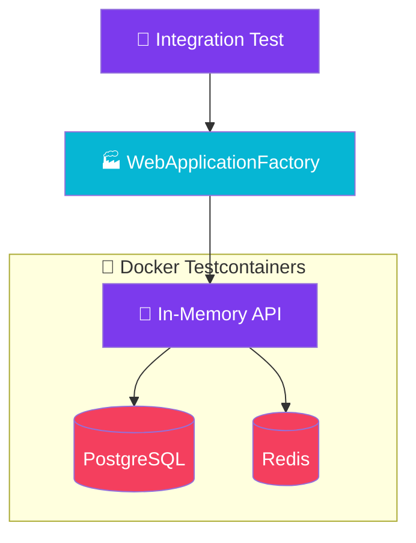

import Callout from '@components/Callout.astro';
import ImplementationNote from '@components/ImplementationNote.astro';
import ExternalCite from '@components/ExternalCite.astro';

When I first configured Testcontainers in our CI pipeline, the Docker socket permission issue nearly made me abandon the whole approach. Locally everything worked perfectly -- containers spun up, tests ran, containers tore down. But in our GitHub Actions self-hosted runner, the test suite would fail immediately with a cryptic "Cannot connect to the Docker daemon" error. The runner process did not have access to `/var/run/docker.sock`, and fixing it required adjusting the runner's group membership and restarting the service. Then came the next surprise: container startup times in CI were three times slower than local because the runner had no image cache. I ended up adding a pre-pull step in the workflow that ensures the PostgreSQL and Redis images are cached before the test job runs. These infrastructure hurdles are not documented in any testing guide, but they are exactly what you will hit when moving from local development to CI.

## Introduction

Integration tests verify that components work together correctly. While unit tests verify isolation, integration tests ensure your code works with the database, cache, and other infrastructure.
<ExternalCite title="Testcontainers for .NET" url="https://testcontainers.com/guides/getting-started-with-testcontainers-for-dotnet/" author="Testcontainers" date="2024-08-15" />

This guide covers building maintainable integration tests with real dependencies using Testcontainers, avoiding the "it works on my machine" syndrome.

## Architecture Overview



## Implementation

## Test Infrastructure

### Package References

```xml
<!-- Archives.Tests.Integration.csproj -->
<PackageReference Include="Microsoft.AspNetCore.Mvc.Testing" Version="10.0.0" />
<PackageReference Include="Testcontainers" Version="3.9.0" />
<PackageReference Include="Testcontainers.PostgreSql" Version="3.9.0" />
<PackageReference Include="Testcontainers.Redis" Version="3.9.0" />
<PackageReference Include="xunit" Version="2.9.0" />
<PackageReference Include="FluentAssertions" Version="6.12.0" />
<PackageReference Include="Bogus" Version="35.0.0" />
```

### Custom WebApplicationFactory

The `WebApplicationFactory<T>` from the ASP.NET Core testing infrastructure creates an in-memory test server, which Testcontainers complements by providing real database and cache instances.
<ExternalCite title="Integration tests in ASP.NET Core" url="https://learn.microsoft.com/en-us/aspnet/core/test/integration-tests" author="Microsoft" date="2024-10-20" />

```csharp
// Tests/Integration/Infrastructure/CustomWebApplicationFactory.cs
public sealed class CustomWebApplicationFactory : WebApplicationFactory<Program>, IAsyncLifetime
{
    private readonly PostgreSqlContainer _postgres;
    private readonly RedisContainer _redis;

    public CustomWebApplicationFactory()
    {
        _postgres = new PostgreSqlBuilder()
            .WithImage("postgres:16-alpine")
            .WithDatabase("archives_test")
            .WithUsername("test")
            .WithPassword("test")
            .Build();

        _redis = new RedisBuilder()
            .WithImage("redis:7-alpine")
            .Build();
    }

    public async Task InitializeAsync()
    {
        await _postgres.StartAsync();
        await _redis.StartAsync();
    }

    public new async Task DisposeAsync()
    {
        await _postgres.DisposeAsync();
        await _redis.DisposeAsync();
        await base.DisposeAsync();
    }

    protected override void ConfigureWebHost(IWebHostBuilder builder)
    {
        builder.ConfigureServices(services =>
        {
            // Remove existing DbContext registration
            var descriptor = services.SingleOrDefault(
                d => d.ServiceType == typeof(DbContextOptions<AppDbContext>));
            if (descriptor is not null)
            {
                services.Remove(descriptor);
            }

            // Add test database
            services.AddDbContext<AppDbContext>(options =>
            {
                options.UseNpgsql(_postgres.GetConnectionString());
            });

            // Configure Redis
            services.AddStackExchangeRedisCache(options =>
            {
                options.Configuration = _redis.GetConnectionString();
            });

            // Apply migrations
            var sp = services.BuildServiceProvider();
            using var scope = sp.CreateScope();
            var db = scope.ServiceProvider.GetRequiredService<AppDbContext>();
            db.Database.Migrate();
        });

        builder.ConfigureTestServices(services =>
        {
            // Mock external services
            services.AddSingleton<IMinioClient, FakeMinioClient>();
            services.AddSingleton<INatsConnection, FakeNatsConnection>();
        });
    }
}
```

<Callout type="tip">
Testcontainers automatically starts and stops Docker containers for your tests. Each test run gets a fresh, isolated database instance.
</Callout>

<ImplementationNote>
The Docker socket issue in CI was the first hurdle, but container startup time was the ongoing pain point. Each test run was spending 8-12 seconds just waiting for PostgreSQL and Redis to become healthy. The fix was twofold: first, I switched to Alpine-based images (`postgres:16-alpine` instead of `postgres:16`) which cut image pull times significantly. Second, I used xUnit's `ICollectionFixture` to share a single set of containers across all test classes, so the 8-second startup only happens once per test run instead of once per test class. That single change cut our integration test suite time from 4 minutes to under 90 seconds.
</ImplementationNote>

## Collection Fixture

### Shared Test Infrastructure

```csharp
// Tests/Integration/Infrastructure/IntegrationTestCollection.cs
[CollectionDefinition(Name)]
public sealed class IntegrationTestCollection : ICollectionFixture<CustomWebApplicationFactory>
{
    public const string Name = "Integration";
}

// Base class for all integration tests
public abstract class IntegrationTestBase : IClassFixture<CustomWebApplicationFactory>
{
    protected readonly HttpClient Client;
    protected readonly CustomWebApplicationFactory Factory;
    protected readonly IServiceScope Scope;
    protected readonly AppDbContext DbContext;

    protected IntegrationTestBase(CustomWebApplicationFactory factory)
    {
        Factory = factory;
        Client = factory.CreateClient();
        Scope = factory.Services.CreateScope();
        DbContext = Scope.ServiceProvider.GetRequiredService<AppDbContext>();
    }

    protected async Task<T> GetServiceAsync<T>() where T : notnull
    {
        return Scope.ServiceProvider.GetRequiredService<T>();
    }

    protected async Task AuthenticateAsync(string userId = "test-user")
    {
        Client.DefaultRequestHeaders.Authorization =
            new AuthenticationHeaderValue("Bearer", GenerateTestToken(userId));
    }

    private string GenerateTestToken(string userId)
    {
        // Generate test JWT token
        var claims = new[]
        {
            new Claim("sub", userId),
            new Claim("app_user_id", "testuser1"),
            new Claim("email", "test@example.com")
        };

        var key = new SymmetricSecurityKey(Encoding.UTF8.GetBytes("test-secret-key-minimum-length-256-bits"));
        var creds = new SigningCredentials(key, SecurityAlgorithms.HmacSha256);

        var token = new JwtSecurityToken(
            issuer: "test",
            audience: "test",
            claims: claims,
            expires: DateTime.UtcNow.AddHours(1),
            signingCredentials: creds);

        return new JwtSecurityTokenHandler().WriteToken(token);
    }
}
```

xUnit's fixture model provides a clean way to share expensive resources like database containers across test classes without sacrificing test isolation.
<ExternalCite title="xUnit Shared Context" url="https://xunit.net/docs/shared-context" author="xUnit.net" date="2024-05-10" />

## API Integration Tests

### Document Endpoint Tests

```csharp
// Tests/Integration/Endpoints/DocumentEndpointTests.cs
[Collection(IntegrationTestCollection.Name)]
public sealed class DocumentEndpointTests : IntegrationTestBase
{
    private readonly Faker<CreateDocumentRequest> _requestFaker;

    public DocumentEndpointTests(CustomWebApplicationFactory factory) : base(factory)
    {
        _requestFaker = new Faker<CreateDocumentRequest>()
            .RuleFor(x => x.Name, f => f.System.FileName("pdf"))
            .RuleFor(x => x.Description, f => f.Lorem.Sentence());
    }

    [Fact]
    public async Task CreateDocument_WithValidRequest_ReturnsCreated()
    {
        // Arrange
        await AuthenticateAsync();
        var request = _requestFaker.Generate();

        // Act
        var response = await Client.PostAsJsonAsync("/api/documents", request);

        // Assert
        response.StatusCode.Should().Be(HttpStatusCode.Created);

        var document = await response.Content.ReadFromJsonAsync<DocumentResponse>();
        document.Should().NotBeNull();
        document!.Name.Should().Be(request.Name);
        document.Id.Should().NotBeEmpty();

        // Verify in database
        var dbDocument = await DbContext.Documents
            .FirstOrDefaultAsync(d => d.Id == DocumentId.From(document.Id));
        dbDocument.Should().NotBeNull();
    }

    [Fact]
    public async Task GetDocument_WhenNotFound_ReturnsNotFound()
    {
        // Arrange
        await AuthenticateAsync();
        var nonExistentId = Guid.NewGuid();

        // Act
        var response = await Client.GetAsync($"/api/documents/{nonExistentId}");

        // Assert
        response.StatusCode.Should().Be(HttpStatusCode.NotFound);
    }

    [Fact]
    public async Task GetDocuments_WithPagination_ReturnsPagedResults()
    {
        // Arrange
        await AuthenticateAsync();
        await SeedDocumentsAsync(25);

        // Act
        var response = await Client.GetAsync("/api/documents?page=2&limit=10");

        // Assert
        response.StatusCode.Should().Be(HttpStatusCode.OK);

        var result = await response.Content.ReadFromJsonAsync<PagedResult<DocumentResponse>>();
        result.Should().NotBeNull();
        result!.Items.Should().HaveCount(10);
        result.TotalCount.Should().Be(25);
        result.Page.Should().Be(2);
    }

    private async Task SeedDocumentsAsync(int count)
    {
        var userId = CustomId.From("testuser1");
        var documents = Enumerable.Range(0, count)
            .Select(_ => Document.Create(_requestFaker.Generate().Name, userId))
            .ToList();

        DbContext.Documents.AddRange(documents);
        await DbContext.SaveChangesAsync();
    }
}
```

<ImplementationNote>
Use Bogus for generating realistic test data. It provides consistent, reproducible data generation with fluent configuration.
</ImplementationNote>

## Repository Integration Tests

### Testing with Real Database

```csharp
// Tests/Integration/Repositories/DocumentRepositoryTests.cs
[Collection(IntegrationTestCollection.Name)]
public sealed class DocumentRepositoryTests : IntegrationTestBase
{
    private readonly IDocumentRepository _repository;

    public DocumentRepositoryTests(CustomWebApplicationFactory factory) : base(factory)
    {
        _repository = Scope.ServiceProvider.GetRequiredService<IDocumentRepository>();
    }

    [Fact]
    public async Task AddAsync_WithValidDocument_PersistsToDatabase()
    {
        // Arrange
        var userId = CustomId.From("testuser1");
        var document = Document.Create("test-document.pdf", userId);

        // Act
        await _repository.AddAsync(document, CancellationToken.None);

        // Assert
        var retrieved = await DbContext.Documents
            .FirstOrDefaultAsync(d => d.Id == document.Id);

        retrieved.Should().NotBeNull();
        retrieved!.Name.Should().Be("test-document.pdf");
        retrieved.OwnerId.Should().Be(userId);
    }

    [Fact]
    public async Task GetByOwnerAsync_ReturnsOnlyUserDocuments()
    {
        // Arrange
        var user1 = CustomId.From("user1111");
        var user2 = CustomId.From("user2222");

        await _repository.AddAsync(Document.Create("doc1.pdf", user1), CancellationToken.None);
        await _repository.AddAsync(Document.Create("doc2.pdf", user1), CancellationToken.None);
        await _repository.AddAsync(Document.Create("doc3.pdf", user2), CancellationToken.None);

        // Act
        var user1Documents = await _repository.GetByOwnerAsync(user1, CancellationToken.None);

        // Assert
        user1Documents.Should().HaveCount(2);
        user1Documents.Should().AllSatisfy(d => d.OwnerId.Should().Be(user1));
    }

    [Fact]
    public async Task UpdateAsync_WithOptimisticConcurrency_ThrowsOnConflict()
    {
        // Arrange
        var userId = CustomId.From("testuser1");
        var document = Document.Create("test.pdf", userId);
        await _repository.AddAsync(document, CancellationToken.None);

        // Simulate concurrent modification
        await DbContext.Database.ExecuteSqlRawAsync(
            "UPDATE \"Documents\" SET \"Name\" = 'modified.pdf' WHERE \"Id\" = {0}",
            document.Id.Value);

        // Act & Assert
        document.Rename("new-name.pdf");
        await Assert.ThrowsAsync<DbUpdateConcurrencyException>(
            () => _repository.UpdateAsync(document, CancellationToken.None));
    }
}
```

FluentAssertions provides a rich, readable assertion API that makes test failures easier to diagnose compared to the default xUnit assertions.
<ExternalCite title="FluentAssertions" url="https://fluentassertions.com/" author="Dennis Doomen" date="2024-06-20" />

## Service Integration Tests

### Testing Service Composition

```csharp
// Tests/Integration/Services/DocumentProcessingServiceTests.cs
[Collection(IntegrationTestCollection.Name)]
public sealed class DocumentProcessingServiceTests : IntegrationTestBase
{
    private readonly IDocumentProcessingService _service;

    public DocumentProcessingServiceTests(CustomWebApplicationFactory factory) : base(factory)
    {
        _service = Scope.ServiceProvider.GetRequiredService<IDocumentProcessingService>();
    }

    [Fact]
    public async Task ProcessDocumentAsync_WithValidDocument_UpdatesStatus()
    {
        // Arrange
        var userId = CustomId.From("testuser1");
        var document = Document.Create("test.pdf", userId);
        DbContext.Documents.Add(document);
        await DbContext.SaveChangesAsync();

        // Act
        await _service.ProcessDocumentAsync(document.Id, CancellationToken.None);

        // Assert
        DbContext.Entry(document).Reload();
        document.Status.Should().Be(DocumentStatus.Processed);
        document.ProcessedAt.Should().NotBeNull();
    }
}
```

## Test Data Builders

### Fluent Builder Pattern

```csharp
// Tests/Integration/Builders/DocumentBuilder.cs
public sealed class DocumentBuilder
{
    private string _name = "default.pdf";
    private CustomId _ownerId = CustomId.From("testuser1");
    private DocumentStatus _status = DocumentStatus.Pending;
    private string? _content;

    public DocumentBuilder WithName(string name)
    {
        _name = name;
        return this;
    }

    public DocumentBuilder WithOwner(string ownerId)
    {
        _ownerId = CustomId.From(ownerId);
        return this;
    }

    public DocumentBuilder WithStatus(DocumentStatus status)
    {
        _status = status;
        return this;
    }

    public DocumentBuilder WithContent(string content)
    {
        _content = content;
        return this;
    }

    public Document Build()
    {
        var document = Document.Create(_name, _ownerId);

        if (_status != DocumentStatus.Pending)
        {
            // Use reflection or internal method to set status for testing
            typeof(Document)
                .GetProperty(nameof(Document.Status))!
                .SetValue(document, _status);
        }

        if (_content is not null)
        {
            document.SetContent(_content, Array.Empty<float>());
        }

        return document;
    }
}

// Usage
var document = new DocumentBuilder()
    .WithName("report.pdf")
    .WithOwner("user1234")
    .WithStatus(DocumentStatus.Processed)
    .Build();
```

Bogus combined with the builder pattern provides both randomized and deterministic test data construction, which is essential for covering edge cases while keeping tests readable.
<ExternalCite title="Bogus - Fake Data Generator for .NET" url="https://github.com/bchavez/Bogus" author="Brian Chavez" date="2024-04-15" />

## Test Cleanup

### Database Reset Between Tests

```csharp
// Tests/Integration/Infrastructure/DatabaseReset.cs
public sealed class DatabaseReset : IAsyncLifetime
{
    private readonly AppDbContext _context;

    public DatabaseReset(AppDbContext context) => _context = context;

    public Task InitializeAsync() => Task.CompletedTask;

    public async Task DisposeAsync()
    {
        // Clean up test data
        _context.Documents.RemoveRange(_context.Documents);
        _context.Users.RemoveRange(_context.Users.Where(u => u.Email.Contains("test")));
        await _context.SaveChangesAsync();
    }
}
```

<Callout type="warning">
Consider using Respawn for faster database cleanup in large test suites. It resets the database by deleting data rather than recreating the schema.
</Callout>

<ImplementationNote>
Database cleanup between tests was a source of flaky failures for weeks. The naive approach of deleting rows in `DisposeAsync` caused foreign key constraint violations when tests ran in parallel, because xUnit runs test classes concurrently by default. I tried two approaches: first, wrapping each test in a transaction that gets rolled back (fast but incompatible with tests that need to verify committed data), and second, using Respawn to intelligently delete all data respecting foreign key order. Respawn ended up being the right solution -- it is fast, handles the constraint ordering automatically, and we call it in the base class `InitializeAsync` so each test starts with a clean database. The key configuration was excluding the `__EFMigrationsHistory` table so the schema stays intact between resets.
</ImplementationNote>

## Conclusion

Integration testing with Testcontainers fundamentally changed our confidence in deployments. Before Testcontainers, our integration tests used an in-memory SQLite database that behaved differently from PostgreSQL in subtle but critical ways -- array columns, JSON operators, and index behavior all diverged. Bugs would slip through the test suite and only appear in staging. With Testcontainers, every test runs against real PostgreSQL and real Redis, and the "works on my machine" problem is gone because the containers are identical in every environment. The initial infrastructure setup -- Docker socket permissions, image caching, container startup optimization -- took a few days to get right, but the payoff has been enormous. Our deployment failure rate dropped from roughly one-in-five to nearly zero, and the team now trusts the test suite enough to merge with confidence.

| Component | Approach |
|-----------|----------|
| Database | Testcontainers with PostgreSQL |
| Cache | Testcontainers with Redis |
| External APIs | Fake implementations |
| Authentication | Test JWT tokens |
| Data | Bogus + Builder pattern |

### Next Steps
- [Error Handling and Resilience Patterns](/error-handling-resilience-patterns-dotnet)
- [EF Core Migrations and Schema Management](/efcore-migrations-schema-management)
- [Background Job Processing in .NET](/dotnet-background-job-processing)

### Further Reading


<ExternalCite title="Testcontainers for .NET getting started guide" url="https://testcontainers.com/guides/getting-started-with-testcontainers-for-dotnet/" author="Testcontainers" date="2024" />

<ExternalCite title="Microsoft: Integration tests in ASP.NET Core" url="https://learn.microsoft.com/en-us/aspnet/core/test/integration-tests" author="Microsoft" date="2024" />

<ExternalCite title="xUnit.net shared context and fixtures" url="https://xunit.net/docs/shared-context" author="xUnit.net Authors" date="2024" />

<ExternalCite title="FluentAssertions documentation" url="https://fluentassertions.com/" author="Fluentassertions" date="2024" />

<ExternalCite title="Bogus fake data generator for .NET" url="https://github.com/bchavez/Bogus" author="GitHub Community" date="2024" />
<ExternalCite title="Testcontainers for .NET" url="https://testcontainers.com/guides/getting-started-with-testcontainers-for-dotnet/" author="Testcontainers" date="2024-08-15" />
