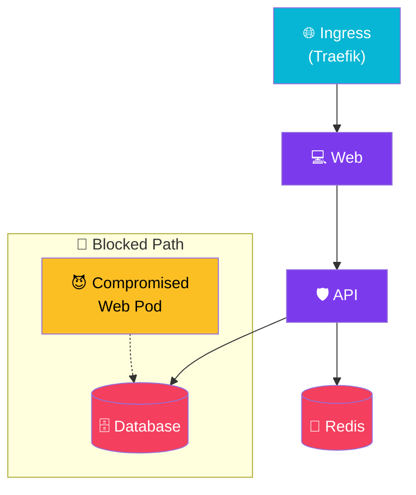

import Callout from '@components/Callout.astro';
import ImplementationNote from '@components/ImplementationNote.astro';
import ExternalCite from '@components/ExternalCite.astro';

When I first deployed default-deny network policies across my homelab cluster, I immediately broke everything. The API could not reach PostgreSQL, the workers could not pull from NATS, and even DNS resolution stopped working because I had forgotten to allow egress to kube-system on port 53. It took me an entire evening with `kubectl logs` and Hubble flow traces to understand the cascade of failures. That painful experience taught me to always deploy allow policies before deny policies, and to keep a validation script handy. This article is the playbook I built from those hard-won lessons.

## Introduction

In a flat network, a compromised pod can attack any other pod in the cluster. Network Policies act as a firewall for pods, enabling a Zero Trust architecture where communication is denied by default and explicitly allowed only where necessary. This guide demonstrates how to implement a defense-in-depth strategy using Kubernetes Network Policies, ensuring that services can only communicate with their valid dependencies.

<ExternalCite title="Network Policies" url="https://kubernetes.io/docs/concepts/services-networking/network-policies/" author="Kubernetes" date="2024-03-01" />

## Architecture Overview

Network Policies enforce a whitelist model. All traffic is blocked unless explicitly allowed.


```mermaid
flowchart TB
    Traefik["🌐 Ingress<br/>(Traefik)"] --> Web["💻 Web"]
    Web --> API["🛡️ API"]
    
    API --> DB[("🗄️ Database")]
    API --> Cache[("🧊 Redis")]
    
    subgraph Attack["🚫 Blocked Path"]
        Attacker["😈 Compromised<br/>Web Pod"] -.-> DB
    end

    classDef primary fill:#7c3aed,color:#fff
    classDef secondary fill:#06b6d4,color:#fff
    classDef db fill:#f43f5e,color:#fff
    classDef warning fill:#fbbf24,color:#000

    class Web,API primary
    class Traefik secondary
    class DB,Cache db
    class Attacker warning
```

## Implementation

### Default Deny Policies

#### Deny All Ingress

```yaml
# core-infra/security/default-deny-ingress.yaml
apiVersion: networking.k8s.io/v1
kind: NetworkPolicy
metadata:
  name: default-deny-ingress
  namespace: myapp-staging
spec:
  podSelector: {}
  policyTypes:
    - Ingress
```

#### Deny All Egress

```yaml
# core-infra/security/default-deny-egress.yaml
apiVersion: networking.k8s.io/v1
kind: NetworkPolicy
metadata:
  name: default-deny-egress
  namespace: myapp-staging
spec:
  podSelector: {}
  policyTypes:
    - Egress
```

#### Combined Default Deny

```yaml
# core-infra/security/default-deny-all.yaml
apiVersion: networking.k8s.io/v1
kind: NetworkPolicy
metadata:
  name: default-deny-all
  namespace: myapp-staging
spec:
  podSelector: {}
  policyTypes:
    - Ingress
    - Egress
```

<Callout type="warning">
Always deploy default-deny policies **after** allow policies are in place, or you may lock yourself out of the cluster.
</Callout>

<ExternalCite title="NIST SP 800-207: Zero Trust Architecture" url="https://csrc.nist.gov/publications/detail/sp/800-207/final" author="Scott Rose et al." date="2020-08-11" />

### Allow Policies

#### API to Database

```yaml
# apps/myapp-api/network-policy.yaml
apiVersion: networking.k8s.io/v1
kind: NetworkPolicy
metadata:
  name: myapp-api-allow
  namespace: myapp-staging
spec:
  podSelector:
    matchLabels:
      app.kubernetes.io/name: myapp-api
  policyTypes:
    - Ingress
    - Egress
  ingress:
    # Allow from Traefik ingress
    - from:
        - namespaceSelector:
            matchLabels:
              kubernetes.io/metadata.name: traefik-system
          podSelector:
            matchLabels:
              app.kubernetes.io/name: traefik
      ports:
        - protocol: TCP
          port: 8080
  egress:
    # Allow to PostgreSQL
    - to:
        - namespaceSelector:
            matchLabels:
              kubernetes.io/metadata.name: data-layer
          podSelector:
            matchLabels:
              app.kubernetes.io/name: postgresql
      ports:
        - protocol: TCP
          port: 5432
    # Allow to NATS
    - to:
        - namespaceSelector:
            matchLabels:
              kubernetes.io/metadata.name: data-layer
          podSelector:
            matchLabels:
              app.kubernetes.io/name: nats
      ports:
        - protocol: TCP
          port: 4222
    # Allow DNS
    - to:
        - namespaceSelector:
            matchLabels:
              kubernetes.io/metadata.name: kube-system
      ports:
        - protocol: UDP
          port: 53
        - protocol: TCP
          port: 53
```

<ImplementationNote title="DNS Egress Is Non-Negotiable">
Always include DNS egress rules (port 53) or pods won't be able to resolve service names. This is a common source of issues when implementing network policies. I once spent two hours debugging why my API pods could not connect to PostgreSQL, only to realize the issue was not the database policy at all -- the pods simply could not resolve `postgresql.data-layer.svc.cluster.local` because DNS egress was blocked. My rule of thumb now is: DNS egress to kube-system is the very first allow rule I write for any namespace.
</ImplementationNote>

#### Worker to Services

```yaml
# apps/myapp-workers/network-policy.yaml
apiVersion: networking.k8s.io/v1
kind: NetworkPolicy
metadata:
  name: myapp-workers-allow
  namespace: myapp-staging
spec:
  podSelector:
    matchLabels:
      app.kubernetes.io/name: myapp-workers
  policyTypes:
    - Egress
  egress:
    # PostgreSQL
    - to:
        - namespaceSelector:
            matchLabels:
              kubernetes.io/metadata.name: data-layer
          podSelector:
            matchLabels:
              app.kubernetes.io/name: postgresql
      ports:
        - protocol: TCP
          port: 5432
    # NATS
    - to:
        - namespaceSelector:
            matchLabels:
              kubernetes.io/metadata.name: data-layer
          podSelector:
            matchLabels:
              app.kubernetes.io/name: nats
      ports:
        - protocol: TCP
          port: 4222
    # Qdrant
    - to:
        - namespaceSelector:
            matchLabels:
              kubernetes.io/metadata.name: data-layer
          podSelector:
            matchLabels:
              app.kubernetes.io/name: qdrant
      ports:
        - protocol: TCP
          port: 6333
        - protocol: TCP
          port: 6334
    # MinIO
    - to:
        - namespaceSelector:
            matchLabels:
              kubernetes.io/metadata.name: data-layer
          podSelector:
            matchLabels:
              app.kubernetes.io/name: minio
      ports:
        - protocol: TCP
          port: 9000
    # Ollama AI
    - to:
        - namespaceSelector:
            matchLabels:
              kubernetes.io/metadata.name: ai
          podSelector:
            matchLabels:
              app.kubernetes.io/name: ollama
      ports:
        - protocol: TCP
          port: 11434
    # DNS
    - to:
        - namespaceSelector:
            matchLabels:
              kubernetes.io/metadata.name: kube-system
      ports:
        - protocol: UDP
          port: 53
```

#### Web to API

```yaml
# apps/my-web-client/network-policy.yaml
apiVersion: networking.k8s.io/v1
kind: NetworkPolicy
metadata:
  name: my-web-client-allow
  namespace: myapp-staging
spec:
  podSelector:
    matchLabels:
      app.kubernetes.io/name: my-web-client
  policyTypes:
    - Ingress
    - Egress
  ingress:
    # Allow from Traefik
    - from:
        - namespaceSelector:
            matchLabels:
              kubernetes.io/metadata.name: traefik-system
      ports:
        - protocol: TCP
          port: 8080
  egress:
    # Allow to API
    - to:
        - podSelector:
            matchLabels:
              app.kubernetes.io/name: myapp-api
      ports:
        - protocol: TCP
          port: 8080
    # Allow to NATS (real-time updates)
    - to:
        - namespaceSelector:
            matchLabels:
              kubernetes.io/metadata.name: data-layer
          podSelector:
            matchLabels:
              app.kubernetes.io/name: nats
      ports:
        - protocol: TCP
          port: 4222
    # DNS
    - to:
        - namespaceSelector:
            matchLabels:
              kubernetes.io/metadata.name: kube-system
      ports:
        - protocol: UDP
          port: 53
```

### Database Layer Policies

#### PostgreSQL Access Control

```yaml
# infrastructure/data-layer/postgresql-network-policy.yaml
apiVersion: networking.k8s.io/v1
kind: NetworkPolicy
metadata:
  name: postgresql-allow
  namespace: data-layer
spec:
  podSelector:
    matchLabels:
      app.kubernetes.io/name: postgresql
  policyTypes:
    - Ingress
  ingress:
    # Allow from staging API and workers
    - from:
        - namespaceSelector:
            matchLabels:
              kubernetes.io/metadata.name: myapp-staging
          podSelector:
            matchExpressions:
              - key: app.kubernetes.io/name
                operator: In
                values:
                  - myapp-api
                  - myapp-workers
                  - my-web-client
      ports:
        - protocol: TCP
          port: 5432
    # Allow from production
    - from:
        - namespaceSelector:
            matchLabels:
              kubernetes.io/metadata.name: myapp-prod
          podSelector:
            matchExpressions:
              - key: app.kubernetes.io/name
                operator: In
                values:
                  - myapp-api
                  - myapp-workers
                  - my-web-client
      ports:
        - protocol: TCP
          port: 5432
    # Allow from CNPG operator
    - from:
        - namespaceSelector:
            matchLabels:
              kubernetes.io/metadata.name: cnpg-system
      ports:
        - protocol: TCP
          port: 5432
```

#### NATS Access Control

```yaml
# infrastructure/data-layer/nats-network-policy.yaml
apiVersion: networking.k8s.io/v1
kind: NetworkPolicy
metadata:
  name: nats-allow
  namespace: data-layer
spec:
  podSelector:
    matchLabels:
      app.kubernetes.io/name: nats
  policyTypes:
    - Ingress
  ingress:
    # Client connections
    - from:
        - namespaceSelector:
            matchExpressions:
              - key: kubernetes.io/metadata.name
                operator: In
                values:
                  - myapp-staging
                  - myapp-prod
      ports:
        - protocol: TCP
          port: 4222
    # Cluster communication (between NATS pods)
    - from:
        - podSelector:
            matchLabels:
              app.kubernetes.io/name: nats
      ports:
        - protocol: TCP
          port: 6222
    # Leafnode connections
    - from:
        - podSelector:
            matchLabels:
              app.kubernetes.io/name: nats
      ports:
        - protocol: TCP
          port: 7422
```

### CIDR-Based Rules

#### External API Access

```yaml
# Allow egress to external APIs
apiVersion: networking.k8s.io/v1
kind: NetworkPolicy
metadata:
  name: allow-external-apis
  namespace: myapp-staging
spec:
  podSelector:
    matchLabels:
      app.kubernetes.io/name: myapp-workers
  policyTypes:
    - Egress
  egress:
    # Allow HTTPS to external APIs
    - to:
        - ipBlock:
            cidr: 0.0.0.0/0
            except:
              - 10.0.0.0/8
              - 172.16.0.0/12
              - 192.168.0.0/16
      ports:
        - protocol: TCP
          port: 443
```

<Callout type="tip">
Exclude private IP ranges when allowing external access to prevent bypassing internal network policies.
</Callout>

### Cilium Enhanced Policies

<ExternalCite title="Cilium Network Policy Documentation" url="https://docs.cilium.io/en/stable/security/policy/" author="Cilium" date="2024-05-15" />

#### Layer 7 HTTP Policy

```yaml
# Cilium L7 policy for API path filtering
apiVersion: cilium.io/v2
kind: CiliumNetworkPolicy
metadata:
  name: myapp-api-l7
  namespace: myapp-staging
spec:
  endpointSelector:
    matchLabels:
      app.kubernetes.io/name: myapp-api
  ingress:
    - fromEndpoints:
        - matchLabels:
            app.kubernetes.io/name: my-web-client
      toPorts:
        - ports:
            - port: "8080"
              protocol: TCP
          rules:
            http:
              - method: "GET"
                path: "/api/documents.*"
              - method: "POST"
                path: "/api/documents"
              - method: "GET"
                path: "/health.*"
```

#### DNS Policy

```yaml
# Cilium DNS egress policy
apiVersion: cilium.io/v2
kind: CiliumNetworkPolicy
metadata:
  name: allow-specific-dns
  namespace: myapp-staging
spec:
  endpointSelector:
    matchLabels:
      app.kubernetes.io/name: myapp-workers
  egress:
    - toEndpoints:
        - matchLabels:
            k8s:io.kubernetes.pod.namespace: kube-system
            k8s-app: kube-dns
      toPorts:
        - ports:
            - port: "53"
              protocol: UDP
          rules:
            dns:
              - matchPattern: "*.svc.cluster.local"
              - matchName: "api.openai.com"
```

<ImplementationNote title="Cilium vs Standard NetworkPolicy Gotchas">
When I migrated from standard Kubernetes NetworkPolicy resources to CiliumNetworkPolicy, I discovered they do not merge the way I expected. Cilium evaluates its own policies separately from the standard K8s ones, and having both active on the same pods created confusing allow/deny conflicts. My Hubble traces showed traffic being allowed by the Cilium policy but dropped by the standard policy, or vice versa. I ended up standardizing entirely on CiliumNetworkPolicy for namespaces where I needed L7 filtering, and keeping the standard policies only for namespaces that might run on non-Cilium clusters. The key lesson: pick one policy type per namespace and stick with it.
</ImplementationNote>

### Monitoring Network Policies

#### Policy Audit with Cilium

```yaml
# Enable Hubble for network flow visibility
apiVersion: cilium.io/v2
kind: CiliumNetworkPolicy
metadata:
  name: audit-deny
  namespace: myapp-staging
  annotations:
    io.cilium.proxy-visibility: "<Egress/80/TCP/HTTP>,<Ingress/8080/TCP/HTTP>"
spec:
  endpointSelector: {}
  enableDefaultDeny:
    ingress: true
    egress: true
```

#### Validation Script

```bash
#!/bin/bash
# Test network policy enforcement

# Test allowed connection
kubectl run test-client --rm -i --restart=Never \
  --image=busybox \
  -n myapp-staging \
  --labels="app.kubernetes.io/name=myapp-api" \
  -- wget -qO- --timeout=5 \
  http://postgresql.data-layer.svc.cluster.local:5432 || echo "Connection blocked (expected)"

# Test denied connection
kubectl run test-client --rm -i --restart=Never \
  --image=busybox \
  -n myapp-staging \
  --labels="app.kubernetes.io/name=test-pod" \
  -- wget -qO- --timeout=5 \
  http://postgresql.data-layer.svc.cluster.local:5432 && echo "Connection allowed (unexpected!)" || echo "Connection blocked (expected)"
```

### Testing Strategy

<ExternalCite title="Kubernetes Network Policy Recipes" url="https://github.com/ahmetb/kubernetes-network-policy-recipes" author="Ahmet Alp Balkan" date="2023-11-20" />

#### Policy Test Matrix

| Source | Destination | Port | Expected |
|--------|-------------|------|----------|
| myapp-api | postgresql | 5432 | Allow |
| myapp-api | nats | 4222 | Allow |
| myapp-api | qdrant | 6333 | Deny |
| myapp-workers | qdrant | 6333 | Allow |
| my-web-client | myapp-api | 8080 | Allow |
| my-web-client | postgresql | 5432 | Deny |
| traefik | myapp-api | 8080 | Allow |

## Conclusion

Network Policies are a fundamental building block of Kubernetes security. By starting with a default-deny posture and whitelisting required traffic, you significantly reduce the attack surface of your cluster, turning it from a soft-shell target into a hardened fortress.

Implementing these policies in my own homelab felt like going from leaving the front door wide open to installing a proper lock on every room. The upfront investment in mapping out which services genuinely need to talk to each other forced me to understand my own architecture more deeply than I had before. Every time I add a new service now, the first thing I write is its network policy -- it has become as natural as writing the Deployment manifest itself.

<ExternalCite title="Network Policies - Kubernetes Documentation" url="https://kubernetes.io/docs/concepts/services-networking/network-policies/" author="Kubernetes" date="2024-03-01" />

<ImplementationNote title="Rollout Strategy for Production">
One mistake I made early on was applying default-deny across all namespaces simultaneously. In a production-like environment, I recommend a phased rollout: start with a single low-risk namespace, validate with Hubble flow logs for at least 48 hours, then expand to the next namespace. I also keep a "break glass" script that removes the default-deny policies from all namespaces in case something goes catastrophically wrong during business hours.
</ImplementationNote>

### Next Steps

- Enable **Hubble UI** for real-time network flow visualization and policy debugging.
- Implement **CiliumClusterwideNetworkPolicy** for policies that span multiple namespaces.
- Explore **NetworkPolicy editor tools** like [Cilium Editor](https://editor.networkpolicy.io/) to visually design and validate policies before deployment.

### Further Reading


<ExternalCite title="NIST SP 800-207: Zero Trust Architecture" url="https://csrc.nist.gov/publications/detail/sp/800-207/final" author="NIST" date="2024" />

<ExternalCite title="Cilium Documentation" url="https://docs.cilium.io/" author="Docs" date="2024" />

<ExternalCite title="Kubernetes Security Best Practices" url="https://kubernetes.io/docs/concepts/security/" author="Kubernetes Authors" date="2024" />
