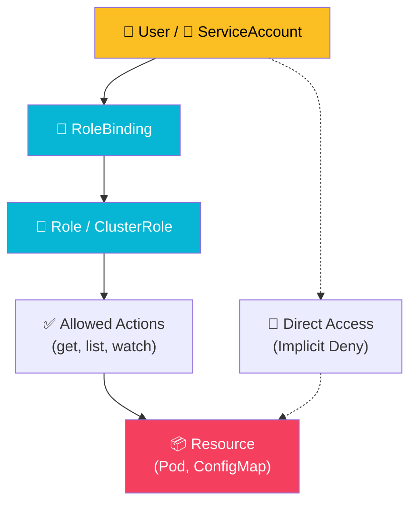

import Callout from '@components/Callout.astro';
import ImplementationNote from '@components/ImplementationNote.astro';
import ExternalCite from '@components/ExternalCite.astro';

When I first configured RBAC on my k3s homelab cluster, I made the classic mistake of running everything under the default service account with cluster-admin privileges. It worked, until I accidentally deployed a misconfigured test pod that could read Secrets from every namespace, including the production database credentials stored by External Secrets Operator. That wake-up call sent me down a rabbit hole of Role definitions, RoleBindings, and the subtle differences between namespace-scoped and cluster-scoped permissions. I spent an entire weekend rewriting every service account in the cluster to follow least-privilege principles, and I have not regretted a single minute of that effort.

## Introduction

Kubernetes defaults to a permissive stance, but in production, "everyone is an admin" is a recipe for disaster. Role-Based Access Control (RBAC) allows you to define who can do what within your cluster. This guide covers implementing least-privilege access patterns using Service Accounts, Roles, and RoleBindings, ensuring that both users and applications operate within their designated boundaries.

<ExternalCite title="Using RBAC Authorization" url="https://kubernetes.io/docs/reference/access-authn-authz/rbac/" author="Kubernetes Project" date="2024-08-01" />

<ExternalCite title="Kubernetes Security and Observability" url="https://www.oreilly.com/library/view/kubernetes-security-and/9781098107093/" author="Brendan Creane, Amit Gupta" date="2021-10-01" />

## Architecture Overview

Access to resources in Kubernetes is governed by the connection between an Identity (Subject), a set of permissions (Role), and the link between them (Binding).



## Implementation

### RBAC Components

| Resource | Scope | Purpose |
|----------|-------|---------|
| Role | Namespace | Define permissions within a namespace |
| ClusterRole | Cluster | Define cluster-wide permissions |
| RoleBinding | Namespace | Grant Role to users/service accounts |
| ClusterRoleBinding | Cluster | Grant ClusterRole cluster-wide |

### Service Accounts

#### Application Service Account

```yaml
# apps/myapp-api/serviceaccount.yaml
apiVersion: v1
kind: ServiceAccount
metadata:
  name: myapp-api
  namespace: myapp-staging
  labels:
    app.kubernetes.io/name: myapp-api
automountServiceAccountToken: false
```

<Callout type="tip">
Set `automountServiceAccountToken: false` by default and only enable it for pods that actually need Kubernetes API access.
</Callout>

<ExternalCite title="Configure Service Accounts for Pods" url="https://kubernetes.io/docs/tasks/configure-pod-container/configure-service-account/" author="Kubernetes Project" date="2024-06-15" />

<ImplementationNote title="The default service account trap">
When I first deployed the CNPG PostgreSQL operator, it kept failing with permission denied errors during leader election. I had set `automountServiceAccountToken: false` at the namespace level and forgot that the operator pod genuinely needed API access to manage its own lease objects. I spent two hours reading operator logs before I realized the token was simply not being mounted. The fix was to explicitly set `automountServiceAccountToken: true` only on the operator's Deployment spec, while keeping the default disabled for every other workload. Now my rule of thumb is: disable by default, enable per-pod with a comment explaining exactly why.
</ImplementationNote>

#### Pod Using Service Account

```yaml
# apps/myapp-api/deployment.yaml
apiVersion: apps/v1
kind: Deployment
metadata:
  name: myapp-api
  namespace: myapp-staging
spec:
  template:
    spec:
      serviceAccountName: myapp-api
      automountServiceAccountToken: false
      containers:
        - name: api
          image: myapp-api:latest
          securityContext:
            runAsNonRoot: true
            runAsUser: 1000
            readOnlyRootFilesystem: true
            allowPrivilegeEscalation: false
```

### Namespace Roles

#### Developer Role

```yaml
# core-infra/security/roles/developer-role.yaml
apiVersion: rbac.authorization.k8s.io/v1
kind: Role
metadata:
  name: developer
  namespace: myapp-staging
rules:
  # Read pods and logs
  - apiGroups: [""]
    resources: ["pods", "pods/log"]
    verbs: ["get", "list", "watch"]
  # Read deployments and services
  - apiGroups: ["apps"]
    resources: ["deployments", "replicasets"]
    verbs: ["get", "list", "watch"]
  - apiGroups: [""]
    resources: ["services", "configmaps"]
    verbs: ["get", "list", "watch"]
  # Port-forward for debugging
  - apiGroups: [""]
    resources: ["pods/portforward"]
    verbs: ["create"]
  # Exec for troubleshooting (limited)
  - apiGroups: [""]
    resources: ["pods/exec"]
    verbs: ["create"]
```

#### Operator Role

```yaml
# core-infra/security/roles/operator-role.yaml
apiVersion: rbac.authorization.k8s.io/v1
kind: Role
metadata:
  name: operator
  namespace: myapp-staging
rules:
  # Full deployment management
  - apiGroups: ["apps"]
    resources: ["deployments", "replicasets", "statefulsets"]
    verbs: ["get", "list", "watch", "update", "patch"]
  # Pod management
  - apiGroups: [""]
    resources: ["pods"]
    verbs: ["get", "list", "watch", "delete"]
  - apiGroups: [""]
    resources: ["pods/log", "pods/exec", "pods/portforward"]
    verbs: ["get", "create"]
  # ConfigMap and Secret read
  - apiGroups: [""]
    resources: ["configmaps", "secrets"]
    verbs: ["get", "list", "watch"]
  # Service management
  - apiGroups: [""]
    resources: ["services"]
    verbs: ["get", "list", "watch", "update", "patch"]
  # HPA management
  - apiGroups: ["autoscaling"]
    resources: ["horizontalpodautoscalers"]
    verbs: ["get", "list", "watch", "update", "patch"]
```

### Cluster Roles

#### Read-Only Cluster Role

```yaml
# core-infra/security/clusterroles/readonly.yaml
apiVersion: rbac.authorization.k8s.io/v1
kind: ClusterRole
metadata:
  name: cluster-readonly
rules:
  - apiGroups: [""]
    resources: ["namespaces", "nodes"]
    verbs: ["get", "list", "watch"]
  - apiGroups: [""]
    resources: ["pods", "services", "configmaps"]
    verbs: ["get", "list", "watch"]
  - apiGroups: ["apps"]
    resources: ["deployments", "replicasets", "statefulsets", "daemonsets"]
    verbs: ["get", "list", "watch"]
  - apiGroups: ["networking.k8s.io"]
    resources: ["ingresses", "networkpolicies"]
    verbs: ["get", "list", "watch"]
```

#### Flux Controller Role

```yaml
# core-infra/security/clusterroles/flux-controller.yaml
apiVersion: rbac.authorization.k8s.io/v1
kind: ClusterRole
metadata:
  name: flux-reconciler
rules:
  # Full resource management for GitOps
  - apiGroups: ["*"]
    resources: ["*"]
    verbs: ["get", "list", "watch", "create", "update", "patch", "delete"]
  # CRD management
  - apiGroups: ["apiextensions.k8s.io"]
    resources: ["customresourcedefinitions"]
    verbs: ["get", "list", "watch", "create", "update", "patch", "delete"]
```

<ImplementationNote>
Flux requires extensive permissions because it manages all cluster resources. This is acceptable for a trusted GitOps controller but should never be granted to users.
</ImplementationNote>

### Role Bindings

#### User RoleBinding

```yaml
# core-infra/security/rolebindings/developer-binding.yaml
apiVersion: rbac.authorization.k8s.io/v1
kind: RoleBinding
metadata:
  name: developer-binding
  namespace: myapp-staging
subjects:
  - kind: Group
    name: developers
    apiGroup: rbac.authorization.k8s.io
  - kind: User
    name: admin@example.local
    apiGroup: rbac.authorization.k8s.io
roleRef:
  kind: Role
  name: developer
  apiGroup: rbac.authorization.k8s.io
```

#### Service Account Binding

```yaml
# Bind ClusterRole to ServiceAccount in specific namespace
apiVersion: rbac.authorization.k8s.io/v1
kind: RoleBinding
metadata:
  name: external-secrets-reader
  namespace: myapp-staging
subjects:
  - kind: ServiceAccount
    name: external-secrets
    namespace: external-secrets
roleRef:
  kind: ClusterRole
  name: external-secrets-controller
  apiGroup: rbac.authorization.k8s.io
```

#### ClusterRoleBinding

```yaml
# core-infra/security/clusterrolebindings/readonly-binding.yaml
apiVersion: rbac.authorization.k8s.io/v1
kind: ClusterRoleBinding
metadata:
  name: cluster-readonly-binding
subjects:
  - kind: Group
    name: readonly-users
    apiGroup: rbac.authorization.k8s.io
roleRef:
  kind: ClusterRole
  name: cluster-readonly
  apiGroup: rbac.authorization.k8s.io
```

### Aggregated ClusterRoles

Kubernetes supports aggregated ClusterRoles, which automatically combine permissions from multiple ClusterRoles based on label selectors. This is a powerful pattern for composing permissions modularly.

<ExternalCite title="Aggregated ClusterRoles" url="https://kubernetes.io/docs/reference/access-authn-authz/rbac/#aggregated-clusterroles" author="Kubernetes Project" date="2024-08-01" />

#### Aggregation Labels

```yaml
# core-infra/security/clusterroles/monitoring-base.yaml
apiVersion: rbac.authorization.k8s.io/v1
kind: ClusterRole
metadata:
  name: monitoring-base
  labels:
    rbac.example.local/aggregate-to-monitoring: "true"
rules:
  - apiGroups: [""]
    resources: ["pods", "nodes", "services"]
    verbs: ["get", "list", "watch"]
  - apiGroups: ["apps"]
    resources: ["deployments", "statefulsets"]
    verbs: ["get", "list", "watch"]
```

#### Aggregated Role

```yaml
# core-infra/security/clusterroles/monitoring-aggregated.yaml
apiVersion: rbac.authorization.k8s.io/v1
kind: ClusterRole
metadata:
  name: monitoring
aggregationRule:
  clusterRoleSelectors:
    - matchLabels:
        rbac.example.local/aggregate-to-monitoring: "true"
rules: []  # Automatically aggregated
```

### Application-Specific Roles

#### External Secrets Operator

```yaml
# infrastructure/external-secrets/rbac.yaml
apiVersion: rbac.authorization.k8s.io/v1
kind: ClusterRole
metadata:
  name: external-secrets-controller
rules:
  # Manage secrets
  - apiGroups: [""]
    resources: ["secrets"]
    verbs: ["get", "list", "watch", "create", "update", "patch", "delete"]
  # Read configmaps for configuration
  - apiGroups: [""]
    resources: ["configmaps"]
    verbs: ["get", "list", "watch"]
  # Manage ExternalSecret CRs
  - apiGroups: ["external-secrets.io"]
    resources: ["externalsecrets", "secretstores", "clustersecretstores"]
    verbs: ["get", "list", "watch", "update", "patch"]
  - apiGroups: ["external-secrets.io"]
    resources: ["externalsecrets/status"]
    verbs: ["update", "patch"]
  # Events for status reporting
  - apiGroups: [""]
    resources: ["events"]
    verbs: ["create", "patch"]
```

#### CNPG Operator

```yaml
# infrastructure/cnpg/rbac.yaml
apiVersion: rbac.authorization.k8s.io/v1
kind: ClusterRole
metadata:
  name: cnpg-manager
rules:
  # Manage PostgreSQL clusters
  - apiGroups: ["postgresql.cnpg.io"]
    resources: ["*"]
    verbs: ["*"]
  # Pod management
  - apiGroups: [""]
    resources: ["pods", "pods/exec", "pods/log"]
    verbs: ["get", "list", "watch", "create", "delete"]
  - apiGroups: [""]
    resources: ["services", "endpoints"]
    verbs: ["get", "list", "watch", "create", "update", "patch", "delete"]
  # PVC management
  - apiGroups: [""]
    resources: ["persistentvolumeclaims"]
    verbs: ["get", "list", "watch", "create", "update", "patch", "delete"]
  # Secrets and ConfigMaps
  - apiGroups: [""]
    resources: ["secrets", "configmaps"]
    verbs: ["get", "list", "watch", "create", "update", "patch", "delete"]
```

### Auditing RBAC

Regularly auditing who has access to what is just as important as defining the roles in the first place.

<ExternalCite title="RBAC Good Practices" url="https://kubernetes.io/docs/concepts/security/rbac-good-practices/" author="Kubernetes Project" date="2024-07-20" />

#### Check User Permissions

```bash
# Check if user can perform action
kubectl auth can-i create deployments -n myapp-staging --as=admin@example.local

# List all permissions for a user
kubectl auth can-i --list --as=admin@example.local -n myapp-staging

# Check service account permissions
kubectl auth can-i --list --as=system:serviceaccount:myapp-staging:myapp-api -n myapp-staging
```

#### List Role Bindings

```bash
# List all role bindings in namespace
kubectl get rolebindings -n myapp-staging -o wide

# List cluster role bindings
kubectl get clusterrolebindings -o wide | grep -v system:

# Describe specific binding
kubectl describe rolebinding developer-binding -n myapp-staging
```

### Best Practices

#### Least Privilege Checklist

| Principle | Implementation |
|-----------|---------------|
| Namespace isolation | Use Roles over ClusterRoles when possible |
| Minimal verbs | Only grant required actions (get, list vs *) |
| Specific resources | Target specific resource types, not wildcards |
| Service account per app | Unique SA for each application |
| No token auto-mount | Disable unless API access needed |
| Regular audit | Review bindings periodically |

<Callout type="warning">
Never grant `*` verbs or `*` resources to user accounts. Reserve broad permissions for controllers and operators only.
</Callout>

<ImplementationNote title="Debugging RBAC denials in real time">
The most frustrating aspect of RBAC lockdowns was the lack of clear error messages. When a pod got "forbidden" errors, the API server logs only showed a terse denial with no hint about which Role or verb was missing. I ended up enabling audit logging at the `RequestResponse` level temporarily, piping the output through `jq`, and filtering for `403` status codes. That revealed exactly which resource, verb, and service account combination was being denied. I have since added a small shell alias `krbac-debug` that runs `kubectl auth can-i --list` against a given service account and diff's it against the expected permissions file. It saves me at least 30 minutes every time I tighten a Role.
</ImplementationNote>

## Conclusion

RBAC is the primary mechanism for securing access to the Kubernetes API. By strictly defining roles and binding them only to the service accounts that need them, you minimize the potential impact of compromised credentials and ensure compliance with security standards.

Reflecting on my own journey, the hardest part was not writing the YAML manifests -- it was developing the discipline to audit them regularly and resist the temptation to grant broad permissions "just to get things working." Every time I took a shortcut, I paid for it later with a confusing debugging session or, worse, a security gap I only discovered by accident. Now I treat RBAC definitions as first-class code: they live in Git, they go through pull request review, and Flux reconciles them automatically. That workflow has given me genuine confidence that nothing in the cluster has more access than it needs.

<ExternalCite title="Using RBAC Authorization" url="https://kubernetes.io/docs/reference/access-authn-authz/rbac/" author="Kubernetes Project" date="2024-08-01" />

### Next Steps

- Integrate RBAC auditing into your CI/CD pipeline with tools like `kubiscan` or `rakkess`.
- Implement NetworkPolicies alongside RBAC for defense-in-depth.
- Explore Open Policy Agent (OPA) Gatekeeper for policy enforcement beyond RBAC.

### Further Reading

- [Kubernetes RBAC Official Documentation](https://kubernetes.io/docs/reference/access-authn-authz/rbac/) -- The canonical reference for all RBAC resources and their behavior.
- [Kubernetes Security and Observability (O'Reilly)](https://www.oreilly.com/library/view/kubernetes-security-and/9781098107093/) -- In-depth treatment of Kubernetes security patterns including RBAC, network policies, and runtime security.
- [RBAC Good Practices](https://kubernetes.io/docs/concepts/security/rbac-good-practices/) -- Practical guidance on avoiding common RBAC misconfigurations.
