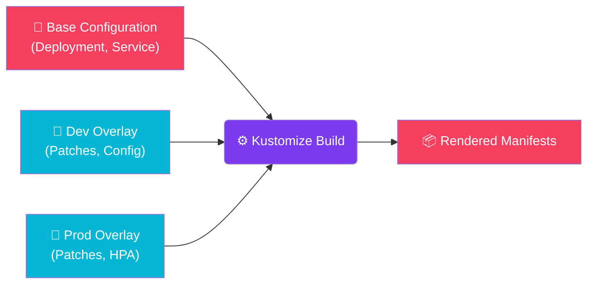

import Callout from '@components/Callout.astro';
import ImplementationNote from '@components/ImplementationNote.astro';
import ExternalCite from '@components/ExternalCite.astro';

## Introduction

Managing Kubernetes configurations across multiple environments (Dev, Staging, Prod) can quickly become a maintenance nightmare if you're duplicating YAML files. Kustomize offers a template-free way to customize application configuration, preserving the base structure while allowing for environment-specific "overlays" to modify behavior. This guide details how to structure a multi-environment deployment using standard Kustomize patterns.

## Architecture Overview

The Kustomize workflow separates the "Base" definition (shared across all environments) from "Overlays" (environment-specific modifications). When built, Kustomize merges the layers to produce the final manifests.



## Implementation

### Directory Structure

```
apps/
└── archives-api/
    ├── base/
    │   ├── kustomization.yaml
    │   ├── deployment.yaml
    │   ├── service.yaml
    │   └── serviceaccount.yaml
    └── overlays/
        ├── dev/
        │   ├── kustomization.yaml
        │   └── deployment-patch.yaml
        ├── staging/
        │   ├── kustomization.yaml
        │   ├── deployment-patch.yaml
        │   └── hpa.yaml
        └── prod/
            ├── kustomization.yaml
            ├── deployment-patch.yaml
            ├── hpa.yaml
            └── pdb.yaml
```

### Base Configuration

#### Base Kustomization

```yaml
# apps/archives-api/base/kustomization.yaml
apiVersion: kustomize.config.k8s.io/v1beta1
kind: Kustomization

commonLabels:
  app.kubernetes.io/name: archives-api
  app.kubernetes.io/component: api

resources:
  - deployment.yaml
  - service.yaml
  - serviceaccount.yaml

images:
  - name: archives-api
    newName: registry.bluerobin.local/archives-api
    newTag: latest
```

#### Base Deployment

```yaml
# apps/archives-api/base/deployment.yaml
apiVersion: apps/v1
kind: Deployment
metadata:
  name: archives-api
spec:
  replicas: 1
  selector:
    matchLabels:
      app.kubernetes.io/name: archives-api
  template:
    metadata:
      labels:
        app.kubernetes.io/name: archives-api
    spec:
      serviceAccountName: archives-api
      containers:
        - name: api
          image: archives-api
          ports:
            - containerPort: 8080
              name: http
          env:
            - name: ASPNETCORE_ENVIRONMENT
              value: Production
            - name: ASPNETCORE_URLS
              value: http://+:8080
          envFrom:
            - secretRef:
                name: archives-api-secrets
          resources:
            requests:
              cpu: 100m
              memory: 256Mi
            limits:
              cpu: 1000m
              memory: 1Gi
          readinessProbe:
            httpGet:
              path: /health/ready
              port: 8080
            initialDelaySeconds: 10
            periodSeconds: 5
          livenessProbe:
            httpGet:
              path: /health/live
              port: 8080
            initialDelaySeconds: 30
            periodSeconds: 10
```

#### Base Service

```yaml
# apps/archives-api/base/service.yaml
apiVersion: v1
kind: Service
metadata:
  name: archives-api
spec:
  selector:
    app.kubernetes.io/name: archives-api
  ports:
    - port: 80
      targetPort: 8080
      name: http
```

### Environment Overlays

#### Staging Overlay

```yaml
# apps/archives-api/overlays/staging/kustomization.yaml
apiVersion: kustomize.config.k8s.io/v1beta1
kind: Kustomization

namespace: archives-staging

namePrefix: staging-

commonLabels:
  app.kubernetes.io/instance: staging

resources:
  - ../../base
  - hpa.yaml
  - externalsecret.yaml
  - ingressroute.yaml

patches:
  - path: deployment-patch.yaml
    target:
      kind: Deployment
      name: archives-api

images:
  - name: archives-api
    newName: registry.bluerobin.local/archives-api
    newTag: 20260101-abc1234  # Updated by CI/CD

configMapGenerator:
  - name: archives-api-config
    literals:
      - Environment=staging
      - LogLevel=Debug
      - Otlp__Endpoint=http://signoz-otel-collector.observability.svc.cluster.local:4317
```

#### Staging Deployment Patch

```yaml
# apps/archives-api/overlays/staging/deployment-patch.yaml
apiVersion: apps/v1
kind: Deployment
metadata:
  name: archives-api
spec:
  replicas: 2
  template:
    spec:
      containers:
        - name: api
          env:
            - name: Environment
              value: staging
          resources:
            requests:
              cpu: 200m
              memory: 512Mi
            limits:
              cpu: 1000m
              memory: 1Gi
```

#### Staging HPA

```yaml
# apps/archives-api/overlays/staging/hpa.yaml
apiVersion: autoscaling/v2
kind: HorizontalPodAutoscaler
metadata:
  name: archives-api
spec:
  scaleTargetRef:
    apiVersion: apps/v1
    kind: Deployment
    name: archives-api
  minReplicas: 2
  maxReplicas: 5
  metrics:
    - type: Resource
      resource:
        name: cpu
        target:
          type: Utilization
          averageUtilization: 70
    - type: Resource
      resource:
        name: memory
        target:
          type: Utilization
          averageUtilization: 80
```

<ImplementationNote>
The `namePrefix` in staging overlay prefixes all resource names with `staging-`, but the HPA's `scaleTargetRef.name` is also prefixed automatically by Kustomize.
</ImplementationNote>

#### Production Overlay

```yaml
# apps/archives-api/overlays/prod/kustomization.yaml
apiVersion: kustomize.config.k8s.io/v1beta1
kind: Kustomization

namespace: archives-prod

namePrefix: prod-

commonLabels:
  app.kubernetes.io/instance: prod

resources:
  - ../../base
  - hpa.yaml
  - pdb.yaml
  - externalsecret.yaml
  - ingressroute.yaml

patches:
  - path: deployment-patch.yaml
    target:
      kind: Deployment
      name: archives-api

images:
  - name: archives-api
    newName: registry.bluerobin.local/archives-api
    newTag: 20260101-def5678

configMapGenerator:
  - name: archives-api-config
    literals:
      - Environment=prod
      - LogLevel=Information
      - Otlp__Endpoint=http://signoz-otel-collector.observability.svc.cluster.local:4317

replicas:
  - name: archives-api
    count: 3
```

#### Production Deployment Patch

```yaml
# apps/archives-api/overlays/prod/deployment-patch.yaml
apiVersion: apps/v1
kind: Deployment
metadata:
  name: archives-api
spec:
  strategy:
    type: RollingUpdate
    rollingUpdate:
      maxSurge: 1
      maxUnavailable: 0
  template:
    spec:
      containers:
        - name: api
          env:
            - name: Environment
              value: prod
          resources:
            requests:
              cpu: 500m
              memory: 1Gi
            limits:
              cpu: 2000m
              memory: 2Gi
      topologySpreadConstraints:
        - maxSkew: 1
          topologyKey: kubernetes.io/hostname
          whenUnsatisfiable: DoNotSchedule
          labelSelector:
            matchLabels:
              app.kubernetes.io/name: archives-api
```

#### Pod Disruption Budget

```yaml
# apps/archives-api/overlays/prod/pdb.yaml
apiVersion: policy/v1
kind: PodDisruptionBudget
metadata:
  name: archives-api
spec:
  minAvailable: 2
  selector:
    matchLabels:
      app.kubernetes.io/name: archives-api
```

<Callout type="tip">
Always use PodDisruptionBudgets in production to ensure high availability during node drains and cluster upgrades.
</Callout>

### Strategic Merge Patches

#### JSON Patch

```yaml
# apps/archives-api/overlays/staging/json-patch.yaml
- op: add
  path: /spec/template/spec/containers/0/env/-
  value:
    name: FEATURE_FLAG_NEW_SEARCH
    value: "true"

- op: replace
  path: /spec/template/spec/containers/0/resources/requests/memory
  value: 768Mi
```

#### Using JSON Patch

```yaml
# apps/archives-api/overlays/staging/kustomization.yaml
patches:
  - path: json-patch.yaml
    target:
      kind: Deployment
      name: archives-api
```

### ConfigMap and Secret Generators

#### ConfigMap Generator

```yaml
# apps/archives-api/overlays/staging/kustomization.yaml
configMapGenerator:
  - name: archives-api-config
    behavior: merge
    files:
      - appsettings.json=config/appsettings.staging.json
    literals:
      - NATS_SUBJECT_PREFIX=staging
```

#### Secret Generator (for dev only)

```yaml
# apps/archives-api/overlays/dev/kustomization.yaml
secretGenerator:
  - name: archives-api-dev-secrets
    literals:
      - DATABASE_PASSWORD=devpassword
    options:
      disableNameSuffixHash: true
```

### Flux Integration

#### Kustomization Resource

```yaml
# clusters/bluerobin/apps/archives-api-staging.yaml
apiVersion: kustomize.toolkit.fluxcd.io/v1
kind: Kustomization
metadata:
  name: archives-api-staging
  namespace: flux-system
spec:
  interval: 10m
  path: ./apps/archives-api/overlays/staging
  prune: true
  sourceRef:
    kind: GitRepository
    name: bluerobin-infra
  targetNamespace: archives-staging
  healthChecks:
    - apiVersion: apps/v1
      kind: Deployment
      name: staging-archives-api
      namespace: archives-staging
  dependsOn:
    - name: external-secrets
    - name: data-layer
```

### Validation

#### Build and Preview

```bash
# Preview staging configuration
kustomize build apps/archives-api/overlays/staging

# Validate without applying
kubectl apply --dry-run=client -k apps/archives-api/overlays/staging

# Diff against cluster state
kubectl diff -k apps/archives-api/overlays/staging
```

## Conclusion

Using Kustomize overlays allows us to maintain a clean, DRY (Don't Repeat Yourself) configuration base while accommodating the specific needs of each environment. This approach aligns perfectly with GitOps principles, providing a declarative source of truth that is both flexible and maintainable.

Kustomize structure benefits:

| Feature | Benefit |
|---------|---------|
| Base + Overlays | DRY configuration management |
| Patches | Environment-specific modifications |
| Generators | ConfigMaps and Secrets from files/literals |
| Name Prefixing | Clear resource namespacing |
| Flux Integration | GitOps-native deployment |

Combined with Flux, Kustomize enables declarative, version-controlled Kubernetes deployments.

<ExternalCite 
  title="Kustomize Documentation" 
  url="https://kustomize.io/"
  author="Kubernetes SIG CLI"
/>
