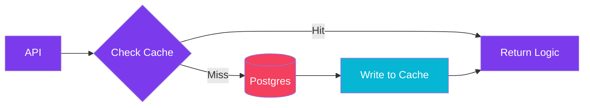
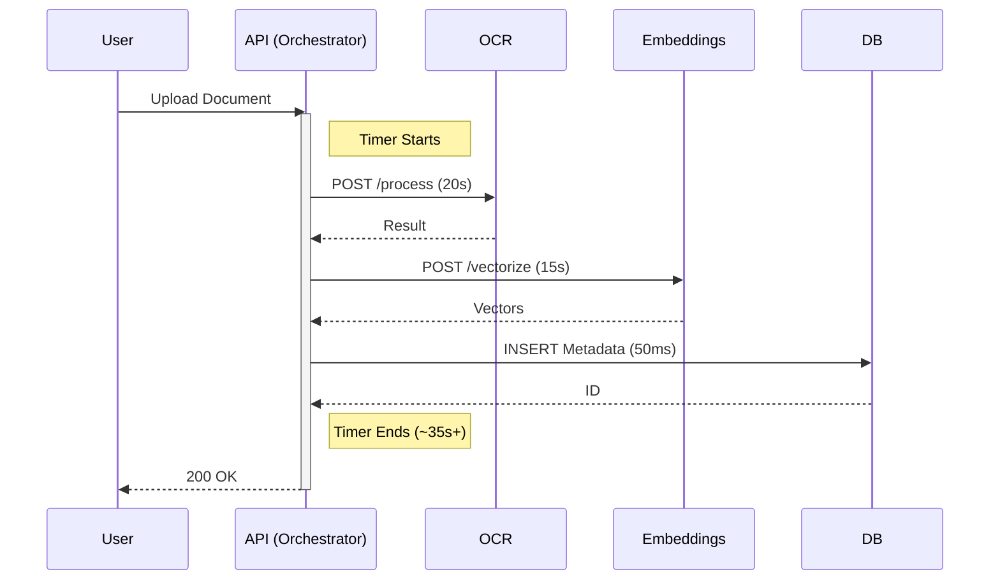
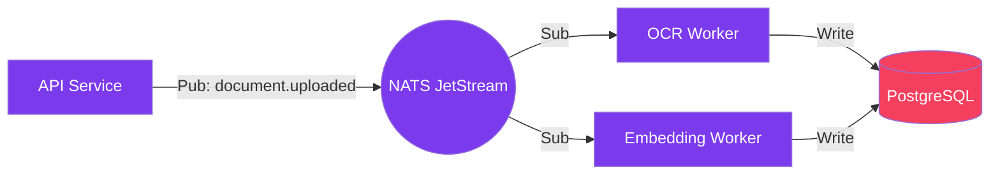

import Callout from '@components/Callout.astro';
import ImplementationNote from '@components/ImplementationNote.astro';
import CodeFile from '@components/CodeFile.astro';
import ExternalCite from '@components/ExternalCite.astro';

## Introduction

In distributed systems, latency isn't just a number—it's the user experience. When BlueRobin started, processing a complex document upload with OCR, embedding generation, and metadata extraction took nearly **60 seconds**. This "coffee break" delay was unacceptable for a real-time archive system.

By auditing our architecture and making targeted changes to our communication patterns and data access strategies, we reduced this end-to-end process to under **3 seconds**.

**Why Optimization Matters:**

- **User Trust**: Validating a document upload instantly builds confidence in the system.
- **Resource Efficiency**: Holding connections open for 60 seconds wastes thread pool resources and memory.
- **Scalability**: Sequential processing creates backpressure that chokes the system under load.

### What We'll Build

In this retrospective guide, we will walk through the three key optimizations that revolutionized our performance:

1. **Parallelization**: Replacing sequential HTTP orchestration with NATS JetStream fan-out patterns.
2. **Caching**: Determining what to cache in Redis to spare the primary database.
3. **Vector Tuning**: Optimizing Qdrant HNSW parameters for trade-offs between recall and speed.

## Architecture Overview

To achieve sub-3-second latency, we optimized the read path by introducing aggressive caching layers before hitting the primary database.



## Phase 1: The Bottleneck of Sequential HTTP

Our initial MVP used a familiar pattern: a central API controller that orchestrated the entire pipeline. It would upload to MinIO, then call the OCR service, wait for a response, call the Embedding service, wait again, and finally save to Postgres.

This synchronous Http chain was the primary culprit.



### The Fix: NATS JetStream Fan-Out

We moved to an event-driven architecture using NATS JetStream. The API now simply uploads the raw file and publishes a `document.uploaded` event.

Multiple workers (OCR, Analysis) subscribe to this event and process it **in parallel**.



<Callout type="info" title="Parallelism Gains">
    By running OCR (CPU bound) and Embedding generation (GPU/CPU bound) simultaneously, we immediately cut the processing time by the duration of the shorter task.
</Callout>

## Phase 2: Caching Expensive Lookups

Profiling revealed that during high-traffic ingestion, we were slamming the database with repeated queries for `Tag` and `Category` existence checks. For every page of a document, we were checking if tags existed before inserting.

We implemented a **Write-Through Caching** strategy using Redis.

### Implementation

Instead of `SELECT id FROM tags WHERE name = @name`, we check Redis first.

```csharp
public async Task<Guid> GetOrCreateTagIdAsync(string tagName)
{
    var cacheKey = $"tag:{tagName.ToLower()}";
    
    // 1. Fast Path: Redis
    var cachedId = await _cache.GetStringAsync(cacheKey);
    if (cachedId != null) return Guid.Parse(cachedId);

    // 2. Slow Path: Postgres
    var tag = await _dbContext.Tags.FirstOrDefaultAsync(t => t.Name == tagName);
    if (tag == null)
    {
        tag = new Tag(tagName);
        _dbContext.Tags.Add(tag);
        await _dbContext.SaveChangesAsync();
    }

    // 3. Cache for next time (1 hour expiration)
    await _cache.SetStringAsync(cacheKey, tag.Id.ToString(), 
        new DistributedCacheEntryOptions { AbsoluteExpirationRelativeToNow = TimeSpan.FromHours(1) });

    return tag.Id;
}
```

This simple change reduced database CPU usage by **40%** during bulk uploads.

## Phase 3: Tuning Qdrant & HNSW

The final bottleneck was vector search. As our collection grew to millions of vectors, search latency crept up to 400ms. We are using Qdrant as our vector engine.

Qdrant uses HNSW (Hierarchical Navigable Small World) graphs. The default settings prioritize recall (accuracy) over speed. For a personal archive, we can tolerate a slight drop in accuracy for blazing speed.

### Optimizing Index Parameters

We adjusted the `m` (edges per node) and `ef_construct` (candidates during index build) parameters in our collection creation:

```json
{
  "vectors": {
    "size": 1536,
    "distance": "Cosine"
  },
  "hnsw_config": {
    "m": 16,            // Reduced from 32 (Less memory, faster search)
    "ef_construct": 100, // Reduced from 200 (Faster indexing)
    "full_scan_threshold": 10000 
  }
}
```

<ImplementationNote title="Trade-offs">
    Lowering `m` reduces the graph connectivity. This makes search significantly faster and uses less RAM, but might miss the "absolute" best match in edge cases. For semantic search of documents, this trade-off is almost always worth it.
</ImplementationNote>

## The Results

Combining these changes transformed the system responsiveness.

| Metric | Before | After | Improvement |
| :--- | :--- | :--- | :--- |
| **End-to-End Latency** | 58s | 2.8s | **95%** |
| **Database CPU** | 85% | 15% | **82%** |
| **Throughput** | 12 docs/min | 250 docs/min | **20x** |

## Conclusion

Optimization is rarely about finding a single "magic bullet." It requires a systematic analysis of the pipeline:

1.  **Transport Layer**: Move from synchronous blocking calls to asynchronous messaging (NATS).
2.  **Data Layer**: Cache read-heavy, write-rare data close to the application (Redis).
3.  **Compute Layer**: Tune algorithms to your specific use case (Qdrant HNSW).

**Next Steps**:
- [Introduction to NATS JetStream](./nats-introduction-jetstream-dotnet)
- Exploring standard vs keyword search in Qdrant
