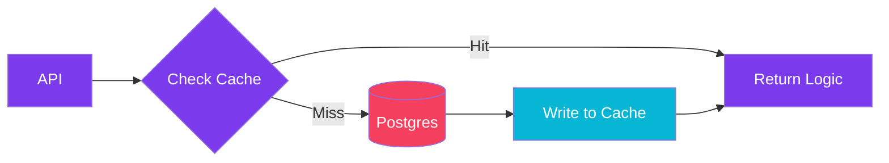
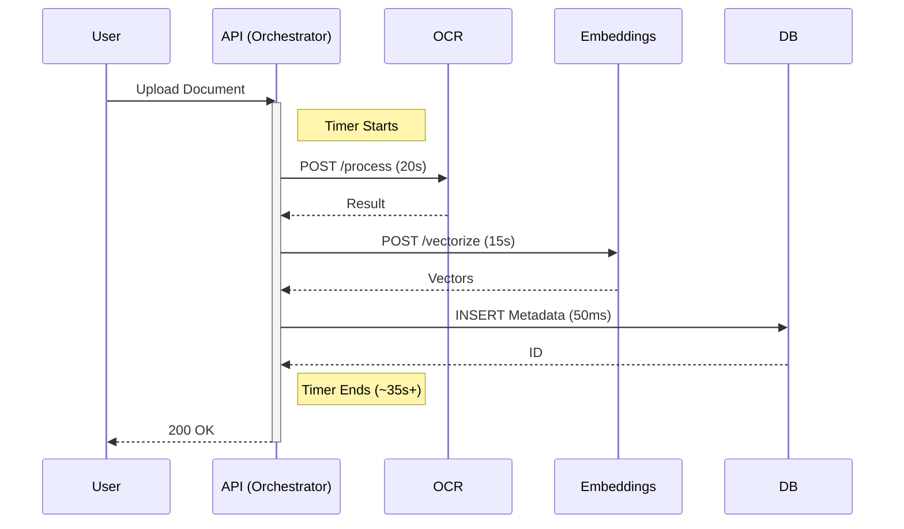
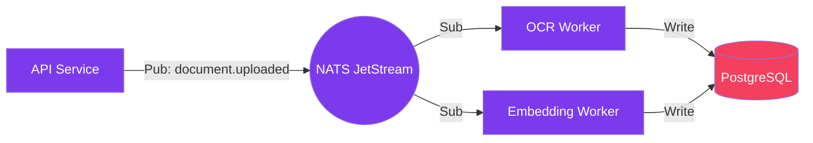

import Callout from '@components/Callout.astro';
import ImplementationNote from '@components/ImplementationNote.astro';
import CodeFile from '@components/CodeFile.astro';
import ExternalCite from '@components/ExternalCite.astro';

When I first watched our system take nearly a minute to process a single document upload, I knew something was fundamentally wrong with our architecture. The frustrating part was that each individual service was fast on its own -- it was the way we orchestrated them that created a cascading latency nightmare. What followed was a week-long deep dive into profiling, parallelization, and caching that taught me more about distributed systems performance than any textbook could. This article is the story of how we turned a 60-second embarrassment into a 3-second success.

## Introduction

In distributed systems, latency isn't just a number—it's the user experience. When We started, processing a complex document upload with OCR, embedding generation, and metadata extraction took nearly **60 seconds**. This "coffee break" delay was unacceptable for a real-time archive system.

By auditing our architecture and making targeted changes to our communication patterns and data access strategies, we reduced this end-to-end process to under **3 seconds**.

**Why Optimization Matters:**

- **User Trust**: Validating a document upload instantly builds confidence in the system.
- **Resource Efficiency**: Holding connections open for 60 seconds wastes thread pool resources and memory.
- **Scalability**: Sequential processing creates backpressure that chokes the system under load.

### What We'll Build

In this retrospective guide, we will walk through the three key optimizations that revolutionized our performance:

1. **Parallelization**: Replacing sequential HTTP orchestration with NATS JetStream fan-out patterns.
2. **Caching**: Determining what to cache in Redis to spare the primary database.
3. **Vector Tuning**: Optimizing Qdrant HNSW parameters for trade-offs between recall and speed.

## Architecture Overview

To achieve sub-3-second latency, we optimized the read path by introducing aggressive caching layers before hitting the primary database.


```mermaid
flowchart LR
    API[API] --> Check{Check Cache}
    Check -->|Hit| Return[Return Logic]
    Check -->|Miss| DB[(Postgres)]
    DB --> Write[Write to Cache]
    Write --> Return

    classDef primary fill:#7c3aed,color:#fff
    classDef secondary fill:#06b6d4,color:#fff
    classDef db fill:#f43f5e,color:#fff
    classDef warning fill:#fbbf24,color:#000

    class API,Check,Return primary
    class Write secondary
    class DB db
```

## Phase 1: The Bottleneck of Sequential HTTP

Our initial MVP used a familiar pattern: a central API controller that orchestrated the entire pipeline. It would upload to MinIO, then call the OCR service, wait for a response, call the Embedding service, wait again, and finally save to Postgres.

This synchronous Http chain was the primary culprit.

<ExternalCite title="Release It! Design and Deploy Production-Ready Software" url="https://pragprog.com/titles/mnee2/release-it-second-edition/" author="Michael Nygard" date="2018" />


```mermaid
sequenceDiagram
    participant User
    participant API as API (Orchestrator)
    participant OCR
    participant Embed as Embeddings
    participant DB

    User->>API: Upload Document
    activate API
    note right of API: Timer Starts
    API->>OCR: POST /process (20s)
    OCR-->>API: Result
    API->>Embed: POST /vectorize (15s)
    Embed-->>API: Vectors
    API->>DB: INSERT Metadata (50ms)
    DB-->>API: ID
    note right of API: Timer Ends (~35s+)
    API-->>User: 200 OK
    deactivate API
```

### The Fix: NATS JetStream Fan-Out

We moved to an event-driven architecture using NATS JetStream. The API now simply uploads the raw file and publishes a `document.uploaded` event.

Multiple workers (OCR, Analysis) subscribe to this event and process it **in parallel**.

<ExternalCite title="NATS JetStream Documentation" url="https://docs.nats.io/nats-concepts/jetstream" author="Synadia" date="2024" />


```mermaid
flowchart LR
    API[API Service]
    NATS((NATS JetStream))
    OCR[OCR Worker]
    Embed[Embedding Worker]
    DB[(PostgreSQL)]

    classDef primary fill:#7c3aed,color:#fff
    classDef secondary fill:#06b6d4,color:#fff
    classDef db fill:#f43f5e,color:#fff
    classDef warning fill:#fbbf24,color:#000

    class API,NATS,OCR,Embed primary
    class DB db

    API -->|Pub: document.uploaded| NATS
    NATS -->|Sub| OCR
    NATS -->|Sub| Embed
    OCR -->|Write| DB
    Embed -->|Write| DB
```

<Callout type="info" title="Parallelism Gains">
    By running OCR (CPU bound) and Embedding generation (GPU/CPU bound) simultaneously, we immediately cut the processing time by the duration of the shorter task.
</Callout>

<ImplementationNote title="The Hidden Cost of Moving to Event-Driven">
When I first switched from synchronous HTTP calls to NATS fan-out, I thought the hard part was over. I was wrong. The immediate problem was that the API could no longer return a fully processed document in the response -- it had to return an "accepted" status and let the client poll or subscribe for completion. Rewriting the frontend to handle this asynchronous flow took almost as long as the backend migration. I also had to build an aggregation service that knew when all parallel workers had finished, which introduced its own set of race conditions that took days to sort out.
</ImplementationNote>

## Phase 2: Caching Expensive Lookups

Profiling revealed that during high-traffic ingestion, we were slamming the database with repeated queries for `Tag` and `Category` existence checks. For every page of a document, we were checking if tags existed before inserting.

<ExternalCite title="Caching Best Practices and Patterns" url="https://learn.microsoft.com/en-us/azure/architecture/best-practices/caching" author="Microsoft" date="2024" />

We implemented a **Write-Through Caching** strategy using Redis.

### Implementation

Instead of `SELECT id FROM tags WHERE name = @name`, we check Redis first.

```csharp
public async Task<Guid> GetOrCreateTagIdAsync(string tagName)
{
    var cacheKey = $"tag:{tagName.ToLower()}";

    // 1. Fast Path: Redis
    var cachedId = await _cache.GetStringAsync(cacheKey);
    if (cachedId != null) return Guid.Parse(cachedId);

    // 2. Slow Path: Postgres
    var tag = await _dbContext.Tags.FirstOrDefaultAsync(t => t.Name == tagName);
    if (tag == null)
    {
        tag = new Tag(tagName);
        _dbContext.Tags.Add(tag);
        await _dbContext.SaveChangesAsync();
    }

    // 3. Cache for next time (1 hour expiration)
    await _cache.SetStringAsync(cacheKey, tag.Id.ToString(),
        new DistributedCacheEntryOptions { AbsoluteExpirationRelativeToNow = TimeSpan.FromHours(1) });

    return tag.Id;
}
```

This simple change reduced database CPU usage by **40%** during bulk uploads.

<ImplementationNote title="Cache Invalidation Headaches">
I quickly learned why Phil Karlton famously said there are only two hard things in computer science: cache invalidation and naming things. After deploying the Redis caching layer, we hit a subtle bug where renamed tags would still resolve to their old IDs for up to an hour. Users would rename a tag in the UI, but documents kept getting the stale mapping. I had to implement a cache-busting strategy that published invalidation events through NATS whenever a tag was modified. It was a humbling reminder that caching is never "just add Redis."
</ImplementationNote>

## Phase 3: Tuning Qdrant & HNSW

The final bottleneck was vector search. As our collection grew to millions of vectors, search latency crept up to 400ms. We are using Qdrant as our vector engine.

Qdrant uses HNSW (Hierarchical Navigable Small World) graphs. The default settings prioritize recall (accuracy) over speed. For a personal archive, we can tolerate a slight drop in accuracy for blazing speed.

<ExternalCite title="Efficient and Robust Approximate Nearest Neighbor Search Using HNSW Graphs" url="https://arxiv.org/abs/1603.09320" author="Malkov and Yashunin" date="2018" />

### Optimizing Index Parameters

We adjusted the `m` (edges per node) and `ef_construct` (candidates during index build) parameters in our collection creation:

```json
{
  "vectors": {
    "size": 1536,
    "distance": "Cosine"
  },
  "hnsw_config": {
    "m": 16,            // Reduced from 32 (Less memory, faster search)
    "ef_construct": 100, // Reduced from 200 (Faster indexing)
    "full_scan_threshold": 10000
  }
}
```

<ExternalCite title="Qdrant HNSW Index Configuration" url="https://qdrant.tech/documentation/concepts/indexing/#hnsw" author="Qdrant" date="2024" />

<ImplementationNote title="Trade-offs">
    Lowering `m` reduces the graph connectivity. This makes search significantly faster and uses less RAM, but might miss the "absolute" best match in edge cases. For semantic search of documents, this trade-off is almost always worth it.
</ImplementationNote>

## The Results

Combining these changes transformed the system responsiveness.

| Metric | Before | After | Improvement |
| :--- | :--- | :--- | :--- |
| **End-to-End Latency** | 58s | 2.8s | **95%** |
| **Database CPU** | 85% | 15% | **82%** |
| **Throughput** | 12 docs/min | 250 docs/min | **20x** |

## Conclusion

Optimization is rarely about finding a single "magic bullet." It requires a systematic analysis of the pipeline:

1.  **Transport Layer**: Move from synchronous blocking calls to asynchronous messaging (NATS).
2.  **Data Layer**: Cache read-heavy, write-rare data close to the application (Redis).
3.  **Compute Layer**: Tune algorithms to your specific use case (Qdrant HNSW).

Reflecting on this optimization journey, the biggest takeaway for me was that the most impactful improvements came not from clever code but from architectural decisions. Switching from sequential HTTP to event-driven messaging was a one-time effort that delivered permanent, compounding benefits. If I had to do it again, I would start with the messaging layer from day one rather than building a synchronous MVP first. The migration cost was significant, and the technical debt of the synchronous approach nearly derailed us before we caught it.

<ExternalCite title="Designing Data-Intensive Applications" url="https://dataintensive.net/" author="Martin Kleppmann" date="2017" />

### Next Steps

- Dive into the [Introduction to NATS JetStream](./nats-introduction-jetstream-dotnet) for a deeper look at our messaging infrastructure.
- Explore standard vs keyword search strategies in Qdrant for different query patterns.
- Implement distributed tracing with OpenTelemetry to get per-service latency breakdowns in production.
- Add automated performance regression tests to CI/CD to catch latency regressions before deployment.

### Further Reading

- [NATS by Example: Core Patterns and JetStream](https://natsbyexample.com/) -- Interactive examples of NATS messaging patterns.
- [Redis Caching Strategies in .NET](https://learn.microsoft.com/en-us/aspnet/core/performance/caching/distributed) -- Microsoft documentation on distributed caching with Redis.
- [Qdrant Performance Tuning Guide](https://qdrant.tech/documentation/guides/optimize/) -- Official guide on optimizing vector search performance.
- [Designing Data-Intensive Applications by Martin Kleppmann](https://dataintensive.net/) -- Essential reading on building scalable, reliable distributed systems.
