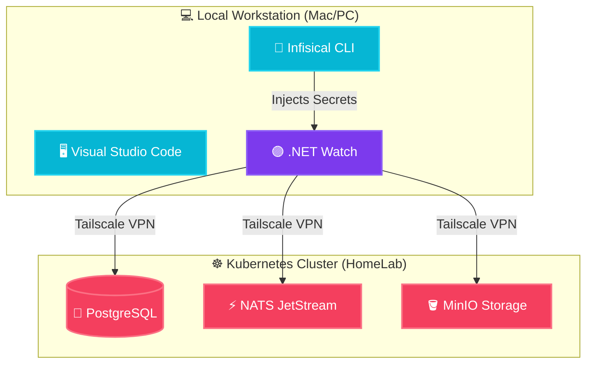

import Callout from '@components/Callout.astro';
import ImplementationNote from '@components/ImplementationNote.astro';
import CodeFile from '@components/CodeFile.astro';
import ExternalCite from '@components/ExternalCite.astro';

When I first tried to onboard myself onto this project after a two-week vacation, I realized our setup instructions were scattered across Slack messages, a half-finished Notion page, and tribal knowledge that lived entirely in my own head. It took me over an hour to get a working dev environment running again -- on my own project. That experience motivated me to write this guide and build the `generate-env.sh` script that reduces setup to three commands. The hybrid approach of running code locally but databases on the cluster was born out of necessity: my MacBook's fan sounded like a jet engine whenever I tried to run PostgreSQL, NATS, and MinIO locally alongside the .NET processes.

## Introduction

Onboarding to a microservice architecture can be daunting. In our project, we've invested heavily in "Developer Experience" (DevEx) to ensure you can go from `git clone` to a running application in under 15 minutes. We achieve this by hybridizing local compute (your laptop) with shared cluster infrastructure.

**Why This Hybrid Approach Matters:**

- **Resource Efficiency**: You don't need to run Postgres, MinIO, Qdrant, and FalkorDB on your Mac. They run on the K8s homelab cluster.
- **Speed**: `.NET Watch` and `Hot Reload` work natively because the code runs locally.
- **Realism**: You develop against real data services, not mocked in-memory alternatives.

### What We'll Build

You will set up the local development environment. You will:

1.  **Authenticate**: Connect to Infisical for secrets.
2.  **Generate Config**: Create the `.env.local` file.
3.  **Run**: Launch the API, Web, and Workers simultaneously.

## Architecture Overview

Network traffic flows from your local process to the `data-layer` services in the cluster via **Tailscale**.

<ExternalCite title="Tailscale - Best VPN Service for Secure Networks" url="https://tailscale.com/kb/1151/what-is-tailscale" author="Tailscale" date="2024-11-20" />


```mermaid
flowchart TB
    subgraph Local["💻 Local Workstation (Mac/PC)"]
        Code["🖥️ Visual Studio Code"]
        Infisical["🔐 Infisical CLI"]
        DotNet["🟣 .NET Watch"]
    end
    
    subgraph K8s["☸️ Kubernetes Cluster (HomeLab)"]
        PG[("🐘 PostgreSQL")]
        NATS["⚡ NATS JetStream"]
        MinIO["🪣 MinIO Storage"]
    end

    Infisical -->|Injects Secrets| DotNet
    DotNet -->|Tailscale VPN| PG
    DotNet -->|Tailscale VPN| NATS
    DotNet -->|Tailscale VPN| MinIO
    
    classDef primary fill:#7c3aed,color:#fff,stroke:#8b5cf6,stroke-width:2px
    classDef secondary fill:#06b6d4,color:#fff,stroke:#22d3ee,stroke-width:2px
    classDef db fill:#f43f5e,color:#fff,stroke:#fb7185,stroke-width:2px
    classDef infra fill:#334155,color:#e2e8f0,stroke:#475569,stroke-width:2px

    class DotNet primary
    class Code,Infisical secondary
    class PG,NATS,MinIO db
```

## Implementation

### 1. Prerequisites

Ensure you have the following installed:
- .NET 10 SDK
- Node.js & NPM
- Infisical CLI
- Tailscale (Connected to `my-tailnet` tailnet)

<ExternalCite title="Infisical CLI Documentation" url="https://infisical.com/docs/cli/overview" author="Infisical" date="2024-10-15" />

### 2. Secret Injection

We do not commit configuration files. Instead, we generate them from our centralized secret store.

<ExternalCite title="The Twelve-Factor App: Config" url="https://12factor.net/config" author="Adam Wiggins" date="2017-01-30" />

<CodeFile filename="Terminal" language="bash">
```bash
# Login to Infisical
infisical login

# Generate the .env.local file
./scripts/generate-env.sh
```
</CodeFile>

This script fetches connection strings for the `dev` environment databases running on K8s and writes them to `.env.local`.

<ImplementationNote title="Tailscale DNS Resolution Quirks">
One issue I hit early on was that Tailscale's MagicDNS does not resolve Kubernetes service FQDNs like `postgres-rw.data-layer.svc.cluster.local` directly from my Mac. I had to configure split DNS in the Tailscale admin console so that `.svc.cluster.local` queries get routed to the cluster's CoreDNS. Without this, the `generate-env.sh` script would produce connection strings with FQDNs that my local .NET process could not resolve, resulting in cryptic "No such host is known" errors that wasted hours of my time.
</ImplementationNote>

### 3. Launching the Stack

We use VS Code Tasks to orchestrate the startup. Open the Command Palette (`Cmd+Shift+P`) and run **"Tasks: Run Task"** -> **"Start Local Dev"**.

<ExternalCite title="VS Code Tasks Documentation" url="https://code.visualstudio.com/docs/editor/tasks" author="Microsoft" date="2024-09-10" />

This parallels the execution of:

1.  **Tailwind Watcher**: Compiles CSS for the UI.
2.  **API**: Starts the FastEndpoints backend on port 5000.
3.  **Web**: Starts the Blazor Server frontend on port 5001.
4.  **Workers**: Starts the background job processor.

<ImplementationNote title="Environment Variables">
  The startup tasks automatically source `.env.local` before running `dotnet`, ensuring all connection strings are present in the environment.
</ImplementationNote>

<ExternalCite title=".NET Hot Reload" url="https://learn.microsoft.com/en-us/dotnet/core/tools/dotnet-watch" author="Microsoft" date="2024-08-05" />

<ImplementationNote title="Hot Reload Limitations with NATS Consumers">
One thing that caught me off guard is that `dotnet watch` hot reload works beautifully for API endpoints and Razor pages, but it does not gracefully handle changes to NATS JetStream consumer configurations. If you modify a consumer's filter subject or durable name, the hot-reloaded process tries to re-subscribe with the new configuration while the old consumer is still active on the server, resulting in a "consumer name already in use" error. My workaround is to restart the Workers task manually whenever I change NATS consumer settings -- it takes about 3 seconds versus the 15 seconds a full solution rebuild would require.
</ImplementationNote>

## Conclusion

By treating infrastructure as a shared utility and code as a local concern, we get the best of both worlds. There is no `docker-compose up` waiting time, no fan noise from running 10 containers, just pure coding efficiency. Welcome!

The biggest lesson I learned building this setup is that developer experience is not a luxury -- it is a multiplier. Every minute I spent automating the `generate-env.sh` script and configuring VS Code tasks paid itself back tenfold. When I can go from a fresh clone to a running application in under five minutes, I actually want to work on side features and experiments instead of dreading the setup ritual. If you take one thing from this guide, let it be this: invest in your inner loop, and everything else gets easier.

<ExternalCite title="Accelerate: The Science of Lean Software and DevOps" url="https://itrevolution.com/product/accelerate/" author="Nicole Forsgren, Jez Humble, Gene Kim" date="2018-03-27" />

## Next Steps

- Add a health check script that verifies Tailscale connectivity and database reachability before launching the stack
- Create a `devcontainer.json` for contributors who prefer a fully containerized workflow
- Integrate the Infisical VS Code extension for inline secret browsing
- Set up automatic `.env.local` regeneration on secret rotation via a file watcher

## Further Reading

- [Infisical Documentation](https://infisical.com/docs/documentation/getting-started/introduction)
- [Tailscale Subnet Routers](https://tailscale.com/kb/1019/subnets)
- [.NET CLI Tools Overview](https://learn.microsoft.com/en-us/dotnet/core/tools/)
- [VS Code Compound Tasks](https://code.visualstudio.com/docs/editor/tasks#_compound-tasks)
