import Callout from '@components/Callout.astro';
import ImplementationNote from '@components/ImplementationNote.astro';
import CodeFile from '@components/CodeFile.astro';
import ExternalCite from '@components/ExternalCite.astro';

## Introduction

Onboarding to a microservice architecture can be daunting. At BlueRobin, we've invested heavily in "Developer Experience" (DevEx) to ensure you can go from `git clone` to a running application in under 15 minutes. We achieve this by hybridizing local compute (your laptop) with shared cluster infrastructure.

**Why This Hybrid Approach Matters:**

- **Resource Efficiency**: You don't need to run Postgres, MinIO, Qdrant, and FalkorDB on your Mac. They run on the K8s homelab cluster.
- **Speed**: `.NET Watch` and `Hot Reload` work natively because the code runs locally.
- **Realism**: You develop against real data services, not mocked in-memory alternatives.

### What We'll Build

You will set up the "BlueRobin Local" environment. You will:

1.  **Authenticate**: Connect to Infisical for secrets.
2.  **Generate Config**: Create the `.env.local` file.
3.  **Run**: Launch the API, Web, and Workers simultaneously.

## Architecture Overview

Network traffic flows from your local process to the `data-layer` services in the cluster via **Tailscale**.

```mermaid
flowchart TB
    subgraph Local["💻 Local Workstation (Mac/PC)"]
        Code["🖥️ Visual Studio Code"]
        Infisical["🔐 Infisical CLI"]
        DotNet["🟣 .NET Watch"]
    end
    
    subgraph K8s["☸️ Kubernetes Cluster (HomeLab)"]
        PG[("🐘 PostgreSQL")]
        NATS["⚡ NATS JetStream"]
        MinIO["🪣 MinIO Storage"]
    end

    Infisical -->|Injects Secrets| DotNet
    DotNet -->|Tailscale VPN| PG
    DotNet -->|Tailscale VPN| NATS
    DotNet -->|Tailscale VPN| MinIO
    
    classDef primary fill:#7c3aed,color:#fff,stroke:#8b5cf6,stroke-width:2px
    classDef secondary fill:#06b6d4,color:#fff,stroke:#22d3ee,stroke-width:2px
    classDef db fill:#f43f5e,color:#fff,stroke:#fb7185,stroke-width:2px
    classDef infra fill:#334155,color:#e2e8f0,stroke:#475569,stroke-width:2px

    class DotNet primary
    class Code,Infisical secondary
    class PG,NATS,MinIO db
```



## Implementation

### 1. Prerequisites

Ensure you have the following installed:
- .NET 10 SDK
- Node.js & NPM
- Infisical CLI
- Tailscale (Connected to `bluerobin` tailnet)

### 2. Secret Injection

We do not commit configuration files. Instead, we generate them from our centralized secret store.

<CodeFile filename="Terminal" language="bash">
```bash
# Login to Infisical
infisical login

# Generate the .env.local file
./scripts/generate-env.sh
```
</CodeFile>

This script fetches connection strings for the `dev` environment databases running on K8s and writes them to `.env.local`.

### 3. Launching the Stack

We use VS Code Tasks to orchestrate the startup. Open the Command Palette (`Cmd+Shift+P`) and run **"Tasks: Run Task"** -> **"Start Local Dev"**.

This parallels the execution of:

1.  **Tailwind Watcher**: Compiles CSS for the UI.
2.  **API**: Starts the FastEndpoints backend on port 5000.
3.  **Web**: Starts the Blazor Server frontend on port 5001.
4.  **Workers**: Starts the background job processor.

<ImplementationNote title="Environment Variables">
  The startup tasks automatically source `.env.local` before running `dotnet`, ensuring all connection strings are present in the environment.
</ImplementationNote>

## Conclusion

By treating infrastructure as a shared utility and code as a local concern, we get the best of both worlds. There is no `docker-compose up` waiting time, no fan noise from running 10 containers, just pure coding efficiency. Welcome to BlueRobin!
