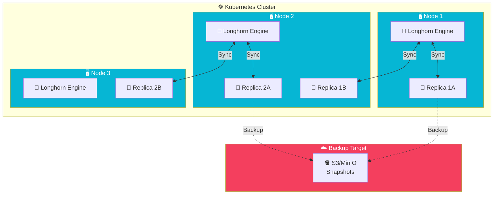

import Callout from '@components/Callout.astro';
import ImplementationNote from '@components/ImplementationNote.astro';
import ExternalCite from '@components/ExternalCite.astro';

## Introduction

In a Kubernetes cluster, pods are ephemeral—they can be rescheduled to any node at any time. This creates a fundamental challenge: **where do you store persistent data?** Traditional storage solutions require manual provisioning, don't replicate across nodes, and become a single point of failure.

**Why Distributed Storage Matters:**

- **High Availability**: Data survives node failures through replication
- **Dynamic Provisioning**: Storage is created on-demand via PersistentVolumeClaims
- **Data Locality**: Replicas can be placed close to workloads for low latency
- **Disaster Recovery**: Built-in backup and snapshot capabilities

Longhorn, a CNCF project, solves these problems elegantly. It turns your cluster nodes' local disks into a distributed, replicated block storage system—no external SAN required.

## Architecture Overview

Longhorn deploys a storage controller on each node, managing replicas that span across the cluster:



**Key Components**:
- **Longhorn Engine**: Runs on each node, serves iSCSI volumes to pods
- **Replicas**: Data copies spread across nodes (configurable count)
- **Backup Target**: S3-compatible storage for disaster recovery
- **Manager**: UI and API for volume lifecycle management

Longhorn provides lightweight, reliable distributed block storage for Kubernetes. This guide covers deploying and configuring Longhorn for production workloads.

## Prerequisites

### Node Requirements

```bash
# Install open-iscsi on all nodes
sudo apt-get update
sudo apt-get install -y open-iscsi

# Enable and start iscsid
sudo systemctl enable --now iscsid
```

## Installation

### Helm Deployment

```yaml
# infrastructure/longhorn/helm-release.yaml
apiVersion: helm.toolkit.fluxcd.io/v2
kind: HelmRelease
metadata:
  name: longhorn
  namespace: longhorn-system
spec:
  interval: 30m
  chart:
    spec:
      chart: longhorn
      version: "1.6.x"
      sourceRef:
        kind: HelmRepository
        name: longhorn
        namespace: flux-system
  values:
    persistence:
      defaultClass: true
      defaultClassReplicaCount: 2
      defaultDataLocality: best-effort
      reclaimPolicy: Retain
    
    defaultSettings:
      backupTarget: s3://longhorn-backups@us-east-1/
      backupTargetCredentialSecret: longhorn-backup-credentials
      defaultReplicaCount: 2
      storageMinimalAvailablePercentage: 15
      nodeDownPodDeletionPolicy: delete-both-statefulset-and-deployment-pod
      autoSalvage: true
      concurrentAutomaticEngineUpgradePerNodeLimit: 1
      
    ingress:
      enabled: true
      ingressClassName: traefik
      host: longhorn.bluerobin.local
      tls: true
      tlsSecret: longhorn-tls
    
    resources:
      limits:
        cpu: 500m
        memory: 512Mi
      requests:
        cpu: 100m
        memory: 256Mi
```

### Backup Credentials

```yaml
# infrastructure/longhorn/backup-secret.yaml
apiVersion: external-secrets.io/v1beta1
kind: ExternalSecret
metadata:
  name: longhorn-backup-credentials
  namespace: longhorn-system
spec:
  refreshInterval: 1h
  secretStoreRef:
    kind: ClusterSecretStore
    name: infisical-store
  target:
    name: longhorn-backup-credentials
    template:
      data:
        AWS_ACCESS_KEY_ID: "{{ .access_key }}"
        AWS_SECRET_ACCESS_KEY: "{{ .secret_key }}"
        AWS_ENDPOINTS: "{{ .endpoint }}"
  data:
    - secretKey: access_key
      remoteRef:
        key: MINIO_BACKUP_ACCESS_KEY
    - secretKey: secret_key
      remoteRef:
        key: MINIO_BACKUP_SECRET_KEY
    - secretKey: endpoint
      remoteRef:
        key: MINIO_ENDPOINT
```

## Storage Classes

### Standard Storage Class

```yaml
# infrastructure/longhorn/storageclass-standard.yaml
apiVersion: storage.k8s.io/v1
kind: StorageClass
metadata:
  name: longhorn
  annotations:
    storageclass.kubernetes.io/is-default-class: "true"
provisioner: driver.longhorn.io
allowVolumeExpansion: true
reclaimPolicy: Retain
volumeBindingMode: Immediate
parameters:
  numberOfReplicas: "2"
  staleReplicaTimeout: "30"
  dataLocality: "best-effort"
  fsType: "ext4"
```

### High Availability Storage Class

```yaml
# infrastructure/longhorn/storageclass-ha.yaml
apiVersion: storage.k8s.io/v1
kind: StorageClass
metadata:
  name: longhorn-ha
provisioner: driver.longhorn.io
allowVolumeExpansion: true
reclaimPolicy: Retain
volumeBindingMode: Immediate
parameters:
  numberOfReplicas: "3"
  staleReplicaTimeout: "30"
  dataLocality: "disabled"
  fsType: "ext4"
```

### Fast Local Storage Class

```yaml
# infrastructure/longhorn/storageclass-fast.yaml
apiVersion: storage.k8s.io/v1
kind: StorageClass
metadata:
  name: longhorn-fast
provisioner: driver.longhorn.io
allowVolumeExpansion: true
reclaimPolicy: Delete
volumeBindingMode: WaitForFirstConsumer
parameters:
  numberOfReplicas: "1"
  dataLocality: "strict-local"
  fsType: "ext4"
```

<Callout type="warning">
`strict-local` data locality means volumes can only be scheduled on nodes with local replicas. Use for performance-critical workloads that don't need HA.
</Callout>

## Using Longhorn Volumes

### PersistentVolumeClaim

```yaml
# apps/postgres/pvc.yaml
apiVersion: v1
kind: PersistentVolumeClaim
metadata:
  name: postgres-data
  namespace: data-layer
spec:
  accessModes:
    - ReadWriteOnce
  storageClassName: longhorn-ha
  resources:
    requests:
      storage: 50Gi
```

### StatefulSet Volume Template

```yaml
# apps/postgres/statefulset.yaml
apiVersion: apps/v1
kind: StatefulSet
metadata:
  name: postgres
  namespace: data-layer
spec:
  serviceName: postgres
  replicas: 1
  selector:
    matchLabels:
      app: postgres
  template:
    metadata:
      labels:
        app: postgres
    spec:
      containers:
        - name: postgres
          image: postgres:16
          volumeMounts:
            - name: data
              mountPath: /var/lib/postgresql/data
  volumeClaimTemplates:
    - metadata:
        name: data
      spec:
        accessModes: ["ReadWriteOnce"]
        storageClassName: longhorn-ha
        resources:
          requests:
            storage: 100Gi
```

## Volume Snapshots

### Snapshot Class

```yaml
# infrastructure/longhorn/volumesnapshotclass.yaml
apiVersion: snapshot.storage.k8s.io/v1
kind: VolumeSnapshotClass
metadata:
  name: longhorn-snapshot
driver: driver.longhorn.io
deletionPolicy: Delete
parameters:
  type: snap
```

### Creating Snapshots

```yaml
# Manual snapshot
apiVersion: snapshot.storage.k8s.io/v1
kind: VolumeSnapshot
metadata:
  name: postgres-snapshot-manual
  namespace: data-layer
spec:
  volumeSnapshotClassName: longhorn-snapshot
  source:
    persistentVolumeClaimName: postgres-data
```

<ImplementationNote>
Snapshots are created instantly using copy-on-write. They don't require additional storage until data diverges from the snapshot.
</ImplementationNote>

## Recurring Snapshots and Backups

### Recurring Job Configuration

```yaml
# infrastructure/longhorn/recurring-jobs.yaml
---
apiVersion: longhorn.io/v1beta2
kind: RecurringJob
metadata:
  name: daily-snapshot
  namespace: longhorn-system
spec:
  name: daily-snapshot
  task: snapshot
  cron: "0 2 * * *"
  retain: 7
  concurrency: 1
  labels:
    schedule: daily
---
apiVersion: longhorn.io/v1beta2
kind: RecurringJob
metadata:
  name: weekly-backup
  namespace: longhorn-system
spec:
  name: weekly-backup
  task: backup
  cron: "0 3 * * 0"
  retain: 4
  concurrency: 1
  labels:
    schedule: weekly
```

### Applying to Volumes

```yaml
# Annotate PVC for recurring jobs
apiVersion: v1
kind: PersistentVolumeClaim
metadata:
  name: postgres-data
  namespace: data-layer
  labels:
    recurring-job-group.longhorn.io/default: enabled
    recurring-job.longhorn.io/daily-snapshot: enabled
    recurring-job.longhorn.io/weekly-backup: enabled
spec:
  accessModes:
    - ReadWriteOnce
  storageClassName: longhorn-ha
  resources:
    requests:
      storage: 50Gi
```

## Disaster Recovery

### Restore from Backup

```yaml
# Restore PVC from backup
apiVersion: v1
kind: PersistentVolumeClaim
metadata:
  name: postgres-data-restored
  namespace: data-layer
spec:
  accessModes:
    - ReadWriteOnce
  storageClassName: longhorn-ha
  dataSource:
    name: backup://s3://longhorn-backups@us-east-1/backups/backup-abc123
    kind: LonghornBackup
    apiGroup: longhorn.io
  resources:
    requests:
      storage: 50Gi
```

### Clone from Snapshot

```yaml
# Clone PVC from snapshot
apiVersion: v1
kind: PersistentVolumeClaim
metadata:
  name: postgres-data-clone
  namespace: data-layer
spec:
  accessModes:
    - ReadWriteOnce
  storageClassName: longhorn-ha
  dataSource:
    name: postgres-snapshot-manual
    kind: VolumeSnapshot
    apiGroup: snapshot.storage.k8s.io
  resources:
    requests:
      storage: 50Gi
```

## Volume Encryption

### Encrypted Storage Class

```yaml
# infrastructure/longhorn/storageclass-encrypted.yaml
apiVersion: storage.k8s.io/v1
kind: StorageClass
metadata:
  name: longhorn-encrypted
provisioner: driver.longhorn.io
allowVolumeExpansion: true
reclaimPolicy: Retain
parameters:
  numberOfReplicas: "2"
  dataLocality: "best-effort"
  encrypted: "true"
  csi.storage.k8s.io/provisioner-secret-name: longhorn-crypto
  csi.storage.k8s.io/provisioner-secret-namespace: longhorn-system
  csi.storage.k8s.io/node-publish-secret-name: longhorn-crypto
  csi.storage.k8s.io/node-publish-secret-namespace: longhorn-system
```

### Encryption Secret

```yaml
# infrastructure/longhorn/encryption-secret.yaml
apiVersion: v1
kind: Secret
metadata:
  name: longhorn-crypto
  namespace: longhorn-system
type: Opaque
stringData:
  CRYPTO_KEY_VALUE: "your-32-character-encryption-key"
  CRYPTO_KEY_PROVIDER: secret
```

## Monitoring

### Prometheus ServiceMonitor

```yaml
# infrastructure/longhorn/servicemonitor.yaml
apiVersion: monitoring.coreos.com/v1
kind: ServiceMonitor
metadata:
  name: longhorn
  namespace: longhorn-system
spec:
  selector:
    matchLabels:
      app: longhorn-manager
  endpoints:
    - port: manager
      interval: 30s
```

### Key Metrics

| Metric | Description |
|--------|-------------|
| `longhorn_volume_actual_size_bytes` | Actual disk usage |
| `longhorn_volume_capacity_bytes` | Provisioned capacity |
| `longhorn_volume_state` | Volume health state |
| `longhorn_node_storage_capacity_bytes` | Node storage capacity |
| `longhorn_node_storage_usage_bytes` | Node storage usage |
| `longhorn_disk_usage_bytes` | Per-disk usage |

## Troubleshooting

### Common Commands

```bash
# Check volume status
kubectl get volumes.longhorn.io -n longhorn-system

# Check replica status
kubectl get replicas.longhorn.io -n longhorn-system

# Check engine status
kubectl get engines.longhorn.io -n longhorn-system

# View node storage
kubectl get nodes.longhorn.io -n longhorn-system -o yaml
```

## Summary

Longhorn storage features:

| Feature | Configuration |
|---------|--------------|
| Replication | `numberOfReplicas` parameter |
| Data Locality | `best-effort`, `strict-local`, `disabled` |
| Snapshots | VolumeSnapshot resources |
| Backups | S3-compatible storage target |
| Encryption | LUKS encryption via secrets |
| Expansion | `allowVolumeExpansion: true` |

Longhorn provides enterprise storage features without external dependencies, ideal for edge and homelab deployments.

<ExternalCite 
  title="Longhorn Documentation" 
  url="https://longhorn.io/docs/"
  author="SUSE Rancher"
/>
