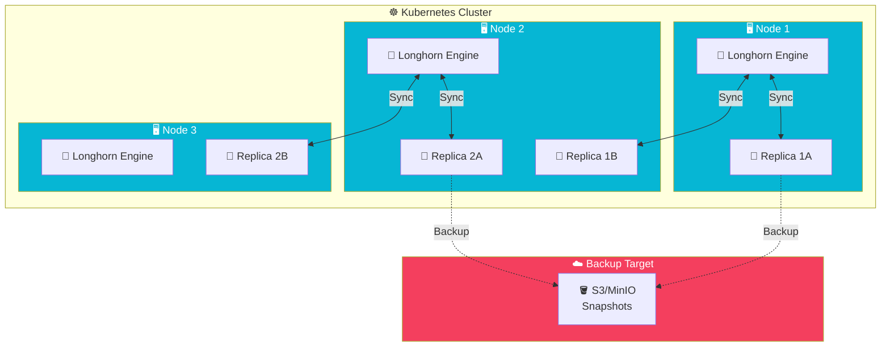

import Callout from '@components/Callout.astro';
import ImplementationNote from '@components/ImplementationNote.astro';
import ExternalCite from '@components/ExternalCite.astro';

When I first configured Longhorn on my three-node K3s cluster, I naively assumed distributed storage would "just work." Within the first week, I lost a PostgreSQL database after a node reboot because I had not properly configured replica counts or understood how data locality interacted with pod scheduling. That painful incident forced me to deeply study Longhorn's architecture, from how its engines coordinate iSCSI mounts to how replicas synchronize across nodes. After months of iteration, rebuilding volumes from backups, and tuning snapshot schedules, I finally arrived at a configuration that has survived multiple unplanned node failures without data loss. This guide captures every lesson from that journey so you can avoid the same mistakes.

## Introduction

In a Kubernetes cluster, pods are ephemeral—they can be rescheduled to any node at any time. This creates a fundamental challenge: **where do you store persistent data?** Traditional storage solutions require manual provisioning, don't replicate across nodes, and become a single point of failure.

**Why Distributed Storage Matters:**

- **High Availability**: Data survives node failures through replication
- **Dynamic Provisioning**: Storage is created on-demand via PersistentVolumeClaims
- **Data Locality**: Replicas can be placed close to workloads for low latency
- **Disaster Recovery**: Built-in backup and snapshot capabilities

Longhorn, a CNCF project, solves these problems elegantly. It turns your cluster nodes' local disks into a distributed, replicated block storage system—no external SAN required.

## Architecture Overview

Longhorn deploys a storage controller on each node, managing replicas that span across the cluster:


```mermaid
flowchart TB
    subgraph Cluster["☸️ Kubernetes Cluster"]
        subgraph Node1["🖥️ Node 1"]
            E1["🔧 Longhorn Engine"]
            R1A["💾 Replica 1A"]
        end
        
        subgraph Node2["🖥️ Node 2"]
            E2["🔧 Longhorn Engine"]
            R1B["💾 Replica 1B"]
            R2A["💾 Replica 2A"]
        end
        
        subgraph Node3["🖥️ Node 3"]
            E3["🔧 Longhorn Engine"]
            R2B["💾 Replica 2B"]
        end
        
        E1 <-->|"Sync"| R1A
        E1 <-->|"Sync"| R1B
        E2 <-->|"Sync"| R2A
        E2 <-->|"Sync"| R2B
    end

    subgraph Backup["☁️ Backup Target"]
        S3["🪣 S3/MinIO\nSnapshots"]
    end

    R1A -.->|"Backup"| S3
    R2A -.->|"Backup"| S3

    classDef primary fill:#7c3aed,color:#fff
    classDef secondary fill:#06b6d4,color:#fff
    classDef db fill:#f43f5e,color:#fff
    classDef warning fill:#fbbf24,color:#000

    class Node1,Node2,Node3 secondary
    class Backup db
```

**Key Components**:
- **Longhorn Engine**: Runs on each node, serves iSCSI volumes to pods
- **Replicas**: Data copies spread across nodes (configurable count)
- **Backup Target**: S3-compatible storage for disaster recovery
- **Manager**: UI and API for volume lifecycle management

Longhorn provides lightweight, reliable distributed block storage for Kubernetes. This guide covers deploying and configuring Longhorn for production workloads.

<ExternalCite title="Longhorn Architecture Documentation" url="https://longhorn.io/docs/latest/concepts/" author="SUSE Rancher" date="2024-03-15" />

<ExternalCite title="Cloud Native Computing Foundation - Longhorn" url="https://www.cncf.io/projects/longhorn/" author="CNCF" date="2023-11-01" />

## Prerequisites

### Node Requirements

```bash
# Install open-iscsi on all nodes
sudo apt-get update
sudo apt-get install -y open-iscsi

# Enable and start iscsid
sudo systemctl enable --now iscsid
```

<ImplementationNote title="iSCSI dependency pitfall">
When I first installed Longhorn, I skipped the open-iscsi prerequisite on one of my three nodes because it was running a minimal Ubuntu image. Longhorn deployed successfully and even showed the node as "schedulable" in the UI, but volumes mounted on that node would silently fail to attach. I spent hours checking CSI driver logs before realizing the iscsid service was simply not running. Now I run the Longhorn environment check script before every node addition -- it catches these issues in seconds rather than hours.
</ImplementationNote>

<ExternalCite title="Longhorn Installation Requirements" url="https://longhorn.io/docs/latest/deploy/install/#installation-requirements" author="SUSE Rancher" date="2024-03-15" />

## Installation

### Helm Deployment

```yaml
# infrastructure/longhorn/helm-release.yaml
apiVersion: helm.toolkit.fluxcd.io/v2
kind: HelmRelease
metadata:
  name: longhorn
  namespace: longhorn-system
spec:
  interval: 30m
  chart:
    spec:
      chart: longhorn
      version: "1.6.x"
      sourceRef:
        kind: HelmRepository
        name: longhorn
        namespace: flux-system
  values:
    persistence:
      defaultClass: true
      defaultClassReplicaCount: 2
      defaultDataLocality: best-effort
      reclaimPolicy: Retain
    
    defaultSettings:
      backupTarget: s3://longhorn-backups@us-east-1/
      backupTargetCredentialSecret: longhorn-backup-credentials
      defaultReplicaCount: 2
      storageMinimalAvailablePercentage: 15
      nodeDownPodDeletionPolicy: delete-both-statefulset-and-deployment-pod
      autoSalvage: true
      concurrentAutomaticEngineUpgradePerNodeLimit: 1
      
    ingress:
      enabled: true
      ingressClassName: traefik
      host: longhorn.bluerobin.local
      tls: true
      tlsSecret: longhorn-tls
    
    resources:
      limits:
        cpu: 500m
        memory: 512Mi
      requests:
        cpu: 100m
        memory: 256Mi
```

### Backup Credentials

```yaml
# infrastructure/longhorn/backup-secret.yaml
apiVersion: external-secrets.io/v1beta1
kind: ExternalSecret
metadata:
  name: longhorn-backup-credentials
  namespace: longhorn-system
spec:
  refreshInterval: 1h
  secretStoreRef:
    kind: ClusterSecretStore
    name: infisical-store
  target:
    name: longhorn-backup-credentials
    template:
      data:
        AWS_ACCESS_KEY_ID: "{{ .access_key }}"
        AWS_SECRET_ACCESS_KEY: "{{ .secret_key }}"
        AWS_ENDPOINTS: "{{ .endpoint }}"
  data:
    - secretKey: access_key
      remoteRef:
        key: MINIO_BACKUP_ACCESS_KEY
    - secretKey: secret_key
      remoteRef:
        key: MINIO_BACKUP_SECRET_KEY
    - secretKey: endpoint
      remoteRef:
        key: MINIO_ENDPOINT
```

<ImplementationNote title="Tuning replica count for homelab nodes">
I initially set defaultReplicaCount to 3, following production best practices, but in a three-node homelab this meant every volume consumed disk space on every single node. My 500GB NVMe drives filled up within two weeks. Dropping to 2 replicas freed up a third of my cluster storage while still surviving any single-node failure. The key insight was that for a homelab, two replicas plus S3 backups to MinIO provide more practical resilience than three replicas with no off-cluster backup.
</ImplementationNote>

## Storage Classes

### Standard Storage Class

```yaml
# infrastructure/longhorn/storageclass-standard.yaml
apiVersion: storage.k8s.io/v1
kind: StorageClass
metadata:
  name: longhorn
  annotations:
    storageclass.kubernetes.io/is-default-class: "true"
provisioner: driver.longhorn.io
allowVolumeExpansion: true
reclaimPolicy: Retain
volumeBindingMode: Immediate
parameters:
  numberOfReplicas: "2"
  staleReplicaTimeout: "30"
  dataLocality: "best-effort"
  fsType: "ext4"
```

### High Availability Storage Class

```yaml
# infrastructure/longhorn/storageclass-ha.yaml
apiVersion: storage.k8s.io/v1
kind: StorageClass
metadata:
  name: longhorn-ha
provisioner: driver.longhorn.io
allowVolumeExpansion: true
reclaimPolicy: Retain
volumeBindingMode: Immediate
parameters:
  numberOfReplicas: "3"
  staleReplicaTimeout: "30"
  dataLocality: "disabled"
  fsType: "ext4"
```

### Fast Local Storage Class

```yaml
# infrastructure/longhorn/storageclass-fast.yaml
apiVersion: storage.k8s.io/v1
kind: StorageClass
metadata:
  name: longhorn-fast
provisioner: driver.longhorn.io
allowVolumeExpansion: true
reclaimPolicy: Delete
volumeBindingMode: WaitForFirstConsumer
parameters:
  numberOfReplicas: "1"
  dataLocality: "strict-local"
  fsType: "ext4"
```

<Callout type="warning">
`strict-local` data locality means volumes can only be scheduled on nodes with local replicas. Use for performance-critical workloads that don't need HA.
</Callout>

## Using Longhorn Volumes

### PersistentVolumeClaim

```yaml
# apps/postgres/pvc.yaml
apiVersion: v1
kind: PersistentVolumeClaim
metadata:
  name: postgres-data
  namespace: data-layer
spec:
  accessModes:
    - ReadWriteOnce
  storageClassName: longhorn-ha
  resources:
    requests:
      storage: 50Gi
```

### StatefulSet Volume Template

```yaml
# apps/postgres/statefulset.yaml
apiVersion: apps/v1
kind: StatefulSet
metadata:
  name: postgres
  namespace: data-layer
spec:
  serviceName: postgres
  replicas: 1
  selector:
    matchLabels:
      app: postgres
  template:
    metadata:
      labels:
        app: postgres
    spec:
      containers:
        - name: postgres
          image: postgres:16
          volumeMounts:
            - name: data
              mountPath: /var/lib/postgresql/data
  volumeClaimTemplates:
    - metadata:
        name: data
      spec:
        accessModes: ["ReadWriteOnce"]
        storageClassName: longhorn-ha
        resources:
          requests:
            storage: 100Gi
```

## Volume Snapshots

### Snapshot Class

```yaml
# infrastructure/longhorn/volumesnapshotclass.yaml
apiVersion: snapshot.storage.k8s.io/v1
kind: VolumeSnapshotClass
metadata:
  name: longhorn-snapshot
driver: driver.longhorn.io
deletionPolicy: Delete
parameters:
  type: snap
```

### Creating Snapshots

```yaml
# Manual snapshot
apiVersion: snapshot.storage.k8s.io/v1
kind: VolumeSnapshot
metadata:
  name: postgres-snapshot-manual
  namespace: data-layer
spec:
  volumeSnapshotClassName: longhorn-snapshot
  source:
    persistentVolumeClaimName: postgres-data
```

<ImplementationNote>
Snapshots are created instantly using copy-on-write. They don't require additional storage until data diverges from the snapshot.
</ImplementationNote>

## Recurring Snapshots and Backups

### Recurring Job Configuration

```yaml
# infrastructure/longhorn/recurring-jobs.yaml
---
apiVersion: longhorn.io/v1beta2
kind: RecurringJob
metadata:
  name: daily-snapshot
  namespace: longhorn-system
spec:
  name: daily-snapshot
  task: snapshot
  cron: "0 2 * * *"
  retain: 7
  concurrency: 1
  labels:
    schedule: daily
---
apiVersion: longhorn.io/v1beta2
kind: RecurringJob
metadata:
  name: weekly-backup
  namespace: longhorn-system
spec:
  name: weekly-backup
  task: backup
  cron: "0 3 * * 0"
  retain: 4
  concurrency: 1
  labels:
    schedule: weekly
```

### Applying to Volumes

```yaml
# Annotate PVC for recurring jobs
apiVersion: v1
kind: PersistentVolumeClaim
metadata:
  name: postgres-data
  namespace: data-layer
  labels:
    recurring-job-group.longhorn.io/default: enabled
    recurring-job.longhorn.io/daily-snapshot: enabled
    recurring-job.longhorn.io/weekly-backup: enabled
spec:
  accessModes:
    - ReadWriteOnce
  storageClassName: longhorn-ha
  resources:
    requests:
      storage: 50Gi
```

## Disaster Recovery

### Restore from Backup

```yaml
# Restore PVC from backup
apiVersion: v1
kind: PersistentVolumeClaim
metadata:
  name: postgres-data-restored
  namespace: data-layer
spec:
  accessModes:
    - ReadWriteOnce
  storageClassName: longhorn-ha
  dataSource:
    name: backup://s3://longhorn-backups@us-east-1/backups/backup-abc123
    kind: LonghornBackup
    apiGroup: longhorn.io
  resources:
    requests:
      storage: 50Gi
```

<ExternalCite title="Kubernetes Persistent Volumes Documentation" url="https://kubernetes.io/docs/concepts/storage/persistent-volumes/" author="Kubernetes Authors" date="2024-06-01" />

### Clone from Snapshot

```yaml
# Clone PVC from snapshot
apiVersion: v1
kind: PersistentVolumeClaim
metadata:
  name: postgres-data-clone
  namespace: data-layer
spec:
  accessModes:
    - ReadWriteOnce
  storageClassName: longhorn-ha
  dataSource:
    name: postgres-snapshot-manual
    kind: VolumeSnapshot
    apiGroup: snapshot.storage.k8s.io
  resources:
    requests:
      storage: 50Gi
```

<ImplementationNote title="Recovering from a failed backup restore">
During a real disaster recovery drill, I attempted to restore a 50GB PostgreSQL volume from an S3 backup and discovered that the restore process took over 45 minutes because Longhorn was rebuilding both replicas simultaneously over the network. The database pod kept hitting its startup probe timeout and getting killed by Kubernetes. I solved this by temporarily increasing the startup probe's failureThreshold to 60 and periodSeconds to 10, giving the restore a full 10-minute window to complete. Now I always factor restore time into my probe configurations for stateful workloads.
</ImplementationNote>

## Volume Encryption

### Encrypted Storage Class

```yaml
# infrastructure/longhorn/storageclass-encrypted.yaml
apiVersion: storage.k8s.io/v1
kind: StorageClass
metadata:
  name: longhorn-encrypted
provisioner: driver.longhorn.io
allowVolumeExpansion: true
reclaimPolicy: Retain
parameters:
  numberOfReplicas: "2"
  dataLocality: "best-effort"
  encrypted: "true"
  csi.storage.k8s.io/provisioner-secret-name: longhorn-crypto
  csi.storage.k8s.io/provisioner-secret-namespace: longhorn-system
  csi.storage.k8s.io/node-publish-secret-name: longhorn-crypto
  csi.storage.k8s.io/node-publish-secret-namespace: longhorn-system
```

### Encryption Secret

```yaml
# infrastructure/longhorn/encryption-secret.yaml
apiVersion: v1
kind: Secret
metadata:
  name: longhorn-crypto
  namespace: longhorn-system
type: Opaque
stringData:
  CRYPTO_KEY_VALUE: "your-32-character-encryption-key"
  CRYPTO_KEY_PROVIDER: secret
```

## Monitoring

### Prometheus ServiceMonitor

```yaml
# infrastructure/longhorn/servicemonitor.yaml
apiVersion: monitoring.coreos.com/v1
kind: ServiceMonitor
metadata:
  name: longhorn
  namespace: longhorn-system
spec:
  selector:
    matchLabels:
      app: longhorn-manager
  endpoints:
    - port: manager
      interval: 30s
```

### Key Metrics

| Metric | Description |
|--------|-------------|
| `longhorn_volume_actual_size_bytes` | Actual disk usage |
| `longhorn_volume_capacity_bytes` | Provisioned capacity |
| `longhorn_volume_state` | Volume health state |
| `longhorn_node_storage_capacity_bytes` | Node storage capacity |
| `longhorn_node_storage_usage_bytes` | Node storage usage |
| `longhorn_disk_usage_bytes` | Per-disk usage |

## Troubleshooting

### Common Commands

```bash
# Check volume status
kubectl get volumes.longhorn.io -n longhorn-system

# Check replica status
kubectl get replicas.longhorn.io -n longhorn-system

# Check engine status
kubectl get engines.longhorn.io -n longhorn-system

# View node storage
kubectl get nodes.longhorn.io -n longhorn-system -o yaml
```

## Summary

Longhorn storage features:

| Feature | Configuration |
|---------|--------------|
| Replication | `numberOfReplicas` parameter |
| Data Locality | `best-effort`, `strict-local`, `disabled` |
| Snapshots | VolumeSnapshot resources |
| Backups | S3-compatible storage target |
| Encryption | LUKS encryption via secrets |
| Expansion | `allowVolumeExpansion: true` |

Longhorn provides enterprise storage features without external dependencies, ideal for edge and homelab deployments.

Looking back at my journey with Longhorn, the most important lesson was that distributed storage requires active management, not just initial deployment. I underestimated how much time I would spend monitoring replica health, tuning snapshot retention, and planning for disk capacity growth. But once the configuration was dialed in, Longhorn became the most reliable component in my entire cluster -- silently replicating data, surviving node reboots, and making disaster recovery as simple as pointing at an S3 backup URL. If you are running stateful workloads on Kubernetes without distributed storage, you are one node failure away from learning these lessons the hard way.

<ExternalCite title="Designing Data-Intensive Applications" url="https://dataintensive.net/" author="Martin Kleppmann" date="2017-03-16" />

## Next Steps

- Explore [MinIO Object Storage for Document Management](/minio-object-storage-document-management) for S3-compatible storage that complements Longhorn's block storage
- See how we benchmark [Storage Performance: Local NVMe SSD vs 10GbE NAS](/infrastructure-performance-ssd-vs-nas) to decide where each workload belongs
- Review the [Homelab Server & NAS Setup](/homelab-setup-truenas-server-guide) that provides the underlying hardware for these volumes

## Further Reading

- [Longhorn Official Documentation](https://longhorn.io/docs/) -- comprehensive reference for all Longhorn features and configuration options
- [Kubernetes Storage Concepts](https://kubernetes.io/docs/concepts/storage/) -- understanding PersistentVolumes, StorageClasses, and CSI drivers
- [ZFS on Linux Documentation](https://openzfs.github.io/openzfs-docs/) -- deep dive into the filesystem backing our NAS storage tier

<ExternalCite
  title="Longhorn Documentation"
  url="https://longhorn.io/docs/"
  author="SUSE Rancher"
/>
