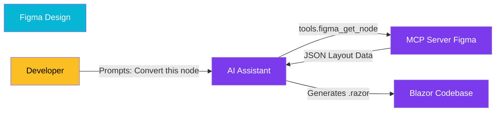

import Callout from '@components/Callout.astro';
import ImplementationNote from '@components/ImplementationNote.astro';
import CodeFile from '@components/CodeFile.astro';
import ExternalCite from '@components/ExternalCite.astro';

## Introduction

The "handover" phase from design to development is notoriously lossy. Pixels get shifted, colors slighted, and spacing ignored. At BlueRobin, we use an AI-driven approach to solve this. By connecting our coding assistant directly to Figma via the Model Context Protocol (MCP), we allow the LLM to "see" the design structure and generate precise Blazor + Tailwind code.

**Why MCP for Design Matters:**

- **Context Awareness**: The model can inspect the layer hierarchy, Auto Layout settings, and design tokens directly.
- **Consistency**: It enforces our specific Blazor component patterns (`BlueRobinComponentBase`) rather than generic HTML.
- **Speed**: Reduces the time from "approved design" to "functional component" by 80%.

### What We'll Build

We will walk through the workflow of converting a Figma component (e.g., a "Document Card") into a Blazor component using the MCP toolchain.

## Architecture Overview

The LLM acts as the bridge. It queries the Figma API via MCP to start the translation, then writes files to the codebase.



## Implementation

### 1. The Prompt Strategy

We don't just say "make this." We provide the `node_id` from Figma and specify our tech stack context.

> **User**: "Using the `figma-mcp` tool, retrieve node `1234:5678`. Convert this 'Document Card' into a Blazor component using Tailwind v4. Use `<base-card>` as the wrapper."

### 2. Interpreting the Data

The MCP server returns a JSON representation of the Figma node. The LLM parses properties like `layoutMode: "AUTO"` (Flexbox) and `primaryAxisAlignItems: "SPACE_BETWEEN"`.

<CodeFile filename="Figma Node (Simplified)" language="json">
```json
{
  "name": "Document Card",
  "type": "FRAME",
  "layoutMode": "HORIZONTAL",
  "children": [
    { "name": "Icon", "type": "INSTANCE" },
    { "name": "Title", "type": "TEXT" }
  ],
  "fills": [{ "type": "SOLID", "color": { "r": 1, "g": 1, "b": 1 } }]
}
```
</CodeFile>

### 3. Generated Code

The model maps these Figma primitives to our specific utilities.

<CodeFile filename="DocumentCard.razor" language="razor">
```html
<div class="flex flex-row items-center p-4 bg-white rounded-lg shadow-sm border border-robin-200">
    <div class="mr-3 text-robin-500">
        <Icon Name="FileText" Size="24" />
    </div>
    <div class="flex-1">
        <h3 class="font-semibold text-gray-900">@Title</h3>
        <p class="text-sm text-gray-500">@Date</p>
    </div>
</div>

@code {
    [Parameter] public string Title { get; set; }
    [Parameter] public string Date { get; set; }
}
```
</CodeFile>

<ImplementationNote title="Token Mapping">
  The real magic happens when the LLM recognizes that a hex code `#0ea5e9` matches our design token `robin-500` and uses the class name instead of an arbitrary value.
</ImplementationNote>

## Conclusion

This workflow turns Figma from a static image into a structured data source. By using MCP to pipe that data into an LLM context-aware of our codebase, we achieve a fidelity in implementation that manual coding struggles to match efficiently.
