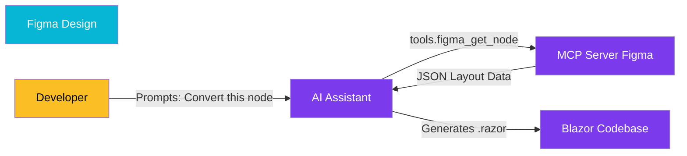

import Callout from '@components/Callout.astro';
import ImplementationNote from '@components/ImplementationNote.astro';
import CodeFile from '@components/CodeFile.astro';
import ExternalCite from '@components/ExternalCite.astro';

When I first configured the MCP server for Figma in my development workflow, I expected a smooth plug-and-play experience. Instead, I immediately hit issues with Figma personal access token expiration, MCP server cold starts that would time out the LLM's tool call, and nested Figma component instances that returned deeply recursive JSON the model struggled to parse. It took several iterations of prompt engineering and token refresh automation before the workflow became reliable. But once it clicked, the speed improvement was dramatic -- what used to take an hour of manual Figma-to-code translation now happens in under a minute. This article walks through the setup and the lessons learned along the way.

## Introduction

The "handover" phase from design to development is notoriously lossy. Pixels get shifted, colors slighted, and spacing ignored. In our project, we use an AI-driven approach to solve this. By connecting our coding assistant directly to Figma via the Model Context Protocol (MCP), we allow the LLM to "see" the design structure and generate precise Blazor + Tailwind code.

**Why MCP for Design Matters:**

- **Context Awareness**: The model can inspect the layer hierarchy, Auto Layout settings, and design tokens directly.
- **Consistency**: It enforces our specific Blazor component patterns (`AppComponentBase`) rather than generic HTML.
- **Speed**: Reduces the time from "approved design" to "functional component" by 80%.

<ExternalCite title="Model Context Protocol Specification" url="https://modelcontextprotocol.io/specification" author="Anthropic" date="2024-11-25" />

### What We'll Build

We will walk through the workflow of converting a Figma component (e.g., a "Document Card") into a Blazor component using the MCP toolchain.

## Architecture Overview

The LLM acts as the bridge. It queries the Figma API via MCP to start the translation, then writes files to the codebase.

<ExternalCite title="Figma REST API Reference" url="https://www.figma.com/developers/api" author="Figma" date="2024-08-15" />


```mermaid
flowchart LR
    Designer[Figma Design]
    Dev[Developer]
    LLM[AI Assistant]
    MCP[MCP Server Figma]
    Code[Blazor Codebase]

    Dev -->|Prompts: Convert this node| LLM
    LLM -->|tools.figma_get_node| MCP
    MCP -->|JSON Layout Data| LLM
    LLM -->|Generates .razor| Code
    
    classDef primary fill:#7c3aed,color:#fff
    classDef secondary fill:#06b6d4,color:#fff
    classDef db fill:#f43f5e,color:#fff
    classDef warning fill:#fbbf24,color:#000

    class MCP,Code,LLM primary
    class Designer secondary
    class Dev warning
```

## Implementation

<ExternalCite title="MCP Server for Figma" url="https://github.com/anthropics/model-context-protocol/tree/main/servers/figma" author="Anthropic" date="2024-12-01" />

### 1. The Prompt Strategy

We don't just say "make this." We provide the `node_id` from Figma and specify our tech stack context.

> **User**: "Using the `figma-mcp` tool, retrieve node `1234:5678`. Convert this 'Document Card' into a Blazor component using Tailwind v4. Use `<base-card>` as the wrapper."

### 2. Interpreting the Data

The MCP server returns a JSON representation of the Figma node. The LLM parses properties like `layoutMode: "AUTO"` (Flexbox) and `primaryAxisAlignItems: "SPACE_BETWEEN"`.

<ExternalCite title="Figma Auto Layout Documentation" url="https://help.figma.com/hc/en-us/articles/5731482952599-Using-auto-layout" author="Figma" date="2024-07-10" />

<CodeFile filename="Figma Node (Simplified)" language="json">
```json
{
  "name": "Document Card",
  "type": "FRAME",
  "layoutMode": "HORIZONTAL",
  "children": [
    { "name": "Icon", "type": "INSTANCE" },
    { "name": "Title", "type": "TEXT" }
  ],
  "fills": [{ "type": "SOLID", "color": { "r": 1, "g": 1, "b": 1 } }]
}
```
</CodeFile>

### 3. Generated Code

The model maps these Figma primitives to our specific utilities.

<ExternalCite title="Tailwind CSS v4 Documentation" url="https://tailwindcss.com/docs" author="Tailwind Labs" date="2024-11-20" />

<CodeFile filename="DocumentCard.razor" language="razor">
```html
<div class="flex flex-row items-center p-4 bg-white rounded-lg shadow-sm border border-robin-200">
    <div class="mr-3 text-primary-500">
        <Icon Name="FileText" Size="24" />
    </div>
    <div class="flex-1">
        <h3 class="font-semibold text-gray-900">@Title</h3>
        <p class="text-sm text-gray-500">@Date</p>
    </div>
</div>

@code {
    [Parameter] public string Title { get; set; }
    [Parameter] public string Date { get; set; }
}
```
</CodeFile>

<ImplementationNote title="Token Mapping">
  The real magic happens when the LLM recognizes that a hex code `#0ea5e9` matches our design token `primary-500` and uses the class name instead of an arbitrary value.
</ImplementationNote>

<ImplementationNote title="Figma Token Sync and Cold Start Woes">
One persistent issue I hit was that the MCP server would "cold start" on the first tool call of a session, taking 8-12 seconds to authenticate with the Figma API and fetch the node tree. This consistently caused the LLM to time out and retry, sometimes producing duplicate file writes. My workaround was to add a warm-up script that makes a lightweight Figma API call on MCP server startup. I also had to automate Figma personal access token rotation, since the tokens expire and the MCP server gives an unhelpful generic error when that happens.
</ImplementationNote>

<ImplementationNote title="Prompt Engineering for Accurate Component Generation">
Getting the LLM to consistently output our project-specific patterns (like extending `AppComponentBase` and using our design token classes instead of raw hex values) required significant prompt refinement. I found that including a short "component template" example in the system prompt -- showing the exact structure of an existing component -- improved accuracy far more than verbose written instructions. The model learns better from a concrete example than from a specification paragraph.
</ImplementationNote>

## Conclusion

This workflow turns Figma from a static image into a structured data source. By using MCP to pipe that data into an LLM context-aware of our codebase, we achieve a fidelity in implementation that manual coding struggles to match efficiently.

The biggest shift in my thinking was realizing that the MCP server is not just a convenience -- it fundamentally changes the developer's role. Instead of translating pixels to CSS by hand, I spend my time curating the prompt context and reviewing the generated output. The quality of the output depends almost entirely on how well the prompt describes our component conventions and design token system. Investing time in prompt engineering pays off across every future component generation.

**Key Takeaways:**

- MCP provides structured access to Figma node data, eliminating the guesswork of visual inspection
- Prompt context matters more than model capability -- include concrete component examples in system prompts
- Automate token rotation and MCP server warm-up to avoid frustrating cold-start timeouts
- Design token mapping (hex-to-class) is where the real accuracy gains come from
- The workflow is most effective for leaf components; complex nested layouts still benefit from manual review

## Next Steps

- **Build a component library index** that the MCP server can reference, so the LLM knows which existing components to reuse rather than generating from scratch
- **Add a visual diff step** that compares a screenshot of the generated component to the Figma render, closing the feedback loop automatically
- **Extend the MCP server** to support Figma Variables and design tokens natively, reducing reliance on hex-to-class mapping heuristics
- **Integrate with CI** so that Figma design changes trigger automated component regeneration proposals as pull requests

## Further Reading

- [Model Context Protocol Documentation](https://modelcontextprotocol.io/) -- The official MCP specification and server implementation guides
- [Figma REST API Reference](https://www.figma.com/developers/api) -- Complete API reference for querying Figma files, nodes, and images
- [Tailwind CSS v4 Documentation](https://tailwindcss.com/docs) -- Utility-first CSS framework used in the generated components
- [Figma Auto Layout](https://help.figma.com/hc/en-us/articles/5731482952599-Using-auto-layout) -- Understanding Figma's layout system helps interpret the MCP data
- [Building MCP Servers](https://modelcontextprotocol.io/docs/concepts/servers) -- Guide to building custom MCP server integrations
