import Callout from '@components/Callout.astro';
import ImplementationNote from '@components/ImplementationNote.astro';
import CodeFile from '@components/CodeFile.astro';
import ExternalCite from '@components/ExternalCite.astro';

When I first tried to include architecture diagrams in our technical documentation, I was exporting PNGs from draw.io and committing them alongside our Markdown files. Every time the architecture changed, I had to re-open the diagram tool, make the edit, re-export, and hope I did not forget to update the image reference. It was tedious and error-prone. Discovering Mermaid was a turning point -- suddenly my diagrams lived in the same file as my prose, version-controlled and diffable. This article is the guide I wish I had when I started.

## Introduction

Technical documentation often requires visual representations of complex systems. While tools like Lucidchart or draw.io work well, they create binary files that are difficult to version control and review. **Mermaid.js** solves this problem by rendering diagrams from plain text definitions.

<ExternalCite title="Mermaid.js Official Documentation" url="https://mermaid.js.org/intro/" author="Mermaid Contributors" date="2025" />

**Why Mermaid?**

- **Version Control Friendly**: Diagrams are plain text, so changes show up in Git diffs
- **Live in Documentation**: No separate files to manage or links to break
- **Quick Iteration**: Update the text, see the result immediately
- **Consistent Styling**: Automatic theming that matches your site's design

<Callout type="tip" title="Pro Tip">
All diagrams in this blog support fullscreen viewing—hover over any diagram and click the expand button in the top-right corner.
</Callout>

## Getting Started

In MDX files, you can create diagrams using fenced code blocks with the `mermaid` language identifier:

````markdown
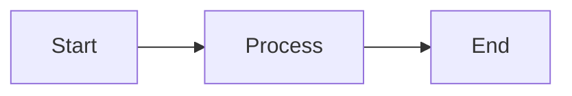
```mermaid
graph LR
    A[Start] --> B[Process]
    B --> C[End]
```
````

This renders as:


```mermaid
graph LR
    A[Start] --> B[Process]
    B --> C[End]
```

## Flowcharts

Flowcharts are the most versatile diagram type. They support various node shapes, connection styles, and subgraphs.

<ExternalCite title="Mermaid Flowchart Syntax" url="https://mermaid.js.org/syntax/flowchart.html" author="Mermaid Contributors" date="2025" />

### Basic Flowchart

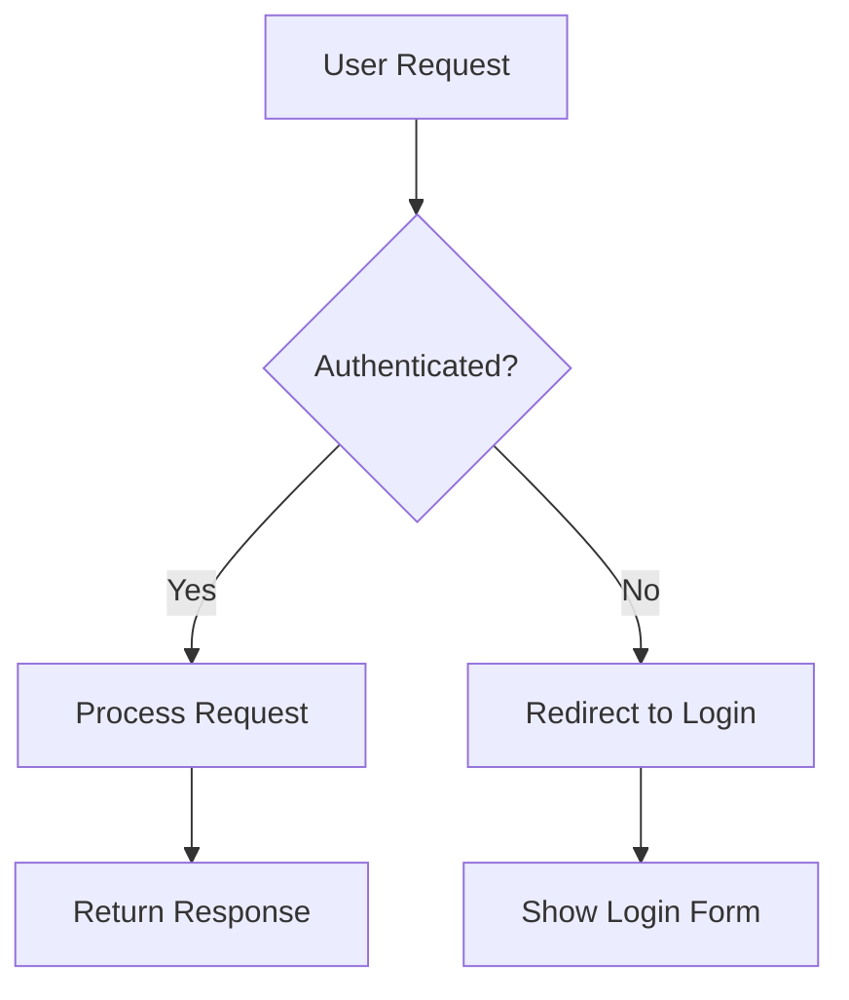
```mermaid
graph TD
    A[User Request] --> B{Authenticated?}
    B -->|Yes| C[Process Request]
    B -->|No| D[Redirect to Login]
    C --> E[Return Response]
    D --> F[Show Login Form]
```

### Node Shapes

Mermaid supports different shapes to convey meaning:

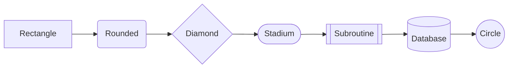
```mermaid
graph LR
    A[Rectangle] --> B(Rounded)
    B --> C{Diamond}
    C --> D([Stadium])
    D --> E[[Subroutine]]
    E --> F[(Database)]
    F --> G((Circle))
```

| Shape | Syntax | Use Case |
|-------|--------|----------|
| Rectangle | `[text]` | Standard process step |
| Rounded | `(text)` | Start/end points |
| Diamond | `{text}` | Decision points |
| Stadium | `([text])` | Events or triggers |
| Subroutine | `[[text]]` | Subprocess call |
| Cylinder | `[(text)]` | Database or storage |
| Circle | `((text))` | Connection point |

### Subgraphs for Organization

For complex systems, subgraphs help group related components:

<ImplementationNote title="Subgraph Nesting Limits">
When I first tried nesting three levels of subgraphs to represent our full infrastructure, the rendering engine choked and produced overlapping labels. I discovered through trial and error that Mermaid handles two levels of nesting reliably, but beyond that, the auto-layout algorithm struggles. My workaround was to split overly deep hierarchies into two separate diagrams -- one for the high-level view and another for the detailed subsystem -- rather than fighting the layout engine.
</ImplementationNote>

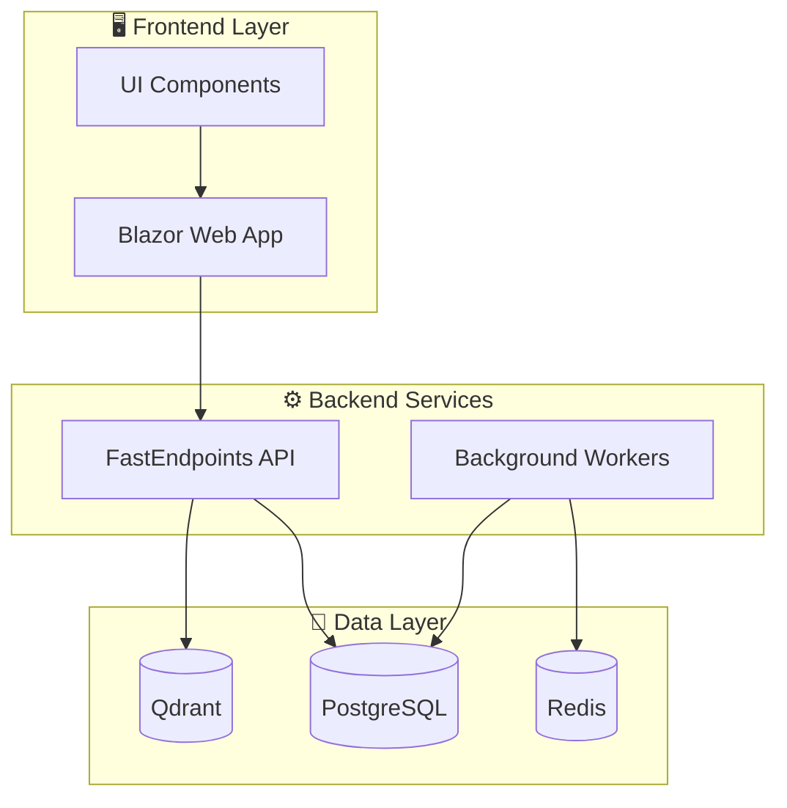
```mermaid
graph TB
    subgraph Frontend ["🖥️ Frontend Layer"]
        UI[Blazor Web App]
        Components[UI Components]
    end
    
    subgraph Backend ["⚙️ Backend Services"]
        API[FastEndpoints API]
        Workers[Background Workers]
    end
    
    subgraph Data ["💾 Data Layer"]
        DB[(PostgreSQL)]
        Vector[(Qdrant)]
        Cache[(Redis)]
    end
    
    UI --> API
    Components --> UI
    API --> DB
    API --> Vector
    Workers --> Cache
    Workers --> DB
```

## Sequence Diagrams

Sequence diagrams are perfect for showing interactions between services over time.

<ExternalCite title="Mermaid Sequence Diagram Syntax" url="https://mermaid.js.org/syntax/sequenceDiagram.html" author="Mermaid Contributors" date="2025" />

### Basic Sequence

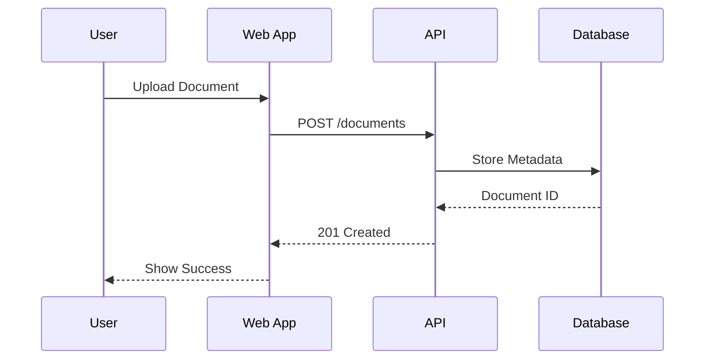
```mermaid
sequenceDiagram
    participant U as User
    participant W as Web App
    participant A as API
    participant D as Database
    
    U->>W: Upload Document
    W->>A: POST /documents
    A->>D: Store Metadata
    D-->>A: Document ID
    A-->>W: 201 Created
    W-->>U: Show Success
```

### Advanced Interactions

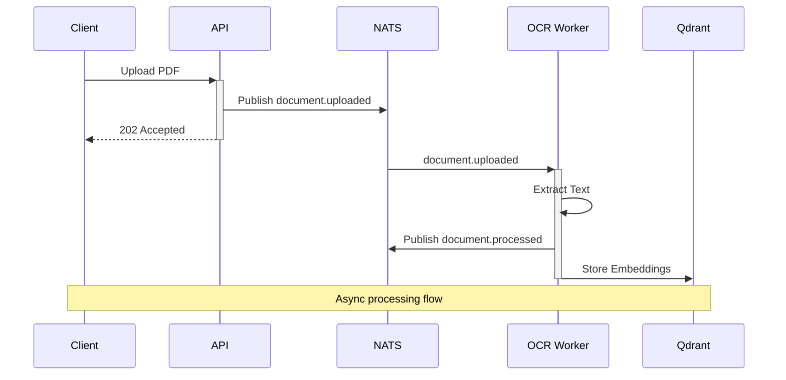
```mermaid
sequenceDiagram
    participant Client
    participant API
    participant NATS
    participant OCR Worker
    participant Qdrant
    
    Client->>+API: Upload PDF
    API->>NATS: Publish document.uploaded
    API-->>-Client: 202 Accepted
    
    NATS->>+OCR Worker: document.uploaded
    OCR Worker->>OCR Worker: Extract Text
    OCR Worker->>NATS: Publish document.processed
    OCR Worker->>-Qdrant: Store Embeddings
    
    Note over Client,Qdrant: Async processing flow
```

### Activation and Loops

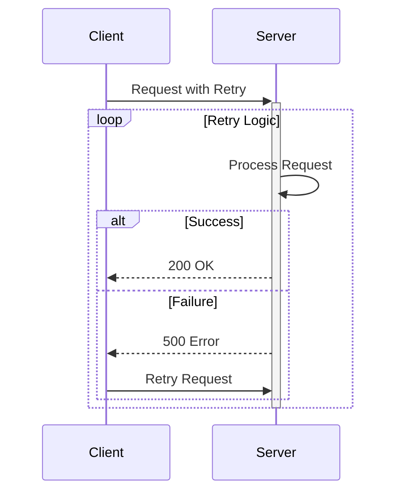
```mermaid
sequenceDiagram
    participant C as Client
    participant S as Server
    
    C->>+S: Request with Retry
    
    loop Retry Logic
        S->>S: Process Request
        alt Success
            S-->>C: 200 OK
        else Failure
            S-->>C: 500 Error
            C->>S: Retry Request
        end
    end
    
    deactivate S
```

## Class Diagrams

For documenting domain models and object relationships:

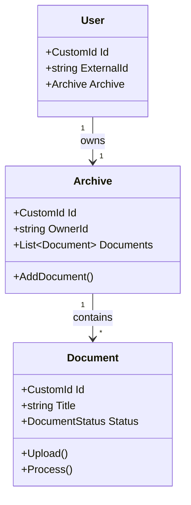
```mermaid
classDiagram
    class Document {
        +CustomId Id
        +string Title
        +DocumentStatus Status
        +Upload()
        +Process()
    }
    
    class Archive {
        +CustomId Id
        +string OwnerId
        +List~Document~ Documents
        +AddDocument()
    }
    
    class User {
        +CustomId Id
        +string ExternalId
        +Archive Archive
    }
    
    User "1" --> "1" Archive : owns
    Archive "1" --> "*" Document : contains
```

## State Diagrams

State diagrams show the lifecycle of an entity:

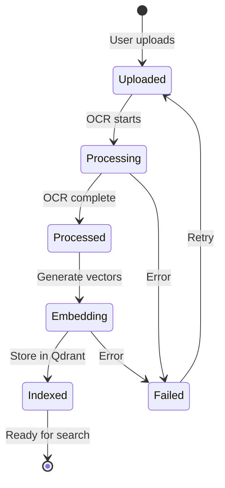
```mermaid
stateDiagram-v2
    [*] --> Uploaded: User uploads
    
    Uploaded --> Processing: OCR starts
    Processing --> Processed: OCR complete
    Processing --> Failed: Error
    
    Processed --> Embedding: Generate vectors
    Embedding --> Indexed: Store in Qdrant
    Embedding --> Failed: Error
    
    Indexed --> [*]: Ready for search
    
    Failed --> Uploaded: Retry
```

## Entity Relationship Diagrams

For database schema documentation:

<ExternalCite title="Mermaid Entity Relationship Diagram Syntax" url="https://mermaid.js.org/syntax/entityRelationshipDiagram.html" author="Mermaid Contributors" date="2025" />

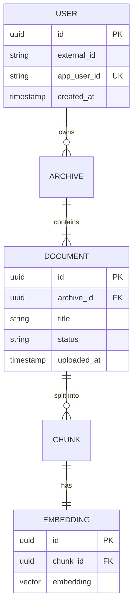
```mermaid
erDiagram
    USER ||--o{ ARCHIVE : owns
    ARCHIVE ||--|{ DOCUMENT : contains
    DOCUMENT ||--o{ CHUNK : "split into"
    CHUNK ||--|| EMBEDDING : has
    
    USER {
        uuid id PK
        string external_id
        string app_user_id UK
        timestamp created_at
    }
    
    DOCUMENT {
        uuid id PK
        uuid archive_id FK
        string title
        string status
        timestamp uploaded_at
    }
    
    EMBEDDING {
        uuid id PK
        uuid chunk_id FK
        vector embedding
    }
```

## Architecture Diagrams (C4 Style)

For high-level system views, combine subgraphs with styling:

<ExternalCite title="The C4 Model for Visualising Software Architecture" url="https://c4model.com/" author="Simon Brown" date="2024" />

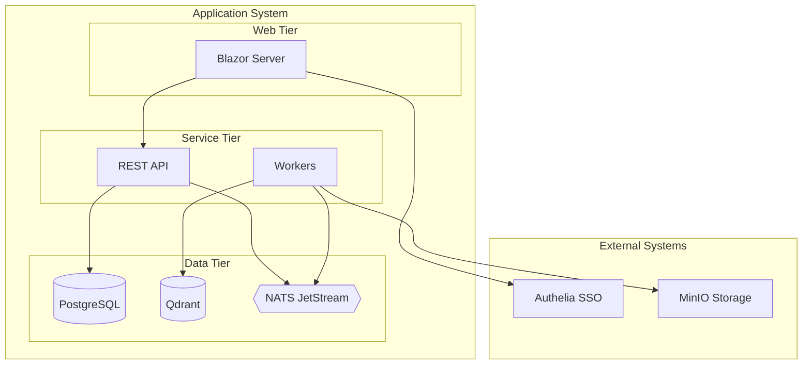
```mermaid
graph TB
    subgraph External ["External Systems"]
        Auth[Authelia SSO]
        MinIO[MinIO Storage]
    end
    
    subgraph App ["Application System"]
        subgraph Web ["Web Tier"]
            Blazor[Blazor Server]
        end
        
        subgraph Services ["Service Tier"]
            API[REST API]
            Workers[Workers]
        end
        
        subgraph Data ["Data Tier"]
            PG[(PostgreSQL)]
            Qdrant[(Qdrant)]
            NATS{{NATS JetStream}}
        end
    end
    
    Blazor --> Auth
    Blazor --> API
    API --> PG
    API --> NATS
    Workers --> NATS
    Workers --> Qdrant
    Workers --> MinIO
```

## Gantt Charts

For project timelines and planning:

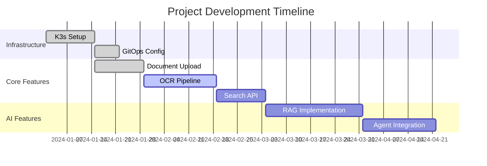
```mermaid
gantt
    title Project Development Timeline
    dateFormat YYYY-MM-DD
    
    section Infrastructure
    K3s Setup           :done, infra1, 2024-01-01, 14d
    GitOps Config       :done, infra2, after infra1, 7d
    
    section Core Features
    Document Upload     :done, core1, 2024-01-15, 14d
    OCR Pipeline        :active, core2, after core1, 21d
    Search API          :core3, after core2, 14d
    
    section AI Features
    RAG Implementation  :ai1, after core3, 28d
    Agent Integration   :ai2, after ai1, 21d
```

## Pie Charts

For simple data visualization:

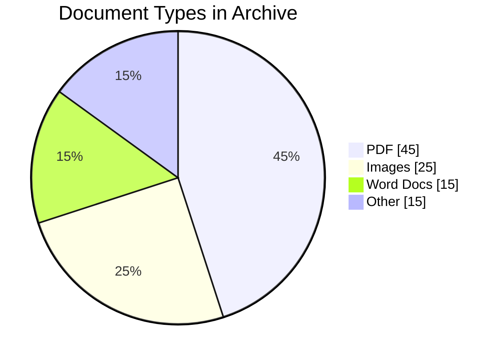
```mermaid
pie showData
    title Document Types in Archive
    "PDF" : 45
    "Images" : 25
    "Word Docs" : 15
    "Other" : 15
```

## Best Practices

<Callout type="info" title="Diagram Guidelines">

1. **Keep it Simple**: If a diagram needs more than 15-20 nodes, consider splitting it
2. **Use Subgraphs**: Group related elements to improve readability
3. **Direction Matters**: `TB` (top-bottom) for hierarchies, `LR` (left-right) for flows
4. **Label Edges**: Always label connections to explain relationships
5. **Consistent Naming**: Use clear, descriptive node IDs

</Callout>

### Styling Tips

You can add custom styling to nodes:

<ImplementationNote title="Dark Mode Theming Challenges">
I ran into a frustrating issue when our blog added dark mode support. Mermaid diagrams that looked great on a white background became unreadable on dark backgrounds because the default text color was near-black. I had to create a custom Mermaid theme configuration that detected the current color scheme and swapped the palette accordingly. The key insight was to use CSS custom properties for the Mermaid theme variables, so the diagrams automatically adapt when the user toggles between light and dark mode.
</ImplementationNote>


```mermaid
graph LR
    A[Critical]:::critical --> B[Warning]:::warning --> C[Info]:::info
    
    classDef critical fill:#ef4444,color:white
    classDef warning fill:#f59e0b,color:white
    classDef info fill:#3b82f6,color:white
```

## Common Patterns

<ExternalCite title="Include Diagrams in Your Markdown Files with Mermaid" url="https://github.blog/2022-02-14-include-diagrams-markdown-files-mermaid/" author="GitHub Blog" date="2022" />

### Request-Response Flow

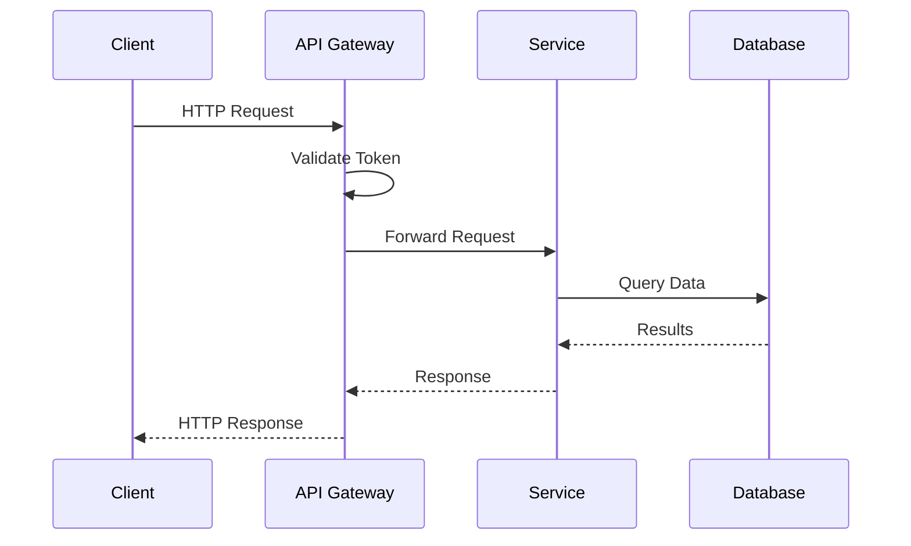
```mermaid
sequenceDiagram
    participant C as Client
    participant G as API Gateway
    participant S as Service
    participant D as Database
    
    C->>G: HTTP Request
    G->>G: Validate Token
    G->>S: Forward Request
    S->>D: Query Data
    D-->>S: Results
    S-->>G: Response
    G-->>C: HTTP Response
```

### Event-Driven Architecture

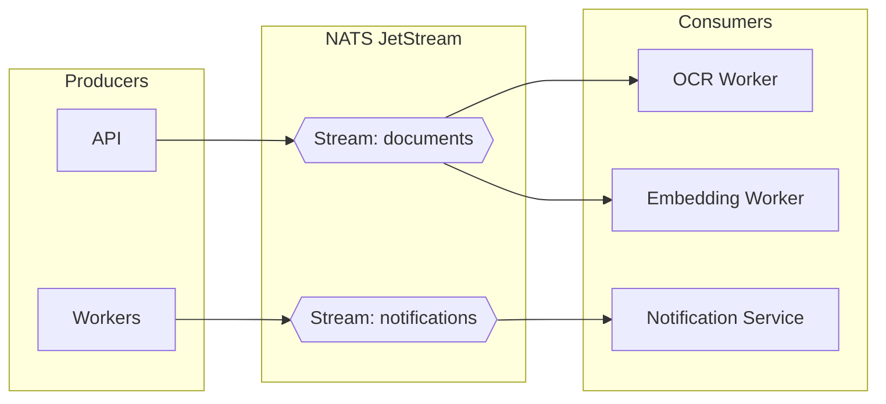
```mermaid
graph LR
    subgraph Producers
        A[API]
        B[Workers]
    end
    
    subgraph MessageBroker ["NATS JetStream"]
        Q1{{Stream: documents}}
        Q2{{Stream: notifications}}
    end
    
    subgraph Consumers
        C[OCR Worker]
        D[Embedding Worker]
        E[Notification Service]
    end
    
    A --> Q1
    B --> Q2
    Q1 --> C
    Q1 --> D
    Q2 --> E
```

## Conclusion

Mermaid transforms technical documentation from static text into living visual documentation. By embedding diagrams directly in your MDX files, you ensure they stay in sync with the code and can be reviewed alongside it.

Adopting Mermaid across our documentation has been one of those quiet productivity wins that compounds over time. I no longer dread updating architecture diagrams because the friction is nearly zero -- edit the text, commit, and the CI pipeline renders it. The real payoff came during code reviews, where reviewers could see diagram changes in the same diff as the code changes they described. If you are still exporting PNGs from a GUI tool, I genuinely encourage you to give Mermaid a week-long trial. You will not go back.

**Key Takeaways:**

- Use **flowcharts** for architecture and process flows
- Use **sequence diagrams** for service interactions
- Use **class/ER diagrams** for domain modeling
- Use **state diagrams** for entity lifecycles
- Keep diagrams focused and use subgraphs for complex systems

<ImplementationNote>
Our technical blog automatically renders Mermaid diagrams with a consistent theme that matches the site's design system. Diagrams support both light and dark modes and include a fullscreen view button for detailed examination.
</ImplementationNote>

### Next Steps

- Explore **Mermaid CLI** (`mmdc`) to pre-render diagrams as SVGs during build time for environments that do not support client-side rendering.
- Integrate Mermaid diagram **linting** into your CI pipeline to catch syntax errors before they reach production.
- Experiment with **Gitgraph diagrams** to visualize branching strategies directly in your contributing guides.
- Build a **shared diagram component library** with pre-styled subgraph templates for your team's common architecture patterns.

### Further Reading

- [Mermaid Official Documentation](https://mermaid.js.org/) - Complete syntax reference and examples
- [Mermaid Live Editor](https://mermaid.live/) - Test and iterate on diagrams in real-time
- [GitHub Mermaid Support](https://github.blog/2022-02-14-include-diagrams-markdown-files-mermaid/) - Mermaid rendering in GitHub markdown
- [The C4 Model](https://c4model.com/) - A structured approach to diagramming software architecture
