import Callout from '@components/Callout.astro';
import ImplementationNote from '@components/ImplementationNote.astro';

## Introduction

Technical documentation often requires visual representations of complex systems. While tools like Lucidchart or draw.io work well, they create binary files that are difficult to version control and review. **Mermaid.js** solves this problem by rendering diagrams from plain text definitions.

**Why Mermaid?**

- **Version Control Friendly**: Diagrams are plain text, so changes show up in Git diffs
- **Live in Documentation**: No separate files to manage or links to break
- **Quick Iteration**: Update the text, see the result immediately
- **Consistent Styling**: Automatic theming that matches your site's design

<Callout type="tip" title="Pro Tip">
All diagrams in this blog support fullscreen viewing—hover over any diagram and click the expand button in the top-right corner.
</Callout>

## Getting Started

In MDX files, you can create diagrams using fenced code blocks with the `mermaid` language identifier:

````markdown

````

This renders as:


## Flowcharts

Flowcharts are the most versatile diagram type. They support various node shapes, connection styles, and subgraphs.

### Basic Flowchart


### Node Shapes

Mermaid supports different shapes to convey meaning:


| Shape | Syntax | Use Case |
|-------|--------|----------|
| Rectangle | `[text]` | Standard process step |
| Rounded | `(text)` | Start/end points |
| Diamond | `{text}` | Decision points |
| Stadium | `([text])` | Events or triggers |
| Subroutine | `[[text]]` | Subprocess call |
| Cylinder | `[(text)]` | Database or storage |
| Circle | `((text))` | Connection point |

### Subgraphs for Organization

For complex systems, subgraphs help group related components:

```mermaid
graph TB
    subgraph Frontend ["🖥️ Frontend Layer"]
        UI[Blazor Web App]
        Components[UI Components]
    end
    
    subgraph Backend ["⚙️ Backend Services"]
        API[FastEndpoints API]
        Workers[Background Workers]
    end
    
    subgraph Data ["💾 Data Layer"]
        DB[(PostgreSQL)]
        Vector[(Qdrant)]
        Cache[(Redis)]
    end
    
    UI --> API
    Components --> UI
    API --> DB
    API --> Vector
    Workers --> Cache
    Workers --> DB
```



## Sequence Diagrams

Sequence diagrams are perfect for showing interactions between services over time.

### Basic Sequence


### Advanced Interactions


### Activation and Loops


## Class Diagrams

For documenting domain models and object relationships:


## State Diagrams

State diagrams show the lifecycle of an entity:


## Entity Relationship Diagrams

For database schema documentation:


## Architecture Diagrams (C4 Style)

For high-level system views, combine subgraphs with styling:


## Gantt Charts

For project timelines and planning:


## Pie Charts

For simple data visualization:


## Best Practices

<Callout type="info" title="Diagram Guidelines">

1. **Keep it Simple**: If a diagram needs more than 15-20 nodes, consider splitting it
2. **Use Subgraphs**: Group related elements to improve readability
3. **Direction Matters**: `TB` (top-bottom) for hierarchies, `LR` (left-right) for flows
4. **Label Edges**: Always label connections to explain relationships
5. **Consistent Naming**: Use clear, descriptive node IDs

</Callout>

### Styling Tips

You can add custom styling to nodes:


## Common Patterns

### Request-Response Flow


### Event-Driven Architecture


## Conclusion

Mermaid transforms technical documentation from static text into living visual documentation. By embedding diagrams directly in your MDX files, you ensure they stay in sync with the code and can be reviewed alongside it.

**Key Takeaways:**

- Use **flowcharts** for architecture and process flows
- Use **sequence diagrams** for service interactions
- Use **class/ER diagrams** for domain modeling
- Use **state diagrams** for entity lifecycles
- Keep diagrams focused and use subgraphs for complex systems

<ImplementationNote>
The BlueRobin blog automatically renders Mermaid diagrams with a consistent theme that matches the site's design system. Diagrams support both light and dark modes and include a fullscreen view button for detailed examination.
</ImplementationNote>

## Further Reading

- [Mermaid Official Documentation](https://mermaid.js.org/)
- [Mermaid Live Editor](https://mermaid.live/) - Test diagrams in real-time
- [GitHub Mermaid Support](https://github.blog/2022-02-14-include-diagrams-markdown-files-mermaid/) - Mermaid in GitHub markdown
