import Callout from '@components/Callout.astro';
import ImplementationNote from '@components/ImplementationNote.astro';
import ExternalCite from '@components/ExternalCite.astro';

## Introduction

In cloud environments, creating a `LoadBalancer` Service is trivial—AWS, GCP, and Azure automatically provision external IPs. But in bare-metal Kubernetes? That same Service sits in `Pending` forever, waiting for a load balancer that doesn't exist.

**Why MetalLB Matters:**

- **Real External IPs**: Your Services get actual routable IP addresses
- **No Cloud Lock-in**: Run production-grade networking on your own hardware
- **Simple Setup**: L2 mode works with any network—no BGP expertise required
- **High Availability**: Services failover automatically when nodes go down

MetalLB fills this gap by implementing the LoadBalancer Service type for bare-metal clusters. It's the missing piece that makes homelab Kubernetes feel like a real cloud.

## Architecture Overview

MetalLB assigns IPs from a configured pool and announces them to your network:

```mermaid
flowchart TB
    subgraph Network["🌐 Local Network"]
        Router["📡 Router\n192.168.1.1"]
        Client["💻 Client"]
    end

    subgraph MetalLB["⚖️ MetalLB"]
        Controller["🎛️ Controller\nIP Assignment"]
        
        subgraph Speakers["📢 Speakers (DaemonSet)"]
            S1["🔊 Speaker\nNode 1"]
            S2["🔊 Speaker\nNode 2"]
            S3["🔊 Speaker\nNode 3"]
        end
        
        Pool["🏊 IP Pool\n192.168.1.200-250"]
    end

    subgraph Services["☸️ Kubernetes Services"]
        Svc1["🔌 Traefik\n192.168.1.200"]
        Svc2["🔌 API\n192.168.1.201"]
    end

    Client -->|"Request"| Router
    Router -->|"ARP"| S1
    S1 -->|"Traffic"| Svc1
    Controller --> Pool
    Pool --> Svc1
    Pool --> Svc2

    classDef primary fill:#7c3aed,color:#fff
    classDef secondary fill:#06b6d4,color:#fff
    classDef db fill:#f43f5e,color:#fff
    classDef warning fill:#fbbf24,color:#000

    class Services primary
    class MetalLB secondary
    class Network warning
```



**How L2 Mode Works**:
1. **Controller** assigns an IP from the pool to your Service
2. **Speaker** pods respond to ARP requests for that IP
3. **Traffic** flows to the elected speaker node, then to your Service
4. **Failover** happens automatically if the speaker node fails

MetalLB provides network load balancer implementations for bare metal Kubernetes clusters. This guide covers deploying MetalLB with L2 mode for homelab and small deployments.

## Installation

### Helm Deployment

```yaml
# infrastructure/metallb/helm-release.yaml
apiVersion: helm.toolkit.fluxcd.io/v2
kind: HelmRelease
metadata:
  name: metallb
  namespace: metallb-system
spec:
  interval: 30m
  chart:
    spec:
      chart: metallb
      version: "0.14.x"
      sourceRef:
        kind: HelmRepository
        name: metallb
        namespace: flux-system
  install:
    crds: CreateReplace
    remediation:
      retries: 3
  upgrade:
    crds: CreateReplace
  values:
    controller:
      resources:
        requests:
          cpu: 50m
          memory: 64Mi
        limits:
          cpu: 200m
          memory: 128Mi
    speaker:
      resources:
        requests:
          cpu: 50m
          memory: 64Mi
        limits:
          cpu: 200m
          memory: 128Mi
      tolerations:
        - effect: NoSchedule
          key: node-role.kubernetes.io/control-plane
```

## L2 Mode Configuration

### IP Address Pool

```yaml
# infrastructure/metallb/ip-pool.yaml
apiVersion: metallb.io/v1beta1
kind: IPAddressPool
metadata:
  name: main-pool
  namespace: metallb-system
spec:
  addresses:
    - 192.168.1.200-192.168.1.250
  autoAssign: true
  avoidBuggyIPs: true
```

### L2 Advertisement

```yaml
# infrastructure/metallb/l2-advertisement.yaml
apiVersion: metallb.io/v1beta1
kind: L2Advertisement
metadata:
  name: main-l2
  namespace: metallb-system
spec:
  ipAddressPools:
    - main-pool
  interfaces:
    - eth0
```

<Callout type="warning">
L2 mode has a single-node limitation for each service IP. All traffic for a service goes through one node, which handles ARP responses.
</Callout>

## Multiple Address Pools

### Segmented Pools

```yaml
# infrastructure/metallb/pools.yaml
---
apiVersion: metallb.io/v1beta1
kind: IPAddressPool
metadata:
  name: ingress-pool
  namespace: metallb-system
spec:
  addresses:
    - 192.168.1.200-192.168.1.209
  autoAssign: false
---
apiVersion: metallb.io/v1beta1
kind: IPAddressPool
metadata:
  name: apps-pool
  namespace: metallb-system
spec:
  addresses:
    - 192.168.1.210-192.168.1.230
  autoAssign: true
---
apiVersion: metallb.io/v1beta1
kind: IPAddressPool
metadata:
  name: db-pool
  namespace: metallb-system
spec:
  addresses:
    - 192.168.1.240-192.168.1.250
  autoAssign: false
```

### Pool Selection by Service

```yaml
# Service requesting specific pool
apiVersion: v1
kind: Service
metadata:
  name: traefik
  namespace: traefik-system
  annotations:
    metallb.universe.tf/address-pool: ingress-pool
spec:
  type: LoadBalancer
  ports:
    - name: web
      port: 80
      targetPort: 8000
    - name: websecure
      port: 443
      targetPort: 8443
```

## Sharing IPs

### Multiple Services on One IP

```yaml
# Service 1
apiVersion: v1
kind: Service
metadata:
  name: traefik-web
  annotations:
    metallb.universe.tf/allow-shared-ip: "traefik-shared"
    metallb.universe.tf/loadBalancerIPs: "192.168.1.200"
spec:
  type: LoadBalancer
  ports:
    - name: http
      port: 80
      targetPort: 8000
    - name: https
      port: 443
      targetPort: 8443
---
# Service 2 sharing same IP
apiVersion: v1
kind: Service
metadata:
  name: traefik-dashboard
  annotations:
    metallb.universe.tf/allow-shared-ip: "traefik-shared"
    metallb.universe.tf/loadBalancerIPs: "192.168.1.200"
spec:
  type: LoadBalancer
  ports:
    - name: dashboard
      port: 9000
      targetPort: 9000
```

<ImplementationNote>
Services sharing an IP must use different ports. The `allow-shared-ip` annotation must have the same value for all services sharing the IP.
</ImplementationNote>

## Requesting Specific IPs

### Static IP Assignment

```yaml
apiVersion: v1
kind: Service
metadata:
  name: postgres-external
  namespace: data-layer
  annotations:
    metallb.universe.tf/address-pool: db-pool
spec:
  type: LoadBalancer
  loadBalancerIP: 192.168.1.240
  ports:
    - port: 5432
      targetPort: 5432
```

## BGP Mode Configuration

### BGP Peer Configuration

```yaml
# infrastructure/metallb/bgp-peer.yaml
apiVersion: metallb.io/v1beta2
kind: BGPPeer
metadata:
  name: router-peer
  namespace: metallb-system
spec:
  myASN: 64500
  peerASN: 64501
  peerAddress: 192.168.1.1
  peerPort: 179
  password: "bgp-secret"
  holdTime: 90s
  keepaliveTime: 30s
```

### BGP Advertisement

```yaml
# infrastructure/metallb/bgp-advertisement.yaml
apiVersion: metallb.io/v1beta1
kind: BGPAdvertisement
metadata:
  name: main-bgp
  namespace: metallb-system
spec:
  ipAddressPools:
    - main-pool
  aggregationLength: 32
  localPref: 100
  communities:
    - 64500:100
```

## Service Configuration

### Traefik LoadBalancer Service

```yaml
# apps/traefik/service.yaml
apiVersion: v1
kind: Service
metadata:
  name: traefik
  namespace: traefik-system
  annotations:
    metallb.universe.tf/address-pool: ingress-pool
    metallb.universe.tf/loadBalancerIPs: "192.168.1.200"
spec:
  type: LoadBalancer
  externalTrafficPolicy: Local
  ports:
    - name: web
      port: 80
      targetPort: 8000
      protocol: TCP
    - name: websecure
      port: 443
      targetPort: 8443
      protocol: TCP
  selector:
    app.kubernetes.io/name: traefik
```

<Callout type="tip">
Use `externalTrafficPolicy: Local` to preserve client source IPs and reduce network hops. This requires the service to have pods on the node receiving traffic.
</Callout>

## Monitoring

### Prometheus ServiceMonitor

```yaml
# infrastructure/metallb/servicemonitor.yaml
apiVersion: monitoring.coreos.com/v1
kind: ServiceMonitor
metadata:
  name: metallb
  namespace: metallb-system
spec:
  selector:
    matchLabels:
      app.kubernetes.io/name: metallb
  endpoints:
    - port: metrics
      interval: 30s
```

### Key Metrics

| Metric | Description |
|--------|-------------|
| `metallb_bgp_session_up` | BGP session status |
| `metallb_bgp_announced_prefixes_total` | Announced route count |
| `metallb_allocator_addresses_total` | Pool address capacity |
| `metallb_allocator_addresses_in_use_total` | Addresses currently assigned |

## Troubleshooting

### Common Issues

```bash
# Check controller logs
kubectl logs -n metallb-system -l app.kubernetes.io/component=controller

# Check speaker logs (L2 mode ARP)
kubectl logs -n metallb-system -l app.kubernetes.io/component=speaker

# Verify IP pool assignments
kubectl get ipaddresspools -n metallb-system -o yaml

# Check service IP allocation
kubectl get svc -A -o wide | grep LoadBalancer
```

### ARP Debugging (L2 Mode)

```bash
# On a network machine, check ARP for service IP
arp -n | grep 192.168.1.200

# Check which node is advertising
kubectl logs -n metallb-system -l app.kubernetes.io/component=speaker | grep -i "192.168.1.200"
```

## Summary

MetalLB configuration components:

| Resource | Purpose |
|----------|---------|
| IPAddressPool | Define available IP ranges |
| L2Advertisement | Enable L2/ARP mode |
| BGPPeer | Configure BGP routing |
| BGPAdvertisement | Control BGP announcements |
| Service Annotations | Pool selection, IP sharing |

MetalLB enables production-grade load balancing for bare metal Kubernetes without cloud provider dependencies.

<ExternalCite 
  title="MetalLB Documentation" 
  url="https://metallb.io/"
  author="MetalLB Project"
/>
