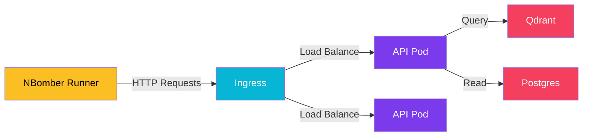

import Callout from '@components/Callout.astro';
import ImplementationNote from '@components/ImplementationNote.astro';
import CodeFile from '@components/CodeFile.astro';
import ExternalCite from '@components/ExternalCite.astro';

## Introduction

"It works on my machine" is not a performance guarantee. As we move to a microservices architecture with NATS and Qdrant, we need to know: **Where does the system break?**

Does the API CPU spike? Does the database lock up? Does the memory leak?

**Why Benchmarking Matters:**
- **Capacity Planning**: Knowing how many concurrent users a single pod can handle.
- **Regression Testing**: Ensuring a new feature didn't slow down the core loop.
- **Bottleneck Identification**: Checking if the Vector DB or the API is the weak link.

### What We'll Build

We will create a stress test suite using **NBomber** (a .NET-native load testing framework) to hammer our endpoints.

## Architecture Overview



## Section 1: Writing the Scenario

We want to test the "Search" endpoint, as it is the most resource-intensive.

```csharp
var httpFactory = HttpClientFactory.Create();

var searchStep = Step.Create("search_documents", httpFactory, async context =>
{
    var request = Http.CreateRequest("GET", "https://api.bluerobin.local/documents/search?q=invoice")
        .WithHeader("Authorization", "Bearer token");
        
    var response = await Http.Send(request, context);
    
    return response.StatusCode == 200 
        ? Response.Ok(statusCode: 200) 
        : Response.Fail();
});

var scenario = ScenarioBuilder.CreateScenario("search_load", searchStep)
    .WithWarmUpDuration(TimeSpan.FromSeconds(10))
    .WithLoadSimulations(
        Simulation.RampingInject(rate: 50, interval: TimeSpan.FromSeconds(1), during: TimeSpan.FromMinutes(2))
    );

NBomberRunner
    .RegisterScenarios(scenario)
    .Run();
```

## Section 2: Analyzing the Crash

We ran the test ramping up to 500 requests per second (RPS).

**Results:**
- **0-100 RPS**: Sub-50ms latency. Smooth.
- **200 RPS**: Latency jumped to 400ms.
- **350 RPS**: Errors started appearing (HTTP 503).

### The Investigation

We looked at our **SigNoz** dashboards during the test.

1. **API CPU**: 40%. Not the bottleneck.
2. **Postgres CPU**: 15%. Sleeping.
3. **Qdrant CPU**: **98%**. 

**Diagnosis**: The vector search calculations were saturating the CPU cores allocated to Qdrant.

<ImplementationNote title="Fixing the Bottleneck">
    We scaled Qdrant vertically (gave it more CPU limits) and implemented caching for common queries using Redis. Retesting showed we could hit 800 RPS before saturation.
</ImplementationNote>

## Section 3: Continuous Performance Testing

We integrated this into our CI/CD pipeline. We don't run the full stress test on every commit, but we run a "smoke test" (50 RPS) to ensure no gross regressions.

```yaml
- name: Run Performance Smoke Test
  run: dotnet run --project tests/Archives.Performance
```

## Conclusion

You cannot optimize what you do not measure. By identifying Qdrant as our bottleneck, we focussed our optimization efforts where they mattered, rather than wasting time optimizing C# code that wasn't the problem.

**Next Steps**:
- Learn about [Storage Performance](/blog/infrastructure-performance-ssd-vs-nas) impacting database speed.
- See how [Pact Testing](/blog/pact-consumer-driven-contract-testing) handles functional correctness.
